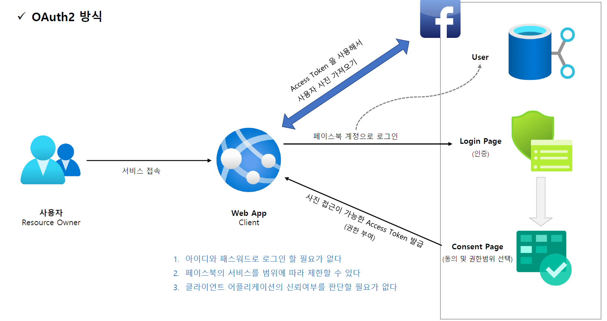

<nav>
    <a href="../.." target="_blank">[Spring Security OAuth2]</a>
</nav>

# 2.1 OAuth 2.0 소개

---

## 1. OAuth 란?

- OAuth = Open + Authorization 
- The OAuth 2.0 Authorization Framework (RFC 6749 : https://ko.wikipedia.org/wiki/RFC)
   - https://datatracker.ietf.org/doc/rfc6749/
   - OAuth 2.0 인가 프레임워크는 애플리케이션이 사용자 대신하여 사용자의 자원에 대한 제한된 액세스를 얻기 위해 승인 상호 작용을 함으로
   써 애플리케이션이 자체적으로 액세스 권한을 얻도록 한다.
   - 즉 사용자가 속한 사이트의 보호된 자원 (Protected Resource) 에 대하여 타 어플리케이션의 접근을 허용하도록 승인하는 것을 의미한다
- Delegated authorization framework 위임 인가 프레임워크
  - 어플리케이션이 사용자의 데이터에 접근하도록 권한을 부여한다

---

## 2. 등장 배경 : OAuth 2.0 이전 방식

- 사용자는 서비스 이용을 위해 facebook, google과 같은 서비스의 아이디, 패스워드를 직접 입력한다.
- 우리 서비스가 사용자를 대신하여 해당 id, password를 전달하여 해당 서비스에 접속하고 정보를 획득한다.
- 문제점
  - 아이디와 패스워드가 노출되어 보안에 취약
  - 페이스북의 모든 서비스를 제한없이 사용 가능
  - 뭘 믿고? : 클라이언트 어플리케이션을 신뢰할 수 있는가?

----

## 3. OAuth2 방식

- 아이디와 패스워드로 로그인 할 필요가 없다.
- 페이스북의 서비스를 범위에 따라 제한할 수 있다.
- 클라이언트 어플리케이션의 신뢰여부를 판단할 필요가 없다.

---
