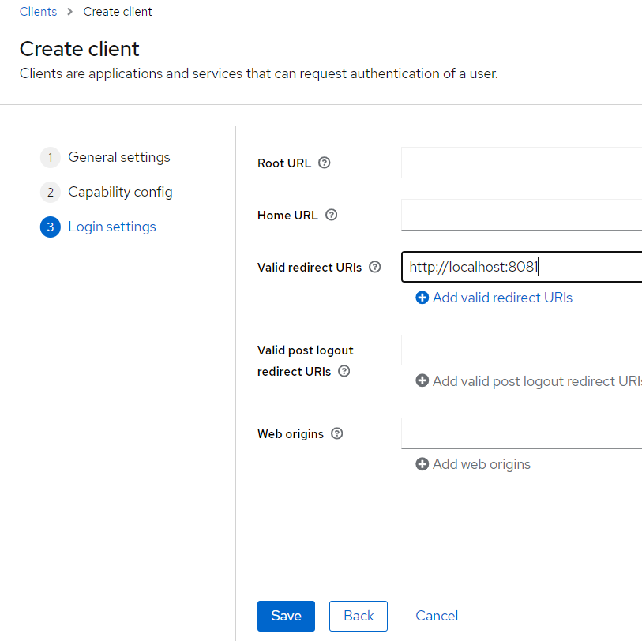

<nav>
    <a href="../.." target="_blank">[Spring Security OAuth2]</a>
</nav>

# 2.2 OAuth2 오픈 소스 - Keycloak 설치 및 설정

---

## 1. Keycloak 이란?
- ID 및 접근 관리를 지원하는 인가서버 오픈 소스로 사용자 연합, 강력한 인증, 사용자 관리, 세분화된 권한 부여 등을 제공한다
- 로컬 개발환경에서 간단하게 OAuth2 기능을 테스트할 때 유용하다.
- 이 강의에서는 OAuth2 Client 와 Resource Server 커리큘럼에서 테스트용 인가서버 플랫폼으로 사용한다.

---

## 2. Keycloak 설치
- https://www.keycloak.org/downloads
- 시작가이드: https://www.keycloak.org/getting-started/getting-started-zip

---

## 3. Keycloak 실행
```shell
cd bin
./kc.bat start-dev
```
- bin 경로로 이동하고 `kc.bat` 또는 `kc.sh` 파일을 실행한다. 이 때 실행변수를 추가로 전달해야하는데, dev 환경에서 실행하도록 start-dev를 넘기자.
- 이렇게하면 8080 포트에서 keycloak 실행된다.

---

## 4. Keycloak 설정

### 4.1 관리자 계정 생성 및 접속


- 생성
  - id: admin
  - pw: 1111
- 이후 접근할 때는 로그인해서 접속하면 된다. 

### 4.2 Realm


- 인증이 유효한 영역 개념인데, 기본적으로 Master Realm이 사용된다.
- `oauth2` 이름으로 Realm을 생성하자. 이후에는 oauth2 Realm을 사용할 것이다.

### 4.3 Client 생성 및 설정


- Clients → Create Client
- Client ID: oauth2-client-app


- capability config
  - client authentication : on
  - Service accounts roles 활성화
  - Authentication flow : Implict flow 활성화



- valid redirect URIs : http://localhost:8081
- 생성


- 이후 Client 목록을 통해 해당 클라이언트의 Client 정보 조회 가능
- 여기서 Credentials쪽에서 Client Secret 값도 확인 가능

### 4.4 사용자 생성


- Users → Add User
- 신상정보
  - username: user
  - email: user@keycloak.com
  - firstname: fire / lastname: punch


- credentials -> set Password
  - password : 1111

### 4.5 엔드포인트 확인


- 현재 Realm의 Realm settings에 가보면 하단부에서 OpenID EndPoint Configurations 에서 엔드포인트들을
조회할 수 있다.
- 그 외에도 지원되는 인가 유형, response_type 등을 확인할 수 있다.

```json
{
  "issuer": "http://localhost:8080/realms/oauth2",
  "authorization_endpoint": "http://localhost:8080/realms/oauth2/protocol/openid-connect/auth",
  "token_endpoint": "http://localhost:8080/realms/oauth2/protocol/openid-connect/token",
  "introspection_endpoint": "http://localhost:8080/realms/oauth2/protocol/openid-connect/token/introspect",
  "userinfo_endpoint": "http://localhost:8080/realms/oauth2/protocol/openid-connect/userinfo",
  "end_session_endpoint": "http://localhost:8080/realms/oauth2/protocol/openid-connect/logout",
  "frontchannel_logout_session_supported": true,
  "frontchannel_logout_supported": true,
  "jwks_uri": "http://localhost:8080/realms/oauth2/protocol/openid-connect/certs",
  "check_session_iframe": "http://localhost:8080/realms/oauth2/protocol/openid-connect/login-status-iframe.html",
  "grant_types_supported": [
    "authorization_code",
    "implicit",
    "refresh_token",
    "password",
    "client_credentials",
    "urn:openid:params:grant-type:ciba",
    "urn:ietf:params:oauth:grant-type:device_code"
  ],
  "acr_values_supported": [
    "0",
    "1"
  ],
  "response_types_supported": [
    "code",
    "none",
    "id_token",
    "token",
    "id_token token",
    "code id_token",
    "code token",
    "code id_token token"
  ],
  "subject_types_supported": [

}
```


---

## 5. Postman
- https://www.postman.com/downloads/
- 인가서버 및 리소스 서버와의 통신시 클라이언트 역할

---
