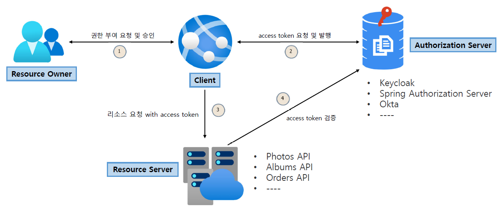
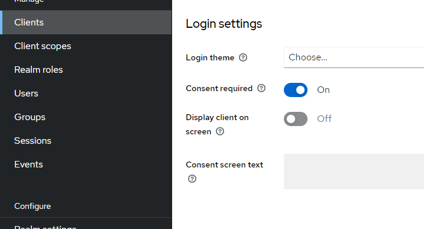
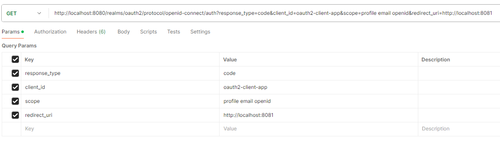
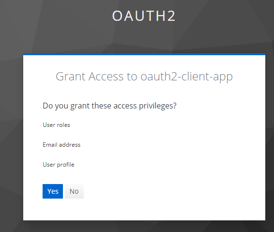
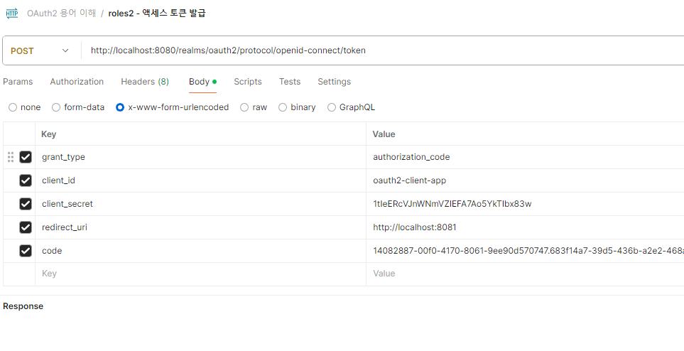
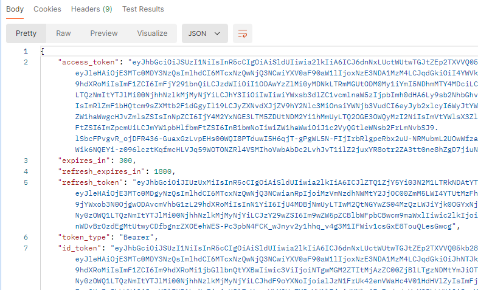
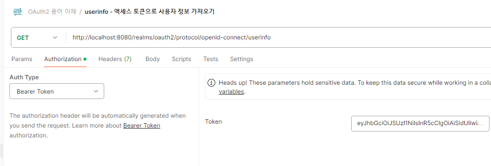
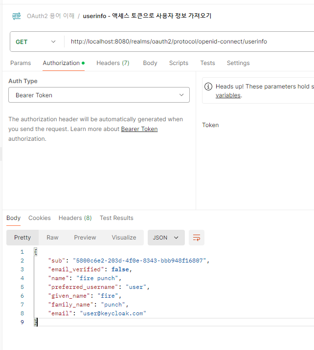

<nav>
    <a href="../.." target="_blank">[Spring Security OAuth2]</a>
</nav>

# 2.3 OAuth 2.0 Roles 이해

---

## 1. OAuth 2.0 Roles
1. Resource Owner (자원 소유자)
   - 보호된 자원에 대한 접근 권한을 부여할 수 있는 주체, 사용자로서 계정의 일부에 대한 접근 권한을 부여하는 사람
   - 사용자를 대신하여 작동하려는 모든 클라이언트는 먼저 사용자의 허가를 받아야 한다
2. Resource Server (보호자원서버)
   - 타사 어플리케이션에서 접근하는 사용자의 자원이 포함된 서버를 의미한다
   - 액세스 토큰을 수락 및 검증할 수 있어야 하며 권한 체계에 따라 요청을 승인할 수 있어야 한다.
3. Authorization Server (인가서버)
   - 클라이언트가 사용자 계정에 대한 동의 및 접근을 요청할 때 상호 작용하는 서버로서 클라이언트의 권한 부여 요청을 승인하거나 거부하는 서버
   - 사용자가 클라이언트에게 권한 부여 요청을 승인한 후 access token 을 클라이언트에게 부여하는 역할
4. Client (클라이언트)
   - 사용자를 대신하여 권한을 부여받아 사용자의 리소스에 접근하려는 어플리케이션
   - 사용자를 권한 부여 서버로 안내하거나 사용자의 상호 작용 없이 권한 부여 서버로부터 직접 권한을 얻을 수 있다

---

## 2. OAuth2 Roles 흐름

1. 권한부여 요청 및 승인
   - 실제 자원소유자는 권한 부여에 대한 동의를 한다.
2. 클라이언트: 액세스토큰 요청 및 발행
   - 클라이언트는 자원 소유자의 동의로 얻어낸 값(예: code)을 기반으로 인가 서버에게 액세스 토큰을 요청하고 발행받는다.
3. 클라이언트: 리소스 서버에게 자원을 획득
   - 클라이언트는 앞에서 받은 액세스 토큰을 통해 리소스 서버에 리소스를 획득할 수 있다.
   - 리소스 서버는 인가 서버와 협력하여(혹은 자체적으로) 클라이언트에게 받은 AccessToken이 유효한지 확인할 수 있어야 한다.

---

## 3. KeyCloak OAuth2 권한부여 실습

### 3.1 동의화면 설정

- KeyCloak(Realm: oauth2) -> Clients -> oauth2-client-app -> Login settings -> Consent required on
- 우선 KeyCloak 을 통해 OAuth2 흐름을 사용하기 앞서 '동의(consent)'를 활성화해야한다.
- 이 기능을 활성해야 인가 서버(Authorization Server)로부터 동의 화면을 받고 동의 여부를 선택할 수 있다.
  - 이 기능을 활성화하지 않으면 동의화면을 거치지 않고, 바로 동의하게 되버린다.

### 3.3 자원소유자 승인, code 발급

- 요청(브라우저): `http://localhost:8080/realms/oauth2/protocol/openid-connect/auth?response_type=code&client_id=oauth2-client-app&scope=profile email openid&redirect_uri=http://localhost:8081`
  - method: GET
  - URL: `http://localhost:8080/realms/oauth2/protocol/openid-connect/auth`
  - QueryString
    - `response_type=code`
    - `client_id=oauth2-client-app` : client의 id
    - `scope=profile email openid`
      - 이후 `userinfo` 엔드포인트 접근시 `openid` 스코프가 포함된 액세스 토큰이 필요하므로 `openid`도 같이 적어줘야한다.
      - Client scopes에서 디폴트로 설정하는 방법도 있긴하다.
      - `https://www.inflearn.com/questions/735104/keycloack-userinfo-403-forbidden-error`
    - `redirect_uri=http://localhost:8081` : 앞서 우리가 설정한 리다이렉트 uri를 여기 지정해준다. 보통 프론트엔드에서 이 페이지를 구현한다.

- `user`로 로그인하면 동의화면이 뜬다. 동의를 한다.
- 동의를 하면 리다이렉트 되는데, 이 url 뒤에 code 쿼리문자열이 포함되어 전달된다.

### 3.4 액세스토큰 발급

- 요청(POSTMAN)
  - method: POST
  - URL: http://localhost:8080/realms/oauth2/protocol/openid-connect/token
  - content-type: `application/x-www-form-urlencoded`
  - body
    - grant_type: authorization_code
    - client_id: oauth2-client-app
    - client_secret: 시크릿값
    - redirect_uri: 리다이렉트 uri
    - code: 앞서 발급받은 code

- 성공하면 응답으로 받은 json에 access_token이 포함된다.
- 인가에 실패했을 경우 앞서 발급받은 token의 유효기간이 경과했을 가능성이 있으므로 code를 다시 발급받아보자.

### 3.5 userinfo api 호출

- 요청(POSTMAN)
  - method: GET
  - URL: `http://localhost:8080/realms/oauth2/protocol/openid-connect/userinfo`
  - 헤더
    - `Authorization: Bearer [[액세스토큰]]`

- 해당 사용자에 대한 정보를 json으로 얻을 수 있다
- 401 에러가 뜬다면 액세스 토큰이 만료됐을 가능성이 큰데 code 발급부터 과정을 다시 수행하자.

---

