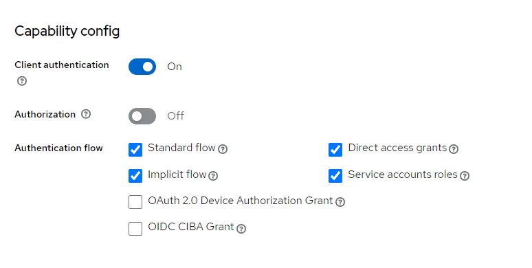

<nav>
    <a href="../.." target="_blank">[Spring Security OAuth2]</a>
</nav>

# 2.4 OAuth 2.0 Client Types 이해

---

## 1. OAuth 2.0 Clients
- RFC 6749 - `https://datatracker.ietf.org/doc/html/rfc6749#section-2.1`

### 1.1 클라이언트 ID / Secret
- 인증 서버에 클라이언트를 등록할 때 클라이언트 자격 증명인 클라이언트 아이디와 클라이언트 암호를 받는다.
- 클라이언트 암호는 비밀이고 그대로 유지되어야 하는 반면 클라이언트 아이디는 공개이다.
- 이 자격 증명은 인증 서버에 대한 클라이언트 ID를 증명한다

### 1.2 기밀 클라이언트 (Confidential Clients)

- 기밀 클라이언트는 client_secret 의 기밀성을 유지할 수 있는 클라이언트를 의미한다.
- 일반적으로 사용자가 소스 코드에 액세스할 수 없는 서버에서 실행되는(server-side) 응용 프로그램으로 NET, Java, PHP 및 Node.JS와 같은 서버 측 언어로 작성된
다.
- 이러한 유형의 애플리케이션은 대부분 웹 서버에서 실행되기 때문에 일반적으로 ＂웹 애플리케이션 서버＂라고 한다
- 주 인증 방식: Authorization code flow(standard flow)
- 프론트채널/백채널 양쪽에서 인가서버와 통신하며, 승인 절차는 프론트 채널에서 이루어지지고 액세스토큰 발급은 백 채널에서만 이루어진다.

### 1.3 공개 클라이언트 (Public Clients)

- 공개 클라이언트는 client_secret 의 기밀을 유지할 수 없으므로 이러한 앱에는 secret 이 사용되지 않는다.
- 브라우저에서 실행되는 JavaScript 애플리케이션, Android 또는 iOS 모바일 앱, 데스크톱에서 실행되는 기본 앱뿐만 아니라 IoT/임베디드 장치에서
실행되는 애플리케이션 등이 있다
- Chrome 개발자 콘솔이나 디스어셈블러와 같은 디버깅 도구를 사용하여 바이너리/실행 코드에서 기밀 정보를 추출할 수 있기 때문에 공개로 간주된다.
- 서버측이 아닌 리소스 소유자가 사용하는 장치에서 실행되는 모든 클라이언트는 공개 클라이언트로 간주되어야 한다
- 프론트채널에서만 인가서버와 통신하며, 승인 및 액세스토큰 발급이 모두 프론트 채널에서만 이루어진다.

---

## 2. 실습

### 2.1 기밀 클라이언트 실습
- 이전 단원에서 실습한 Authorization code flow 가 기밀 클라이언트 방식에 해당하므로 생략

### 2.2 공개 클라이언트 실습

- keycloak 서버에서 Implicit Grant 를 활성화하고(이미함)

- response_type 쿼리 파라미터 값을 token으로 지정
- 브라우저에서 접속해서 승인
- 이렇게 하면 응답 redirect url에 바로 액세스 토큰이 전달된다.

---
