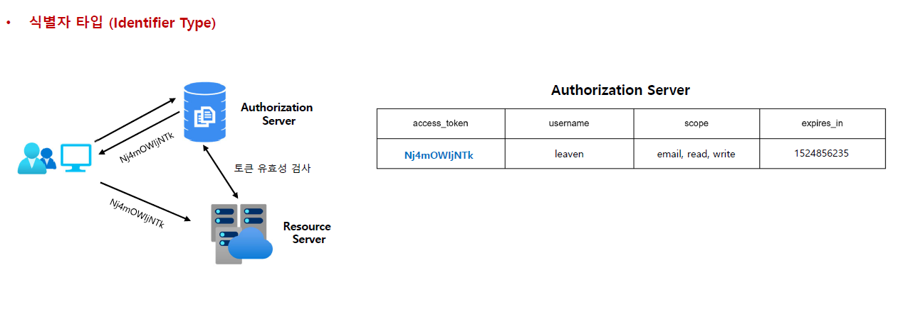
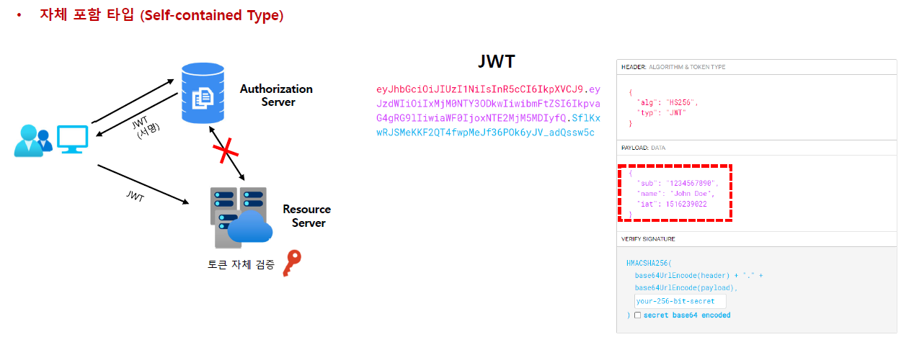

<nav>
    <a href="../.." target="_blank">[Spring Security OAuth2]</a>
</nav>

# 2.5 OAuth 2.0 Token Types 이해

---

## 1. OAuth 2.0 Token 유형

### 1.1 Access Token
- 클라이언트에서 사용자의 보호된 리소스에 접근하기 위해 사용하는 일종의 **자격 증명**으로서 역할을 하며 리소스 소유자가 클라이언트에게 부여한
권한 부여의 표현이다.
- 타입에는 식별자 타입 (Identifier Type) 과 자체 포함타입 (Self-contained Type) 이 있다.
- 일반적으로 자체 포함타입인 JWT(JSON Web Tokens) 형식을 취하지만 사양에 따라 그럴 필요는 없다.
  - 토큰에는 해당 액세스 기간, 범위 및 서버에 필요한 기타 정보가 있다.

### 1.2 Refresh Token
- 액세스 토큰이 만료된 후 새 액세스 토큰을 얻기 위해(**재발급 목적**) 클라이언트 응용 프로그램에서 사용하는 자격 증명
- 액세스 토큰이 만료되는 경우 클라이언트는 권한 부여 서버로 인증하고 Refresh Token 을 전달한다.
- 인증 서버는 Refresh Token 의 유효성을 검사하고 새 액세스 토큰을 발급한다.
- Refresh Token 은 액세스 토큰과 달리 권한 서버 토큰 엔드포인트에만 보내지고(재발급 API) 리소스 서버에는 보내지 않는다.

### 1.3 ID Token
- OpenID Connect 챕터에서 다룸

### 1.4 Authorization Code
- 권한 부여 코드 흐름에서 사용되며 이 코드는 클라이언트가 액세스 토큰과 교환할 1회용 임시 코드임.
  - 보통 1회 사용 후 폐기한다.
- 사용자가 클라이언트가 요청하는 정보를 확인하고 인가 서버로부터 리다이렉트 되어 받아온다.

---

## 2. Access Token의 유형

### 2.1 식별자 타입

- 인가서버는 데이터 저장소에 토큰의 내용을 저장하고 이 토큰에 대한 고유 식별자만 클라이언트에 다시 발행한다.
  - 토큰에는 유의미한 정보가 없고 그냥 난수이다.
- 이 토큰을 수신하는 리소스 서버 API는 토큰의 유효성을 검사하기 위해 인가서버에 대한 백채널 통신을 열고
DB 를 조회해야 한다.
- 네트워크 비용이 증가하는 문제가 생긴다.

### 2.2 자체포함 타입

- JWT 형식으로 발급되며 클레임 및 만료가 있는 보호된 데이터 구조이다.
- 리소스 서버 API가 검증 키 등의 핵심 자료에 대해 알게 되면 발급자와 통신할 필요 없이 자체 포함된 토큰의
유효성을 검사할 수 있다.
- 특정한 암호화 알고리즘에 의해 개인키로 서명되고 공개키로 검증할 수 있으며 만료될 때까지 유효하다.
  - 인가서버에서 토큰 발행 시에는 개인키로 서명하고 리소스 서버에서는 공개키로 검증할 수 있다.
  - 개인키를 인가서버에만 두고 관리할 수 있어서 보안적인 리스크가 없고, 인가서버와 네트워크 통신을 할 필요가 없다.

---

