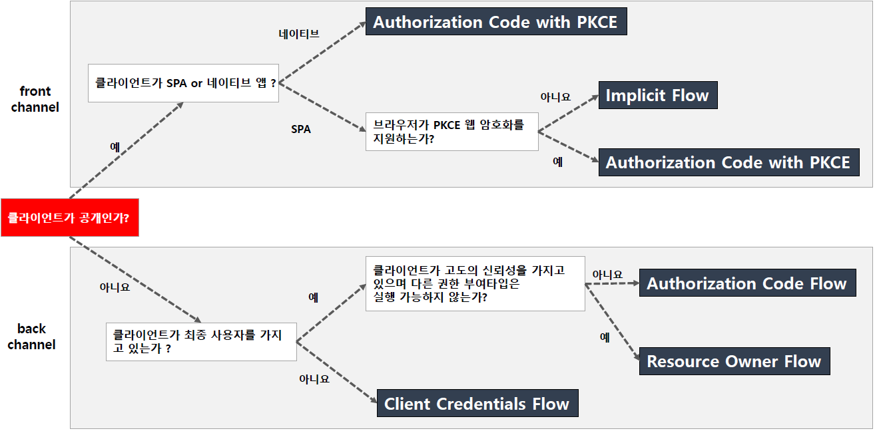

<nav>
    <a href="../.." target="_blank">[Spring Security OAuth2]</a>
</nav>

# 3.1 OAuth 2.0 Grant Type 개요

---

## 1. OAuth 2.0 권한 부여 유형

- OAuth 2.0 권한부여란 클라이언트가 사용자를 대신해서 사용자의 승인하에 인가서버로부터 권한을 부여받는 것을 의미한다.
- OAuth 2.0 메커니즘은 아래와 같은 권한 부여 유형들을 지원하고 있으며 일부는 Depreacted 되었다

1. Authorization Code Grant Type
   - 권한 코드 부여 타입, 서버 사이드 어플리케이션(웹 어플리케이션)에서 사용
   - **보안에 가장 안전한 유형**
2. Implicit Grant Type (Deprecated)
   - 암시적 부여 타입, 공개 클라이언트 어플리케이션 (SPA 기반 자바스크립트 앱, 모바일 앱)
   - 보안에 취약하여 deprecated되었고 웬만해선 쓰지 않는게 좋다.
3. Resource Owner Password Credentials Grant Type (Deprecated)
   - 리소스 사용자 비밀번호 자격증명 부여 타입
   - 서버 어플리케이션이 사용자를 대신하여 id, password를 리소스 서버에 전달하는 방식이다.
   - 보안에 취약
4. Client Credentials Grant Type
   - 클라이언트 자격 증명 권한 부여 타입 , UI or 화면이 없는 서버 어플리케이션
   - 클라이언트 자체가 리소스 소유주
5. Refresh Token Grant Type
   - 재갱신 토큰(액세스 토큰을 재발급 받기 위함) 부여 타입, Authorization Code, Resource Owner Password Type 에서 지원
6. PKCE-enhanced Authorization Code Grant Type
   - PKCE 권한 코드 부여 타입
   - 서버 사이드 어플리케이션, 공개 클라이언트 어플리케이션 양쪽에서 모두 사용 가능
   - Authorization Code 방식의 보안을 좀 더 강화

---

## 2. 선택 기준

1. 클라이언트에 대한 기밀이 보호되어야 하는 경우(기밀 클라이언트)
   - 클라이언트가 최종 사용자를 가지지 않는다(단순히 백엔드와 리소스 서버가 통신하는 구조) -> Client Credentials Type
   - 클라이언트가 최종 사용자를 가질 경우
     - 클라이언트가 신뢰할 수 있고, 다른 권한 부여 유형이 지원되지 않을 때 : Resource Owner Flow(deprecated)
     - 일반적인 경우: Authorization Code Flow(물론 PKCE를 추가적으로 적용하여 보안을 강화해도 된다.)
2. 클라이언트에 대한 기밀이 보호될 필요 없는 경우(공개 클라이언트)
   - 브라우저에서 실행되는 자바스크립트 애플리케이션이 아닐 경우(Native): Authorization Code with PKCE
   - 그 외
     - 브라우저가 PKCE 웹 암호화 지원 -> Authorization Code with PKCE
     - 안 됨 -> Implict Grant Type(deprecated)

---
