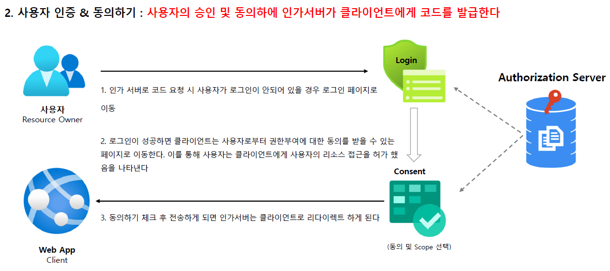

<nav>
    <a href="../.." target="_blank">[Spring Security OAuth2]</a>
</nav>

# 3.3 Authorization Code Grant Type - 권한 부여 코드 승인방식

---

## 1. Authorization Code Grant Type 개요

### 1.1 흐름 및 특징
- 사용자가 애플리케이션을 승인하면 인가서버는 Redirect URI 로 임시 코드 담아서 애플리케이션으로 다시 리다이렉션한다 
- 애플리케이션은 해당 임시 코드를 인가서버로 전달하고 액세스 토큰으로 교환한다 
- 애플리케이션이 액세스 토큰을 요청할 때 해당 요청을 클라이언트 암호로 인증할 수 있으므로 공격자가 인증 코드를 가로채서 스스로 사용할 위험이 줄어듬
- 액세스 토큰이 사용자 또는 브라우저에 표시되지 않고 애플리케이션에 다시 전달하는 가장 안전한 방법이므로 토큰이 다른 사람에게 누출될 위험이 줄어듬

### 1.2 권한부여코드 요청 시 매개변수
- response_type=code (필수)
- client_id (필수)
- redirect_uri (선택사항)
- scope (선택사항)
- state (선택사항)

### 1.3 액세스토큰 교환 요청 시 매개변수
- grant_type=authorization_code (필수)
- code (필수)
- redirect_uri (필수 : 리다이렉션 URL이 초기 승인 요청에 포함된 경우)
- client_id (필수) 
- client_secret (필수)

---

## 2. 흐름

### 2.1 클라이언트 : 승인요청 페이지 URL 준비

- 클라이언트에서는 사용자가 승인 요청 페이지(소셜 로그인 페이지)로 이동할 수 있도록 URL을 동적으로 생성해서 준비한다.
- 브라우저에서 바로 승인요청 페이지로 이동하게 할 수도 있긴 하다. 
- 하지만 승인 요청 페이지 URL을 서버에서 동적으로 생성하는게 보안상 안전하다.
- 요청 파라미터
    - response_type: code
    - client_id
    - state : CSRF 방어용
    - scope : 애플리케이션에게 허가할 유효 범위
    - redirect_uri : 승인 후 리다이렉트할 URI (클라이언트 등록시 이것도 함께 등록한다.)
- 여기서 눈여겨 볼 부분은 state이다. CSRF 방어를 위해 이 값을 동적으로 생성할 수 있다.
- 서버는 state를 동적으로 생성하고, 승인 요청 페이지 URL 쿼리 문자열에 포함시킨다.
- 이 state를 세션 또는 쿠키(http only, secure)에 암호화해서 보관한다.

### 2.2 Authorization Code 요청
- 앞서 만든 승인요청 페이지 URL을 브라우저에 내려준다.
- 리소스 소유자는 브라우저에서 해당 페이지로 접속한다.

### 2.3 사용자 인증 & 동의

- 사용자는 로그인 후, 클라이언트가 scope 범위 내에서 해당 리소스 사용을 할 수 있음을 허가한다.
- 인가 서버는 인가 요청을 허락받고, 앞서 지정했던 리다이렉트 페이지로 리다이렉트된다.

### 2.4 Redirect 및 Access Token 교환 요청: 클라이언트의 권한 부여가 승인되고 그 결과로 토큰을 획득한다

- 리다이렉트 된 페이지의 URL 쿼리문자열에는 code, state(앞서 보낸 state와 동일한 값) 가 포함된다.
- 이 페이지에서 브라우저는 클라이언트 서버로 code, state, 쿠키를 함께 전달하면 된다
- 클라이언트는 이 값들을 전달받아 유효성 검사를 수행하고(state가 유효한가?) 인가 서버로 access token 발급 요청을 수행한다.
- 파라미터
  - grany_type: authorization_code
  - code
  - client_id
  - client_secret
  - redirect_uri
- 인가에 성공하면 인가서버로부터 access token 을 발급받을 수 있다.

### 2.5 이후 : resource server 에 접근 가능
- 이후 클라이언트는 access token을 사용해 resource server의 자원에 접근할 수 있다.

---

## 3. 전체 흐름

---
