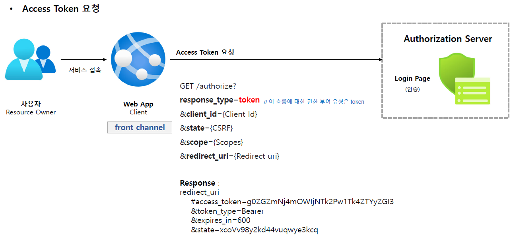
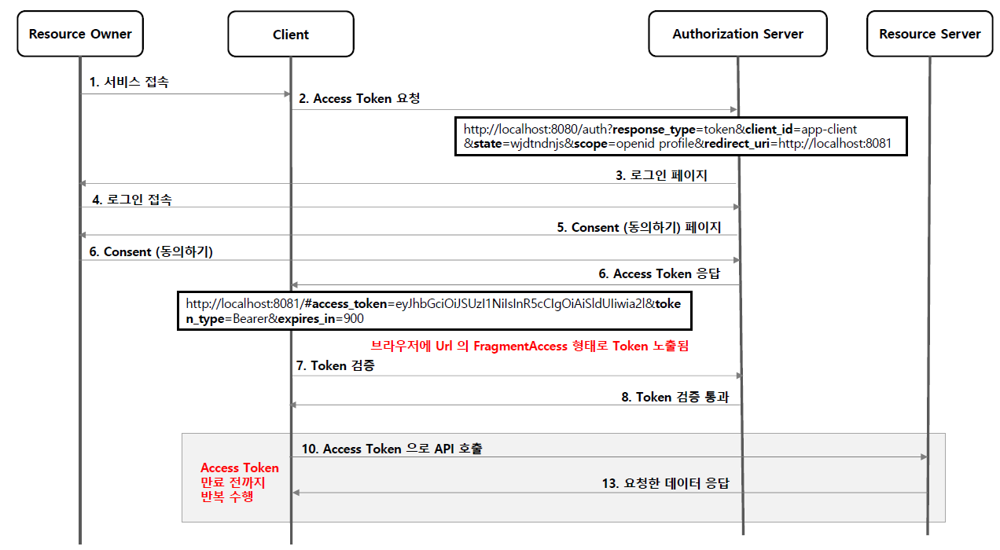

<nav>
    <a href="../.." target="_blank">[Spring Security OAuth2]</a>
</nav>

# 3.4 Implicit Grant Type - 암묵적 승인 방식

---

## 1. Implicit Grant Type 개요

### 1.1 흐름 및 특징
- 클라이언트에서 Javascript 및 HTML 소스 코드를 다운로드한 후 브라우저는 인가 서버/리소스 서버에 직접 API 요청을 한다
- 코드 교환 단계를 건너뛰고 승인 과정을 거치면 액세스 토큰이 쿼리 문자열 조각으로 클라이언트에 즉시 반환된다.
- 이 유형은 back channel 이 없으므로 refresh token 을 사용하지 못한다.
- 토큰 만료 시 어플리케이션이 새로운 access token을 얻으려면 다시 OAuth 승인 과정을 거쳐야 한다

### 1.2 권한부여 승인 요청 시 매개변수
- response_type= token(필수), id_token
- client_id: 필수
- redirect_uri: 필수
- scope: 선택
- state: 선택

---

## 2. Access Token 요청

- 브라우저에서 인가 서버로 바로 access token을 요청한다.
- 승인을 거치면 바로 access token 이 발급된다.

---

## 3. 전체 흐름

---
