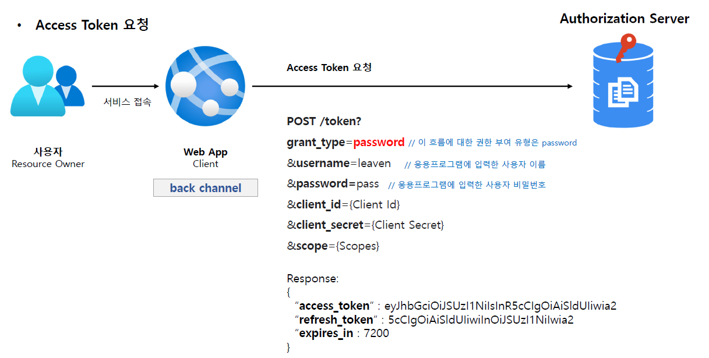
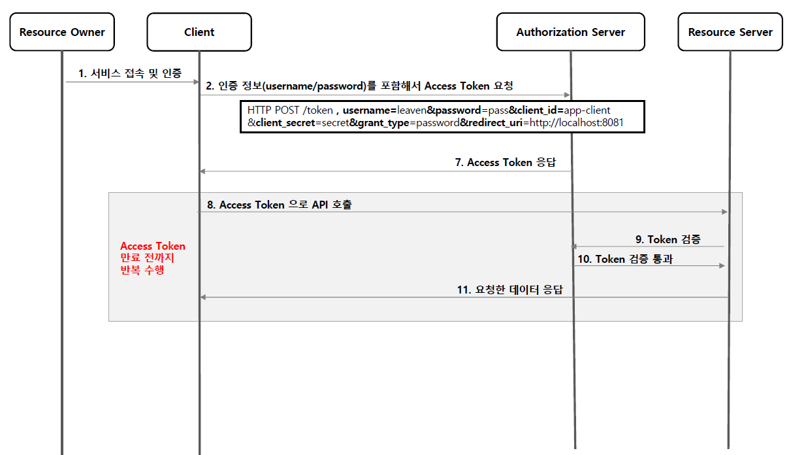
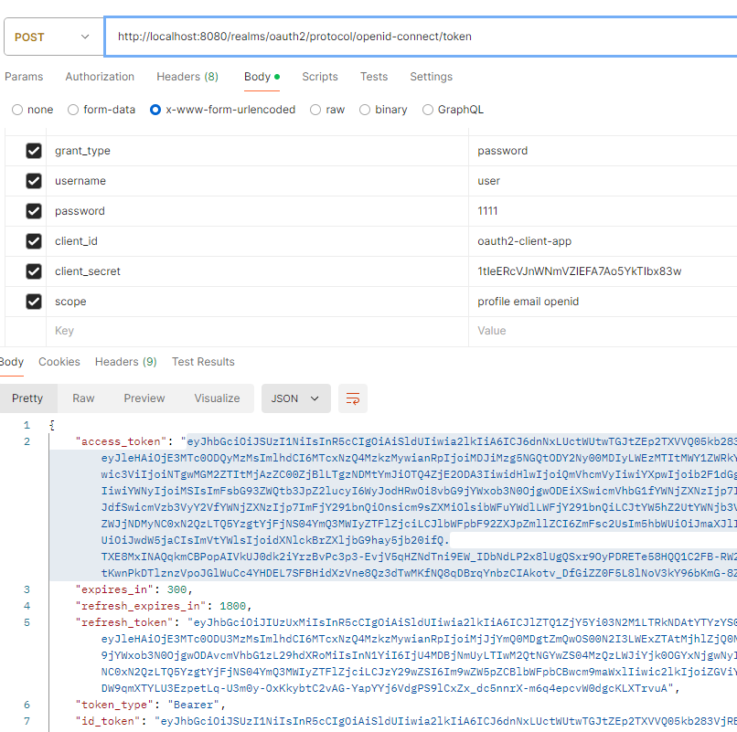

<nav>
    <a href="../.." target="_blank">[Spring Security OAuth2]</a>
</nav>

# 3.5 Resource Owner Password Credentials Grant Type - 패스워드 자격증명 승인 방식

---

## 1. Resource Owner Password Credentials Grant Type 개요

### 1.1 흐름 및 특징
- 애플리케이션이 사용자 이름과 암호를 액세스 토큰으로 교환할 때 사용된다.
- 클라이언트는 사용자로부터 아이디, 패스워드 입력을 받아서 인가 서버에 대신 전달한다.
- 타사 어플리케이션이 이 권한을 사용하도록 허용해서는 안되고 고도의 신뢰할 자사 어플리케이션에서만 사용해야 한다.
  (우리 서비스를 뭘 믿고???)

### 1.2 권한 부여 승인 요청 시 매개변수
- grant_type=password (필수)
- username (필수)
- password (필수)
- client_id (필수)
- client_secret (필수)
- scope (선택사항)

---

## 2. Access Token 요청

- 사용자는 우리 서비스에 인가 서버의 id, password를 전달한다.
- 우리 서버는 사용자를 대신하여 id, password를 제출하고 access token을 발급받는다.
- 우리 서비스의 뭘 믿고???
  - 보안상 매우 취약하다.

---

## 3. 흐름

---

## 4. 실습

- 우선 keycloak 서버에서 설정을 해줘야한다.
  - authentication flow에서 Direct access grants 를 활성화
  - 사용자 동의(consent required) 를 비활성화 해야함
- token 발급 api를 바로 직접적으로 호출하면 access token이 바로 발급된다.

---
