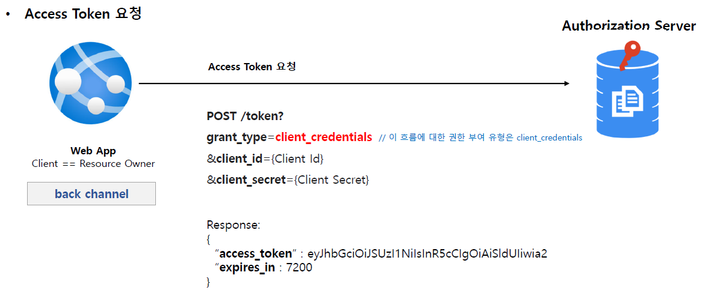
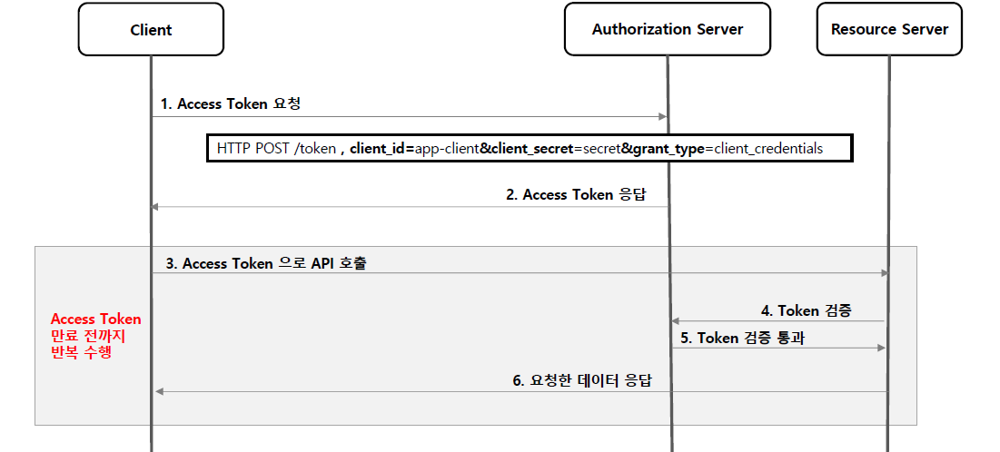
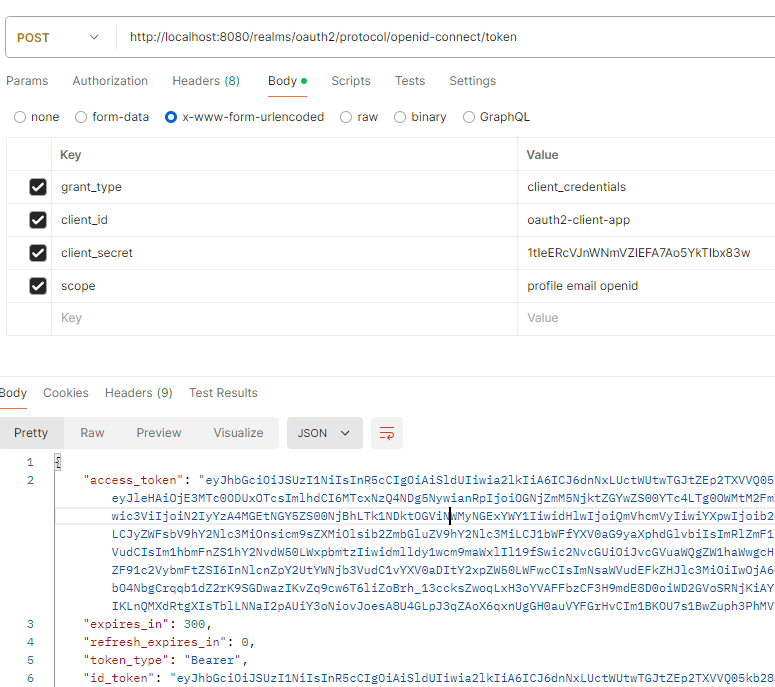
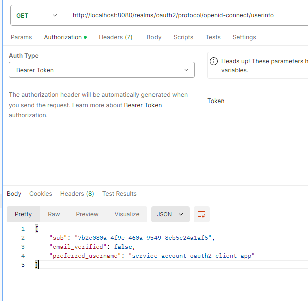

<nav>
    <a href="../.." target="_blank">[Spring Security OAuth2]</a>
</nav>

# 3.6 Client Credentials Grant Type - 클라이언트 자격증명 승인 방식

---

## 1. Client Credentials Grant Type - 개요

### 1.1 흐름 및 특징
- 애플리케이션이 **리소스 소유자인 동시에 클라이언트의 역할**을 한다 
- 리소스 소유자에게 권한 위임 받아 리소스에 접근하는 것이 아니라 자기 자신이 애플리케이션을 사용할 목적으로 사용하는 것
- 서버 대 서버간의 통신에서 사용할 수 있으며 IOT 와 같은 장비 어플리케이션과의 통신을 위한 인증으로도 사용할 수 있다.
- Client Id 와 Client Secret 을 통해 액세스 토큰을 바로 발급 받을 수 있기 때문에 Refresh Token 을 제공하지 않는다
  - Client 정보를 기반으로 하기 때문에 사용자 정보를 제공하지 않는다. 

### 1.2 권한 부여 승인 요청 시 매개변수
- grant_type=client_credentials (필수)
- client_id (필수)
- client_secret (필수)
- scope (선택사항)

---

## 2. Access Token 요청

- 단순히 클라이언트가 리소스 소유자의 역할을 수행하여 인가 서버에 요청하기 때문에 백채널에서만 수행된다.
- 파라미터도 단순하게, grant_type, client_id, client_secret 정도면 된다.

---

## 3. 전체 흐름

---

## 4. 실습

### 4.1 액세스 토큰 발급

- client_id, client_secret, grant_type을 바디에 담아 보낸다.

### 4.2 userInfo 발급

- 단순히 클라이언트가 스스로 리소스 소유자로서 자격증명을 얻어 api를 호출하므로 클라이언트의 정보만 담길 뿐
리소스 사용자들의 정보는 포함되지 않는다.

---
