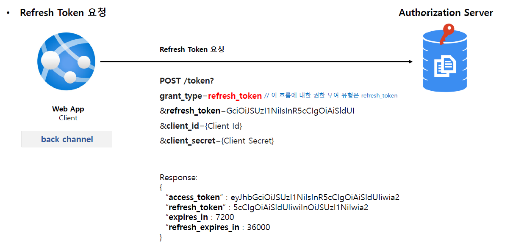
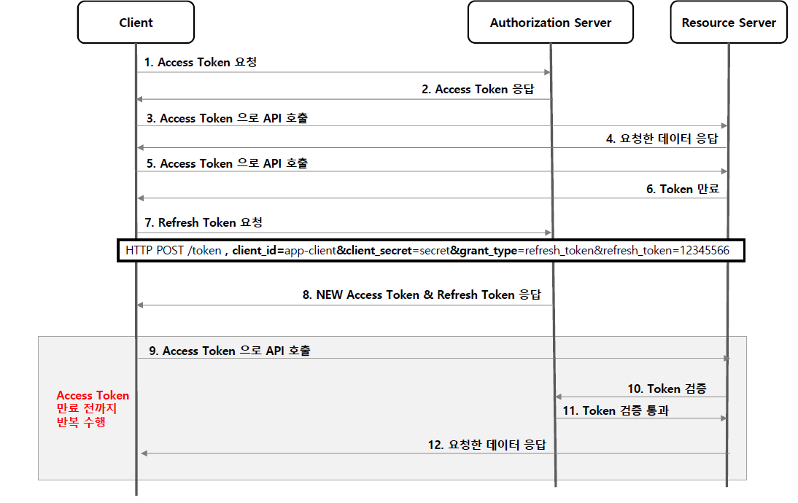
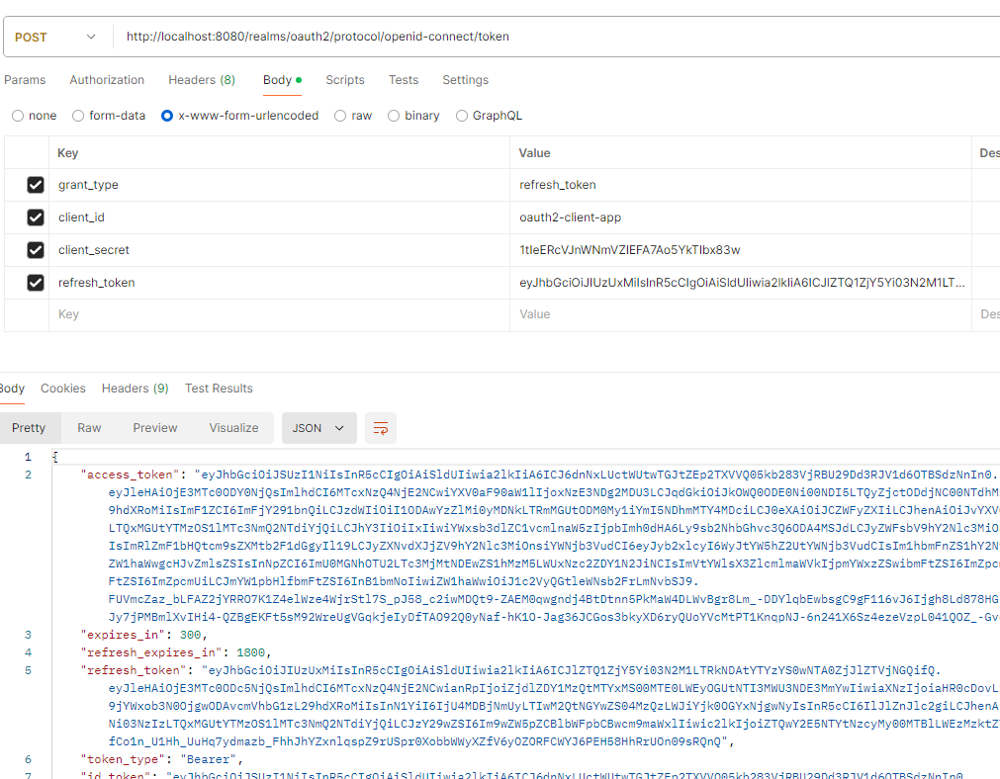

<nav>
    <a href="../.." target="_blank">[Spring Security OAuth2]</a>
</nav>

# 3.7 Refresh Token Grant Type - 리프레시 토큰 승인 방식

---

## 1. Refresh Token Grant Type - 리프레시 토큰 승인 방식

### 1.1 흐름 및 특징
- 액세스 토큰이 발급될 때 함께 제공되는 토큰으로서 액세스 토큰이 만료되더라도 함께 발급받았던 리프레시 토큰이 유효하다면, 인증 과정을 처음부터
반복하지 않아도 액세스 토큰을 재발급 받으실 수 있다.
- 한 번 사용된 리프레시 토큰은 폐기되거나 재사용 할 수 있다.
  - 폐기를 하려면, 기존 리프레시 토큰 유효기간동안 인가서버에서 별도로 세션 또는 DB를 통해 블랙리스트를 관리해야한다.
  - 이 부분은 트레이드 오프가 필요한 부분이라 팀 내 합의가 필요하다.

### 1.2 권한 부여 승인 요청 시 매개변수
- grant_type=refresh_token (필수)
- refresh_token
- client_id (필수)
- client_secret (필수)

---

## 2. 리프레시 토큰을 사용한 액세스 토큰 재발급

- 요청 시 파라미터에 리프레시 토큰을 함께 담아 보낸다.
- 응답으로 새로 access token, refresh token 이 담겨 보내진다.

---

## 3. 흐름

---

## 4. 실습

- access token/refresh token을 미리 준비하고 refresh token 재발급 api를 호출
- access token 및 refresh 토큰이 재발급된 것을 볼 수 있다.
- keycloak의 구현 기준으로는 기존 토큰은 여전히 유효하다.

---
