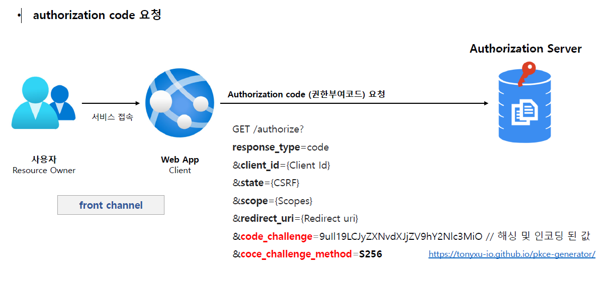
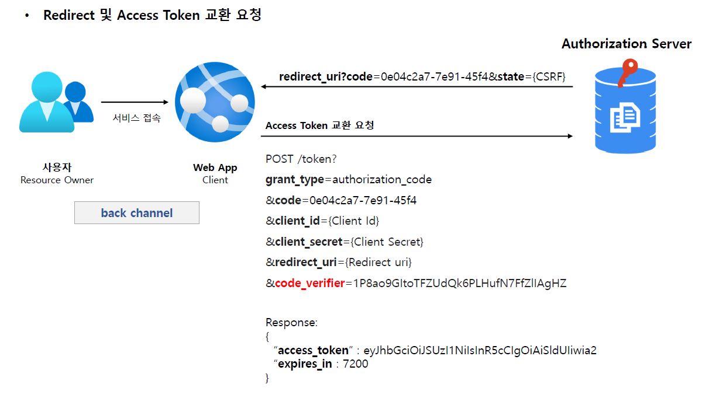
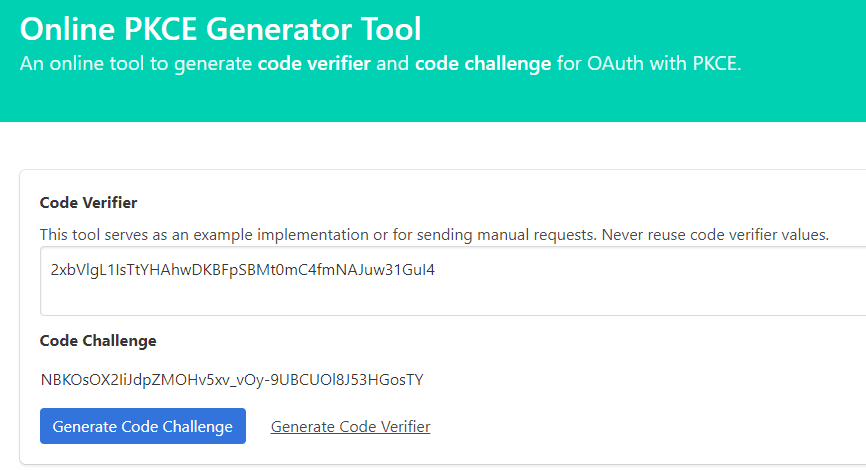
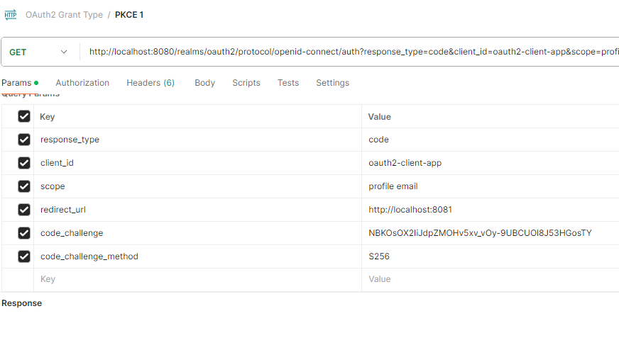
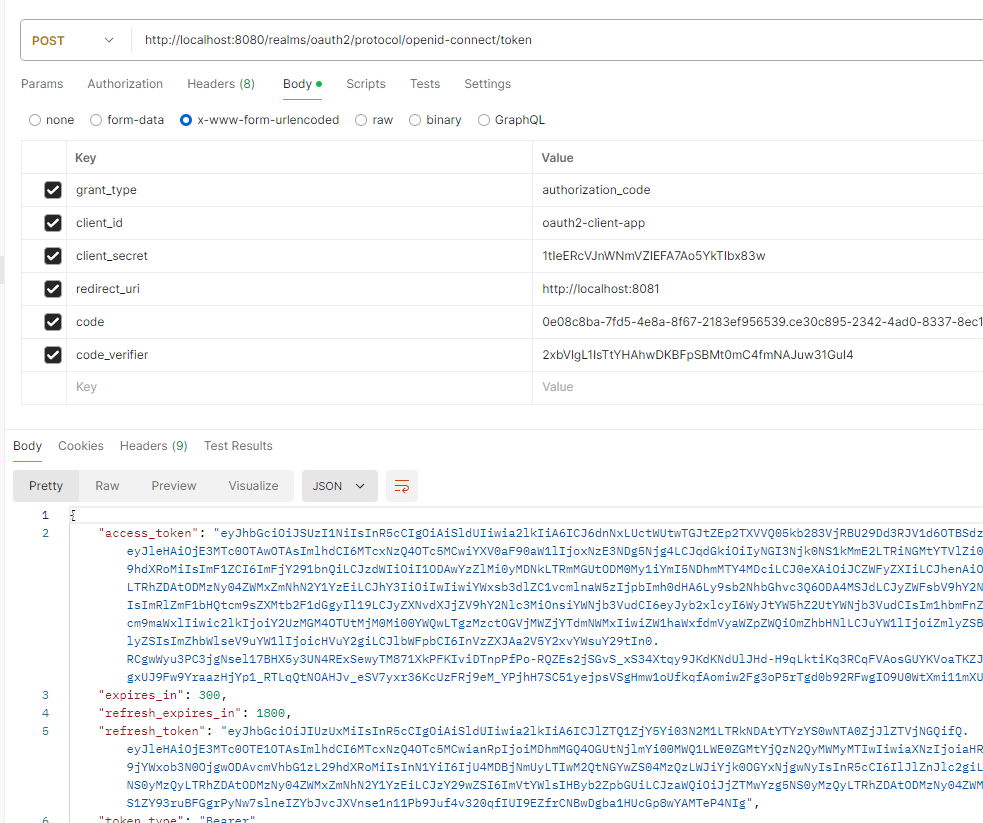

<nav>
    <a href="../.." target="_blank">[Spring Security OAuth2]</a>
</nav>

# 3.8 PKCE-enhanced Authorization Code Grant Type - PKCE 권한부여 코드 승인 방식

---

## 1. PKCE(Proof Key for Code Exchange, RFC - 6749)
- 코드 교환을 위한 증명 키로서 CSRF 및 권한부여코드 삽입 공격을 방지하기 위한 Authorization Code Grant Flow 의 확장버전이다.
- 권한부여코드 요청시 Code Verifier와 Code Challenge 를 추가하여 만약 Authorization Code Grant Flow 에서 Authrozization Code 가 탈취당했을 때 Access
Token을 발급하지 못하도록 차단한다.
- PKCE는 원래 모바일 앱에서 Authorization Code Grant Flow 를 보호하도록 설계되었으며 나중에 단일 페이지 앱에서도 사용하도록 권장되으며 모든 유형의
OAuth2 클라이언트, 심지어 클라이언트 암호를 사용하는 웹 서버에서 실행되는 앱에도 유용하다.

---

## 2. PKCE를 위한 코드 생성

### 2.1 Code Verifier(원본값)
- 권한부여코드 요청 전에 앱이 원래 생성한 PKCE 요청에 대한 코드 검증기
- 48 ~ 128 글자수를 가진 무작위 문자열
- A-Z a-z 0-9 -._~ 의 ASCII 문자들로만 구성됨
- 보관하고 있다가 실제 access token 발급 시점 때 요청에 담아 보낸다.

### 2.2 Code Exchange (해싱한 값)
- 선택한 Hash 알고리즘으로 Code Verifier를 Hashing 한 후 Base64 인코딩을 한 값
- ex) Base64Encode(Sha256(ASCII(Code Verifier)))
  - 원본값(Code Verifier)를 ASCII 인코딩 후 sha256 해싱을 한 뒤 Base64로 인코딩

### 2.3 Code Challenge Method (알고리즘)
- `plain` – Code Verifier 가 특정한 알고리즘을 사용하지 않도록 설정
- `S256` – Code Verifier 가 S256 해시 알고리즘 사용하도록 설정

---

## 3. 처리 흐름

### 3.1 authorization code 요청

1. 클라이언트는 `code_verifier(원본값)`를 생성하고, `code_challenge_method(알고리즘)`를 사용하여 `code_challenge(해싱값)`를 계산한다. 
2. 클라이언트가 `/authorize`에 대한 요청을 작성한다.
   - 여기에 `code_challenge(해싱값)`, `code_challenge_method`를 포함한다.
3. 권한 서버가 `/authorize` 에 대한 표준 OAuth2 요청 유효성 검증을 수행한다.
4. 권한 서버가 `code_challenge` 및 `code_challenge_method`의 존재를 확인한다. 
5. 권한 서버가 권한 코드에 대해 `code_challenge` 및 `code_challenge_method`를 저장한다.
   - 이 값을 기억해뒀다가 다음에 access token 요청이 들어왔을 때 유효성 검증에 사용한다.
6. 권한 서버가 권한 코드 응답을 리턴한다.

### 3.2 Redirect 및 Access Token 교환 요청

1. 클라이언트가 추가 `code_verifier(원본값)`를 포함해 권한 코드를 `/token`에 제공한다.
2. 권한 서버가 `/token`에 대한 표준 OAuth2 요청 유효성 검증을 수행한다.
3. 권한 서버가 제공된 `code_verifier(원본값)` 및 저장된 `code_challenge_method(알고리즘)`를 사용하여 고유 `code_challenge(해싱값)`를 생성한다.
4. 권한 서버가 생성된 `code_challenge`를 `/authorize`에 대한 초기 요청에 제공된 값과 비교한다.
5. 두 값이 일치하면 액세스 토큰이 발행되고 일치하지 않으면 요청이 거부된다.

### 3.3 code_challenge_method 검증
- 권한 부여 코드 흐름에 있어 인가서버는 `code_verifier(원본값)`를 검증하기 위해 `code_challenge_method(알고리즘)` 을 이미 알고 있어야 한다
- 토큰 교환시 `code_challenge_method` 가 plain 이면 인가서버는 전달된 `code_verifier` 와 보관하고 있는 `code_challenge` 문자열과 단순히
일치하는지 확인만 하면된다.
- `code_challenge_method` 가 S256이면 인가서버는 전달된 `code_verifier` 를 가져와서 동일한 S256 해시 메소드를 사용하여 변환한 다음 보관된
code_challenge 문자열과 비교해서 일치 여부를 판단한다

---

## 4. 실습

### 4.1 Online PKCE Generator Tool

- 사이트: https://tonyxu-io.github.io/pkce-generator/
- 간단하게 Code Verifier(원본값), Code Challenge(해싱값) 생성을 해주는 사이트

### 4.2 Code 발급

- code 발급 요청 시 code_challenge, code_challenge_method 를 함께 제공해서 보낸다.
- 인가 서버는 이 정보를 기억한다.

### 4.3 Access Token 발급

- access 토큰 발급 요청 시 code_verifier 를 함께 제공해서 보낸다. (잘못된 값을 보내선 안 된다)
- 인가 서버는 앞서 받은 code_challenge_method를 이용해 code_verifier 를 해싱하고 만들어진 code_challenge를
앞서 받은 code_challenge와 비교하여 유효성을 검증한다.
  두 값이 일치하면 액세스 토큰이 발행되고 일치하지 않으면 요청이 거부된다.

---
