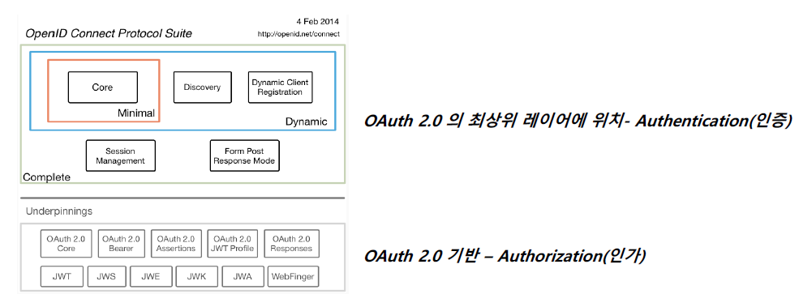
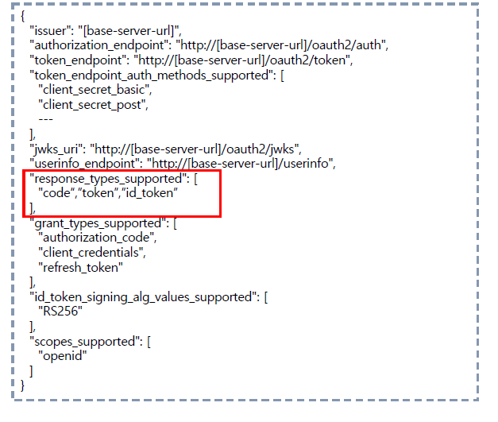
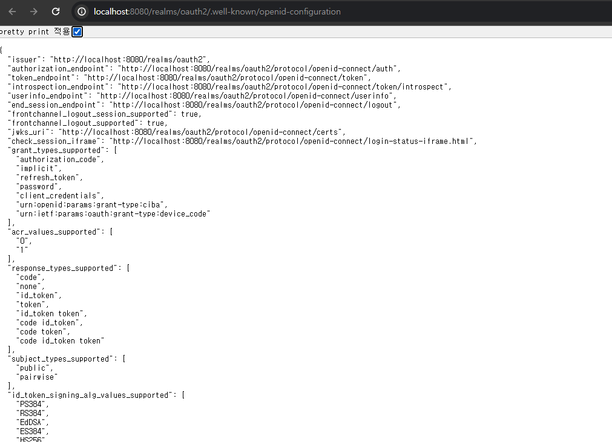

<nav>
    <a href="../.." target="_blank">[Spring Security OAuth2]</a>
</nav>

# 4.1 OAuth 2.0 Open ID Connect - 개요 및 특징

---

## 1. OpenID Connect

- OpenID Connect 1.0은 OAuth 2.0 프로토콜 위에 구축된 ID 계층으로 OAuth 2.0을 확장하여 인증 방식을 표준화 한 OAuth 2.0 기반의 인증 프로토콜이다
- scope 지정 시 “openid” 를 포함하면 OpenID Connect 사용이 가능하며 인증에 대한 정보는 ID 토큰 (ID Token )이라고 하는 JSON 웹 토큰(JWT) 으로 반환된다.
  - 여기서 말하는 인증 정보는 사용자 이름, 이메일 등이 해당된다. 이런 데이터가 JWT 페이로드의 클레임에 포함된다.
- OpenID Connect는 클라이언트가 사용자 ID를 확인할 수 있게 하는 보안 토큰인 ID Token 을 제공한다.

---

## 2. OpenID Connect Discovery 1.0 Provider Metadata

- OpenID Connect 를 사용하기 위해 필요한 모든 엔드 포인트 및 공개 키 위치 정보를 포함는 문서
- OpenID 공급자의 구성에 대한 클레임 집합이 모아져 있음
- 검색 문서 경로 : `/.well-known/openid-configuration`
  - `http(s)://[base-server-url]/.well-known/openid-configuration` 에서 검색 할 수 있도록 표준화되어 있다.
- KeyCloak에서도 지원된다.

---

## 3. OAuth 2.0 vs OpenID Connect

### 3.1 OAuth 2.0
- OAuth 2.0 Authorization Framework : 인가 프레임워크 -> 권한부여에 초점(주제)을 맞춘 프레임워크
- 권한부여를 위해 액세스 토큰을 발급받는다. 이를 통해 클라이언트는 사용자를 대신하여 사실상 인증/인가처리를 모두 할 수 있긴 하다.
  - 액세스 토큰을 통해 사용자 정보를 가져오는 API를 호출해야한다.
- 하지만 리소스 소유자의 리소스에 대한 접근 권한을 얻기 위함에 초점이 맞춰져 있지, 인증을 위한 도구가 아님.

### 3.2 OpenID Connect
- OAuth 2.0 프로토콜 위에 구축
- 인증에 초점을 둠
- ID 토큰은 JWT 형태로 제공되며 페이로드의 클레임에 사용자 정보가 포함된다.
- ID 토큰에 사용자 정보가 포함되어 전달되므로 인증을 위해 별도로 사용자 정보 API를 호출할 필요가 없다.
- 하지만 ID 토큰은 인증을 위한 자격증명에 불과하며 이를 사용해 리소스 서버의 자원을 획득하는 것은 불가능하다.

---
