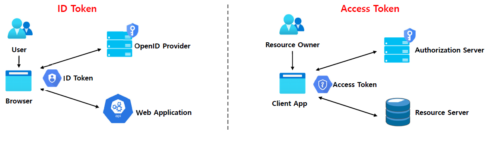
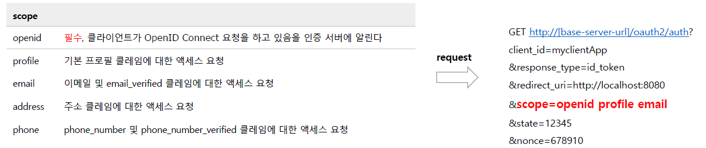
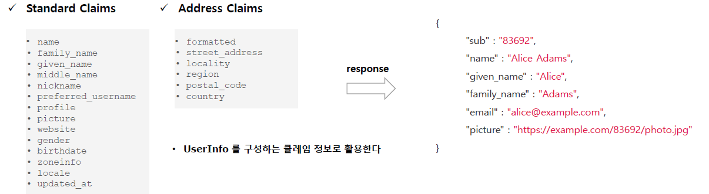
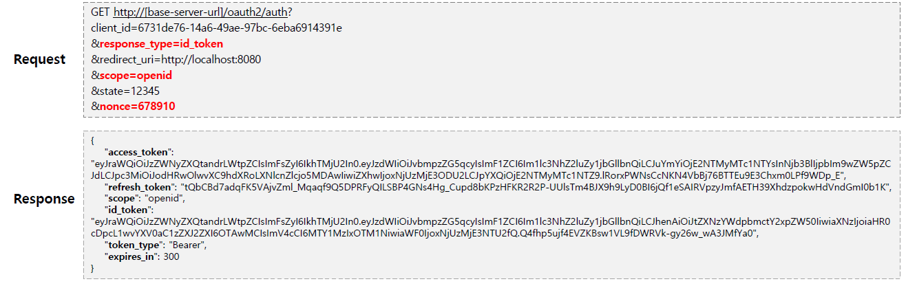
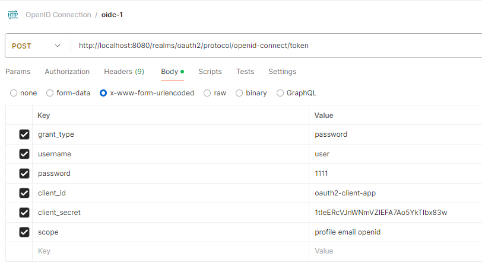
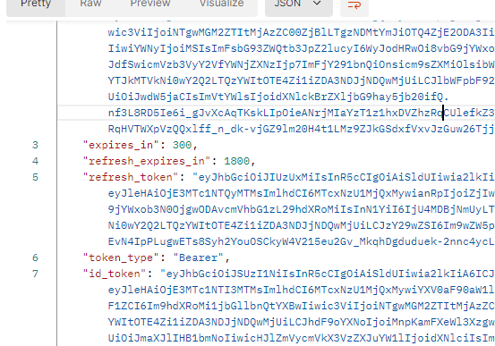
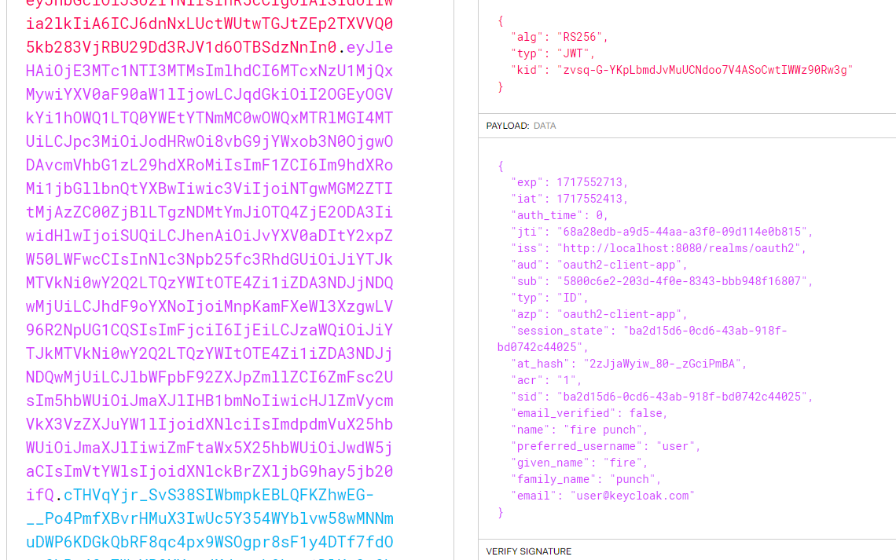
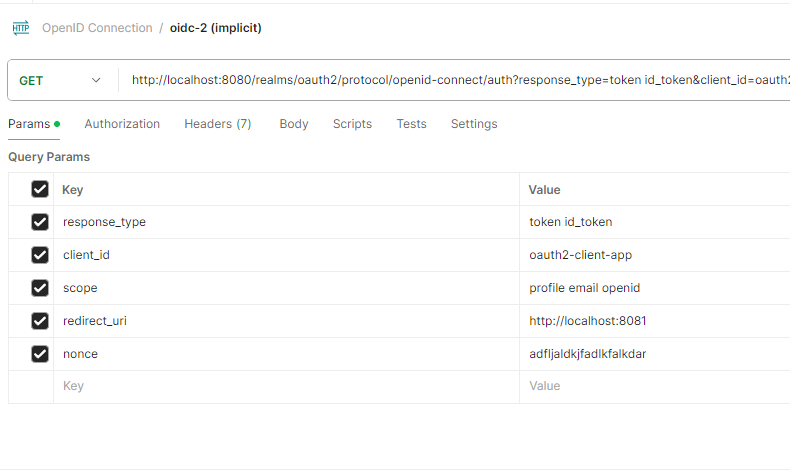
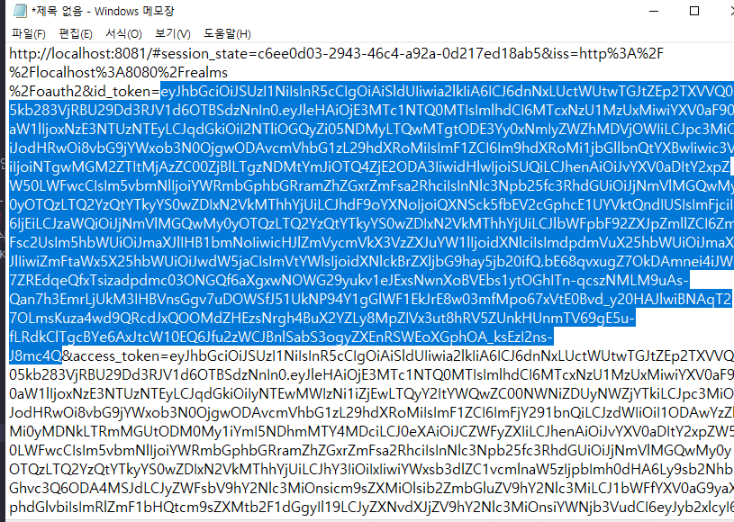
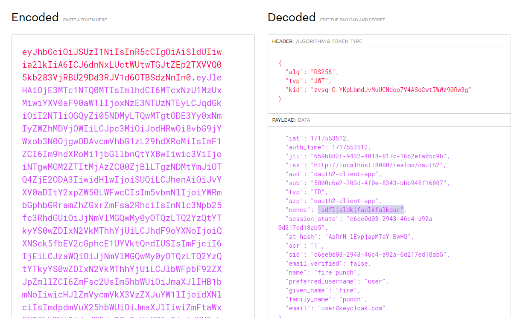

<nav>
    <a href="../.." target="_blank">[Spring Security OAuth2]</a>
</nav>

# 4.2 OAuth 2.0 Open ID Connect - ID Token & Scope

---

## 1. ID Token
- ID 토큰은 **사용자가 인증 되었음을 증명**하는 결과물로서 OIDC 요청 시 access token 과 함께 클라이언트에게 전달되는 토큰이다.
- ID 토큰은 JWT(JSON 웹 토큰)로 표현되며 헤더, 페이로드 및 서명으로 구성된다
- ID 토큰은 개인 키로 발급자가 서명하는 것으로서 토큰의 출처를 보장하고 변조되지 않았음을 보장한다.
- 어플리케이션은 공개 키로 ID 토큰을 검증 및 유효성을 검사하고 만료여부 등 토큰의 클레임을 확인 할 수 있다.
- 클라이언트는 클레임 정보에 포함되어 있는 사용자명, 이메일을 활용하여 인증 관리를 할 수 있다.
- 즉, 그 자체적으로 신원 확인(인증)을 위한 것

---

## 2. ID Token vs Access Token

### 2.1 ID Token
- 사용자의 신원확인을 위해 사용

### 2.2 Access Token
- 리소스 소유자의 리소스에 대한 접근 권한을 얻기 위함에 초점이 맞춰져 있지, 인증을 위한 도구가 아님.

---

## 3. OIDC Scope

- code 요청시 scope 파라미터에 openid 를 포함하면 OIDC가 작동한다.
- 이 때 스코프에 profile, email, address, phone 과 같이 특정 스코프를 섞으면 ID Token 클레임에 해당 정보가 포함된다.

---

## 4. OIDC Claims

- OIDC의 클레임 일부는 표준화되어 있으며(Standard Claims) `/userinfo` 엔드포인트를 통해 획득할 수도 있다.
- https://openid.net/specs/openid-connect-core-1_0.html#Claims

---

## 5. OIDC 상호행위자

### 5.1 OpenID Provider
- 줄여서 OP 라고 하며 OpenID 제공자로서 최종 사용자를 인증하고 인증 결과와 사용자에 대한 정보를 신뢰 당사자에게 제공할 수 있는 Oauth
2.0 서버를 의미한다

### 5.2 Relying Party
- 줄여서 RP 라고 하며 신뢰 당사자로서 인증 요청을 처리하기 위해 OP에 ＂의존＂하는 Oauth 2.0 애플리케이션을 의미한다(우리 서버)

---

## 6. OIDC 를 이용한 로그인 흐름
1. RP는 OP에 권한 부여 요청을 보낸다.
2. OP는 최종 사용자를 인증하고 권한을 얻는다.
3. OP는 ID 토큰과 액세스 토큰으로 응답한다.
4. RP는 Access Token을 사용하여 UserInfo 엔드포인트에 요청을 보낼 수 있다.
5. UserInfo 엔드포인트는 최종 사용자에 대한 클레임을 반환한다.

---

## 7. OIDC 파라미터

- 요청 시 openid 범위를 scope 매개 변수에 포함해야 한다.
  - response_type 매개 변수는 id_token을(를) 포함 한다. (response_type 이 해당 토큰을 지원해야 한다)
- 요청 시 `nonce` 매개 변수를 포함해야 한다. (Implicit Flow 인 경우 필수)
  - nonce 매개변수가 포함되었을 시, 응답으로 오는 id_token 클레임에는 동일한 nonce 클레임이 포함된다.
  이후 클라이언트는 nonce 의 유효성 검증을 통해 요청의 출처 검증에 사용할 수 있다.(CSRF 공격 방어)
  - state 와 유사한 개념

---

## 8. 실습

### 8.1 id_token 요청

- 여기서는 Resource Owner Password Credentials Grant 방식을 사용했다.
- scope에 openid를 포함한다.

### 8.2 id_token 응답

- id_token이 access_token과 함께 응답으로 옴

### 8.3 jwt.io 에서 토큰 확인하기

- `https://jwt.io/`
- id 토큰에 프로필 정보, 이메일이 포함된 것을 확인할 수 있다.
- 이 id 토큰으로는 사용자 정보 등의 리소스 api 호출에 사용할 수 없다.

### 8.4 implicit grant - id_token 요청

- implicit 방식으로 id_token을 획득해보자.
- response_type으로는 두 개 이상의 반환타입 지정이 가능하다. 여기서는 token, id_token을 지정했다.
- nonce 파라미터가 필수다.

### 8.5 implicit grant - id_token 응답

- 응답으로 id_token, access_token이 함께 온다.

### 8.6 implicit grant - jwt.io 에서 토큰 확인하기

- nonce 클레임이 추가된 것을 볼 수 있는데, 우리가 전달한 nonce 파라미터값과 같다.

---
