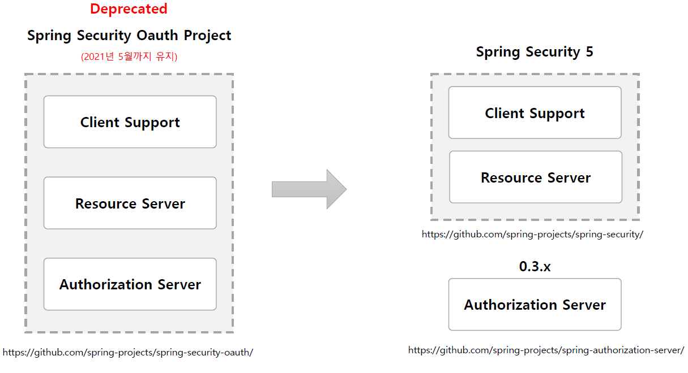

<nav>
    <a href="../.." target="_blank">[Spring Security OAuth2]</a>
</nav>

# 5.1 스프링 시큐리티 - OAuth 2.0 관련 프로젝트들

---

## 1. 스프링의 OAuth 2.0 관련 프로젝트

### 1.1 예전
- Spring Security OAuth Project
- `https://github.com/spring-attic/spring-security-oauth`
- 구성
  - client support
  - resource server
  - authorization server
- 2021년 5월까지 유지되고 이후 더 이상 지원되지 않음

### 1.2 Spring Security 5 이후
- Spring Security 프로젝트와 Spring Authorization Server 프로젝트로 분리됨
- Spring Security
  - `https://github.com/spring-projects/spring-security/`
  - Client Support : spring-boot-starter-oauth2-client 종속성 추가
  - Resource Server : spring-boot-starter-oauth2-resource-server 종속성 추가
- Spring Authorization Server
  - `https://github.com/spring-projects/spring-authorization-server/`
  - 별도 프로젝트로 분리됨.

---
