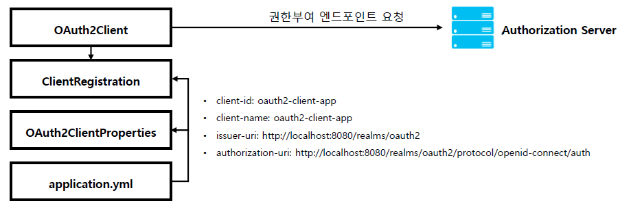
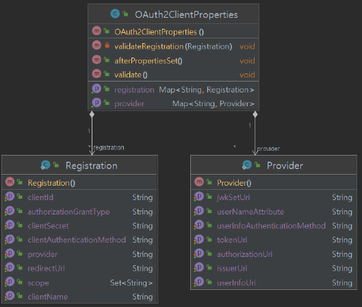
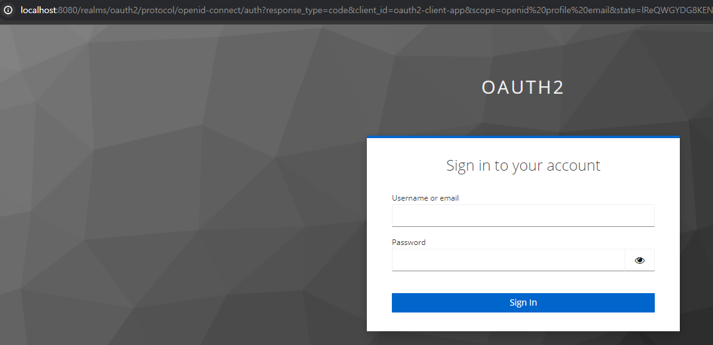
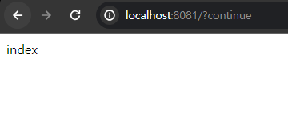
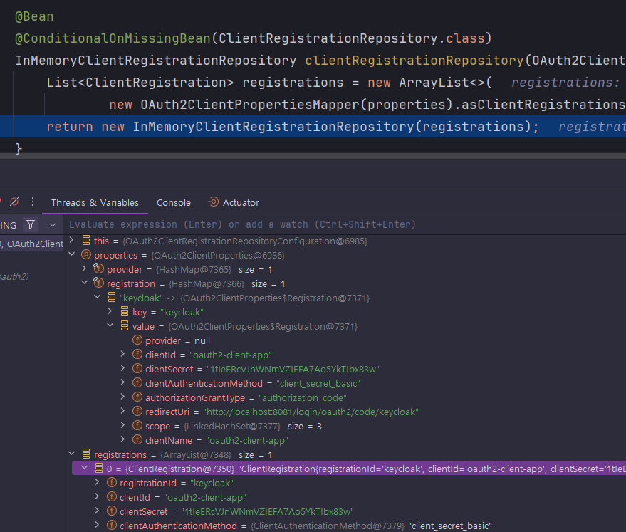
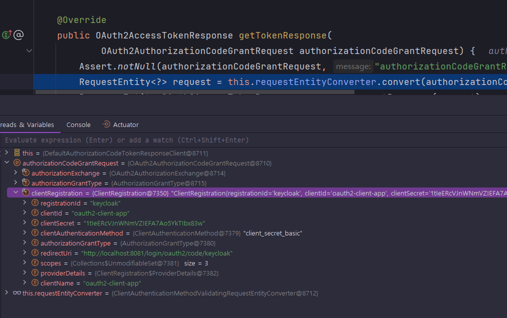

<nav>
    <a href="../.." target="_blank">[Spring Security OAuth2]</a>
</nav>

# 6.1 클라이언트 앱 시작하기 - application.yml & OAuth2ClientProperties

---

## 1. OAuth2 Client 관련 설정


- 클라이언트가 인가서버로 권한 부여 요청을 하거나 토큰 요청을 할 경우 클라이언트 정보 및 엔드포인트 정보를 참조해서 전달해야한다.
- 클라이언트 - 인가서버, 클라이언트 - 리소스 서버간 통신을 위한 설정은 어떻게 구성하고, 이 설정은 어디서 통합되어 관리되며, 어떻게 사용되는가? 
- 설정 순서
  - `application.yml` 환경설정 파일에 클라이언트 설정과 인가서버 엔드포인트 등을 설정한다. 
  - 스프링 컨테이너 초기화가 진행되면 `application.yml` 에 있는 클라이언트 및 엔드포인트 정보가 `OAuth2ClientProperties` 의 각 속성에 바인딩 된다.
  - `OAuth2ClientProperties` 에 바인딩 되어 있는 속성의 값은 인가서버로 권한부여 요청을 하기 위한 `ClientRegistration` 클래스의 필드에 저장된다 
  - `OAuth2Client` 는 `ClientRegistration` 를 참조해서 권한부여 요청을 위한 매개변수를 구성하고 인가서버와 통신한다

---

## 2. `application.yml` 작성
```yaml
spring.application.name: spring-security-oauth2

server:
  port: 8081

spring:
  security:
    oauth2:
      client:
        # 클라이언트 설정
        registration:
          # OAuth2ClientProperties 의 내부 registration Map 의 key로 삽입된다.
          keycloak:
            # 서비스 공급자에 등록된 클라이언트 id
            clientId: oauth2-client-app
            # 서비스 공급자에 등록된 클라이언트 비밀번호
            clientSecret: 1tIeERcVJnWNmVZIEFA7Ao5YkTIbx83w
            # 클라이언트 이름
            clientName: oauth2-client-app
            # OAuth 2.0 권한부여 타입
            authorizationGrantType: authorization_code
            # 인가 서버에서 권한 코드 부여 후 클라이언트로 다시 리다이렉트 하는 위치
            redirectUri: http://localhost:8081/login/oauth2/code/keycloak
            # 인가 서버 token 발급 시 Client를 입증할 수단
            # client_secret_basic -> client_id:client_secret 값을 base64 인코딩한 값을 Authorization 헤더에 삽입하여 전달하는 방식
            # client_secret_post : 파라미터 방식
            # 그 외 none ...
            clientAuthenticationMethod: client_secret_basic
            # 토큰이 허가하는 유효범위
            scope: openid,profile,email
        # 서비스 제공자 설정
        provider:
          # OAuth2ClientProperties 의 내부 provider Map 의 key로 삽입된다.
          keycloak:
            # OpenID Connect 검색 엔드포인트 또는 RFC 8414에 정의된 OAuth 2.0 인증 서버 메타데이터 엔드포인트일 수 있는 URI 의 BaseUri
            # 공급자의 baseUri
            # 해당 Uri에 /.well-known/openid-configuration 를 붙여 검색 엔드포인트를 탐색하게 된다.
            issuerUri: http://localhost:8080/realms/oauth2
            # code를 발급받을 엔드포인트
            authorizationUri: http://localhost:8080/realms/oauth2/protocol/openid-connect/auth
            # token을 발급받을 엔드포인트
            tokenUri: http://localhost:8080/realms/oauth2/protocol/openid-connect/token
            # 클라이언트가 resource server에게 데이터를 요청할 때 access token 을 전달해야 하는데
            # 이 access token을 검증하기 위한 공개키를 얻기 위한 엔드포인트
            jwkSetUri: http://localhost:8080/realms/oauth2/protocol/openid-connect/certs
            # 사용자 정보를 발급받을 엔드포인트 uri
            userInfoUri: http://localhost:8080/realms/oauth2/protocol/openid-connect/userinfo
            # OAuth2 사용자명을 추출할 key (클레임명. keycloak 기준으로는 preferred_username)
            # profile 스코프가 있어야 이 key로 사용자 이름을 가져올 수 있음
            userNameAttribute: preferred_username
```
- 여기서 설정한 값들은 OAuth2ClientProperties 객체에 바인딩된다.

---

## 3. OAuth2ClientProperties


```java
@ConfigurationProperties(prefix = "spring.security.oauth2.client")
public class OAuth2ClientProperties implements InitializingBean {

	private final Map<String, Provider> provider = new HashMap<>();
	private final Map<String, Registration> registration = new HashMap<>();
```
- provider
  - 공급자 정보 Map
  - 공급자에서 제공되는 엔드포인트 등의 정보를 나타낸다.
  - 우리가 위에서 keyCloak 이름으로 설정을 해뒀는데 이 keyCloak이 key가 되고 그 내부 프로퍼티는 Provider 객체에 바인딩된다.
- registration
  - 클라이언트 정보 Map
  - 인가서버에 등록된 클라이언트 및 요청 파라미터 정보들을 모아둔다.
  - 위에서 우리가 keyCloak 이름으로 설정을 해뒀는데 이 keyCloak이 key가 되고 그 내부 프로퍼티는 Registration 객체에 바인딩된다.

---

## 4. 실습

### 4.1 컨트롤러
```kotlin
@RestController
class IndexController {

    @GetMapping("/")
    fun index(): String {
        return "index"
    }
}
```
- 루트 엔드포인트를 하나 만들어두었다.
- 스프링 시큐리티 자동 구성에 의해 인증된 사용자만 접근 가능할 것이다.

### 4.2 루트 접속 시도


- 인가에 실패하고 자동으로 keycloak code 요청 페이지로 리다이렉트된다.
- 우리가 설정한 값 외에 state, nonce 값이 추가적으로 파라미터 형태로 전달된 것을 볼 수 있다.
- 로그인을 하고 승인을 해보자.

### 4.3 루트 접속 성공


- 루트 페이지에 접속이 성공한다.
- 이 사이에 엄청 많은 일이 있었을 것이다.
  - 승인 후 받은 code를 가지고 다시 authorization server에 access token 발급 요청을 했을 것이다.
  - 그리고 여기서 받은 access token 을 이용해 userinfo 엔드포인트에 접근하여 사용자 정보를 가져오고 인증에 사용했을 것이다.
- 스프링은 이 사이에서 무슨 일을 했을까? 그리고 그 기본 설정 지점을 우리가 어떻게 커스터마이징 할 수 있을까?

---

## 5. 디버거

### 5.1 OAuth2ClientAutoConfiguration
```java
@AutoConfiguration(before = SecurityAutoConfiguration.class)
@ConditionalOnClass({ EnableWebSecurity.class, ClientRegistration.class })
@ConditionalOnWebApplication(type = ConditionalOnWebApplication.Type.SERVLET)
@Import({ OAuth2ClientRegistrationRepositoryConfiguration.class, OAuth2WebSecurityConfiguration.class })
public class OAuth2ClientAutoConfiguration {
```
- 스프링부트 자동구성 OAuth2ClientAutoConfiguration 이 활성화된다.
- 이 자동구성에는 OAuth2ClientRegistrationRepositoryConfiguration 이 import 되어 있다.

### 5.2 OAuth2ClientRegistrationRepositoryConfiguration
```java
@Configuration(proxyBeanMethods = false)
@EnableConfigurationProperties(OAuth2ClientProperties.class)
@Conditional(ClientsConfiguredCondition.class)
class OAuth2ClientRegistrationRepositoryConfiguration {
    @Bean
    @ConditionalOnMissingBean(ClientRegistrationRepository.class)
    InMemoryClientRegistrationRepository clientRegistrationRepository(OAuth2ClientProperties properties) {
        List<ClientRegistration> registrations = new ArrayList<>(
                new OAuth2ClientPropertiesMapper(properties).asClientRegistrations().values());
        return new InMemoryClientRegistrationRepository(registrations);
    }
}
```


- 이 설정 클래스에서는 `OAuth2ClientProperties` 설정을 가져와서 사용하는데, 앞서 우리가 설정파일을 통해 설정한 값들이
여기에 바인딩되어 있다.
- 그리고 이 정보를 기반으로 `ClientRegistration` 리스트를 구성하고 이를 통해 ClientRegistrationRepository 를 만들어
빈으로 등록한다.

### 5.3 DefaultAuthorizationCodeTokenResponseClient


- `DefaultAuthorizationCodeTokenResponseClient` 클래스의 `.getTokenResponse(...)` 부분에 디버거를 걸어봤다.
- 실제 token을 발급받는 과정에서 이 클래스가 호출되는데 여기서 request를 구성할 때 앞에서 설정된 `ClientRegistration`이
사용되는 것을 확인할 수 있다. 이 정보를 이용해 인가서버와 통신하는 것이다.

---
