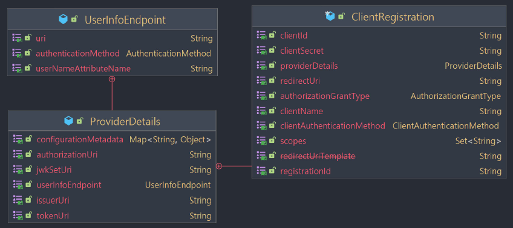
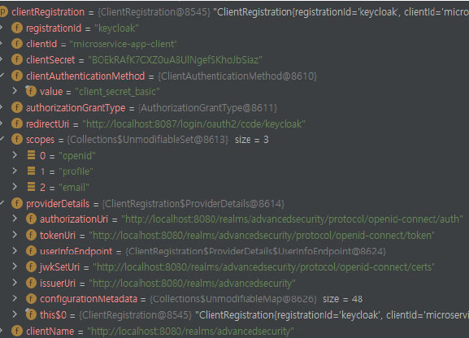
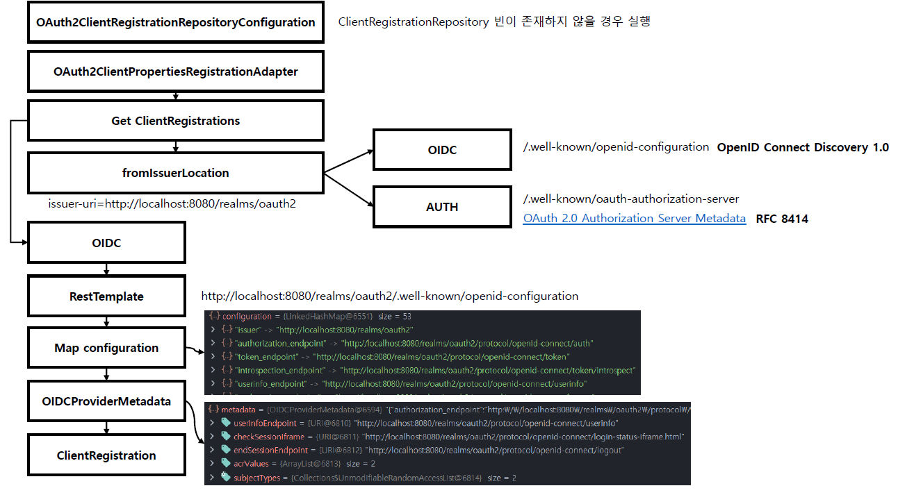

<nav>
    <a href="../.." target="_blank">[Spring Security OAuth2]</a>
</nav>

# 6.2 ClientRegistration 이해 및 활용

---

## 1. ClientRegistration
- OAuth 2.0 또는 OpenID Connect 1.0 Provider 에서 클라이언트의 등록 정보, 서비스 제공자 정보를 나타낸다
- ClientRegistration 은 OpenID Connect Provider의 설정 엔드포인트나 인가 서버의 메타데이터 엔드포인트를 찾는 과정을 거쳐서 초기화될 수 있다.
- 스프링은 기본적으로 우리가 등록한 설정값(`application.yml -> OAuth2CientProperties`)을 기반으로 ClientRegistrationRepository 를 자동구성하여 이 안에 ClientRegistration 를 모아둔다.
  - 물론 우리가 커스텀하게 ClientRegistrationRepository 를 등록해도 된다.(자바 설정 기반) 이 경우 스프링의 자동구성은 작동하지 않는다.
  - 이 부분은 뒷 챕터에서 다룬다.

---

## 2. ClientRegistration 필드 분석




### 2.1 ClientRegistration 식별자
- registrationId: 애플리케이션 내에서 ClientRegistration 을 식별할 수 있는 유니크한 id

### 2.2 클라이언트 등록정보
- clientId(필수): 클라이언트 식별자
- clientSecret(필수): 클라이언트 secret
- clientAuthenticationMethod : provider(인가서버)에서 클라이언트를 인증할 때 사용할 방법
  - `client_secret_basic` : `id:secret`을 base64 인코딩한 뒤 Authorization Header에 담아 보냄(basic 방식)
  - `client_secret_post` : id, secret 을 html form을 통해 보냄
  - `none`: 공개 클라이언트라서 secret이 필요 없는 경우 
- authorizationGrantType: OAuth 2.0 인가 프레임워크의 권한 부여 유형 중 어떤 것을 선택할 것인가?
  - authorization_code
  - implicit
  - client_credentials
  - password
- redirectUriTemplate: 클라이언트에 등록한 리다이렉트 URL로, 사용자의 인증으로 클라이언트에 접근 권한을 부여하고 나면,
인가 서버가 이 URL로 최종 사용자의 브라우저를 리다이렉트시킨다.
- Scopes : 인가 요청 플로우에서 클라이언트가 요청한 openid, 이메일, 프로필 등의 scope
- clientName: 클라이언트를 나타내는 이름으로 자동 생성되는 로그인 페이지에서 노출하는 등에 사용한다.

### 2.3 서비스 제공자 정보(ProviderDetails)
- **issuerUri**: 인가 서비스 제공자의 메타데이터 정보를 얻을 때 사용하는 baseUri
  - 이 값을 설정하면 서비스 제공자가 제공하는 메타데이터 엔드포인트에 접근하여 `configurationMetadata` 를 구성하고, 사용할 수 있다
- configurationMetadata : OpenID Provider 설정 정보 Map. issuerUri 를 설정해야, 해당 인증서버와의 http 통신을 거쳐서 이 정보를 획득하고 사용할 수 있다.
- authorizationUri : 인가 서버의 인가 엔드포인트 URI.
- tokenUri: 인가 서버의 토큰 엔드포인트 URI
- jwkSetUri : 인가 서버에서 JSON 웹 키 (JWK) 셋을 가져올 때 사용할 URI. 이 키 셋엔 ID 토큰의 JSON Web Signature (JWS) 를
검증할 때 사용할 암호키(공개키)가 있으며, UserInfo 응답을 검증할 때도 사용할 수 있다.
- userInfoEndpoint
  - uri: 인증된 최종 사용자의 클레임/속성에 접근할 때 사용하는 UserInfo 엔드포인트 URI.
  - authenticationMethod: UserInfo 엔드포인트로 액세스 토큰을 전송할 때 사용할 인증 메소드. header, form, query 를 지원한다.
- userNameAttributeName : UserInfo 응답에 있는 속성 이름으로, 최종 사용자의 이름이나 식별자에 접근할 때 사용한다

---

## 3. CommonOAuth2Provider
```java
public enum CommonOAuth2Provider {

	GOOGLE {

		@Override
		public Builder getBuilder(String registrationId) {
			ClientRegistration.Builder builder = getBuilder(registrationId,
					ClientAuthenticationMethod.CLIENT_SECRET_BASIC, DEFAULT_REDIRECT_URL);
			builder.scope("openid", "profile", "email");
			builder.authorizationUri("https://accounts.google.com/o/oauth2/v2/auth");
			builder.tokenUri("https://www.googleapis.com/oauth2/v4/token");
			builder.jwkSetUri("https://www.googleapis.com/oauth2/v3/certs");
			builder.issuerUri("https://accounts.google.com");
			builder.userInfoUri("https://www.googleapis.com/oauth2/v3/userinfo");
			builder.userNameAttributeName(IdTokenClaimNames.SUB);
			builder.clientName("Google");
			return builder;
		}

	},
```
- OAuth 2.0 공급자 정보를 제공하는 클래스로서 글로벌 서비스 제공자 일부는 기본으로 제공되어지는데 CommonOAuth2Provider enum 클래스가 그 역할을 한다.
  - Google, GitHub, FaceBoot, Okta, ...
- 이 enum 클래스는 ClientRegistration 객체를 생성할 수 있는 빌더 클래스를 반환하는데 여기에 기본적인 인가서버 정보가 준비되어 있다.
- 이들은 다른 설정은 안 해도 되지만 Client ID 와 Client Secret 는 별도로 `application.properties` 에 작성해야 해야하며, 여기서 얻어온 빌더에
해당 설정을 추가해야한다.
- Naver 나 Kakao 와 같은 국내 공급자 정보는 위의 모든 항목을 수동으로 작성해서 사용해야 한다.

---

## 4. ClientRegistration 설정 과정 흐름


- 일단 여기서는 스프링이 어떻게 ClientRegistration 을 자동 설정하는 지 흐름을 보자. 

### 4.1 OAuth2ClientRegistrationRepositoryConfiguration
```java
@Configuration(proxyBeanMethods = false)
@EnableConfigurationProperties(OAuth2ClientProperties.class)
@Conditional(ClientsConfiguredCondition.class)
class OAuth2ClientRegistrationRepositoryConfiguration {
    @Bean
    @ConditionalOnMissingBean(ClientRegistrationRepository.class)
    InMemoryClientRegistrationRepository clientRegistrationRepository(OAuth2ClientProperties properties) {
        List<ClientRegistration> registrations = new ArrayList<>(
                new OAuth2ClientPropertiesMapper(properties).asClientRegistrations().values());
        return new InMemoryClientRegistrationRepository(registrations);
    }
}
```
- ClientRegistrationRepository 빈이 등록되어있지 않을 때 스프링은 자동으로 `clientRegistrationRepository` 를 빈으로 등록한다.
- 이 설정 클래스에서는 `OAuth2ClientProperties` 설정을 가져와서 사용하는데, 앞서 우리가 설정파일을 통해 설정한 값들이
여기에 바인딩되어 있다.
- 그리고 이 정보를 기반으로 `ClientRegistration` 리스트를 구성하고 이를 통해 `ClientRegistrationRepository` 를 만들어
빈으로 등록한다.
- `asClientRegistrations()` 부분으로 파고들어가 보겠다.

### 4.2 OAuth2ClientPropertiesMapper.asClientRegistrations.values
```java
	public Map<String, ClientRegistration> asClientRegistrations() {
		Map<String, ClientRegistration> clientRegistrations = new HashMap<>();
		this.properties.getRegistration()
			.forEach((key, value) -> clientRegistrations.put(key,
					getClientRegistration(key, value, this.properties.getProvider())));
		return clientRegistrations;
	}
```
- 앞서 설정된 OAuth2Properties 를 기반으롤 ClientRegistration 목록을 만든다.
- getClientRegistration 부분을 파고들어가 보겠다.

### 4.3 OAuth2ClientPropertiesMapper.getClientRegistration
```java
	private static ClientRegistration getClientRegistration(String registrationId,
			OAuth2ClientProperties.Registration properties, Map<String, Provider> providers) {
		Builder builder = getBuilderFromIssuerIfPossible(registrationId, properties.getProvider(), providers);
		if (builder == null) {
			builder = getBuilder(registrationId, properties.getProvider(), providers);
		}
		PropertyMapper map = PropertyMapper.get().alwaysApplyingWhenNonNull();
		map.from(properties::getClientId).to(builder::clientId);
		map.from(properties::getClientSecret).to(builder::clientSecret);
		map.from(properties::getClientAuthenticationMethod)
			.as(ClientAuthenticationMethod::new)
			.to(builder::clientAuthenticationMethod);
		map.from(properties::getAuthorizationGrantType)
			.as(AuthorizationGrantType::new)
			.to(builder::authorizationGrantType);
		map.from(properties::getRedirectUri).to(builder::redirectUri);
		map.from(properties::getScope).as(StringUtils::toStringArray).to(builder::scope);
		map.from(properties::getClientName).to(builder::clientName);
		return builder.build();
	}
```
- 스프링은 ClientRegistration 을 구성할 때 클라이언트 기준인 `Registration` 항목과 서비스 제공자 기준인 `Provider` 항목으로 구분하여 설정한다
- Provider 설정 구성 : Provider 설정을 기반으로 builder를 준비
    - getBuilderFromIssuerIfPossible : provider 설정의 issuerUri 를 기반으로 메타데이터를 조회해서 provider 설정 구성
    - 앞에서 얻어오지 못 했다면 우리가 설정한 provider 설정으로 설정을 구성
- 클라이언트 설정 추가 : Registration으로부터 클라이언트 설정을 가져와 builder에 추가
- `빌더.build()` => ClientRegistration 구성

### 4.4 issuerUri 설정을 했을 경우
```java
	private static Builder getBuilderFromIssuerIfPossible(String registrationId, String configuredProviderId,
			Map<String, Provider> providers) {
		String providerId = (configuredProviderId != null) ? configuredProviderId : registrationId;
		if (providers.containsKey(providerId)) {
			Provider provider = providers.get(providerId);
			String issuer = provider.getIssuerUri();
			if (issuer != null) {
				Builder builder = ClientRegistrations.fromIssuerLocation(issuer).registrationId(registrationId);
				return getBuilder(builder, provider);
			}
		}
		return null;
	}
```
- issuerUri 설정이 있다면 issuerUri 설정을 기반으로 다음 순으로 Http 통신을 시도하고
가장 먼저 성공한 통신을 기반으로 Builder를 구성한다.
  - oidc : `/.well-known/openid-configuration`
  - oidcRfc8414 : `/.well-known/oauth-authorization-server`
- 그 후 우리가 수동 등록한 Provider 설정값이 있으면 해당 값으로 덮어 씌운다.


### 4.5 issuerUri 설정을 하지 않았을 경우
```java
	private static Builder getBuilder(String registrationId, String configuredProviderId,
			Map<String, Provider> providers) {
		String providerId = (configuredProviderId != null) ? configuredProviderId : registrationId;
		CommonOAuth2Provider provider = getCommonProvider(providerId);
		if (provider == null && !providers.containsKey(providerId)) {
			throw new IllegalStateException(getErrorMessage(configuredProviderId, registrationId));
		}
		Builder builder = (provider != null) ? provider.getBuilder(registrationId)
				: ClientRegistration.withRegistrationId(registrationId);
		if (providers.containsKey(providerId)) {
			return getBuilder(builder, providers.get(providerId));
		}
		return builder;
	}
```
- 우선 provider가 잘 알려진 provider인지 확인하고 잘 알려진 provider이면 CommonOAuth2Provider 를 통해 builder를 얻어온다.
  - google, github, facebook, okta, ...
- 잘 알려진 provider가 아닐 경우 빈 builder를 만든다.
- 그 후 우리가 수동등록한 provider 설정값이 있으면 해당 값으로 설정을 덮어 씌운다.

---

## 5. 결론
- 클라이언트 설정
  - clientId, clientSecret 설정은 필수다. (google, github, facebook, okta는 이것만 지정해도 된다.)
  - scope: 인가서버 정책에 따라 따로 지정하지 않아도 기본으로 지정되는 scope들이 있어서 인가서버 정책에 따라 선택적으로 설정하면 된다.
    - keycloak 의 경우 userInfo api 호출 시 "openid" 스코프가 필수인데 디폴트 scope 설정을 하지 않았을 경우 여기서 지정해야한다.
  - redirectUri: issuerUri 설정 시 기본값으로 "{baseUrl}/{action}/oauth2/code/{registrationId}" 템플릿으로 지정된다.
  - client_authentication_method: issuerUri 설정 시 는 메타데이터 정보를 기반으로 구성된다.
- 인가서버 설정(Provider)
  - 잘 알려진 서비스 제공자 (Google, GitHub, Facebook, Okta) 는 서비스 제공자 설정을 할 필요가 없다.
  - 그 외 서비스 제공자의 경우 issuerUri 를 등록하면 나머지 설정을 제공할 필요가 없다.
    - userNameAttribute는 기본값으로 "sub"을 사용한다.
    - authorizationGrantType 은 "authorization_code"를 사용한다.
    - clientName은 issuerUri 를 기본값으로 지정한다.
    - registrationId는 issuer의 Host를 기본값으로 지정한다.
    - 나머지 정보는 메타데이터를 기반으로 구성한다.
  - 필요에 따라 커스터마이징 설정으로 덮어씌워도 된다.

---

## 6. 실습
```yaml
spring.application.name: spring-security-oauth2

server:
  port: 8081

spring:
  security:
    oauth2:
      client:
        registration:
          keycloak:
            clientId: oauth2-client-app
            clientSecret: 1tIeERcVJnWNmVZIEFA7Ao5YkTIbx83w
            scope: openid,profile,email
        provider:
          keycloak:
            issuerUri: http://localhost:8080/realms/oauth2
```
- clientId, clientSecret 은 필수
- issuerUri 설정을 등록함으로서 그 외 provider 설정은 안 해도 된다. 스프링이 인가서버에 요청하여 메타데이터를 찾아주고
그 외 값들을 기본설정 해주기 때문이다.
- scope의 경우 keycloak에서 userinfo api 호출 시 openid scope가 필수인 정책이 있어서 따로 지정해줘야한다.
  - keycloak의 내부 디폴트 스코프 설정에서 openid 설정을 해주면 이 설정도 안 해도 될 것으로 추정된다.
- 여기서 더 나아가, google/github/facebook/okta는 clientId, clientSecret만 설정해줘도 된다.

---
