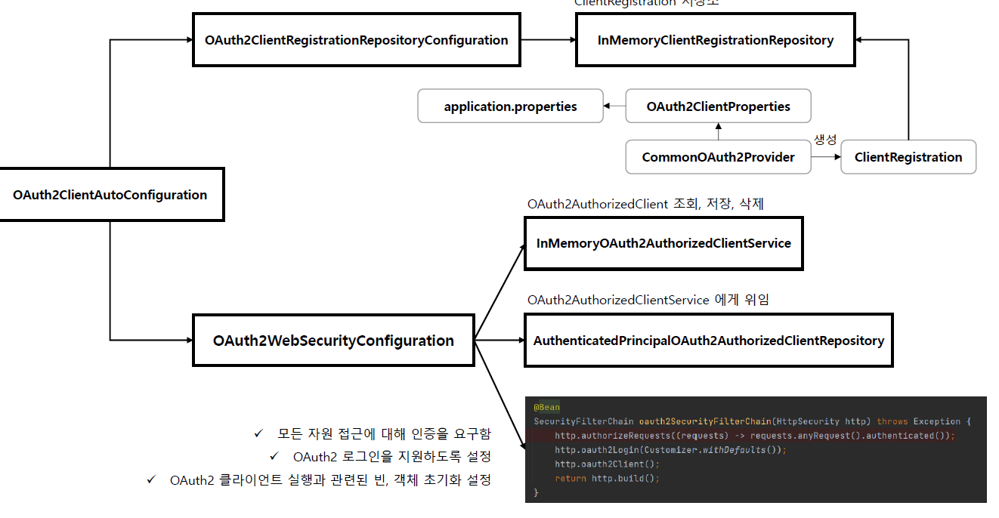
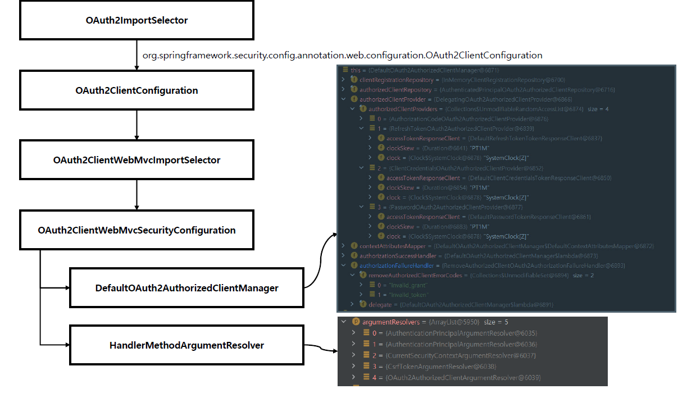

<nav>
    <a href="../.." target="_blank">[Spring Security OAuth2]</a>
</nav>

# 6.4 OAuth 2.0 Client 자동설정에 의한 초기화 과정 이해

---

## 1. (참고) OAuth2AuthorizedClient

이 부분은 이후 챕터에서 집중적으로 다루는 내용이지만, 이번 단원이해를 위해 간단하게 설명한다.

### 1.1 OAuth2AuthorizedClient
```java
public class OAuth2AuthorizedClient implements Serializable {

	private final ClientRegistration clientRegistration;
	private final String principalName;
	private final OAuth2AccessToken accessToken;
	private final OAuth2RefreshToken refreshToken;
```
- 최종 사용자(자원 소유자)로부터 권한부여를 위임받고, 인가서버를 통해 인가에 승인하면 승인된 정보가 여기에 저장된다.
    - 소유자 이름
    - accessToken
    - refreshToken
- 이 정보를 이용해서 리소스 서버에 요청을 보내 최종 사용자의 자원을 가져올 수 있다.

### 1.2 OAuth2AuthorizedClientManager
```java
public interface OAuth2AuthorizedClientManager {
	@Nullable
	OAuth2AuthorizedClient authorize(OAuth2AuthorizeRequest authorizeRequest);
}
```
- OAuth2AuthorizeRequest 를 받고, 이를 토대로 OAuth2AuthorizedClient 반환하는 역할
- 내부 구현에서 다음 AuthorizedClient의 전반적인 관리를 책임져야 한다.
  - `OAuth2AuthorizedClientProvider` 를 사용하여, OAuth2Client 2.0 클라이언트를 승인 또는 재승인해야한다. (자원 소유자의 허락을 기반으로 권한 부여를 받는 것)
  - 일반적으로 `OAuth2AuthorizedClientService` 또는 `OAuth2AuthorizedClientRepository` 를 사용하여 `OAuth2AuthorizedClient` 의 지속성을 위임한다.

### 1.3 `OAuth2AuthorizedClientService`
- `OAuth2AuthorizedClient` 를 조회, 저장, 삭제하는 역할(지속성)

### 1.4 `OAuth2AuthorizedClientRepository`
- `OAuth2AuthorizedClientService`에게 위임

---

## 2. `OAuth2ClientAutoConfiguration` 에 의한 자동 설정


### 2.1 `OAuth2ClientAutoConfiguration`
```java
@AutoConfiguration(before = SecurityAutoConfiguration.class)
@ConditionalOnClass({ EnableWebSecurity.class, ClientRegistration.class })
@ConditionalOnWebApplication(type = ConditionalOnWebApplication.Type.SERVLET)
@Import({ OAuth2ClientRegistrationRepositoryConfiguration.class, OAuth2WebSecurityConfiguration.class })
public class OAuth2ClientAutoConfiguration {
}
```
- Spring OAuth2 Client 모듈이 포함될 경우 OAuth2ClientAutoConfiguration 자동구성이 활성화된다.
- 이 구성에는 다음 설정이 포함된다.
    - OAuth2ClientRegistrationRepositoryConfiguration
    - OAuth2WebSecurityConfiguration

### 2.2 `OAuth2ClientRegistrationRepositoryConfiguration`
```java
@Configuration(proxyBeanMethods = false)
@EnableConfigurationProperties(OAuth2ClientProperties.class)
@Conditional(ClientsConfiguredCondition.class)
class OAuth2ClientRegistrationRepositoryConfiguration {

	@Bean
	@ConditionalOnMissingBean(ClientRegistrationRepository.class)
	InMemoryClientRegistrationRepository clientRegistrationRepository(OAuth2ClientProperties properties) {
		List<ClientRegistration> registrations = new ArrayList<>(
				new OAuth2ClientPropertiesMapper(properties).asClientRegistrations().values());
		return new InMemoryClientRegistrationRepository(registrations);
	}

}
```
- 앞서 배운 내용이다.
- 별도로 `ClientRegistrationRepository` 빈을 등록하지 않았다면 설정을 기반으로 OAuth2ClientProperties 를 구성하고
이를 기반으로 ClientRegistrationRepository 를 빈으로 등록한다.

### 2.3 `OAuth2WebSecurityConfiguration`
```java
@Configuration(proxyBeanMethods = false)
@ConditionalOnBean(ClientRegistrationRepository.class)
class OAuth2WebSecurityConfiguration {

	@Bean
	@ConditionalOnMissingBean
	OAuth2AuthorizedClientService authorizedClientService(ClientRegistrationRepository clientRegistrationRepository) {
		return new InMemoryOAuth2AuthorizedClientService(clientRegistrationRepository);
	}

	@Bean
	@ConditionalOnMissingBean
	OAuth2AuthorizedClientRepository authorizedClientRepository(OAuth2AuthorizedClientService authorizedClientService) {
		return new AuthenticatedPrincipalOAuth2AuthorizedClientRepository(authorizedClientService);
	}

	@Configuration(proxyBeanMethods = false)
	@ConditionalOnDefaultWebSecurity
	static class OAuth2SecurityFilterChainConfiguration {

		@Bean
		SecurityFilterChain oauth2SecurityFilterChain(HttpSecurity http) throws Exception {
			http.authorizeHttpRequests((requests) -> requests.anyRequest().authenticated());
			http.oauth2Login(withDefaults());
			http.oauth2Client(withDefaults());
			return http.build();
		}

	}

}
```
- 다음 빈을 등록하지 않았다면 각각 자동으로 빈이 등록된다.
    - `OAuth2AuthorizedClientService` : `OAuth2AuthorizedClient` 를 조회, 저장, 삭제하는 역할
        - InMemoryOAuth2AuthorizedClientService 구현체가 지정된다.
    - `OAuth2AuthorizedClientRepository` : `OAuth2AuthorizedClientService`에게 위임
        - AuthenticatedPrincipalOAuth2AuthorizedClientRepository 구현체가 지정된다
    - **SecurityFilterChain**
        - 모든 엔드포인트에 인증이 필요
        - `oAuth2Login` api 기본 설정, `oAuth2Client` api 기본 설정이 포함


---

## 3. `OAuth2ImportSelector`에 의한 설정


### 3.1 `@EnalbeWebSecurity`
```java
@Retention(RetentionPolicy.RUNTIME)
@Target(ElementType.TYPE)
@Documented
@Import({ WebSecurityConfiguration.class, SpringWebMvcImportSelector.class, OAuth2ImportSelector.class,
		HttpSecurityConfiguration.class })
@EnableGlobalAuthentication
public @interface EnableWebSecurity {
```
- 스프링부트 시큐리티 자동 구성에 의해 `@EnableWebSecurity` 구성이 자동 포함된다. (개발자가 명시적으로 지정하지 않아도 자동으로 포함된다)
- Spring Security 의 `@EnableWebSecurity` 설정에서, `@OAuth2ImportSelector` ImportSelector 가 포함되어있다.
  - ImportSelector 는 프로그래밍 방식으로 런타임에 다른 설정 클래스를 설정에 포함하기 위한 Spring 의 설정 클래스이다.

### 3.2 `OAuth2ImportSelector`
```java
final class OAuth2ImportSelector implements ImportSelector {

	@Override
	public String[] selectImports(AnnotationMetadata importingClassMetadata) {
		Set<String> imports = new LinkedHashSet<>();
		ClassLoader classLoader = getClass().getClassLoader();
		boolean oauth2ClientPresent = ClassUtils
			.isPresent("org.springframework.security.oauth2.client.registration.ClientRegistration", classLoader);
		boolean webfluxPresent = ClassUtils
			.isPresent("org.springframework.web.reactive.function.client.ExchangeFilterFunction", classLoader);
		boolean oauth2ResourceServerPresent = ClassUtils
			.isPresent("org.springframework.security.oauth2.server.resource.BearerTokenError", classLoader);
		if (oauth2ClientPresent) {
			imports.add("org.springframework.security.config.annotation.web.configuration.OAuth2ClientConfiguration");
		}
		if (webfluxPresent && oauth2ClientPresent) {
			imports.add(
					"org.springframework.security.config.annotation.web.configuration.SecurityReactorContextConfiguration");
		}
		if (webfluxPresent && oauth2ResourceServerPresent) {
			imports.add(
					"org.springframework.security.config.annotation.web.configuration.SecurityReactorContextConfiguration");
		}
		return StringUtils.toStringArray(imports);
	}

}
```
- 스프링부트의 "oauth2 client" 모듈이 포함되어 있을 경우, `OAuth2ClientConfiguration` 설정이 포함된다.

### 3.3 `OAuth2ClientConfiguration`
```java
@Import({ OAuth2ClientConfiguration.OAuth2ClientWebMvcImportSelector.class,
		OAuth2ClientConfiguration.OAuth2AuthorizedClientManagerConfiguration.class })
final class OAuth2ClientConfiguration {
```
- 이 설정에서는 내부 클래스 `OAuth2AuthorizedClientManagerConfiguration.class` 설정과 `OAuth2ClientWebMvcImportSelector.class` 설정과  설정이
포함된다.

### 3.4 `OAuth2AuthorizedClientManagerConfiguration`에 의한 설정
```java
@Configuration(proxyBeanMethods = false)
static class OAuth2AuthorizedClientManagerConfiguration {
    @Bean(name = OAuth2AuthorizedClientManagerRegistrar.BEAN_NAME)
    OAuth2AuthorizedClientManagerRegistrar authorizedClientManagerRegistrar() {
        return new OAuth2AuthorizedClientManagerRegistrar();
    }
}
```
- OAuth2AuthorizedClientManagerRegistrar 를 빈으로 등록한다.
  - 이 클래스는 아래 설정에서 OAuth2AuthorizedClientManager 빈이 존재하지 않을 경우 기본 OAuth2AuthorizedClientManager 를 만들어 반환하는 것을 목적으로
  만들어졌다.

### 3.5 `OAuth2ClienetWebMvcImportSelector`에 의한 설정
```java
	static class OAuth2ClientWebMvcImportSelector implements ImportSelector {

		@Override
		public String[] selectImports(AnnotationMetadata importingClassMetadata) {
			if (!webMvcPresent) {
				return new String[0];
			}
			return new String[] {
					OAuth2ClientConfiguration.class.getName() + ".OAuth2ClientWebMvcSecurityConfiguration" };
		}

	}
```
- spring web mvc가 포함되어 있을 경우 내부 클래스 `OAuth2ClientConfiguration.OAuth2ClientWebMvcSecurityConfiguration` 설정이
활성화된다.

```java

	@Configuration(proxyBeanMethods = false)
	static class OAuth2ClientWebMvcSecurityConfiguration implements WebMvcConfigurer {

		private OAuth2AuthorizedClientManager authorizedClientManager;

		private SecurityContextHolderStrategy securityContextHolderStrategy;

		private OAuth2AuthorizedClientManagerRegistrar authorizedClientManagerRegistrar;

		@Override
		public void addArgumentResolvers(List<HandlerMethodArgumentResolver> argumentResolvers) {
			OAuth2AuthorizedClientManager authorizedClientManager = getAuthorizedClientManager();
			if (authorizedClientManager != null) {
				OAuth2AuthorizedClientArgumentResolver resolver = new OAuth2AuthorizedClientArgumentResolver(
						authorizedClientManager);
				if (this.securityContextHolderStrategy != null) {
					resolver.setSecurityContextHolderStrategy(this.securityContextHolderStrategy);
				}
				argumentResolvers.add(resolver);
			}
		}

		@Autowired(required = false)
		void setAuthorizedClientManager(List<OAuth2AuthorizedClientManager> authorizedClientManagers) {
			if (authorizedClientManagers.size() == 1) {
				this.authorizedClientManager = authorizedClientManagers.get(0);
			}
		}

		@Autowired(required = false)
		void setSecurityContextHolderStrategy(SecurityContextHolderStrategy strategy) {
			this.securityContextHolderStrategy = strategy;
		}

		@Autowired
		void setAuthorizedClientManagerRegistrar(
				OAuth2AuthorizedClientManagerRegistrar authorizedClientManagerRegistrar) {
			this.authorizedClientManagerRegistrar = authorizedClientManagerRegistrar;
		}

		private OAuth2AuthorizedClientManager getAuthorizedClientManager() {
			if (this.authorizedClientManager != null) {
				return this.authorizedClientManager;
			}
			return this.authorizedClientManagerRegistrar.getAuthorizedClientManagerIfAvailable();
		}

	}
```
- WebMvcConfigurer 설정 클래스인데, `OAuth2AuthorizedClientArgumentResolver`를 MVC의 ArgumentResolver 목록에 등록하기 위해 존재한다.
- 설정 과정
  - `OAuth2AuthorizedClientManager` 를 준비한다.
    - `OAuth2AuthorizedClientManager` 빈을 목록으로 주입받고 그들중 0번째 매니저를 설정한다.
    - `OAuth2AuthorizedClientManager` 빈이 없으면 위에서 설정한 `authorizedClientManagerRegistrar` 를 이용해 `AuthorizedClientManager`를
    생성하여 디폴트 설정한다.
  - `SecurityContextHolderStrategy` 빈이 존재하면 이것을 사용하도록 한다. (SecurityContextHolderStrategy 를 빈으로 등록하지 않았으면 내부적으로 ThreadLocalSecurityContextHolderStrategy 를 사용할 것이다)
  - `OAuth2AuthorizedClientArgumentResolver`를 구성하여 ArgumentResolver 목록에 등록한다.

---

## 4. 정리
`spring-boot-starter-oauth2-client`가 등록되면 다음 설정이 기본 활성화된다.

- `ClientRegistrationRepository` : 클라이언트/서비스 제공자 정보가 모인 `ClientRegistration` 목록을 저장해둔 리포지토리
- `OAuth2AuthorizedClientService` : `OAuth2AuthorizedClient` 를 조회, 저장, 삭제하는 역할
- `OAuth2AuthorizedClientRepository` : `OAuth2AuthorizedClientService`에게 위임
- **SecurityFilterChain** : 기본 `oAuth2Login`, `oAuth2Client` 설정이 포함됐고 모든 엔드포인트에 인증이 필요한 시큐리티 필터체인
- `OAuth2AuthorizedClientArgumentResolver` 가 만들어져 ArgumentResolver 목록에 추가

---
