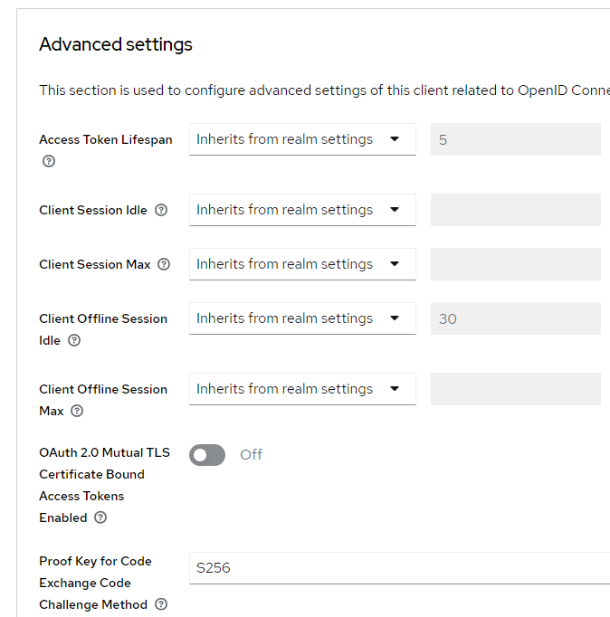

<nav>
    <a href="../.." target="_blank">[Spring Security OAuth2]</a>
</nav>

# 7.11 API 커스텀 구현 - 커스텀 OAuth2AuthorizationRequestResolver

---

## 1. DefaultOAuth2AuthorizationRequestResolver 의 한계
- clientAuthenticationMethod 이어야만 PKCE 를 적용할 수 있다.
- 즉, 공개 클라이언트일 때만 PKCE 를 적용할 수 있다.
- clientSecret 도 포함하여 기밀 클라이언트인 상태로 PKCE 를 적용받을 수는 없다.
    - 이 문제를 해결하려면 커스텀한 OAuth2AuthorizationRequestResolver 를 사용해야한다.

---

## 2. CustomOAuth2AuthorizationRequestResolver
```kotlin

class CustomOAuth2AuthorizationRequestResolver
private constructor(
    private val authorizationRequestMatcher: RequestMatcher,
    private val defaultResolver: DefaultOAuth2AuthorizationRequestResolver
) : OAuth2AuthorizationRequestResolver {

    companion object {
        private val REGISTRATION_ID_URI_VARIABLE_NAME = "registrationId";
        private val DEFAULT_PKCE_APPLIER: Consumer<OAuth2AuthorizationRequest.Builder> =
            OAuth2AuthorizationRequestCustomizers.withPkce()


        fun of(
            clientRegistrationRepository: ClientRegistrationRepository,
            authorizationRequestBaseUri: String
        ): CustomOAuth2AuthorizationRequestResolver {
            return CustomOAuth2AuthorizationRequestResolver(
                AntPathRequestMatcher("${authorizationRequestBaseUri}/{$REGISTRATION_ID_URI_VARIABLE_NAME}"),
                DefaultOAuth2AuthorizationRequestResolver(clientRegistrationRepository, authorizationRequestBaseUri)
            )
        }
    }

    override fun resolve(request: HttpServletRequest): OAuth2AuthorizationRequest? {
        return resolve(request, resolveRegistrationId(request))
    }

    override fun resolve(request: HttpServletRequest, clientRegistrationId: String?): OAuth2AuthorizationRequest? {
        if (clientRegistrationId == null) {
            return null
        }

        // registrationId 가 "keyCloakWithPKCE" 인 경우 여기서 요청을 가로챈다.
        // 기본 스프링 시큐리티 구현은 clientAuthenticationMethod = none 일 때만 PKCE가 작동한다.
        // 기밀 클라이언트로서 pkce 를 적용시키려면 우리가 수동으로 pkce를 적용시켜줘야한다.
        if (clientRegistrationId == "keycloakWithPKCE") {
            return resolveKeyCloakPKCERequest(request)
        }
        return defaultResolver.resolve(request)
    }

    private fun resolveKeyCloakPKCERequest(request: HttpServletRequest): OAuth2AuthorizationRequest {
        val authorizationRequest = defaultResolver.resolve(request)
        val builder = OAuth2AuthorizationRequest.from(authorizationRequest)

        // 커스텀 헤더 전달 가능
        val additionalParameters = mapOf(
            "customName1" to "customValue1",
            "customName2" to "customValue2",
            "customName3" to "customValue3"
        )
        builder.additionalParameters(additionalParameters)

        DEFAULT_PKCE_APPLIER.accept(builder)
        return builder.build()
    }

    private fun resolveRegistrationId(request: HttpServletRequest): String? {
        if (authorizationRequestMatcher.matches(request)) {
            return this.authorizationRequestMatcher.matcher(request).variables[REGISTRATION_ID_URI_VARIABLE_NAME]
        }
        return null
    }
}
```
- resolve
  - clientRegistrationId 추출
    - 요청 uri가 `${authorizationRequestBaseUri}/{$REGISTRATION_ID_URI_VARIABLE_NAME}` 패턴을 따르지 않거나, registrationId 를 추출할 수 없으면
    null 을 반환하게 한다.
- clientRegistrationId 이 "keycloakWithPKCE" 인 경우에만 PKCE를 적용하게한다. (resolveKeyCloakPKCERequest)
  - 디폴트 리졸버를 통해 resolve하고, 이를 기반으로 새로 빌더를 만든다.
  - 빌더에 커스텀 파라미터를 부가적으로 추가할 수 있다.
  - 또, 빌더에 PKCE Applier를 적용할 수 있다.
  - 이렇게 하면 clientAuthenticationMethod 가 none 이 아니여도 PKCE를 적용할 수 있다.
- clientRegistrationId 이 "keycloakWithPKCE" 이 아닌 경우에는 PKCE를 적용하지 않고 디폴트 리졸버를 통해 resolve 하게 한다.

---

## 3. 실습

### 3.1 application.yml
```yaml
spring.application.name: spring-security-oauth2

server:
  port: 8081

spring:
  security:
    oauth2:
      client:
        registration:
          keycloak:
            clientId: oauth2-client-app
            clientSecret: 1tIeERcVJnWNmVZIEFA7Ao5YkTIbx83w
            clientName: oauth2-client-app
            authorizationGrantType: authorization_code
            redirectUri: http://localhost:8081/login/oauth2/code/keycloak
            clientAuthenticationMethod: client_secret_basic
            scope: openid,profile
          keycloakWithPKCE:
            provider: keycloak
            clientId: oauth2-client-app2
            clientSecret: QSqs5YgObgPaCtSwbyUVNJYgCGU1tkcj
            clientName: oauth2-client-app2
            authorizationGrantType: authorization_code
            redirectUri: http://localhost:8081/login/oauth2/code/keycloak
            clientAuthenticationMethod: client_secret_basic
            scope: openid,profile
        provider:
          keycloak:
            issuerUri: http://localhost:8080/realms/oauth2
            authorizationUri: http://localhost:8080/realms/oauth2/protocol/openid-connect/auth
            tokenUri: http://localhost:8080/realms/oauth2/protocol/openid-connect/token
            jwkSetUri: http://localhost:8080/realms/oauth2/protocol/openid-connect/certs
            userInfoUri: http://localhost:8080/realms/oauth2/protocol/openid-connect/userinfo
            userNameAttribute: preferred_username
```
- registration 에 "keycloakWithPKCE" 를 추가하여 새로 설정을 했다.

### 3.2 keycloak에 새로운 클라이언트 추가: oauth2-client-app2
- clientId: oauth2-client-app2
- clientName: oauth2-client-app2
- Client authentication 활성화 : 기밀 클라이언트
  - clientSecret도 함께 발급받아 이후 클라이언트 인증에 사용할 수 있다.
  - 참고로 이 기능을 비활성화 시, 공개 클라이언트가 되고 스프링 시큐리티의 기본설정에 의해 PKCE 인증이 가능하긴 하다.
  - 하지만 우리가 하고 싶은 것은 클라이언트를 기밀 클라이언트로 하면서 PKCE를 적용하는 것이므로 이 기능을 활성화한다.
- Authentication flow : standard flow(authorization_code flow) 활성화
- PKCE 기능 활성화  
    

  - client 설정 > advanced > Proof Key for Code Exchange Code Challenge Method > S256


### 3.3 build.gradle.kts
```kotlin
dependencies {
    // thymeleaf
    implementation("org.springframework.boot:spring-boot-starter-thymeleaf")
    implementation("org.thymeleaf.extras:thymeleaf-extras-springsecurity6")
}
```
- 커스텀 페이지를 만들 때 thymeleaf 및 thymeleaf security 통합 기능을 사용하기 위해 의존성을 추가한다.

### 3.4 Home Page
```html
<!doctype html>
<html lang="ko"
      xmlns:th="http://www.thymeleaf.org"
      xmlns:sec="http://www.thymeleaf.org/extras/spring-security"
>
<head>
    <meta charset="UTF-8">
    <meta name="viewport"
          content="width=device-width, user-scalable=no, initial-scale=1.0, maximum-scale=1.0, minimum-scale=1.0">
    <meta http-equiv="X-UA-Compatible" content="ie=edge">
    <title>HomePage</title>
    <script src="/js/home.js" defer></script>
</head>
<body>
    <div>Welcome</div>
    <div sec:authorize="isAuthenticated()"><a th:href="@{/logout}">Logout</a></div>
    <form sec:authorize="isAnonymous()" action="#">
        <p><button type="button" th:onclick="authorizationCode()" th:text="|AuthorizationCode Grant|"/></p>
        <p><button type="button" th:onclick="authorizationCodeWithPKCE()" th:text="|AuthorizationCode Grant with PKCE|"/></p>
    </form>
</body>
</html>
```
- 로그인한 사용자에게만 로그아웃 버튼이 보인다.
- 로그인하지 않은 사용자에게는 AuthorizationCode Grant(기본 방식) 또는 AuthorizationCode Grant with PKCE(PKCE 방식)을 사용하여 로그인할
수 있도록 한다.

### 3.5 home.js
```javascript
const authorizationCode = () => {
  window.location.href = 'http://localhost:8081/oauth2/authorization/keycloak'
};

const authorizationCodeWithPKCE = () => {
  window.location.href = 'http://localhost:8081/oauth2/authorization/keycloakWithPKCE'
}
```
- 버튼 클릭 시 클라이언트 서버의 인가 요청 엔드포인트로 이동할 수 있게 한다.

---

### 3.6 Security 설정
```kotlin
@Configuration
class OAuth2ClientConfig(
    private val clientRegistrationRepository: ClientRegistrationRepository
) {

    @Bean
    fun securityFilterChain(http: HttpSecurity): SecurityFilterChain {
        http {
            authorizeHttpRequests {
                authorize(PathRequest.toStaticResources().atCommonLocations(), permitAll)
                authorize("/home", permitAll)
                authorize(anyRequest, authenticated)
            }
            oauth2Login {
                authorizationEndpoint {
                    authorizationRequestResolver = customOAuth2AuthorizationRequestResolver()
                }
            }
        }
        return http.build()
    }

    private fun customOAuth2AuthorizationRequestResolver() : OAuth2AuthorizationRequestResolver {
        return CustomOAuth2AuthorizationRequestResolver.of(
            clientRegistrationRepository, OAuth2AuthorizationRequestRedirectFilter.DEFAULT_AUTHORIZATION_REQUEST_BASE_URI
        )
    }
}
```
- 정적 리소스 및 홈(`/home`) 경로에 대해 permitAll 을 적용하고 그 외 모든 요청에 대해서는 인증을 필요로 하게 한다.
- OAuth2AuthorizationRequestResolver 설정으로는 우리가 커스텀하게 등록한 CustomOAuth2AuthorizationRequestResolver가
등록될 수 있게 한다.

### 3.7 페이지 컨트롤러
```kotlin

@Controller
class HomePageController {

    @GetMapping("/home")
    fun homePage(): String {
        return "home"
    }
}
```
- `/home` 으로 이동시 `/templates/home.html` 이 렌더링될 수 있게 한다.

### 3.8 실행
- AuthorizationCode Grant 버튼 클릭 시 기본 Oauth2 인증이 작동한다.
- AuthorizationCode Grant with PKCE 클릭시, 클라이언트 서버의 "/oauth2/authorization/keycloak" 에서 요청을 가로채고
인가를 위한 리다이렉트 흐름이 시작된다.
- 리다이렉트 URL 예시
    ```text
    http://localhost:8080/realms/oauth2/protocol/openid-connect/auth
    ?response_type=code
    &client_id=oauth2-client-app2
    &scope=openid%20profile
    &state=LELJT9XN0EpM3ypBvdiK9MSEEGQ-xxcIzXzCHO5fnsU%3D
    &redirect_uri=http://localhost:8081/login/oauth2/code/keycloak
    &nonce=5USyUOxJpYAjbL2spfR35-CPzx2-E35Hd3hSrGTGj1I
    &customName1=customValue1
    &customName2=customValue2
    &customName3=customValue3
    &code_challenge=EKGP837TBbZPODayS6MDXqmSrn1O0epouKkNVmNippk
    &code_challenge_method=S256
    ```
    - 우선 인가서버의 코드 발급 페이지로 리다이렉트하게한다.
    - 이때 clinet_id, scope, state, customName1/2/3, code_challenge, code_challnege_method 를 동적으로 전달한다.
    - 승인후 redirect_uri 로 리다이렉트하게 한다.
- PKCE가 함께 적용되어 보다 강력한 보안 프로세스를 구성할 수 있게 됐다.

---

