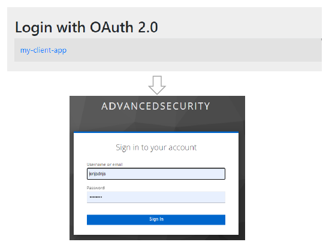

<nav>
    <a href="../.." target="_blank">[Spring Security OAuth2]</a>
</nav>

# 7.2 OAuth2 로그인 구현 - OAuth 2.0 Login Page 생성

---

## 1. 디폴트 로그인 페이지


- 기본적으로 OAuth 2.0 로그인 페이지는 `DefaultLoginPageGeneratingFilter` 가 자동으로 생성해 준다
- 이 디폴트 로그인 페이지는 각 OAuth 2.0 클라이언트명을 보여준다
- 링크를 누르면 인가 요청을 (또는 OAuth 2.0 로그인을) 시작할 수 있다.
  - 각 링크는 우리 서비스의 `/oauth2/authorization/{registrationId}*` 로 이동하게 하며, `OAuth2AuthorizationRequestRedirectFilter`에서
  이 요청을 가로챈다.

---

## 2. 커스텀 로그인 페이지 설정
```kotlin
@Configuration
class OAuth2ClientConfig {

    @Bean
    fun securityFilterChain(http: HttpSecurity): SecurityFilterChain {
        http {
            authorizeHttpRequests {
                authorize(anyRequest, authenticated)
            }
            oauth2Login {
                loginPage = "/login"
                permitAll()
            }
        }
        return http.build()
    }
}
```
- 로그인 페이지 url을 우리가 수동으로 지정할 수 있다.
- 이 경우 DefaultLoginPageGeneratingFilter 동작이 무시된다.
- 인증에 실패할 경우 해당 페이지로 리다이렉트 된다.

---

## 3. 디폴트 로그인 페이지 초기화 과정

### 3.1 HttpSecurityConfiguration
```java
@Bean(HTTPSECURITY_BEAN_NAME)
@Scope("prototype")
HttpSecurity httpSecurity() throws Exception {
    http
        // 생략
        .apply(new DefaultLoginPageConfigurer<>());
    // 생략 
}
```
- 기본적으로 HttpSecurityConfigurer에서 HttpSecurity 설정이 이루어질 때 DefaultLoginPageConfigurer 설정이 추가된다.
- 이후 `http.build()` 를 호출하면 내부적으로 init, configurer 메서드가 호출된다.
  - init 에서 모든 등록된 configurer 들의 init 이 순서대로 호출되고
  - configurer 에서 모든 등록된 configurer 들의 configurer 이 순서대로 호출된다.

### 3.2 HttpSecurity.init
- 여기서 살펴볼 설정은 DefaultLoginPageConfigurer, OAuth2LoginConfigurer 이다.
- `DefaultLoginPageConfigurer.init()` : 여기서 LoginPageGeneratingFilter가 sharedObject에 추가된다.
    ```java
        @Override
        public void init(H http) {
            this.loginPageGeneratingFilter.setResolveHiddenInputs(DefaultLoginPageConfigurer.this::hiddenInputs);
            this.logoutPageGeneratingFilter.setResolveHiddenInputs(DefaultLoginPageConfigurer.this::hiddenInputs);
            http.setSharedObject(DefaultLoginPageGeneratingFilter.class, this.loginPageGeneratingFilter);
        }
    ```
- `OAuth2LoginConfigurer.init()`
    ```java
        super.loginProcessingUrl(this.loginProcessingUrl);
        if (this.loginPage != null) {
            // Set custom login page
            super.loginPage(this.loginPage);
            super.init(http);
        }
    ```
    - 우리 설정에 의해 커스텀 로그인 페이지 url 이 지정됐다면, 그것과 관련된 설정이 여기서 일어난다.
    - 설정 클래스의 customLoginPage 변수값이 여기서 true로 변경된다.
    ```java
        private void initDefaultLoginFilter(B http) {
            DefaultLoginPageGeneratingFilter loginPageGeneratingFilter = http
                .getSharedObject(DefaultLoginPageGeneratingFilter.class);
            
            // 필터가 없거나, 커스텀 로그인 페이지일 경우 반환
            if (loginPageGeneratingFilter == null || this.isCustomLoginPage()) {
                return;
            }
            // LoginPageGeneratingFilter의 oauth2LoginEnalbed 변수를 활성화 -> 디폴트 로그인 페이지 활성화
            loginPageGeneratingFilter.setOauth2LoginEnabled(true);
            loginPageGeneratingFilter.setOauth2AuthenticationUrlToClientName(this.getLoginLinks());
            loginPageGeneratingFilter.setLoginPageUrl(this.getLoginPage());
            loginPageGeneratingFilter.setFailureUrl(this.getFailureUrl());
        }
    ```
    - 실제로 커스텀 로그인 페이지가 설정되어 있지 않으면 뒤의 로그인 페이지 생성 관련 설정이 이루어지지 않는다.
    - 커스텀 로그인 페이지가 설정되어 있다면
      - loginGeneratingFilter에 대해 loginEnabled 변수를 true 로 만듬으로서 디폴트 로그인 페이지 필터를 활성화한다.
      - 그 외 로그인 페이지 관련 설정이 추가적으로 이루어진다.
    
### 3.3 `HttpSecurity.configurer`
- DefaultLoginPageConfigurer.configurer() : 앞의 설정들 과정을 거치면서 다음 변수 중 하나 이상이 활성화됐다면 필터 목록에 추가된다.
    - formLoginEnable 변수값 true
    - oauth2LoginEnabled 변수값 true
    - saml2LoginEnable 변수값 true
    ```java
    @Override
    public void configure(H http) {
        AuthenticationEntryPoint authenticationEntryPoint = null;
        ExceptionHandlingConfigurer<?> exceptionConf = http.getConfigurer(ExceptionHandlingConfigurer.class);
        if (exceptionConf != null) {
            authenticationEntryPoint = exceptionConf.getAuthenticationEntryPoint();
        }
        if (this.loginPageGeneratingFilter.isEnabled() && authenticationEntryPoint == null) {
            this.loginPageGeneratingFilter = postProcess(this.loginPageGeneratingFilter);
            http.addFilter(this.loginPageGeneratingFilter);
            LogoutConfigurer<H> logoutConfigurer = http.getConfigurer(LogoutConfigurer.class);
            if (logoutConfigurer != null) {
                http.addFilter(this.logoutPageGeneratingFilter);
            }
        }
    }
    ```

---
