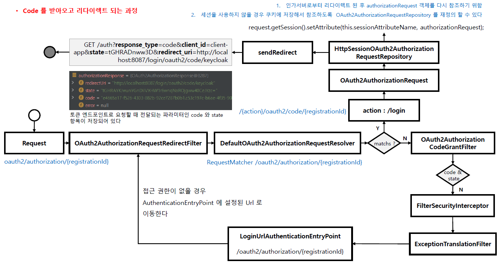

<nav>
    <a href="../.." target="_blank">[Spring Security OAuth2]</a>
</nav>

# 7.3 OAuth2 로그인 구현 - Authorization Code 요청하기

---

## 1. OAuth2AuthorizationRequestRedirectFilter
```java
public class OAuth2AuthorizationRequestRedirectFilter extends OncePerRequestFilter {

	/**
	 * The default base {@code URI} used for authorization requests.
	 */
	public static final String DEFAULT_AUTHORIZATION_REQUEST_BASE_URI = "/oauth2/authorization";

	private final ThrowableAnalyzer throwableAnalyzer = new DefaultThrowableAnalyzer();
    
	private RedirectStrategy authorizationRedirectStrategy = new DefaultRedirectStrategy();
	private OAuth2AuthorizationRequestResolver authorizationRequestResolver;
	private AuthorizationRequestRepository<OAuth2AuthorizationRequest> authorizationRequestRepository = new HttpSessionOAuth2AuthorizationRequestRepository();
	private RequestCache requestCache = new HttpSessionRequestCache();
```

- 클라이언트의 요청이 이 필터에서 잡히면, 사용자의 브라우저를 통해 인가 서버의 권한 부여 엔드포인트로 리다이렉션 시키는 역할
- 이후 클라이언트는 여기서 리다이렉트 된 페이지에 접속하여 승인을 하고 권한 코드 부여 흐름을 시작한다.
- 요청 매핑 Url
  - AuthorizationRequestMatcher : `/oauth2/authorization/{registrationId}*`
  - `AuthorizationEndpointConfig. authorizationRequestBaseUri` 를 통해 baseUri를 재정의할 수 있다
    ```kotlin
    @Bean
    fun securityFilterChain(http: HttpSecurity): SecurityFilterChain {
        http {
            authorizeHttpRequests {
                authorize(anyRequest, authenticated)
            }
            oauth2Login {
                authorizationEndpoint {
                    baseUri = "/my-oauth2/authorization"
                }
                permitAll()
            }
        }
        return http.build()
    }
    ```

---

## 2. 주요 클래스

### 2.1 OAuth2AuthorizationRequest
```java
public final class OAuth2AuthorizationRequest implements Serializable {
    private static final long serialVersionUID = 620L;
    private String authorizationUri;
    private AuthorizationGrantType authorizationGrantType;
    private OAuth2AuthorizationResponseType responseType;
    private String clientId;
    private String redirectUri;
    private Set<String> scopes;
    private String state;
    private Map<String, Object> additionalParameters;
    private String authorizationRequestUri;
    private Map<String, Object> attributes;
```
- 인가서버로 보낼 여러가지 정보를 담은 객체
    - responseType 
    - clientId
    - scopes
    - redirectUri : 어디로 리다이렉트 시킬 지
    - authorizationUri : 인가 Uri (인가서버의 code 발급 엔드포인트)

### 2.2 OAuth2AuthorizationRequestResolver
```java
	@Override
	public OAuth2AuthorizationRequest resolve(HttpServletRequest request) {
		String registrationId = resolveRegistrationId(request);
		if (registrationId == null) {
			return null;
		}
		String redirectUriAction = getAction(request, "login");
		return resolve(request, registrationId, redirectUriAction);
	}
```
- 웹 요청에 대해서 OAuth2AuthorizationRequest를 최종 완성하는 역할
- 기본 구현체: DefaultOAuth2AuthorizationRequestResolver
    - `/oauth2/authorization/{registrationId}` 와 일치하는지 확인해서 일치하면 registrationId를 추출하고 이를 사용해서 ClientRegistration을 가져와
    OAuth2AuthorizationRequest 를 빌드한다.

### 2.3 AuthorizationRequestRepository
```java
	@Override
	public void saveAuthorizationRequest(OAuth2AuthorizationRequest authorizationRequest, HttpServletRequest request,
			HttpServletResponse response) {
		if (authorizationRequest == null) {
			removeAuthorizationRequest(request, response);
			return;
		}
		request.getSession().setAttribute(this.sessionAttributeName, authorizationRequest);
	}
```
- OAuth2AuthorizationRequest 의 지속성 담당
- 인가 요청을 시작한 시점부터 인가 요청을 받는 시점까지 (리다이렉트) OAuth2AuthorizationRequest 를 유지해준다
  - 인가서버로부터 리다이렉트 된 후 authorizationRequest 객체를 다시 참조하기 위함.
  - 기본 구현체는 HttpSessionOAuth2AuthorizationRequestRepository (세션에 보관)
  - 세션을 사용하지 않을 경우 쿠키에 저장해서 참조하도록 OAuth2AuthorizationRequestRepository 를 재정의 할 수 있다

---

## 3. OAuth2AuthorizationRequestRedirectFilter 코드 까보기

### 3.1
```java
@Override
	protected void doFilterInternal(HttpServletRequest request, HttpServletResponse response, FilterChain filterChain)
			throws ServletException, IOException {
		try {
			OAuth2AuthorizationRequest authorizationRequest = this.authorizationRequestResolver.resolve(request);
			if (authorizationRequest != null) {
				this.sendRedirectForAuthorization(request, response, authorizationRequest);
				return;
			}
		}
		catch (Exception ex) {
			this.unsuccessfulRedirectForAuthorization(request, response, ex);
			return;
		}
		try {
			filterChain.doFilter(request, response);
		}
	}
```
- authorizationRequestResolver 를 통해 OAuth2AuthorizationRequest 를 구성한다.
- 구성하지 못 했다면 이 필터에서 가로채지 않고 다음 필터로 doFilter 호출하여 체이닝한다.

### 3.2 sendRedirectForAuthorization
```java
	private void sendRedirectForAuthorization(HttpServletRequest request, HttpServletResponse response,
			OAuth2AuthorizationRequest authorizationRequest) throws IOException {
		if (AuthorizationGrantType.AUTHORIZATION_CODE.equals(authorizationRequest.getGrantType())) {
			this.authorizationRequestRepository.saveAuthorizationRequest(authorizationRequest, request, response);
		}
		this.authorizationRedirectStrategy.sendRedirect(request, response,
				authorizationRequest.getAuthorizationRequestUri());
	}
```
- authorize_code grant 방식이면, authorizationRequestRepository 에 현재 리다이렉트 요청을 미리 저장한다.
  - 이후 로그인 요청이 들어왔을 때 기존 요청과 비교하여 이상한 요청인 지 아닌지 검증하기 위함이다.
- 그리고 authorizationRedirectStrategy 를 통해 AuthorizationRequest 정보에 따라 리다이렉트 시킨다.

---

## 4. 흐름


- OAuth2AuthorizationRequestRedirectFilter
  - 인가서버 code 발급 페이지로 리다이렉트 시키는 역할이다.
  - OAuth2AuthorizationRequestResolver 를 통해 OAuth2AuthorizationRequest 를 구성한다.
    - `/oauth2/authorization/{registrationId}` 와 일치하는지 확인해서 일치하면 registrationId를 추출하고 이를 사용해서 ClientRegistration을 가져와
    OAuth2AuthorizationRequest 를 빌드한다.
  - 제대로 OAuth2AuthorizationRequest 가 구성되면 authorizationRequestRepository 에 요청 정보를 저장하고, authorizationRedirectStrategy 를 통해
  리다이렉트 시킨다.
  - 구성이 되지 않으면 null 을 반환하는데, 이 경우 다음 필터로 체이닝한다. (요청 처리 안 함)
- AuthorizationFilter 및 
  - 인증에 실패하면 AccessDeniedException 이 발생하고 ExceptionTranslationFilter에서 인증 예외로 간주하여 AuthenticationEntryPoint에서 예외 후속처리를 한다.
  - 여기서 설정된 url로 리다이렉트된다. (로그인 페이지 또는 코드 발급 페이지)

---
