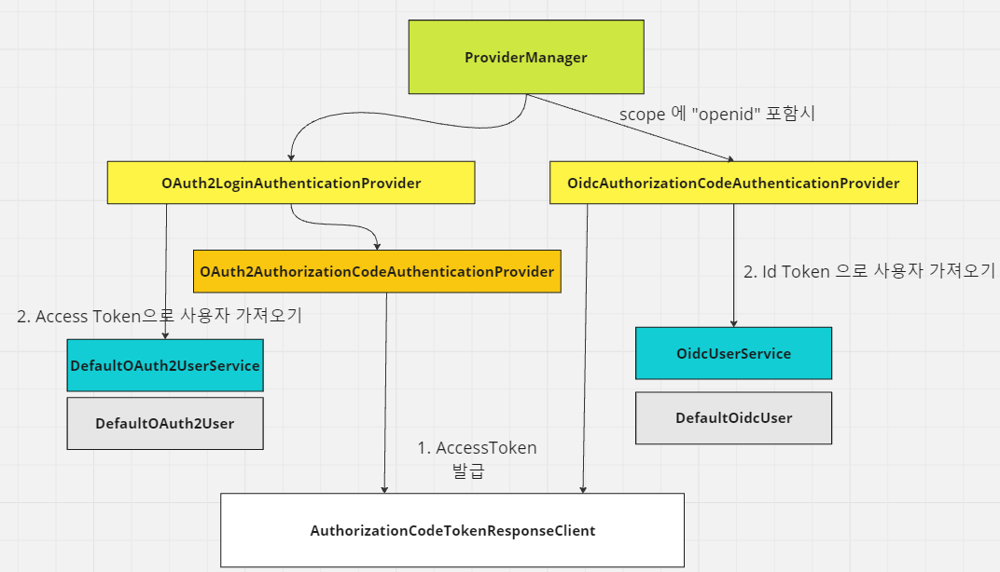
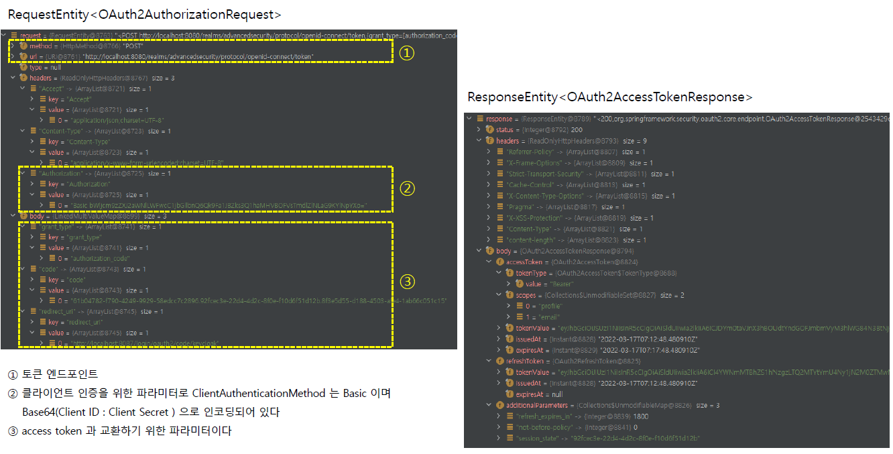
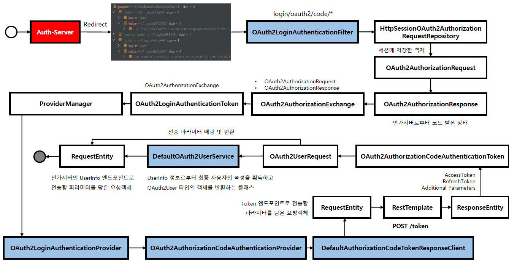

<nav>
    <a href="../.." target="_blank">[Spring Security OAuth2]</a>
</nav>

# 7.4 OAuth2 로그인 구현 - Access Token 교환하기

---

## 1. OAuth2LoginAuthenticationFilter


### 1.1 핵심 역할
- 요청을 매칭하고 가로채기
  - RequestMatcher: `/login/oauth2/code/*`
- 코드 발급 페이지로 리다이렉트 하기 전 생성했던 `OAuth2AuthorizationRequest` 를 다시 불러오기
- OAuth2LoginAuthenticationToken 토큰 구성
- AuthenticationManager 를 통해 인증된 사용자 정보 가져오기
  - 내부적으로 code를 통해 액세스 토큰을 발급 받은 뒤 UserInfo를 AccessToken 또는 IdToken으로 얻어와 인증을 생성한다.
- OAuth2AuthorizedClient (인증 완료 OAuth2Client) 를 생성하고 AuthorizedClientRepository 에 저장하기
- SecurityContext 생성 및 Holder 저장, SecurityContextRepository에 저장

### 1.2 주요 의존성
```java
public class OAuth2LoginAuthenticationFilter extends AbstractAuthenticationProcessingFilter {
	public static final String DEFAULT_FILTER_PROCESSES_URI = "/login/oauth2/code/*";

    private AuthorizationRequestRepository<OAuth2AuthorizationRequest> authorizationRequestRepository = new HttpSessionOAuth2AuthorizationRequestRepository();
	private ClientRegistrationRepository clientRegistrationRepository;
	private OAuth2AuthorizedClientRepository authorizedClientRepository;
	private Converter<OAuth2LoginAuthenticationToken, OAuth2AuthenticationToken> authenticationResultConverter = this::createAuthenticationResult;
```
```java
public abstract class AbstractAuthenticationProcessingFilter extends GenericFilterBean
		implements ApplicationEventPublisherAware, MessageSourceAware {

    private RequestMatcher requiresAuthenticationRequestMatcher;
    private AuthenticationManager authenticationManager;

	private AuthenticationSuccessHandler successHandler = new SavedRequestAwareAuthenticationSuccessHandler();
	private AuthenticationFailureHandler failureHandler = new SimpleUrlAuthenticationFailureHandler();
    
    private SecurityContextHolderStrategy securityContextHolderStrategy = SecurityContextHolder
            .getContextHolderStrategy();
	private SecurityContextRepository securityContextRepository = new RequestAttributeSecurityContextRepository();
```
- AuthorizationRequestRepository : 코드 발급 페이지로 리다이렉트 하기 전 생성했던 요청정보 저장소
- ClientRegistrationRepository : OAuth2 공급자 및 클라이언트 정보가 담긴 ClientRegistration 가져오기
- AuthorizationManager -> ProviderManager
  - OAuth2LoginAuthenticationProvider -> AuthorizationCodeAuthenticationProvider : 액세스 토큰 발급 후 인증
  - OidcAuthorizationCodeAuthenticationProvider : Oidc Id Token 발급 후 인증
- OAuth2AuthorizedClientRepository : 인증된 OAuth2Client 정보 저장
- SecurityContextHolderStrategy, SecurityContextRepository : 인증 정보 ThreadLocal 및 장기 저장

---

## 2. 인증 관리자 및 여러가지 OAuth2 인증 공급자들

### 2.1 AuthenticationManager
```java
public interface AuthenticationManager {
	Authentication authenticate(Authentication authentication) throws AuthenticationException;
}
```
```java
public class ProviderManager implements AuthenticationManager, MessageSourceAware, InitializingBean {
	private List<AuthenticationProvider> providers = Collections.emptyList();
	private AuthenticationManager parent;
```
- 실질적으로 인증 담당
- 구현체 : ProviderManager
- 내부적으로 여러개의 AuthenticationProvider를 가지고 있고, 주어진 AuthenticationToken을 처리할 수 있는 Provider에게 먼저
인가처리를 위임한다.
- 여기서 OAuth2LoginAuthenticationProvider 및 OidcAuthorizationCodeAuthenticationProvider 가 AuthenticationProvider
목록에 포함되어 있다.

### 2.2 OAuth2LoginAuthenticationProvider


- 요청 scope에 openid가 존재할 경우 null 반환하여 다음 OidcAuthorizationCodeAuthenticationProvider 가 호출되도록 제어의 흐름을 변경
- OAuth2AuthorizationCodeAuthenticationProvider 를 통해 code와 AccessToken 을 교환한다.
  - 내부적으로 OAuth2AccessTokenResponseClient 를 사용하는데 이것은 RestTemplate 을 사용하여 실제 인가서버와 통신한다.
- AccessToken 을 획득하고 OAuth2UserService(구현체 DefaultOAuth2UserService)를 통해 사용자 정보(OAuth2User)를 획득함
- OAuth2LoginAuthenticationToken 구성 및 반환

### 2.3 OidcAuthorizationCodeAuthenticationProvider

- 2.2 에서의 흐름에 따라, scope에 "openid"가 포함됐을 경우 인증 처리가 여기서 수행된다.
- OAuth2AuthorizationCodeAuthenticationProvider 를 통해 code와 AccessToken 을 교환한다.
  - 내부적으로 OAuth2AccessTokenResponseClient 를 사용하는데 이것은 RestTemplate 을 사용하여 실제 인가서버와 통신한다.
- AccessToken 을 얻어온 뒤 OidcIdToken 을 획득하고, OidcUserService를 통해 사용자 정보(OidcUser) 를 획득함
- OAuth2LoginAuthenticationToken 구성 및 반환

---

## 3. 그 외 주요 클래스


### 3.1 OAuth2AccessTokenResponseClient
- 기본구현체: DefaultAuthorizationCodeTokenResponseClient
- 인가서버의 token 엔드포인트로 통신 담당
- access token 받은 후 oAuth2AccessTokenResponse에 저장하고 반환



- 내부적으로 RestOperations(구현체 RestTemplate) 사용
  - 요청 : RequestEntity
    - method, url: 토큰 엔드포인트
    - authorization 헤더: clinet_id, client_secret을 base64 인코딩을 통해 전송
    - access token 발급을 위한 파라미터들...
  - 응답 : ResponseEntity
    - accessToken
    - refreshToken

### 3.2 OAuth2UserService / OidcUserService
- OAuth2UserService: OAuth2 AccessToken 을 사용하여, 인가 서버의 사용자 정보 Api 호출 후 사용자 정보 가져오는 역할
- OidcUserService : IdToken 사용하여 사용자 정보 가져오는 역할

### 3.3 OAuth2AuthorizedClientRepository
- 인증된 OAuth2Client 정보 (OAuth2AuthorizedClient) 를 저장하기 위한 리포지토리
- OAuth2AuthorizedClient 에는 인가서버에 인증받은 데이터가 담겨져 있다.
  - client 정보 : ClientRegistration
  - 사용자 정보 : Authentication.name
  - 액세스 토큰
  - 리프레시 토큰
  - ...


---

## 4. OAuth2LoginAuthenticationFilter 흐름


### 4.1 요청 매칭
```java
	public static final String DEFAULT_FILTER_PROCESSES_URI = "/login/oauth2/code/*";

	protected boolean requiresAuthentication(HttpServletRequest request, HttpServletResponse response) {
		if (this.requiresAuthenticationRequestMatcher.matches(request)) {
			return true;
		}
		if (this.logger.isTraceEnabled()) {
			this.logger
				.trace(LogMessage.format("Did not match request to %s", this.requiresAuthenticationRequestMatcher));
		}
		return false;
	}

```
- RequestMatcher 에 매칭되는 지 확인 후, 매칭되면 요청을 가로챔
  - `/login/oauth2/code/*`

### 4.2 `OAuth2AuthorizationRequest` 로드
```java
OAuth2AuthorizationRequest authorizationRequest = this.authorizationRequestRepository
			.removeAuthorizationRequest(request, response);
```
- AuthorizationRequestRepository` 에서 `OAuth2AuthorizationRequest` 를 로드해온다.
- 이것은 코드 발급페이지로 리다이렉트 시키기 전 상태다.


### 4.3 `OAuth2LoginAuthenticationToken` 구성
```java
// registrationId 추출
String registrationId = authorizationRequest.getAttribute(OAuth2ParameterNames.REGISTRATION_ID);

// clientRegistration 가져오기
ClientRegistration clientRegistration = this.clientRegistrationRepository.findByRegistrationId(registrationId);
if (clientRegistration == null) {
    OAuth2Error oauth2Error = new OAuth2Error(CLIENT_REGISTRATION_NOT_FOUND_ERROR_CODE,
            "Client Registration not found with Id: " + registrationId, null);
    throw new OAuth2AuthenticationException(oauth2Error, oauth2Error.toString());
}
String redirectUri = UriComponentsBuilder.fromHttpUrl(UrlUtils.buildFullRequestUrl(request))
        .replaceQuery(null)
        .build()
        .toUriString();
OAuth2AuthorizationResponse authorizationResponse = OAuth2AuthorizationResponseUtils.convert(params,
        redirectUri);
Object authenticationDetails = this.authenticationDetailsSource.buildDetails(request);
OAuth2LoginAuthenticationToken authenticationRequest = new OAuth2LoginAuthenticationToken(clientRegistration,
        new OAuth2AuthorizationExchange(authorizationRequest, authorizationResponse));
authenticationRequest.setDetails(authenticationDetails);
```
- OAuth2AuthorizationResponse 구성 : 인가서버에서 코드 발급받은 상태
- OAuth2AuthorizationExchange 구성(OAuth2AuthorizationRequest, OAuth2AuthorizationResponse)
- 이 정보를 기반으로 `OAuth2LoginAuthenticationToken` 을 구성한다.

### 4.4 AuthenticationManager
```java
OAuth2LoginAuthenticationToken authenticationResult = (OAuth2LoginAuthenticationToken) this
    .getAuthenticationManager()
    .authenticate(authenticationRequest);
```
```java
public class ProviderManager implements AuthenticationManager, MessageSourceAware, InitializingBean {
	private List<AuthenticationProvider> providers = Collections.emptyList();
	private AuthenticationManager parent;
```
- 이렇게 만들어진 토큰을 AuthenticationManager에게 전달하여 인증을 위임한다.
- 기본 구현체는 ProviderManager
- 내부적으로 여러개의 AuthenticationProvider를 가지고 있고, 주어진 AuthenticationToken을 처리할 수 있는 Provider에게 먼저
인가처리를 위임한다.
- 가장 먼저 인증된 AuthenticationToken 을 받을 경우 해당 토큰을 호출 측(필터)으로 반환함.

### 4.5 OAuth2LoginAuthenticationProvider 
- 이때 scope에 openid가 있다면 null 을 반환하고 OidcAuthorizationCodeAuthenticationProvider 에서 처리한다.
  - OidcAuthorizationCodeAuthenticationProvider 쪽 흐름은 설명을 생략한다.
- AuthorizationCodeAuthenticationProvider 을 통해 액세스 토큰을 발급받아온다.
  - 이 클래스는 내부적으로 accessTokenResponseClient 를 사용한다.
  - OAuth2AuthorizationCodeAuthenticationToken 에 액세스토큰, 리프레시 토큰, 추가 파라미터 정보들 담아 반환한다.
- OAuth2UserRequest 구성
- OAuth2UserService를 통해 OAuth2User를 얻어옴
  - 내부적으로 사용자 정보 요청을 거친 후 OAuth2User 객체 형태로 반환
- OAuth2LoginAuthenticationToken 구성 및 반환

### 4.6 필터 - 인증 처리 마무리
- 컨버터를 통해 OAuth2AuthenticationToken 으로 변환
- OAuth2AuthorizedClient (인증 완료 OAuth2Client) 생성
- AuthorizedClientRepository 에 OAuth2AuthorizedClient 저장
- 이후 AbstractAuthenticationProcessingFilter 흐름을 따라감
  - SecurityContext 생성 -> SecurityContextHolderStrategy, SecurityContextRepository에 저장

---
