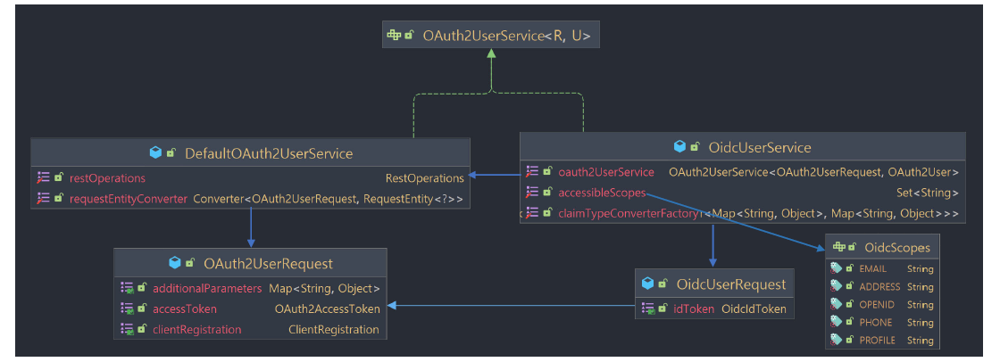
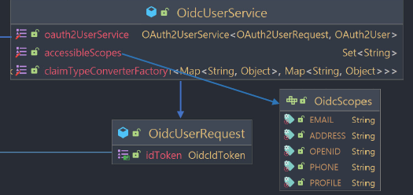
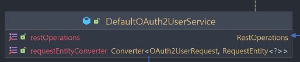
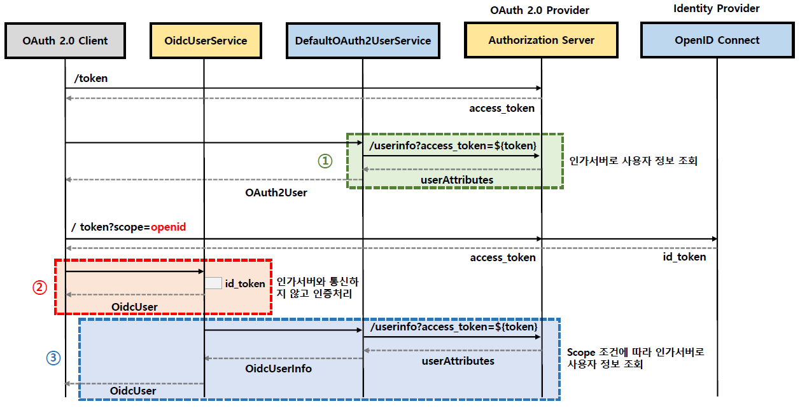
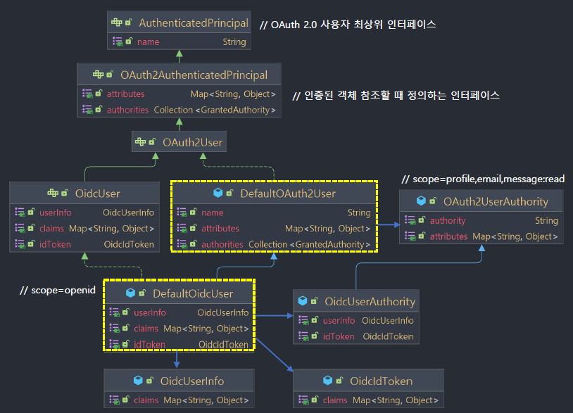
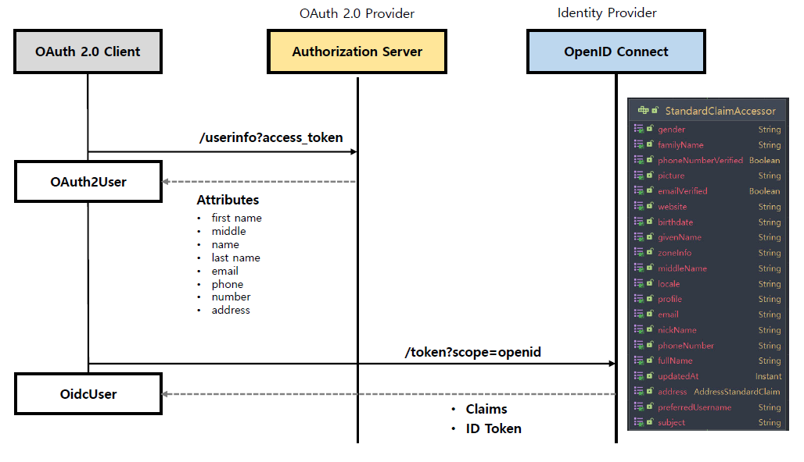

<nav>
    <a href="../.." target="_blank">[Spring Security OAuth2]</a>
</nav>

# 7.5 OAuth2 로그인 구현 - Oauth 2.0 User 모델 소개

---

## 1. OAuth2UserService


### 1.1 개요
- 액세스 토큰을 사용해서 UserInfo 엔드포인트 요청으로 최종 사용자의 (리소스 소유자) 속성을 가져오며 OAuth2User 타입의 객체를 리턴한다
- 구현체로 DefaultOAuth2UserService 와 OidcUserService 가 제공된다.

### 1.2 DefaultOAuth2UserService


- 표준 OAuth 2.0 Provider를 지원하는 OAuth2UserService 구현체다(기본 OAuth 2.0 방식)
- OAuth2UserRequest 에 Access Token 을 담아 인가서버와 통신 후 사용자의 속성을 가지고 온다
- 최종적으로 OAuth2User 타입의 객체를 반환한다

### 1.3 OidcUserService


- OpenID Connect 1.0 Provider를 지원하는 OAuth2UserService 구현체다(OpenID Connect 방식)
- 대부분의 상황에서는 OidcUserRequest 에 있는 ID Token 을 통해 인증 처리를 한다.(UserInfo 엔드포인트 호출 x)
- 필요시(scope가 open) DefaultOAuth2UserService 를 사용해서 UserInfo 엔드포인트의 사용자 속성을 추가적으로 요청한다.
- 최종 OidcUser 타입의 객체를 반환한다

---

## 2. DefaultOAuth2UserService / OidcUserService 흐름


- DefaultOAuth2UserService 의 경우, AccessToken 을 통해 실제 내부적으로 Api 통신을 거쳐 DefaultOauth2User 을 얻어온다.'
- OidcUserService 의 AccessToken, IdToken 두 가지 정보를 이용해 OidcUser 를 얻어온다.
  - 이 때 scope에 accessibleScopes("profile", "email", "address", "phone") 의 값들 중 하나라도 포함될 경우
  OAuth2UserService를 통해 UserInfo 엔드포인트와 통신하여 사용자 정보를 얻어온뒤 OidcUser 구성에 사용한다.

---

## 3. OAuth2User / OidcUser


### 3.1 OAuth2User
- OAuth 2.0 Provider 에 연결된 사용자 주체를 나타낸다. (OAuth2 흐름)
  - AccessToken을 userInfo 엔드포인트에 전달해 획득한다.
- 최종 사용자의 인증에 대한 정보인 attributes 를 포함하고 있으며 first name, middle name, last name, email, phone number, address 등 정보가
이에 해당한다.
- 기본 구현체는 DefaultOAuth2User 이며 인증 이후 Authentication 의 principal 속성에 저장된다

### 3.2 OidcUser
- OIDC Provider 에 연결된 사용자 주체를 나타낸다 (OpenID Connect 흐름)
- OAuth2User 인터페이스를 상속한 인터페이스이다
- 최종 사용자의 인증에 대한 정보인 Claims 를 포함하고 있으며 OidcIdToken 및 OidcUserInfo 에서 집계 및 구성된다.
- 기본 구현체는 DefaultOidcUser 이다.
  - DefaultOAuth2User 를 상속하고 있으며 인증 이후 Authentication 의 principal 속성에 저장된다

### 3.3 획득 흐름


- DefaultOAuth2UserService 흐름에서는 userInfo Api를 통해 얻어온 정보가 OAuth2User attributes 속성에 key, value 형태로 저장된다.
- OidcUserService 흐름에서는 IdToken 및 Claim 값들이 OidcIdToken 객체에 바인딩된다.
  - scope 범위에 따라, 추가적인 정보를 획득해야할 수 있는데 이런 경우 OAuth2UserService를 통해 DefaultOAuth2User를 얻어오고
  userInfo 객체로 만들어 관리한다. 이 때 UserInfo, idToken 을 종합하여 사용자 정보들(claims)을 attributes 에 모아둔다.

---

## 4. 실습

### 4.1 설정
```kotlin
@Configuration
class OAuth2ClientConfig {
    @Bean
    fun securityFilterChain(http: HttpSecurity): SecurityFilterChain {
        http {
            authorizeHttpRequests {
                authorize(anyRequest, permitAll)
            }
            oauth2Login {}
        }
        return http.build()
    }
}
```


### 4.2 컨트롤러
```kotlin
@RestController
class IndexController(
    private val clientRegistrationRepository: ClientRegistrationRepository,
) {

    /**
     * OAuth 2.0 방식
     */
    @GetMapping("/user")
    fun oauth2User(accessToken: String): OAuth2User {
        val clientRegistration = clientRegistrationRepository.findByRegistrationId("keycloak")!!

        val oauth2AccessToken = OAuth2AccessToken(
            OAuth2AccessToken.TokenType.BEARER,
            accessToken,
            Instant.now(),
            Instant.MAX
        )
        val request = OAuth2UserRequest(clientRegistration, oauth2AccessToken)
        val oauth2UserService = DefaultOAuth2UserService()

        val oauth2User = oauth2UserService.loadUser(request)
        return oauth2User
    }

    /**
     * OpenID Connect 방식
     */
    @GetMapping("/oidc")
    fun oidcUser(accessToken: String, idToken: String): OidcUser {
        val clientRegistration = clientRegistrationRepository.findByRegistrationId("keycloak")!!

        val oauth2AccessToken = OAuth2AccessToken(
            OAuth2AccessToken.TokenType.BEARER,
            accessToken,
            Instant.now(),
            Instant.MAX
        )

        val idTokenClaims = mapOf(
            IdTokenClaimNames.ISS to "http://localhost:8080/realms/oauth2",
            IdTokenClaimNames.SUB to "5800c6e2-203d-4f0e-8343-bbb948f16807",
            "preferred_username" to "user",
        )
        val oidcIdToken = OidcIdToken(idToken, Instant.now(), Instant.MAX, idTokenClaims)
        val request = OidcUserRequest(clientRegistration, oauth2AccessToken, oidcIdToken)
        val oidcUserService = OidcUserService()

        val oidcUser = oidcUserService.loadUser(request)
        return oidcUser
    }
}

```
- "/user": OAuth2UserService 방식
  - userInfo 엔드포인트를 호출 후 OAuth2User 를 가져옴.
- "/oidc": OidcUserService 방식
  - 내부적으로 accessibleScopes 범위 및 scopes 를 확인하고 사용자 정보를 추가로 가져올 필요가 있다고 판별되면
  userInfo 엔드포인트를 통해 OAuth2User 를 가져와 uSerInfo 속성으로 구성한다.

---
