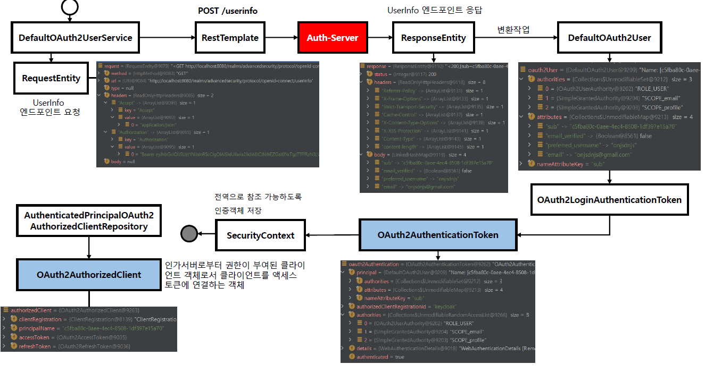
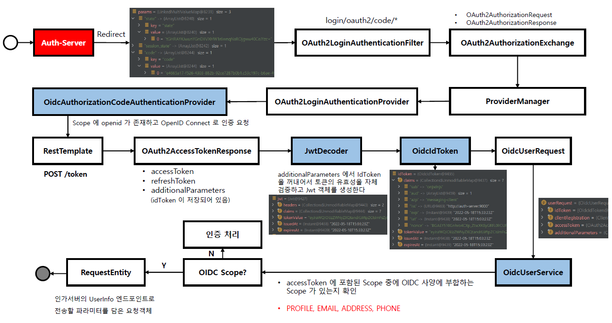
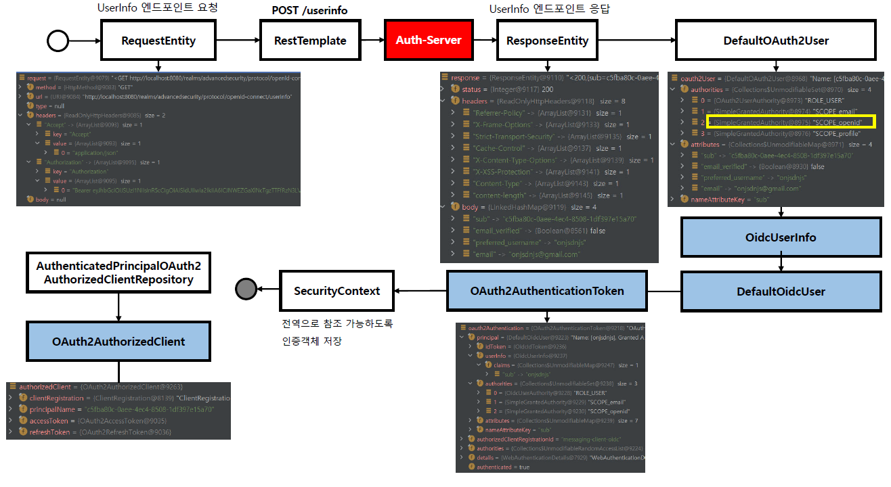

<nav>
    <a href="../.." target="_blank">[Spring Security OAuth2]</a>
</nav>

# 7.6 OAuth2 로그인 구현 - UserInfo 엔드포인트 요청하기

---

## 1. OAuth2User 흐름

### 1.1 주요 클래스
- DefaultOAuth2UserService: OAuth2 사용자 정보 획득 
  - `public OAuth2User loadUser(OAuth2UserRequest userRequest)`
- OAuth2UserRequestEntityConverter: OAuth2UserRequest 를 RequestEntity 로 변환한다
- RestOperations
  - RequestEntity 로 인가서버에 요청하고 ResponseEntity 로 응답받는다
- OAuth2User 타입의 객체를 반환한다
  - 요청 엔드포인트: GET /userinfo

### 1.2 내부 구현
```java
	@Override
	public OAuth2User loadUser(OAuth2UserRequest userRequest) throws OAuth2AuthenticationException {
        // 추출할 username 속성명(spring.security.oauth2.client.provider.keycloak.userNameAttribute)
		String userNameAttributeName = userRequest.getClientRegistration()
			.getProviderDetails()
			.getUserInfoEndpoint()
			.getUserNameAttributeName();
        // OAuth2UserRequest 를 RequestEntity 로 변환
		RequestEntity<?> request = this.requestEntityConverter.convert(userRequest);
		
        // RestTemplate를 통해 인가서버 userInfo 엔드포인트와 통신
        ResponseEntity<Map<String, Object>> response = getResponse(userRequest, request);
		Map<String, Object> userAttributes = response.getBody();
		Set<GrantedAuthority> authorities = new LinkedHashSet<>();
		authorities.add(new OAuth2UserAuthority(userAttributes));
		OAuth2AccessToken token = userRequest.getAccessToken();
		for (String authority : token.getScopes()) {
			authorities.add(new SimpleGrantedAuthority("SCOPE_" + authority));
		}
        
        // 응답 결과의 사용자 이름 프로퍼티명, 여러 프로퍼티, token의 scopes 정보를 기반으로 DefaultOAuth2User 구성
		return new DefaultOAuth2User(authorities, userAttributes, userNameAttributeName);
	}
```
- ClientRegistration 에 등록된 userNameAttributeName 추출
- RequestEntityConverter를 이용해 OAuth2UserRequest 를 RequestEntity 로 변환
- RestTemplate를 통해 인가서버 userInfo 엔드포인트와 통신
- 응답 결과의 사용자 이름 프로퍼티명, 여러 프로퍼티, token의 scopes 정보를 기반으로 DefaultOAuth2User 구성
```java
private ResponseEntity<Map<String, Object>> getResponse(OAuth2UserRequest userRequest, RequestEntity<?> request) {
		try {
			return this.restOperations.exchange(request, PARAMETERIZED_RESPONSE_TYPE);
		}
		catch (OAuth2AuthorizationException ex) {
```
- 내부적인 getResponse 메서드에서는 RestOperations(RestTemplate) 를 통해 인가서버 userInfo 엔드포인트와
통신함을 확인할 수 있다.

### 1.3 흐름



---

## 2. OidcUser 흐름
### 2.1 주요 클래스
- OidcUserService
  - `public OidcUser loadUser(OidcUserRequest userRequest)`
  - 기본적으로 `scope=openid`인 경우 IdToken 만으로 사용자 정보를 구성한다
  - 특정 조건에 부합하면 인가서버의 userInfo 엔드포인트와 추가적으로 통신하여 사용자 정보를 구성한다. 
- OidcUser 타입의 객체를 반환한다
  - 요청 엔드포인트: GET /userinfo

### 2.2 내부 구현
```java
private boolean shouldRetrieveUserInfo(OidcUserRequest userRequest) {
		ProviderDetails providerDetails = userRequest.getClientRegistration().getProviderDetails();
		if (!StringUtils.hasLength(providerDetails.getUserInfoEndpoint().getUri())) {
			return false;
		}
		if (AuthorizationGrantType.AUTHORIZATION_CODE
			.equals(userRequest.getClientRegistration().getAuthorizationGrantType())) {
			return this.accessibleScopes.isEmpty()
					|| CollectionUtils.isEmpty(userRequest.getAccessToken().getScopes())
					|| CollectionUtils.containsAny(userRequest.getAccessToken().getScopes(), this.accessibleScopes);
		}
		return false;
	}
```
- 서비스 제공자 userInfo 엔드포인트 주소가 없으면 userInfo를 가져오지 않는다
- 다음 조건을 만족하면 userInfo 를 가져온다.
    - Accessible Scopes(기본 profile, email, address, phone)가 비어있거나,
    - AccessToken 의 scopes가 비어있거나
    - Accessible scopes와 AccessToken 의 scopes 목록 중 일치하는 것이 하나라도 있을 경우
- 그 외의 경우에는 userInfo를 가져오지 않는다.

```java
@Override
	public OidcUser loadUser(OidcUserRequest userRequest) throws OAuth2AuthenticationException {
		OidcUserInfo userInfo = null;
        
        // 사용자 정보를 userInfo 엔드포인트에서 가져와야하는지 판별
		if (this.shouldRetrieveUserInfo(userRequest)) {
            
            // 가져와야한다면 사용자 정보를 로딩
			OAuth2User oauth2User = this.oauth2UserService.loadUser(userRequest);
			Map<String, Object> claims = getClaims(userRequest, oauth2User);
			
            // userInfo에 클레임들을 모아둠
            userInfo = new OidcUserInfo(claims);
            
            // "sub" 클레임이 없을 때 예외 발생
			if (userInfo.getSubject() == null) {
				OAuth2Error oauth2Error = new OAuth2Error(INVALID_USER_INFO_RESPONSE_ERROR_CODE);
				throw new OAuth2AuthenticationException(oauth2Error, oauth2Error.toString());
			}
            // "sub" 클레임 값 검증
			if (!userInfo.getSubject().equals(userRequest.getIdToken().getSubject())) {
				OAuth2Error oauth2Error = new OAuth2Error(INVALID_USER_INFO_RESPONSE_ERROR_CODE);
				throw new OAuth2AuthenticationException(oauth2Error, oauth2Error.toString());
			}
		}
        
        // userInfo , idToken 을 조합하여 OidcUser 구성
		Set<GrantedAuthority> authorities = new LinkedHashSet<>();
		authorities.add(new OidcUserAuthority(userRequest.getIdToken(), userInfo));
		OAuth2AccessToken token = userRequest.getAccessToken();
		for (String authority : token.getScopes()) {
			authorities.add(new SimpleGrantedAuthority("SCOPE_" + authority));
		}
		return getUser(userRequest, userInfo, authorities);
	}
```
- `shouldRetrieveUserInfo` : 사용자 정보 추가로 가져올지 판별
  - 가져와야한다면 Oauth2UserService 를 통해 사용자 정보 추가로 획득
  - userInfo(OidcUserInfo) 구성
- userInfo(null 또는 위에서 구한 값), idToken 을 조합하여 OidcUser 구성 후 반환

### 2.3 OidcUserService 단독 흐름



### 2.4 OidcUserService가 DefaultOAuth2UserService 를 호출했을 때 흐름


---
