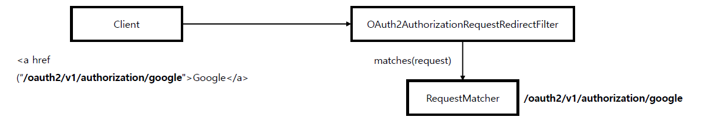
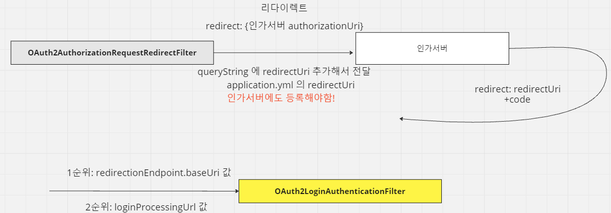

<nav>
    <a href="../.." target="_blank">[Spring Security OAuth2]</a>
</nav>

# 7.9 API 커스텀 구현 - Authorization BaseUrl & Redirection BaseUrl

---

## 1. `authorizationEndpoint().baseUrl("...")`



```kotlin
oauth2Login {

    // 권한부여 요청(리다이렉트 필터) baseUri 설정
    // 예: /oauth2/v1/authorization/google
    authorizationEndpoint {
        baseUri = "/oauth2/v1/authorization"
    }
}
```
- 권한 부여 요청 BaseUri (리다이렉트 필터가 작동하는 baseUri) 를 커스텀 한다.
  - 예) /oauth2/v1/authorization/google
- 권한부여 요청을 하는 측에서 요청하는 Uri와 맞춰야함
  - 예)
    - `<a href="/oauth2/v1/authorization/google>Google 로그인</a>`
    - `authorizationEndpoint().baseUrl("oauth2/v1/authorization")`


---

## 2. `redirectionEndpoint.baseUri("...")`


```kotlin
oauth2Login {
    // OAuth2 로그인 OAuth2LoginAuthenticationFilter 작동 조건 (우선시)
    redirectionEndpoint {
        baseUri = "/login/v2/oauth2/code/*"
    }
}
```
- 실질적 OAuth2 로그인 요청(Token 요청)을 처리하는 `OAuth2LoginAuthenticationFilter`(OAuth2 로그인 필터) 에서 요청에 대한 매칭여부를 판단한다
- `loginProcessingUrl("/login/v1/oauth2/code/*")` 를 설정해도 로그인 처리 baseUri 설정을 하는 것은 동일하지만, `redirectionEndpoint.baseUri`도 설정했다면
이 값이 더 우선이다.
  - OAuth2LoginConfigurer 의 init, configure 참조

### 참고: `applicztion.yml` 설정 파일에서 registration 속성의 redirectUri 설정과 비교
- 인가서버 코드발급 후 어디로 리다이렉트 시킬지에 대한 설정이다.(인가서버에도 이 값을 등록시켜놔야한다.)
- 바로 스프링 서버로 리다이렉트 시키는 구조를 사용한다면 이 설정값과 redirectionEndpoint.baseUri 설정을 일치시켜야한다.

---

## 3. 실습
### 3.1 로그인 페이지 설정
```kotlin
@Controller
class LoginPageController {

    @GetMapping("/login")
    fun loginPage(): String {
        return "login"
    }
}
```
```html
<!DOCTYPE html>
<html lang="en" xmlns:th="http://www.thymeleaf.org">
<head>
    <meta charset="UTF-8">
    <title>Title</title>
</head>
<body>
<div class="container">
    <h2 class="form-signin-heading">Login with OAuth 2.0</h2><table class="table table-striped">
    <tr><td><a href="/oauth2/v1/authorization/keycloak">oauth2-client-app</a></td></tr>
</table>
</div>
</body>
</html>
```
- 커스텀 로그인 페이지를 "/login" 엔드포인트가 반환하게 함
- 링크 주소에 "/oauth2/v1/authorization/keycloak" 를 지정함
  - OAuth2AuthorizationRequestRedirectFilter 가 이 요청을 가로챌 것이다.

### 3.2 시큐리티 설정
```kotlin
@Configuration
class OAuth2ClientConfig {

    @Bean
    fun securityFilterChain(http: HttpSecurity): SecurityFilterChain {
        http {
            authorizeHttpRequests {
                authorize("/login", permitAll)
                authorize(anyRequest, authenticated)
            }
            oauth2Login {

                loginPage = "/login"


                // 권한부여 요청(리다이렉트 필터) baseUri 설정
                // 예: /oauth2/v1/authorization/google
                authorizationEndpoint {
                    baseUri = "/oauth2/v1/authorization"
                }

                // OAuth2 로그인 OAuth2LoginAuthenticationFilter 작동 조건
                loginProcessingUrl = "/login/v1/oauth2/code/*"


                // OAuth2 로그인 OAuth2LoginAuthenticationFilter 작동 조건 (우선시)
                redirectionEndpoint {
                    baseUri = "/login/v2/oauth2/code/*"
                }
            }
        }
        return http.build()
    }
}
```
- 로그인 페이지를 "/login" 로 지정하고, permitAll 로 열어둠
- 코드 발급: authorizationEndpoint.baseUri
- 로그인 처리 Url
  - loginProcessingUrl: `/login/v1/oauth2/code/*`
  - redirectionEndpoint.baseUri: `/login/v2/oauth2/code/*`

### 3.3 application.yml 및 인가서버 설정
```yaml
spring:
  security:
    oauth2:
      client:
        registration:
          keycloak:
            # 나머지 생략
            redirectUri: http://localhost:8081/login/v2/oauth2/code/keycloak
```
- 인가서버에서 코드 발급 시 어디로 redirect 시킬지에 대한 설정이다.
- 이 설정은 인가서버에도 등록해야한다.

### 3.4 결과
- 로그인 페이지에서 oauth2-client-app 링크를 클릭하면 OAuth2AuthorizationRequestRedirectFilter 에서 요청을 가로챈다.
- 이 필터에서 브라우저에게 리다이렉트 시킬 Uri 를 동적으로 구성하고, 이 정보를 저장한 뒤 리다이렉트 시킨다.
  - 이때 querystring 으로 redirect-uri 값에 `application.yml`에서 지정한 redirectUri 가 지정된다.
- 브라우저는 리다이렉트 응답을 받고 인가서버의 code 발급 페이지로 리다이렉트 한다.
- 사용자는 승인을 하고 redirectUri 로 리다이렉트 된다.
- 이 주소는 우리 서버의 로그인 처리 Url로 지정한 redirectionEndpoint.baseUri 값이다. OAuth2LoginAuthenticationFilter 에서
로그인 요청을 가로채 처리한다.
  - loginProcessingUrl 은 무시되고 redirectionEndpoint.baseUri 가 우선시되는 것을 알 수 있다.

---

