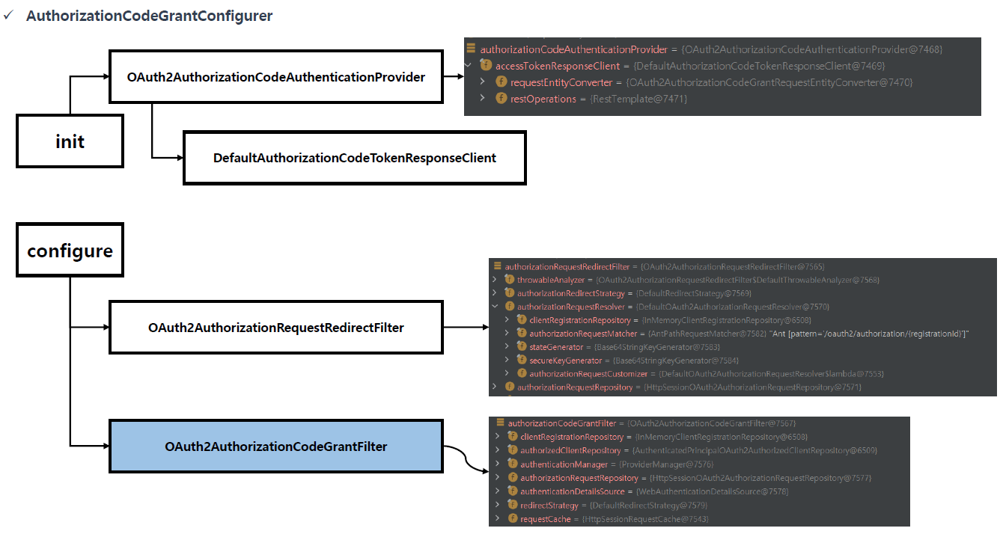

<nav>
    <a href="../.." target="_blank">[Spring Security OAuth2]</a>
</nav>

# 8.1 OAuth2ClientConfigurer 초기화 이해

---

## 1. `oauth2Client()` API
```kotlin
@Configuration
class OAuth2ClientConfig {

    @Bean
    fun securityFilterChain(http: HttpSecurity): SecurityFilterChain {
        http {
            authorizeHttpRequests {
                authorize(anyRequest, authenticated)
            }
            // 최종 사용자에 대해 인가서버 인가처리 하고, 우리 서버에서의 인증처리까지 수행
            // oauth2Login { }

            // 최종사용자에 대해 인가서버 인가처리까지만 하고, 우리 서버에서의 인증처리까지 하지 않음
            oauth2Client { }
        }
        return http.build()
    }

}
```
- `oauth2Client()` API는 `oauth2Login()` 와 달리 우리 클라이언트 서버에서의 인증까지 수행하지 않는다.
  - 우리 서버에서의 인증까지 하려면 추가적인 설정을 해야한다.
- 이 API를 사용하면 OAuth2ClientConfigurer 설정이 활성화된다.

### 주요 설정
```kotlin
oauth2Client {
    // clientRegistrationRepository
    // authorizedClientRepository
    // authorizedClientService
    authorizationCodeGrant {
        // authorizationRequestResolver
        // authorizationRequestRepository
        // authorizationRedirectStrategy
        // accessTokenResponseClient
    }
}
```
- clientRegistrationRepository: ClientRegistration을 저장, 조회하는 역할
- authorizedClientRepository: 인증된 OAuth2 사용자 객체를 가져오는 역할 (service에게 위임)
- authorizedClientService: 인증된 OAuth2 사용자 객체를 저장하고 가져오는 실질적 역할
- authorizationCodeGrant: 인증 과정에서 사용하는 객체들 설정
  - authorizationRequestResolver : 최초 code 발급 요청을 리다이렉트 시길 때 요청 정보(OAuth2AuthorizationRequest)를 생성하는 객체
  - authorizationRequestRepository : code 발급 요청 시 요청 정보(OAuth2AuthorizationRequest)를 저장하고, 이후 인증 시 다시 꺼내서 사용할 수 있도록 하기 위한 리포지토리
  - authorizationRedirectStrategy
  - accessTokenResponseClient : 인가서버와의 통신을 통해 OAuth2AccessTokenResponse 를 얻어오는 역할

---

## 2. OAuth2ClientConfigurer


`oauth2Client()` API 설정을 하면 OAuth2ClientConfigurer 가 작동한다.

### 2.1 `OAuth2ClientConfigurer.init`
```java
	@Override
	public void init(B builder) {
		this.authorizationCodeGrantConfigurer.init(builder);
	}
```
```java
private void init(B builder) {
    OAuth2AuthorizationCodeAuthenticationProvider authorizationCodeAuthenticationProvider = new OAuth2AuthorizationCodeAuthenticationProvider(
            getAccessTokenResponseClient());
    builder.authenticationProvider(postProcess(authorizationCodeAuthenticationProvider));
}
```
- OAuth2AuthorizationCodeAuthenticationProvider 구성
  - OAuth2 코드를 통해 AccessToken을 발급받고, AccessToken을 기반으로 OAuth2AuthorizationCodeAuthenticationToken 을 발급하는 역할
  - 이 provider는 내부적으로 인가서버와 통신해서 accessToken을 발급받아야하는데 그 역할을 하는 OAuth2AccessTokenResponseClient 설정이 일어난다.(`oauth2Client().authorizationCodeGrant().accessTokenResponseClient` 설정 사용)
    - 인가서버와 통신해서 AccessToken 을 발급받는 역할

### 2.2 `OAuth2ClientConfigurer.configure`
```java
@Override
public void configure(B builder) {
    this.authorizationCodeGrantConfigurer.configure(builder);
}
```
```java
private void configure(B builder) {
    OAuth2AuthorizationRequestRedirectFilter authorizationRequestRedirectFilter = createAuthorizationRequestRedirectFilter(
            builder);
    builder.addFilter(postProcess(authorizationRequestRedirectFilter));
    OAuth2AuthorizationCodeGrantFilter authorizationCodeGrantFilter = createAuthorizationCodeGrantFilter(
            builder);
    builder.addFilter(postProcess(authorizationCodeGrantFilter));
}
```
- OAuth2AuthorizationRequestRedirectFilter 설정이 이루어진다.
  - 최초, 인가 요청이 들어왔을 때 이 필터를 통해 code 발급 페이지로 리다이렉트된다.
  - code 발급 페이지 요청을 동적으로 생성하고 이 요청을 저장하여 관리한다.
  - 내부적으로 우리가 설정한 clientRegistrationRepository
- OAuth2AuthorizationCodeGrantFilter 설정이 이루어진다.
  - AccessToken 발급 후 이 정보를 OAuth2AuthorizedClientRepository에 저장한다.
  - 즉, 여기까지 하면 서버의 인가까지 수행하고 서버에서의 인증은 수행되지 않는다.

---

## 3. OAuth2AuthorizationCodeGrantFilter
- AccessToken 발급 후 이 정보를 SecurityContext, OAuth2AuthorizedClientRepository에 저장하는 역할까지 한다.
- 정말 딱, 인가서버를 통해 인가를 받아온 그 결과까지만 저장한다.

### 3.1 matchesAuthorizationResponse (요청 매칭, 필터 작동조건)
```java
	@Override
	protected void doFilterInternal(HttpServletRequest request, HttpServletResponse response, FilterChain filterChain)
			throws ServletException, IOException {
		if (matchesAuthorizationResponse(request)) {
			processAuthorizationResponse(request, response);
			return;
		}
		filterChain.doFilter(request, response);
	}
```
- 사용자의 요청이 로그인 요청인지 체크한뒤, 로그인 요청이 아니면 doFilter를 통해 다음 필터로 바로 보낸다.
- 로그인 요청이 맞다면 oauth2 인가 프로세스를 시작한다.

```java
private boolean matchesAuthorizationResponse(HttpServletRequest request) {
		MultiValueMap<String, String> params = OAuth2AuthorizationResponseUtils.toMultiMap(request.getParameterMap());
		if (!OAuth2AuthorizationResponseUtils.isAuthorizationResponse(params)) {
			return false;
		}
		OAuth2AuthorizationRequest authorizationRequest = this.authorizationRequestRepository
			.loadAuthorizationRequest(request);
		if (authorizationRequest == null) {
			return false;
		}
		UriComponents requestUri = UriComponentsBuilder.fromUriString(UrlUtils.buildFullRequestUrl(request)).build();
		UriComponents redirectUri = UriComponentsBuilder.fromUriString(authorizationRequest.getRedirectUri()).build();
		Set<Map.Entry<String, List<String>>> requestUriParameters = new LinkedHashSet<>(
				requestUri.getQueryParams().entrySet());
		Set<Map.Entry<String, List<String>>> redirectUriParameters = new LinkedHashSet<>(
				redirectUri.getQueryParams().entrySet());
        
		requestUriParameters.retainAll(redirectUriParameters);
		if (Objects.equals(requestUri.getScheme(), redirectUri.getScheme())
				&& Objects.equals(requestUri.getUserInfo(), redirectUri.getUserInfo())
				&& Objects.equals(requestUri.getHost(), redirectUri.getHost())
				&& Objects.equals(requestUri.getPort(), redirectUri.getPort())
				&& Objects.equals(requestUri.getPath(), redirectUri.getPath())
				&& Objects.equals(requestUriParameters.toString(), redirectUriParameters.toString())) {
			return true;
		}
		return false;
	}
```
```java
	static boolean isAuthorizationResponse(MultiValueMap<String, String> request) {
		return isAuthorizationResponseSuccess(request) || isAuthorizationResponseError(request);
	}

	static boolean isAuthorizationResponseSuccess(MultiValueMap<String, String> request) {
		return StringUtils.hasText(request.getFirst(OAuth2ParameterNames.CODE))
				&& StringUtils.hasText(request.getFirst(OAuth2ParameterNames.STATE));
	}

	static boolean isAuthorizationResponseError(MultiValueMap<String, String> request) {
		return StringUtils.hasText(request.getFirst(OAuth2ParameterNames.ERROR))
				&& StringUtils.hasText(request.getFirst(OAuth2ParameterNames.STATE));
	}
```
- 요청 매칭 과정 
  - `OAuth2AuthorizationResponseUtils.isAuthorizationResponse`
    - 'code' 파라미터와 'state'가 있거나 'error' 파라미터와 'state'가 있어야함
    - 없으면 false 반환
  - authorizationRequestRepository 를 통해 OAuth2AuthorizationRequest (이전에 요청한 요청 정보)를 가져온다.
    - 없으면 false 반환
  - 지금 보내진 요청(request)에서 요청 uri(requestUri) 추출
  - 이전 요청(authorizationRequest)에서 (redirectUri) 추출
  - requestUri, redirectUri의 파라미터들 추출
  - 둘을 비교하고, 서로 맞다면 true, 다르다면 false 반환

### 3.2 processAuthorizationResponse
```java
	private void processAuthorizationResponse(HttpServletRequest request, HttpServletResponse response)
			throws IOException {
		OAuth2AuthorizationRequest authorizationRequest = this.authorizationRequestRepository
			.removeAuthorizationRequest(request, response);
		String registrationId = authorizationRequest.getAttribute(OAuth2ParameterNames.REGISTRATION_ID);
		ClientRegistration clientRegistration = this.clientRegistrationRepository.findByRegistrationId(registrationId);
		MultiValueMap<String, String> params = OAuth2AuthorizationResponseUtils.toMultiMap(request.getParameterMap());
		String redirectUri = UrlUtils.buildFullRequestUrl(request);
		OAuth2AuthorizationResponse authorizationResponse = OAuth2AuthorizationResponseUtils.convert(params,
				redirectUri);
		OAuth2AuthorizationCodeAuthenticationToken authenticationRequest = new OAuth2AuthorizationCodeAuthenticationToken(
				clientRegistration, new OAuth2AuthorizationExchange(authorizationRequest, authorizationResponse));
		authenticationRequest.setDetails(this.authenticationDetailsSource.buildDetails(request));
		OAuth2AuthorizationCodeAuthenticationToken authenticationResult;
		try {
			authenticationResult = (OAuth2AuthorizationCodeAuthenticationToken) this.authenticationManager
				.authenticate(authenticationRequest);
		}
		catch (OAuth2AuthorizationException ex) {
			OAuth2Error error = ex.getError();
			UriComponentsBuilder uriBuilder = UriComponentsBuilder.fromUriString(authorizationRequest.getRedirectUri())
				.queryParam(OAuth2ParameterNames.ERROR, error.getErrorCode());
			if (StringUtils.hasLength(error.getDescription())) {
				uriBuilder.queryParam(OAuth2ParameterNames.ERROR_DESCRIPTION, error.getDescription());
			}
			if (StringUtils.hasLength(error.getUri())) {
				uriBuilder.queryParam(OAuth2ParameterNames.ERROR_URI, error.getUri());
			}
			this.redirectStrategy.sendRedirect(request, response, uriBuilder.build().encode().toString());
			return;
		}
		Authentication currentAuthentication = this.securityContextHolderStrategy.getContext().getAuthentication();
		String principalName = (currentAuthentication != null) ? currentAuthentication.getName() : "anonymousUser";
		OAuth2AuthorizedClient authorizedClient = new OAuth2AuthorizedClient(
				authenticationResult.getClientRegistration(), principalName, authenticationResult.getAccessToken(),
				authenticationResult.getRefreshToken());
		this.authorizedClientRepository.saveAuthorizedClient(authorizedClient, currentAuthentication, request,
				response);
		String redirectUrl = authorizationRequest.getRedirectUri();
		SavedRequest savedRequest = this.requestCache.getRequest(request, response);
		if (savedRequest != null) {
			redirectUrl = savedRequest.getRedirectUrl();
			this.requestCache.removeRequest(request, response);
		}
		this.redirectStrategy.sendRedirect(request, response, redirectUrl);
	}
```
- authorizationRequestRepository 에서 이전 요청정보(OAuth2AuthorizationRequest)를 가져오고 말소
- ClientRegistration 가져오기
- OAuth2AuthorizationResponse 구성 : 인가서버에서 가져온 code 발급의 결과를 객체로 구성한다.
  - code 발급 후 리다이렉트된 redirectUri, code, state 정보 등등
- AccessToken 발급을 위한 객체 구성(OAuth2AuthorizationCodeAuthenticationToken)
  - clientRegistration
  - OAuth2AuthorizationExchange : OAuth2AuthorizationRequest, OAuth2AuthorizationResponse
- authenticationManager 를 통해 인증을 받고 인증 결과를 OAuth2AuthorizationCodeAuthenticationToken 로 구성
- 인증된 클라이언트이므로 OAuth2AuthorizedClient 객체로 구성 후 authorizedClientRepository 에 저장
- 리다이렉트
  - 최초 code 발급 요청 시 지정했던 redirect_uri 로 리다이렉트
  - 이전에 인증 실패했던 사용자는 requestCache에 캐싱된 요청이 있는데(스프링 시큐리티 기본 구현) 이를 꺼내와서 리다이렉트

---

## 4. 실습

### 4.1 application.yml
```yaml
spring.application.name: spring-security-oauth2

server:
  port: 8081

spring:
  security:
    oauth2:
      client:
        registration:
          keycloak:
            clientId: oauth2-client-app
            clientSecret: 1tIeERcVJnWNmVZIEFA7Ao5YkTIbx83w
            clientName: oauth2-client-app
            authorizationGrantType: authorization_code
            redirectUri: http://localhost:8081/
            clientAuthenticationMethod: client_secret_basic
            scope: openid,profile
        provider:
          keycloak:
            issuerUri: http://localhost:8080/realms/oauth2
            authorizationUri: http://localhost:8080/realms/oauth2/protocol/openid-connect/auth
            tokenUri: http://localhost:8080/realms/oauth2/protocol/openid-connect/token
            jwkSetUri: http://localhost:8080/realms/oauth2/protocol/openid-connect/certs
            userInfoUri: http://localhost:8080/realms/oauth2/protocol/openid-connect/userinfo
            userNameAttribute: preferred_username
```
- 코드 발급 이후 `http://localhost:8081/`로 리다이렉트 되도록 한다.
  - 물론 인가 서버에 이 설정을 지정해야한다.

### 4.2 설정 클래스
```kotlin
@Configuration
class OAuth2ClientConfig {

    @Bean
    fun securityFilterChain(http: HttpSecurity): SecurityFilterChain {
        http {
            authorizeHttpRequests {
                authorize("/", permitAll)
                authorize(anyRequest, authenticated)
            }
            oauth2Client {}
            exceptionHandling {
                authenticationEntryPoint = LoginUrlAuthenticationEntryPoint("/oauth2/authorization/keycloak")
            }
            requestCache {
                requestCache = NullRequestCache()
            }
        }
        return http.build()
    }
}
```
- `oauth2Client()` API 활성화
- authenticationEntryPoint 설정: 인증 실패 시 코드 발급 엔드 포인트(`/oauth2/authorization/keycloak`)로 리다이렉트 되도록 한다.
- requestCache: 실습의 편의를 위해 요청 캐시를 하지 않는다.

### 4.3 컨트롤러
```kotlin
@RestController
class OAuth2ClientController(
    private val oauth2AuthorizedClientRepository: OAuth2AuthorizedClientRepository
) {

    @GetMapping("/")
    fun index(httpServletRequest: HttpServletRequest): OAuth2AuthenticationResult {
        // oauth2Client() API는 oauth2AuthorizationCodeAuthenticationToken 만 가져옴
        val clientRegistrationId = "keycloak"
        val beforeAuthentication = SecurityContextHolder.getContextHolderStrategy().context.authentication

        println("beforeAuthentication = $beforeAuthentication")

        val oauth2AuthorizedClient = oauth2AuthorizedClientRepository.loadAuthorizedClient<OAuth2AuthorizedClient>(clientRegistrationId, beforeAuthentication, httpServletRequest)
        val clientRegistration = oauth2AuthorizedClient.clientRegistration

        // 사용자 정보를 가져오려면 accessToken 을 사용해서 서비스제공자로부터 가져와야함
        val oauth2UserService = DefaultOAuth2UserService()
        val oauth2User = oauth2UserService.loadUser(OAuth2UserRequest(clientRegistration, oauth2AuthorizedClient.accessToken))
        val authentication = OAuth2AuthenticationToken(oauth2User, setOf(SimpleGrantedAuthority("ROLE_USER")), clientRegistration.clientId)

        SecurityContextHolder.getContextHolderStrategy().context.authentication = authentication

        return OAuth2AuthenticationResult(
            username = authentication.name,
            name = authentication.principal.attributes["name"] as String,
            roles = authentication.authorities.map { it.authority },
            clientId = clientRegistration.clientId,
            accessToken = oauth2AuthorizedClient.accessToken.tokenValue,
            refreshToken = oauth2AuthorizedClient.refreshToken!!.tokenValue
        )
    }

}
```
- "/"에 도달한 시점에는 oauth2AuthorizedClientRepository 에 oauth2AuthorizedClient 이 저장되어 있다.
- DefaultOAuth2UserService를 통해 사용자 정보를 가져온다.(OAuth2User)
- 여기서는 간단하게 실습차원에서 SecurityContext에 인증객체(OAuth2AuthenticationToken)를 담아 저장했다.
- 필요에 따라 이 정보를 이용해 우리 서비스 사용자 인증을 수행하고 세션이나 토큰에 인증을 장기적으로 저장할 수 있다.
- 여러가지 정보를 body에 담아 보내는 식으로 처리했다.


### 4.4 실행
- `http://localhost:8080/adfafd` 로 요청 -> 인증 실패 -> `/oauth2/authorization/keycloak` 리다이렉트
- OAuth2AuthorizationRequestRedirectFilter 작동 -> 인가서버 리다이렉트
- 로그인, 승인 후 인가서버는 우리가 지정한 redirect_uri `http://localhost:8081/` 로 리다이렉트
- OAuth2AuthorizationCodeGrantFilter 작동 응답에
  - code, state가 있고
  - 리다이렉트되면서 온 파라미터와 요청 전 보냈던 파라미터들이 일치하므로 매칭된다.
- 액세스 토큰 발급 후 redirect_uri `http://localhost:8081/` 로 리다이렉트
- 이 때는 요청에 파라미터에 code, state 가 없으므로 필터를 통과한다.
- 컨트롤러에 진입하고, 요청을 처리한다.(위의 내용 참조)


```json
{
  "username": "user",
  "name": "fire punch",
  "roles": [
    "ROLE_USER"
  ],
  "clientId": "oauth2-client-app",
  "accessToken": "eyJhbGciOiJSUzI1NiIsInR5cCIgOiAiSldUIiwia2lkIiA6ICJ6dnNxLUctWUtwTGJtZEp2TXVVQ05kb283VjRBU29Dd3RJV1d6OTBSdzNnIn0.eyJleHAiOjE3MTg2MzIxMTAsImlhdCI6MTcxODYzMTgxMCwiYXV0aF90aW1lIjoxNzE4NjMxODEwLCJqdGkiOiJkODUxMzY1Ni01OWIxLTRjYTMtOTI1ZS02ODUwNjg5NDk5YTAiLCJpc3MiOiJodHRwOi8vbG9jYWxob3N0OjgwODAvcmVhbG1zL29hdXRoMiIsImF1ZCI6ImFjY291bnQiLCJzdWIiOiI1ODAwYzZlMi0yMDNkLTRmMGUtODM0My1iYmI5NDhmMTY4MDciLCJ0eXAiOiJCZWFyZXIiLCJhenAiOiJvYXV0aDItY2xpZW50LWFwcCIsIm5vbmNlIjoiYVRQekh6MlBWUXFXcVFSTG1KSFUycjZ3NW02TElkSElieGRMUzI0V0YtVSIsInNlc3Npb25fc3RhdGUiOiI2NzRlMDRhYi04Yjk1LTRkMDYtYTYyZC1iNmUzZjZiOTAyMTgiLCJhY3IiOiIxIiwiYWxsb3dlZC1vcmlnaW5zIjpbImh0dHA6Ly9sb2NhbGhvc3Q6ODA4MSJdLCJyZWFsbV9hY2Nlc3MiOnsicm9sZXMiOlsib2ZmbGluZV9hY2Nlc3MiLCJ1bWFfYXV0aG9yaXphdGlvbiIsImRlZmF1bHQtcm9sZXMtb2F1dGgyIl19LCJyZXNvdXJjZV9hY2Nlc3MiOnsiYWNjb3VudCI6eyJyb2xlcyI6WyJtYW5hZ2UtYWNjb3VudCIsIm1hbmFnZS1hY2NvdW50LWxpbmtzIiwidmlldy1wcm9maWxlIl19fSwic2NvcGUiOiJvcGVuaWQgcHJvZmlsZSIsInNpZCI6IjY3NGUwNGFiLThiOTUtNGQwNi1hNjJkLWI2ZTNmNmI5MDIxOCIsIm5hbWUiOiJmaXJlIHB1bmNoIiwicHJlZmVycmVkX3VzZXJuYW1lIjoidXNlciIsImdpdmVuX25hbWUiOiJmaXJlIiwiZmFtaWx5X25hbWUiOiJwdW5jaCJ9.QkHVN9vT26SHICdDfuslTrDa6kzlWdQH_bmaIvyqrohDZEkMkA6S6z41lEfpi6CypwgNOb9nsDW53Aw4woIbdi6rdSVw8PLFALliQML3SY4CaCQNVJ3KOvdT0efFK6aKQyvWLe2fkRid1DpfARrqUSx0_pFoEksijBG-OOEYUA7BXYqJzWXbJDhzUBlg0niXmyYQBC-SFDou1FDfF9TPGQwa6Tyc6h51o81BPapZWA3ji15cUK-8fQzUQQ8Ph8q3L92M2YYCvOhT006ureofRMA485mRLIGKoeI1bDGBlsB-U4KlhDg2OnVO1XpTUI9lOoKdc6zYBdkhvAFpn_eq0w",
  "refreshToken": "eyJhbGciOiJIUzUxMiIsInR5cCIgOiAiSldUIiwia2lkIiA6ICJlZTQ1ZjY5Yi03N2M1LTRkNDAtYTYzYS0wNTA0ZjJlZTVjNGQifQ.eyJleHAiOjE3MTg2MzM2MTAsImlhdCI6MTcxODYzMTgxMCwianRpIjoiNTUxOTg2YWItYTVmMC00NzRmLWJjNTYtYjdkNGY4MzdmZTUzIiwiaXNzIjoiaHR0cDovL2xvY2FsaG9zdDo4MDgwL3JlYWxtcy9vYXV0aDIiLCJhdWQiOiJodHRwOi8vbG9jYWxob3N0OjgwODAvcmVhbG1zL29hdXRoMiIsInN1YiI6IjU4MDBjNmUyLTIwM2QtNGYwZS04MzQzLWJiYjk0OGYxNjgwNyIsInR5cCI6IlJlZnJlc2giLCJhenAiOiJvYXV0aDItY2xpZW50LWFwcCIsIm5vbmNlIjoiYVRQekh6MlBWUXFXcVFSTG1KSFUycjZ3NW02TElkSElieGRMUzI0V0YtVSIsInNlc3Npb25fc3RhdGUiOiI2NzRlMDRhYi04Yjk1LTRkMDYtYTYyZC1iNmUzZjZiOTAyMTgiLCJzY29wZSI6Im9wZW5pZCBwcm9maWxlIiwic2lkIjoiNjc0ZTA0YWItOGI5NS00ZDA2LWE2MmQtYjZlM2Y2YjkwMjE4In0.sqRjTo8Jxb5mIKuDwB1nssdB4I9CjZJShqHu9YokvuQebjgcxHSJhURBP7YdCfOxPXIMZbLwd3JOsjpS_kjadg"
}
```
- 응답이 잘 전달된다.


---
