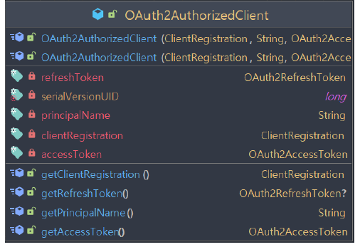
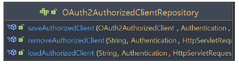
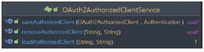
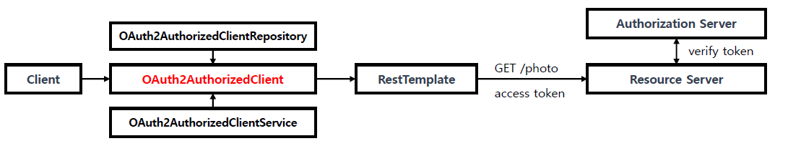
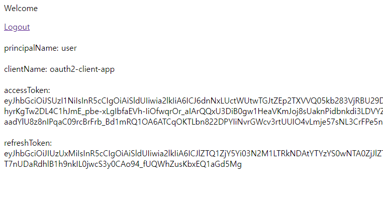

<nav>
    <a href="../.." target="_blank">[Spring Security OAuth2]</a>
</nav>

# 8.2 OAuth2AuthorizedClient 이해 및 활용

---

## 1. OAuth2AuthorizedClient


```java
public class OAuth2AuthorizedClient implements Serializable {
    
    private final ClientRegistration clientRegistration;
    private final String principalName;
    private final OAuth2AccessToken accessToken;
    private final OAuth2RefreshToken refreshToken;
```
- `OAuth2AuthorizedClient` 는 인가받은 클라이언트를 의미하는 클래스다.
- 최종 사용자(리소스 소유자)가 클라이언트에게 리소스에 접근할 수 있는 권한을 부여하면, 클라이언트를 "인가된 클라이언트"로 간주한다
- OAuth2AuthorizedClient 는 AccessToken 과 RefreshToken 을 ClientRegistration (클라이언트)와 권한을 부여한 최종 사용자의 principalName(식별명)과 함께 묶어 준다
- OAuth2AuthorizedClient 의 AccessToken 을 사용해서 리소스 서버의 자원에 접근 할 수 있으며 인가서버와의 통신으로 토큰을 검증할 수 있다
- OAuth2AuthorizedClient 의 ClientRegistration 과 AccessToken 을 사용해서 UserInfo 엔드 포인트로 요청할 수 있다
  - `oauth2UserService.loadUser(OAuth2UserRequest(oauth2AuthorizedClient.clientRegistration, oauth2AuthorizedClient.accessToken))`

---

## 2. OAuth2AuthorizedClientRepository


```java
public interface OAuth2AuthorizedClientRepository {

	<T extends OAuth2AuthorizedClient> T loadAuthorizedClient(String clientRegistrationId, Authentication principal,
			HttpServletRequest request);


	void saveAuthorizedClient(OAuth2AuthorizedClient authorizedClient, Authentication principal,
			HttpServletRequest request, HttpServletResponse response);


	void removeAuthorizedClient(String clientRegistrationId, Authentication principal, HttpServletRequest request,
			HttpServletResponse response);

}
```
- OAuth2AuthorizedClientRepository 는 다른 웹 요청이 와도 동일한 OAuth2AuthorizedClient 를 유지하는 역할을 담당한다.
- 보통 OAuth2AuthorizedClientService 에게 OAuth2AuthorizedClient 의 저장, 조회, 삭제 처리를 위임한다

---

## 3. OAuth2AuthorizedClientService


- OAuth2AuthorizedClientService 는 어플리케이션 레벨에서 OAuth2AuthorizedClient 를 관리(저장, 조회, 삭제 )하는 역할을
담당한다.


---

## 4. 웹 애플리케이션에서 활용


- OAuth2AuthorizedClientRepository 나 OAuth2AuthorizedClientService 는 OAuth2AuthorizedClient 에서 OAuth2AccessToken 을 찾을 수 있는 기능을 제공하므
로 보호중인 리소스 요청을 시작할 때 사용할 수 있다
- 스프링 빈으로 OAuth2AuthorizedClientRepository, OAuth2AuthorizedClientService 를 스프링 빈으로 의존성 주입 받아
사용할 수 있다.
  - `spring-boot-starter-oauth2-client` 가 프로젝트에 포함되면 `OAuth2WebSecurityConfiguration`에 의해 InMemoryOAuth2AuthorizedClientService 및
  `AuthenticatedPrincipalOAuth2AuthorizedClientRepository` 가 기본 빈으로 등록된다.
  - 물론 개발자가 커스텀한 빈을 등록하면 그것이 우선된다.

---

## 5. 실습

### 5.1 application.yml
```yaml
spring.application.name: spring-security-oauth2

server:
  port: 8081

spring:
  security:
    oauth2:
      client:
        registration:
          keycloak:
            clientId: oauth2-client-app
            clientSecret: 1tIeERcVJnWNmVZIEFA7Ao5YkTIbx83w
            clientName: oauth2-client-app
            authorizationGrantType: authorization_code
            redirectUri: http://localhost:8081/client
            clientAuthenticationMethod: client_secret_basic
            scope: openid,profile
        provider:
          keycloak:
            issuerUri: http://localhost:8080/realms/oauth2
            authorizationUri: http://localhost:8080/realms/oauth2/protocol/openid-connect/auth
            tokenUri: http://localhost:8080/realms/oauth2/protocol/openid-connect/token
            jwkSetUri: http://localhost:8080/realms/oauth2/protocol/openid-connect/certs
            userInfoUri: http://localhost:8080/realms/oauth2/protocol/openid-connect/userinfo
            userNameAttribute: preferred_username
```
- redirectUri 로 `http://localhost:8081/client` 를 지정

### 5.2 설정
```kotlin
@Configuration
class OAuth2ClientConfig {

    @Bean
    fun securityFilterChain(http: HttpSecurity): SecurityFilterChain {
        http {
            authorizeHttpRequests {
                authorize(PathRequest.toStaticResources().atCommonLocations(), permitAll)
                authorize("/home", permitAll)
                authorize("/client", permitAll)
                authorize("/favicon.ico", permitAll)
                authorize("/error", permitAll)
                authorize(anyRequest, authenticated)
            }
            oauth2Client {}
            exceptionHandling {
                authenticationEntryPoint = LoginUrlAuthenticationEntryPoint("/home")
            }
            requestCache {
                requestCache = NullRequestCache()
            }
            logout {
                logoutSuccessUrl = "/home"
            }
        }
        return http.build()
    }
}
```

### 5.3 HomePage
```kotlin
@Controller
class HomePageController {

    @GetMapping("/home")
    fun home(): String {
        return "home"
    }

}
```
```html
<!DOCTYPE html>
<html lang="ko" xmlns="http://www.w3.org/1999/xhtml"
      xmlns:th="http://www.thymeleaf.org"
      xmlns:sec="http://www.thymeleaf.org/extras/spring-security">

<head>
    <meta charset="UTF-8">
    <title>Insert title here</title>
    <script src="/js/home.js"></script>
</head>
<body>
<div>Welcome</div>
<form sec:authorize="isAnonymous()" action="#">
    <p><input type="button" onclick="authorizationCode()" value="AuthorizationCode Grant"/>
    <p><input type="button" onclick="password()" value="Resource Owner Password Grant"/>
    <p><input type="button" onclick="clientCredentials()" value="Client Credentials Grant"/>
</form>
</body>
</html>
```
```javascript
const authorizationCode = () => {
  window.location = new URL('http://localhost:8081/oauth2/authorization/keycloak');
}

const password = () => {
  window.location = new URL('http://localhost:8081/oauth2/authorization/keycloak2');
};

const clientCredentials = () => {
  window.location = new URL('http://localhost:8081/oauth2/authorization/keycloak3');
};
```

### 5.4 ClientPageController
```kotlin
@Controller
class ClientPageController(
    private val authorizedClientRepository: OAuth2AuthorizedClientRepository,
    private val authorizedClientService: OAuth2AuthorizedClientService
) {

    @GetMapping("/client")
    fun client(request: HttpServletRequest, model: Model): String {
        // oauth2Client API 를 사용할 경우, SecurityContext에는 익명사용자만 남아있다.
        val authentication = SecurityContextHolder.getContextHolderStrategy().context.authentication

        println("authentication = $authentication")

        val clientRegistrationId = "keycloak"

        // 대신 Oauth2AuthorizedClient 가 AuthorizedClientRepository 에 있으므로 이를 사용해 인증에 사용할 수 있다
        val oauth2AuthorizedClient = authorizedClientRepository.loadAuthorizedClient<OAuth2AuthorizedClient>(
            clientRegistrationId,
            authentication,
            request
        )
        val oauth2AuthorizedClient1 = authorizedClientService.loadAuthorizedClient<OAuth2AuthorizedClient>(
            clientRegistrationId,
            authentication.name
        )
        println("oauth2AuthorizedClient = $oauth2AuthorizedClient")
        println("oauth2AuthorizedClient1 = $oauth2AuthorizedClient1")


        // Oauth2AuthorizedClient 를 통해 여러가지 정보 조회 가능(ClientRegistration, accessToken, refreshToken, principalName)
        val accessToken = oauth2AuthorizedClient.accessToken
        val refreshToken = oauth2AuthorizedClient.refreshToken!!
        val clientRegistration = oauth2AuthorizedClient.clientRegistration
        val principalName = oauth2AuthorizedClient.principalName

        println("accessToken = $accessToken")
        println("refreshToken = $refreshToken")
        println("clientRegistration = $clientRegistration")
        println("principalName = $principalName")

        // Oauth2UserService 를 통해 사용자 정보(OAuth2) 조회
        val oauth2UserService = DefaultOAuth2UserService()
        val oauth2User = oauth2UserService.loadUser(OAuth2UserRequest(clientRegistration, accessToken))


        // 인증 생성(Authentication) 및 저장
        val authenticationToken =
            OAuth2AuthenticationToken(oauth2User, setOf(SimpleGrantedAuthority("ROLE_USER")), clientRegistrationId)
        SecurityContextHolder.getContextHolderStrategy().context.authentication = authenticationToken
        println("authenticationToken = $authenticationToken")


        model.addAttribute("accessToken", accessToken.tokenValue)
        model.addAttribute("refreshToken", refreshToken.tokenValue)
        model.addAttribute("principalName", oauth2User.name)
        model.addAttribute("clientName", oauth2AuthorizedClient.clientRegistration.clientName)
        return "client"
    }
}
```

### 5.5 실행


---
