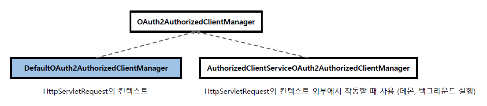
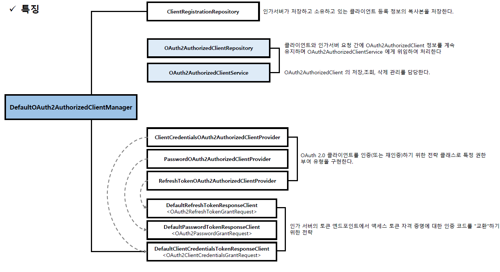
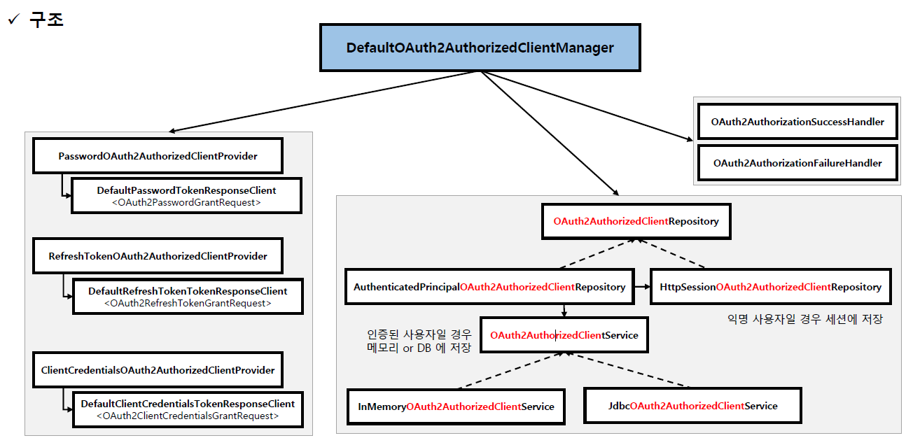

<nav>
    <a href="../.." target="_blank">[Spring Security OAuth2]</a>
</nav>

# 8.3 DefaultOAuth2AuthorizedClientManager 소개 및 특징

---

## 1. OAuth2AuthorizedClientManager
```java
public interface OAuth2AuthorizedClientManager {
	@Nullable
	OAuth2AuthorizedClient authorize(OAuth2AuthorizeRequest authorizeRequest);
}
```
- OAuth2AuthorizedClient 를 전반적으로 관리하는 인터페이스
- `OAuth2AuthorizeRequest` 객체를 전달받아서, OAuth2AuthorizedClient(인증된 클라이언트) 를 반환할 책임을 가진다.
  - 여기서 사용되는 OAuth2AuthorizeRequest 는 빌더로 생성할 수 있다.
- `OAuth2AuthorizedClientProvider` 를 내부적으로 의존하고, 이를 사용하여 OAuth 2.0 클라이언트에 권한을 부여한다.
  - Client Credentials Flow: 최종 사용자 없이 Client 자체를 인증하기 위한 방식
  - Resource Owner Password Flow : 리소스 owner의 id, password 를 직접 전달하여 권한부여 하는 방식
  - Refresh Token Flow : 리프레시 토큰을 전달하여 AccessToken을 새로 발급받는 방식
- `OAuth2AuthorizedClientService` 나 `OAuth2AuthorizedClientRepository` 에 `OAuth2AuthorizedClient` 저장을 위임한 후 `OAuth2AuthorizedClient` 최종 반환
  - 사용자 정의 `OAuth2AuthorizationSuccessHandler` 및 `OAuth2AuthorizationFailureHandler` 를 구성하여 성공/실패 처리를 변경할 수 있다. 
  - `invalid_grant` 오류로 인해 권한 부여 시도가 실패하면 이전에 저장된 `OAuth2AuthorizedClient`가 `OAuth2AuthorizedClientRepository` 에서 제거된다

### 구현체


- 스프링 시큐리티는 기본적으로 2개의 구현체를 제공한다.
- `DefaultOAuth2AuthorizedClientManager` 는 주로 HttpServletRequest를 사용하는 맥락(웹요청)에서 사용하고
`AuthorizedClientServiceOAuth2AuthorizedClientManager`는 주로 HttpServletRequest 를 사용하지 않는 맥락(데몬, 백그라운드 실행)에서 사용한다.
- 이번 강의에서는 DefaultOAuth2AuthorizedClientManager 를 다룬다.

---

## 2. DefaultOAuth2AuthorizedClientManager




- DefaultOAuth2AuthorizedClientManager 는 내부적으로 다음 의존성들을 가진다.
  - ClientRegistrationRepository : 클라이언트 정보(ClientRegistrationRepository)
  - OAuth2AuthorizedClientProvider : 실질적 인증 후 OAuth2AuthorizedClient 를 반환할 책임을 가짐
    - 주로 사용하는 기본 구현체로는 DelegatingOAuth2AuthorizedClientProvider  (`OAuth2AuthorizedClientProviderBuilder.builder()` 를 통해 반환되는 기본 구현체다.)가
    있으며 여러 OAuth2AuthorizedClientProvider 를 가지고, 가장 먼저 성공적으로 반환하는 OAuth2AuthorizedClient 를 반환한다.
    - 내부적으로 기본적으로 DefaultXXXResponseClient 를 사용하여, 인가 서버와 통신해 액세스토큰 등 인가에 필요한 정보를 얻어온다.
  - OAuth2AuthorizedClientRepository : OAuth2AuthorizedClient를 저장, 조회하기 위한 리포지토리
  - OAuth2AuthorizationSuccessHandler : 성공 후속처리
  - OAuth2AuthorizationFailureHandler : 실패 후속처리

---

## 3. 수동 빈 등록
```java
@Bean
public OAuth2AuthorizedClientManager authorizedClientManager(ClientRegistrationRepository clientRegistrationRepository,
    OAuth2AuthorizedClientRepository authorizedClientRepository) {
    
    OAuth2AuthorizedClientProvider authorizedClientProvider = 
            OAuth2AuthorizedClientProviderBuilder.builder()
                    .authorizationCode()
                    .refreshToken()
                    .clientCredentials()
                    .password()
                    .build();
    
    DefaultOAuth2AuthorizedClientManager authorizedClientManager = new DefaultOAuth2AuthorizedClientManager(
            clientRegistrationRepository, authorizedClientRepository
    );
    authorizedClientManager.setAuthorizedClientProvider(authorizedClientProvider);
    return authorizedClientManager;
}
```
- 스프링 빈으로 등록하고 원하는 곳에서 의존성 주입을 받아 사용할 수 있다.
- 참고로 `OAuth2AuthorizedClientManager` 를 스프링 빈으로 등록할 경우 `OAuth2AuthorizedClientManagerConfiguration`
자동 구성에 의해 `OAuth2AuthorizedClientArgumentResolver`에서 내부적으로 주입되어 우선적으로 사용된다.

---
