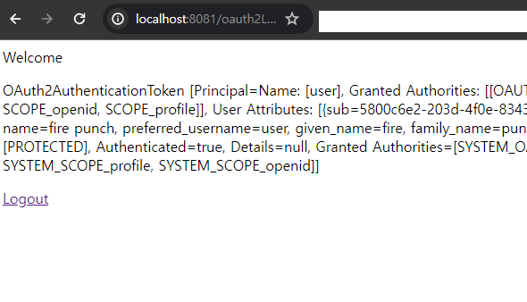
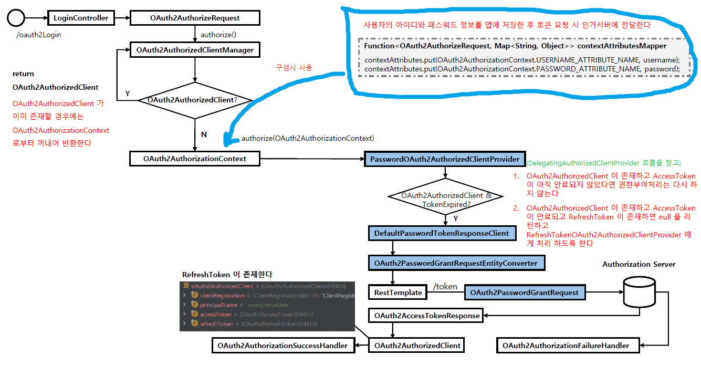
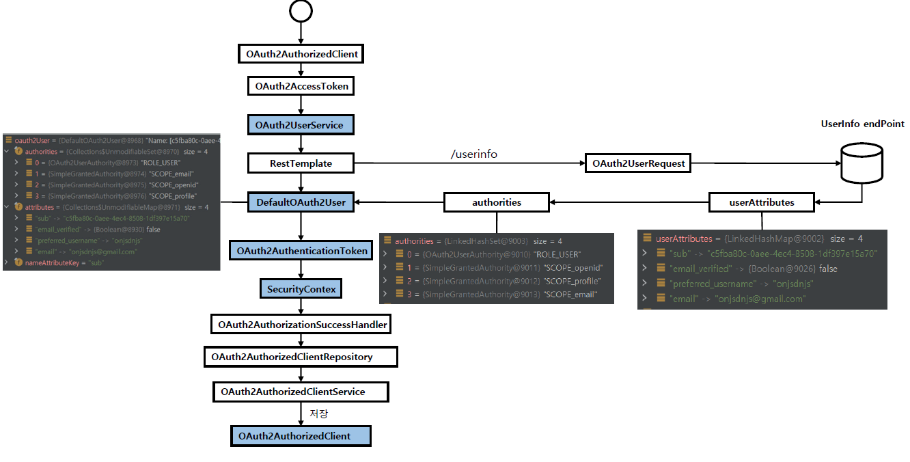

<nav>
    <a href="../.." target="_blank">[Spring Security OAuth2]</a>
</nav>

# 8.5 DefaultOAuth2AuthorizedClientManager - Resource Owner Password 권한 부여 구현하기

---

## 1. 요구사항
- 이번 글에서는 Resource Owner Password 방식으로 OAuth2 기능을 구현하는 것을 목표로 한다.
- 물론 이 방식은 최종 사용자의 id, password 를 직접 받아 인증하는 방식이고, 실무에서 절대 사용하지 않는 방식이지만
Spring Security OAuth2 Client 모듈의 이해를 위해 학습하기로 한다.

---

## 2. application.yml 설정
```yaml
spring.application.name: spring-security-oauth2

server:
  port: 8081

spring:
  security:
    oauth2:
      client:
        registration:
          keycloak:
            clientId: oauth2-client-app
            clientSecret: 1tIeERcVJnWNmVZIEFA7Ao5YkTIbx83w
            clientName: oauth2-client-app
            authorizationGrantType: password
            redirectUri: http://localhost:8081/client
            clientAuthenticationMethod: client_secret_basic
            scope: openid,profile
        provider:
          keycloak:
            issuerUri: http://localhost:8080/realms/oauth2
            authorizationUri: http://localhost:8080/realms/oauth2/protocol/openid-connect/auth
            tokenUri: http://localhost:8080/realms/oauth2/protocol/openid-connect/token
            jwkSetUri: http://localhost:8080/realms/oauth2/protocol/openid-connect/certs
            userInfoUri: http://localhost:8080/realms/oauth2/protocol/openid-connect/userinfo
            userNameAttribute: preferred_username
```
- `authorizationGrantType: password`
  - password 방식으로 인증할 것이다.

---

## 3. DefaultOAuth2AuthorizedClientManager 설정
### 3.1 CustomOAuth2AuthorizationSuccessHandler
```kotlin
class CustomOAuth2AuthorizationSuccessHandler(
    private val oauth2AuthorizedClientRepository: OAuth2AuthorizedClientRepository,
) : OAuth2AuthorizationSuccessHandler {


    override fun onAuthorizationSuccess(
        authorizedClient: OAuth2AuthorizedClient?,
        principal: Authentication?,
        attributes: MutableMap<String, Any>?
    ) {
        oauth2AuthorizedClientRepository.saveAuthorizedClient(
            authorizedClient,
            principal,
            attributes!![HttpServletRequest::class.java.name] as HttpServletRequest,
            attributes[HttpServletResponse::class.java.name] as HttpServletResponse,
        )

        println("authorizedClient = $authorizedClient")
        println("principal = $principal")
        println("attributes = $attributes")
    }
}
```
- DefaultOAuth2AuthorizedClientManager 에서 OAuth2AuthorizedClient 를 성공적으로 얻어왔을 때의 후속처리를 정의한다.
- 여기서는 단순하게 oauth2AuthorizedClientRepository 에 OAuth2AuthorizedClient 를 저장하도록 한다.

### 3.2 contextAttributesMapper
```kotlin
    private fun contextAttributesMapper(): Function<OAuth2AuthorizeRequest, Map<String, Any>> {
        return Function<OAuth2AuthorizeRequest, Map<String, Any>> { oAuth2AuthorizeRequest: OAuth2AuthorizeRequest ->
            val contextAttributes = mutableMapOf<String, Any>()

            val request = oAuth2AuthorizeRequest.getAttribute(HttpServletRequest::class.java.name) as HttpServletRequest
            val username: String = request.getParameter(OAuth2ParameterNames.USERNAME)
            val password: String = request.getParameter(OAuth2ParameterNames.PASSWORD)

            if (StringUtils.hasText(username) && StringUtils.hasText(password)) {
                contextAttributes[OAuth2AuthorizationContext.USERNAME_ATTRIBUTE_NAME] = username
                contextAttributes[OAuth2AuthorizationContext.PASSWORD_ATTRIBUTE_NAME] = password
            }
            contextAttributes
        }
    }
```
- OAuth2AuthorizedClientProvider 들은 인자로 OAuth2AuthorizationContext 를 필요로 한다.
  - 이것은 clientRegistration, 여러가지 파라미터들을 담은 객체로서 인가서버에 권한부여 요청을 하기 위한 정보를 담고 있다.
- OAuth2AuthorizationContext 를 구성하기 위해 DefaultOAuth2AuthorizedClientManager 는 contextAttributesMapper 를 참조한다.
  - `Function<OAuth2AuthorizeRequest, Map<String, Any>>`
  - OAuth2AuthorizeRequest가 들어왔을 때 각 OAuth2AuthorizedClientProvider 에서 사용하는데 필요한 key, value 를 지정해서 전달해줘야한다.
- 여기서는 요청 파라미터에 username, password가 있을 때 이를 map에 담아 전달하는 식으로 처리했다.

### 3.3 DefaultOAuth2AuthorizedClientManager 최종설정
```kotlin

@Configuration
class OAuth2AuthorizedClientManagerConfig {

    @Bean
    fun oauth2AuthorizedClientManager(
        clientRegistrationRepository: ClientRegistrationRepository,
        oauth2AuthorizedClientRepository: OAuth2AuthorizedClientRepository,

        ): OAuth2AuthorizedClientManager {

        val oauth2AuthorizedClientManager =
            DefaultOAuth2AuthorizedClientManager(clientRegistrationRepository, oauth2AuthorizedClientRepository)

        val oauth2AuthorizedClientProvider =
            OAuth2AuthorizedClientProviderBuilder.builder()
                .authorizationCode()
                .password() // deprecated
                .clientCredentials()
                .refreshToken()
                .build()

        oauth2AuthorizedClientManager.setAuthorizedClientProvider(oauth2AuthorizedClientProvider)
        
        // successHandler 설정 추가
        oauth2AuthorizedClientManager.setAuthorizationSuccessHandler(
            CustomOAuth2AuthorizationSuccessHandler(
                oauth2AuthorizedClientRepository
            )
        )
        
        // contextAttributesMapper 설정 추가
        oauth2AuthorizedClientManager.setContextAttributesMapper(contextAttributesMapper())
        return oauth2AuthorizedClientManager
    }

    private fun contextAttributesMapper(): Function<OAuth2AuthorizeRequest, Map<String, Any>> {
        return Function<OAuth2AuthorizeRequest, Map<String, Any>> { oAuth2AuthorizeRequest: OAuth2AuthorizeRequest ->
            val contextAttributes = mutableMapOf<String, Any>()

            val request = oAuth2AuthorizeRequest.getAttribute(HttpServletRequest::class.java.name) as HttpServletRequest
            val username: String = request.getParameter(OAuth2ParameterNames.USERNAME)
            val password: String = request.getParameter(OAuth2ParameterNames.PASSWORD)

            if (StringUtils.hasText(username) && StringUtils.hasText(password)) {
                contextAttributes[OAuth2AuthorizationContext.USERNAME_ATTRIBUTE_NAME] = username
                contextAttributes[OAuth2AuthorizationContext.PASSWORD_ATTRIBUTE_NAME] = password
            }
            contextAttributes
        }
    }
}
```
- `oauth2AuthorizedClientManager.setAuthorizationSuccessHandler` : 성공 핸들러 설정
- `oauth2AuthorizedClientManagersetContextAttributesMappe` : contextAttributesMapper 설정

---

## 4. Resource Owner Password Grant - OAuth2 로그인 기능 구현
```kotlin
@Controller
class LoginProcessingController(
    private val oauth2AuthorizedClientManager: OAuth2AuthorizedClientManager,
) {

    private val oauth2UserService = DefaultOAuth2UserService()
    private val authorityMapper = SimpleAuthorityMapper()

    init {
        authorityMapper.setPrefix("SYSTEM_")
    }

    @GetMapping("/oauth2Login")
    fun oauth2Login(request: HttpServletRequest, response: HttpServletResponse, model: Model): String {
        // 익명사용자
        val authentication = SecurityContextHolder.getContextHolderStrategy().context.authentication

        // 자격 증명 발급
        val oauth2AuthorizeRequest = OAuth2AuthorizeRequest
            .withClientRegistrationId("keycloak")
            .principal(authentication)
            .attribute(HttpServletRequest::class.java.name, request)
            .attribute(HttpServletResponse::class.java.name, response)
            .build()

        val oauth2AuthorizedClient = oauth2AuthorizedClientManager.authorize(oauth2AuthorizeRequest)

        if (oauth2AuthorizedClient != null) {
            val clientRegistration = oauth2AuthorizedClient.clientRegistration
            val accessToken = oauth2AuthorizedClient.accessToken
            val oauth2UserRequest = OAuth2UserRequest(clientRegistration, accessToken)
            val oauth2User = oauth2UserService.loadUser(oauth2UserRequest)

            val grantedAuthorities = authorityMapper.mapAuthorities(oauth2User.authorities)

            val oauth2AuthenticationToken = OAuth2AuthenticationToken(oauth2User, grantedAuthorities, clientRegistration.registrationId)

            SecurityContextHolder.getContextHolderStrategy().context.authentication = oauth2AuthenticationToken
            model.addAttribute("oauth2AuthenticationToken", oauth2AuthenticationToken)
        }
        return "home"
    }
}
```
- OAuth2AuthorizeRequest 를 준비한다.
- Oauth2AuthorizedClientManager 에게 위임하여 OAuth2AuthorizedClient 를 얻어온다.
- 여기서 얻은 정보를 기반으로 OAuth2UserRequest 를 구성하고, Oauth2UserService를 통해 인가서버 측 사용자 정보를 가져온다.
- authorityMapper 를 통해 OAuth2User 에 지정된 권한명 앞에 "SYSTEM_" 이 붙은 grantedAuthorities 를 만든다.
  - 사실 DB 를 통해 우리 서비스에 등록된 사용자 정보를 찾아오고 우리 서비스의 권한으로 변경하는게 일반적인 흐름이다.
- 인증 생성(OAuth2AuthenticationToke)
- 인증을 SecurityContext 에 저장
- model에 담아 "templates/home.html" 렌더링, 응답

---

## 5. 화면

### 5.1 Index 페이지
```html
<!DOCTYPE html>
<html lang="ko" xmlns="http://www.w3.org/1999/xhtml"
      xmlns:th="http://www.thymeleaf.org"
      xmlns:sec="http://www.thymeleaf.org/extras/spring-security">
<head>
    <meta charset="UTF-8">
    <title>Index Page</title>
    <script src="/js/index.js"></script>
</head>
<body>
<div>Welcome</div>
<form sec:authorize="isAnonymous()" action="#">
    <p><input type="button" onclick="authorizationCode()" value="AuthorizationCode Grant"/>
    <div sec:authorize="isAnonymous()"><a th:href="@{/oauth2Login(username='user',password='1111')}">Password Flow Login</a></div>
</form>
</body>
</html>
```
- Password Flow Login 링크를 클릭 시 "/oauth2Login" url로 파라미터에 "username=user&password=1111" 가 전달되어
이동하도록 한다.

### 5.2 home.html
```html
<!DOCTYPE html>
<html lang="ko" xmlns="http://www.w3.org/1999/xhtml"
      xmlns:th="http://www.thymeleaf.org"
      xmlns:sec="http://www.thymeleaf.org/extras/spring-security">

<head>
    <meta charset="UTF-8">
    <title>Insert title here</title>
</head>
<body>
<div>Welcome <p><span th:text="${oauth2AuthenticationToken}"/></p></div>
<div sec:authorize="isAuthenticated()"><a th:href="@{/logout}">Logout</a></div>
</body>
</html>
```
- 우리가 LoginProcessingController 에서 로그인 후 이동하는 페이지이다.
- model 에 담은 oauth2AuthenticationToken 내용을 보여준다.

### 5.3 실행


- `/` 접속
- Password Flow Login 클릭
- `/oauth2Login` 로 `?username=user&password=1111` 함께 전달해 요청
- `home.html` 렌더링

---

## 6. 원리

### 6.1 로그인 컨트롤러에서 Oauth2AuthorizedClientManager 에 권한 부여 관련 처리를 위임한다.
```kotlin
// 익명사용자
val authentication = SecurityContextHolder.getContextHolderStrategy().context.authentication

// 자격 증명 발급
val oauth2AuthorizeRequest = OAuth2AuthorizeRequest
    .withClientRegistrationId("keycloak")
    .principal(authentication)
    .attribute(HttpServletRequest::class.java.name, request)
    .attribute(HttpServletResponse::class.java.name, response)
    .build()

val oauth2AuthorizedClient = oauth2AuthorizedClientManager.authorize(oauth2AuthorizeRequest)
```
- OAuth2AuthorizeRequest 를 작성
  - OAuth2AuthorizedClient를 관리하는데 필요한 정보들을 제공해서 구성한다.
- Oauth2AuthorizedClientManager에 전달하여 OAuth2AuthorizedClient 관련 처리를 위임하고, 얻어온다.

### 6.2 Oauth2AuthorizedClientManager 는 OAuth2AuthorizedClient 관련 처리를 수행한다.


- DefaultOauth2AuthorizedClientManager 는 OAuth2AuthorizationContext 를 구성한다.
  - OAuth2AuthorizedClientRepository 를 탐색하여 이미 인증된 OAuth2AuthorizedClient 가
  있는지 확인한다.
  - 인증된 OAuth2AuthorizedClient가 있으면 이 정보로 OAuth2AuthorizationContext 를 구성한다.
  - 인증된 OAuth2AuthorizedClient가 없으면 clientRegistrationRepository 에서 ClientRegistration 정보를 가져오고 새로 OAuth2AuthorizationContext 를 구성한다.
  - 우리가 등록한 contextAttributesMapper 의 key, value 들을 기반으로 OAuth2AuthorizationContext 구성에 사용한다.
- 내부적으로 의존하는 `AuthorizedClientProvider 를 통해 OAuth2AuthorizedClient를 얻어온다
  - 기본 구현체는 DelegatingOAuth2AuthorizedClientProvider 이다.
  - 내부적으로 다른 AuthorizedClientProvider 들을 목록으로 가지고 있고, OAuth2AuthorizedClient 를 얻어올 때까지 탐색하고 못 얻으면 null 을 반환한다.
- 각각의 AuthorizedClientProvider 들은 전달받은 OAuth2AuthorizationContext를 확인한다.
  - OAuth2AuthorizedClient 가 이미 존재하고, 아직 만료되지 않았다면 null 을 반환하고 권한부여 처리를 별도로 하지 않는다.
  - OAuth2AuthorizedClient 가 존재하고, AccessToken 이 만료되고 RefreshToken 이 존재하면 null 을 반환하면서 RefreshTokenOAuth2AuthorizedClientProvider 가 처리하도록 한다.
  - 그리고 자신이 처리할 수 있는 지 확인하고 자신이 처리한다.
- PasswordOAuth2AuthorizedClientProvider 는 내부적으로 DefaultPasswordTokenResponseClient 를 사용하여 응답을 받아오고 이 정보로 OAuth2AuthorizedClient를 구성한다.
- 이후 DefaultOauth2AuthorizedClientManager 는 OAuth2AuthorizedClient 를 실제로 얻어왔는 지 확인한다.
  - 성공했다면 successHandler 를 호출하고 OAuth2AuthorizedClient 를 반환한다.
    - 우리가 설정한 successHandler 가 작동하여 OAuth2AuthorizedClientRepository 에 저장된다.
  - 도중에 예외가 발생했다면 failureHandler를 호출한다.
- 얻어온 OAuth2AuthorizedClient 가 없으면 authorizationContext 를 탐색해서 OAuth2AuthorizedClient 이 있는지 확인하고 반환한다.
- 여기까지 진행했음에도 없으면 null 을 반환한다.

자세한 구현은 DefaultOAuth2AuthorizedClient의  authorize 메서드를 참조하자.

### 6.3 그 후 : 사용자 정보 가져오고 인증 처리




```kotlin
if (oauth2AuthorizedClient != null) {
    val clientRegistration = oauth2AuthorizedClient.clientRegistration
    val accessToken = oauth2AuthorizedClient.accessToken
    val oauth2UserRequest = OAuth2UserRequest(clientRegistration, accessToken)
    val oauth2User = oauth2UserService.loadUser(oauth2UserRequest)

    val grantedAuthorities = authorityMapper.mapAuthorities(oauth2User.authorities)

    val oauth2AuthenticationToken = OAuth2AuthenticationToken(oauth2User, grantedAuthorities, clientRegistration.registrationId)

    SecurityContextHolder.getContextHolderStrategy().context.authentication = oauth2AuthenticationToken
    model.addAttribute("oauth2AuthenticationToken", oauth2AuthenticationToken)
}
return "home"
```
- 우리가 구현한 로직이다.
- oauth2UserService 를 통해 OAuth2User를 얻어오고, OAuth2AuthenticationToken 를 구성한뒤 SecurityContext에 담는다. (인증 처리)

---
