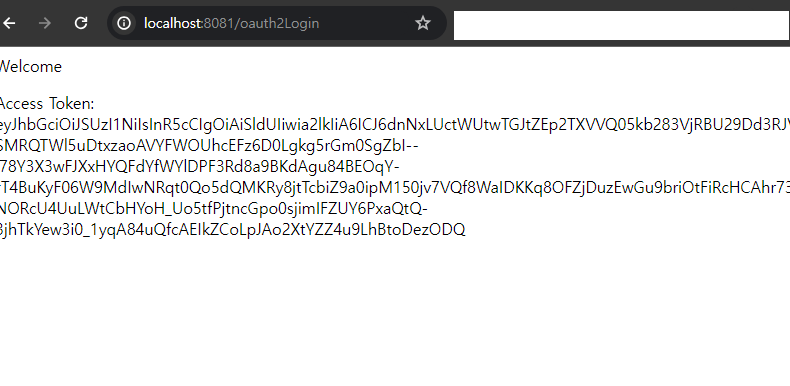
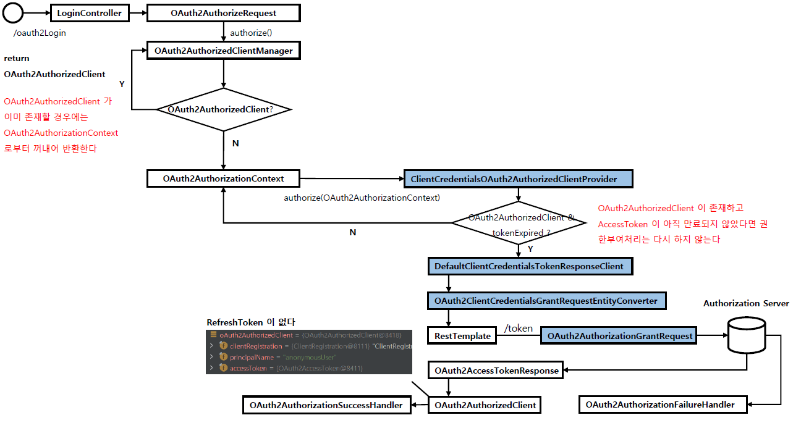

<nav>
    <a href="../.." target="_blank">[Spring Security OAuth2]</a>
</nav>


# 8.6 DefaultOAuth2AuthorizedClientManager - Client Credentials 권한 부여 구현하기

---

## 1. 요구사항
- 이번 글에서는 Client Credentials 방식으로 OAuth2 인증을 하는 것을 목표로 한다.
- 최종사용자의 인증이 필요없고 클라이언트의 인증만 수행한다.

---

## 2. application.yml
```yaml
spring.application.name: spring-security-oauth2

server:
  port: 8081

spring:
  security:
    oauth2:
      client:
        registration:
          keycloak:
            clientId: oauth2-client-app
            clientSecret: 1tIeERcVJnWNmVZIEFA7Ao5YkTIbx83w
            clientName: oauth2-client-app
            authorizationGrantType: client_credentials
            redirectUri: http://localhost:8081/client
            clientAuthenticationMethod: client_secret_basic
#            scope: openid,profile
        provider:
          keycloak:
            issuerUri: http://localhost:8080/realms/oauth2
            authorizationUri: http://localhost:8080/realms/oauth2/protocol/openid-connect/auth
            tokenUri: http://localhost:8080/realms/oauth2/protocol/openid-connect/token
            jwkSetUri: http://localhost:8080/realms/oauth2/protocol/openid-connect/certs
            userInfoUri: http://localhost:8080/realms/oauth2/protocol/openid-connect/userinfo
            userNameAttribute: preferred_username
```
- authorizationGrantType: client_credentials
- scope 는 필요 없다. 단순히 클라이언트의 access token 발급만이 목적이기 때문이다.

---

## 3. LoginProcessingController
```kotlin
package com.ttasjwi.oauth2.controller

import jakarta.servlet.http.HttpServletRequest
import jakarta.servlet.http.HttpServletResponse
import org.springframework.security.core.authority.mapping.SimpleAuthorityMapper
import org.springframework.security.core.context.SecurityContextHolder
import org.springframework.security.oauth2.client.OAuth2AuthorizeRequest
import org.springframework.security.oauth2.client.OAuth2AuthorizedClientManager
import org.springframework.stereotype.Controller
import org.springframework.ui.Model
import org.springframework.web.bind.annotation.GetMapping

@Controller
class LoginProcessingController(
    private val oauth2AuthorizedClientManager: OAuth2AuthorizedClientManager,
) {

    private val authorityMapper = SimpleAuthorityMapper()

    init {
        authorityMapper.setPrefix("SYSTEM_")
    }

    @GetMapping("/oauth2Login")
    fun oauth2Login(request: HttpServletRequest, response: HttpServletResponse, model: Model): String {
        // 익명사용자
        val authentication = SecurityContextHolder.getContextHolderStrategy().context.authentication

        // 자격 증명 발급
        val oauth2AuthorizeRequest = OAuth2AuthorizeRequest
            .withClientRegistrationId("keycloak")
            .principal(authentication)
            .attribute(HttpServletRequest::class.java.name, request)
            .attribute(HttpServletResponse::class.java.name, response)
            .build()

        val oauth2AuthorizedClient = oauth2AuthorizedClientManager.authorize(oauth2AuthorizeRequest)


        if (oauth2AuthorizedClient != null) {
            val accessToken = oauth2AuthorizedClient.accessToken
            model.addAttribute("authorizedClient", accessToken.tokenValue)
        }
        return "home"
    }
}
```
- oauth2AuthorizedClient 를 얻어오고 AccessToken 발급까지만 한다.
- 사용자 정보를 얻어오고 인증하는 부분은 다룰 필요가 없다.

---

## 4. 화면

### 4.1 index.html
```html
<!DOCTYPE html>
<html lang="ko" xmlns="http://www.w3.org/1999/xhtml"
      xmlns:th="http://www.thymeleaf.org"
      xmlns:sec="http://www.thymeleaf.org/extras/spring-security">
<head>
    <meta charset="UTF-8">
    <title>Index Page</title>
    <script src="/js/index.js"></script>
</head>
<body>
<div>Welcome</div>
<form sec:authorize="isAnonymous()" action="#">
    <p><input type="button" onclick="authorizationCode()" value="AuthorizationCode Grant"/></p>
    <p><div sec:authorize="isAnonymous()"><a th:href="@{/oauth2Login(username='user',password='1111')}">Password Flow Login</a></div>
    <div sec:authorize="isAnonymous()"><a th:href="@{/oauth2Login}">Client Credentials Flow Login</a></div>
</form>
</body>
</html>
```
- Client Credentials Flow Login 링크를 추가했다. 단순히 링크 클릭 시 `/oauth2Login` 요청을 한다.

### 4.2 `home.html`
```html
<!DOCTYPE html>
<html lang="ko" xmlns="http://www.w3.org/1999/xhtml"
      xmlns:th="http://www.thymeleaf.org"
      xmlns:sec="http://www.thymeleaf.org/extras/spring-security">

<head>
    <meta charset="UTF-8">
    <title>Insert title here</title>
</head>
<body>
<div>Welcome <p><span th:text="${oauth2AuthenticationToken}"/></p></div>
<div><p>Access Token:  <span th:text = "${authorizedClient}"/></p></div>
<div sec:authorize="isAuthenticated()"><a th:href="@{/logout}">Logout</a></div>
</body>
</html>
```
- oauth2AuthenticationToken 을 출력한다.

### 4.3 실행


- `/` 로 접속
- Client Credentials Flow Login 버튼 클릭
- 액세스 토큰이 잘 받아진다.

---

## 5. 흐름


- 이전 글에서 다룬 DefaultOAuth2AuthorizedClientManager 흐름과 같다.
- 단지, 실질적으로 OAuth2AuthorizedClient 를 받아오는 작업을 OAuth2AuthorizedClientProvider 가 수행하는 차이가 있다.

---
