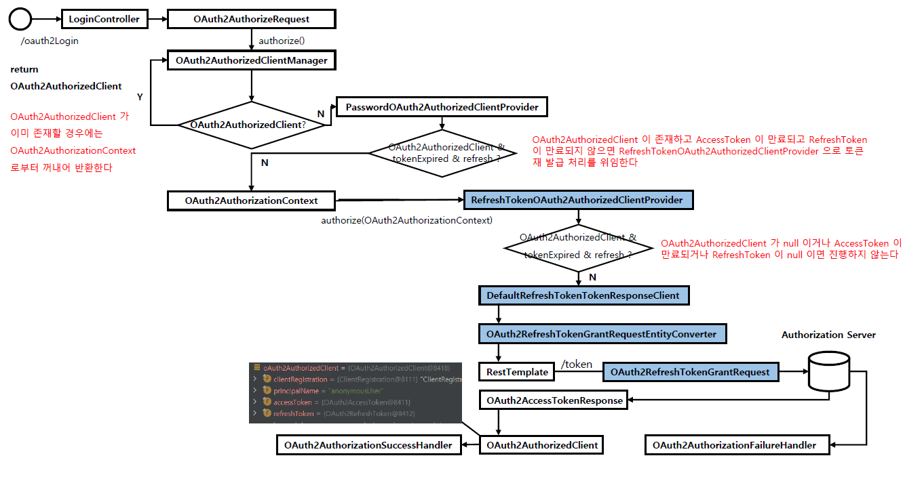

<nav>
    <a href="../.." target="_blank">[Spring Security OAuth2]</a>
</nav>

# 8.7 DefaultOAuth2AuthorizedClientManager - Refresh Token 권한 부여 구현하기

---

## 1. 요구사항
- 최종사용자의 OAuthAuthorizedClient가 저장되어 있으나 AccessToken이 만료된 상황인데,
RefreshToken을 사용해서 액세스토큰을 재발급받고 싶다.

---

## 2. 설정 수정
```yaml
spring:
  security:
    oauth2:
      client:
        registration:
          keycloak:
            clientId: oauth2-client-app
            clientSecret: 1tIeERcVJnWNmVZIEFA7Ao5YkTIbx83w
            clientName: oauth2-client-app
            authorizationGrantType: password
            redirectUri: http://localhost:8081/client
            clientAuthenticationMethod: client_secret_basic
            scope: openid,profile
```
- Resource Owner Password Credentials 방식으로 인증을 한다.

```kotlin
        val oauth2AuthorizedClientProvider =
            OAuth2AuthorizedClientProviderBuilder.builder()
                .authorizationCode()
                .clientCredentials()
                // 액세스토큰 실제 만료 시간으로부터 1시간을 차감한 값을 만료시간으로 간주
                .password{ it.clockSkew(Duration.ofSeconds(3600))}
                .refreshToken{ it.clockSkew(Duration.ofSeconds(3600))}
                .build()
```
- OAuth2AuthorizedClientProvider 설정
  - password, refreshToken 인증 방식 설정
    -  `it.clockSkew(Duration.ofSeconds(3600))`: 내부적으로 액세스 토큰이 만료됐는 지 확인하는 로직에서 사용
      - 이 값을 설정하면 실제 토큰의 만료시간보다 해당 시간만큼 차감한 시간을 만료시간으로 간주한다.
        ```java
            private boolean hasTokenExpired(OAuth2Token token) {
                return this.clock.instant().isAfter(token.getExpiresAt().minus(this.clockSkew));
            }
        ```

---

## 3. 실습

### 3.1 토큰 만료 여부 확인 메서드
```kotlin
@Controller
class LoginProcessingController(
    private val oauth2AuthorizedClientManager: OAuth2AuthorizedClientManager,
) {

    // 추가
    private val clock = Clock.systemUTC()
    private val clockSkew = Duration.ofSeconds(3600)


    private fun hasTokenExpired(token: OAuth2Token): Boolean {
        // 실제 만료시간보다 clockSkew 만큼 차감한 시간을 만료시간으로 간주
        return this.clock.instant().isAfter(token.expiresAt!!.minus(this.clockSkew))
    }
```
- Clock 을 통해 현재 시간을 Instant 로 받아오고, token의 만료시간에서 clockSkew 만큼의 시간을 차감했을 때
더 뒤의 시간이면 만료된 토큰으로 판단하도록 한다.

### 3.2 권한부여 타입을 변경하지 않고 액세스 토큰을 재발급하는 방식
```kotlin
        var oauth2AuthorizedClient = oauth2AuthorizedClientManager.authorize(oauth2AuthorizeRequest)


        // 권한부여 타입을 변경하지 않고 액세스 토큰을 재발급하는 방식
        if (oauth2AuthorizedClient != null && hasTokenExpired(oauth2AuthorizedClient.accessToken)
            && oauth2AuthorizedClient.refreshToken != null) {
            oauth2AuthorizedClient = oauth2AuthorizedClientManager.authorize(oauth2AuthorizeRequest)
        }
```
- Oauth2AuthorizedClientManager 를 통해 oauth2AuthorizedClient 를 받아온다.
- `hasTokenExpired(...)` 에 의해 만료된 토큰으로 간주된다.
- 다시 `oauth2AuthorizedClientManager` 를 통해 `Oauth2AuthorizedClient`를 받아온다.
  - 이때 PasswordOAuth2AuthorizedClientProvider는 내부적으로 액세스토큰 만료여부를 판단하는데 아까 설정한 clockSkew 때문에
  만료된 액세스토큰으로 간주하고 null 을 반환한다.
      ```java
              if (authorizedClient != null && hasTokenExpired(authorizedClient.getAccessToken())
                      && authorizedClient.getRefreshToken() != null) {
                  // If client is already authorized and access token is expired and a refresh
                  // token is available, than return and allow
                  // RefreshTokenOAuth2AuthorizedClientProvider to handle the refresh
                  return null;
              }
      ```
  - 이후 RefreshTokenOAuth2AuthorizedClientProvider 에서는 액세스토큰이 만료된 것을 확인하고 리프레시 토큰 인증을 시작하여
  AccessToken 등의 정보를 받아와 Oauth2AuthorizedClient 를 반환한다.
    ```java
    @Override
    @Nullable
    public OAuth2AuthorizedClient authorize(OAuth2AuthorizationContext context) {
        Assert.notNull(context, "context cannot be null");
        OAuth2AuthorizedClient authorizedClient = context.getAuthorizedClient();
        
        
        if (authorizedClient == null || authorizedClient.getRefreshToken() == null
                || !hasTokenExpired(authorizedClient.getAccessToken())) {
            return null;
        }
        
        // 만료된 AccessToken 이므로 여기서부터 로직이 실행된다.
        // 생략
    ```
    
### 3.3 권한부여 타입을 변경하지 않고 액세스 토큰을 재발급하는 방식
```kotlin
        // 권한 부여 타입을 런타임에 변경하고 토큰 재발급
        if (oauth2AuthorizedClient != null && hasTokenExpired(oauth2AuthorizedClient.accessToken)
            && oauth2AuthorizedClient.refreshToken != null) {

            val newClientRegistration = ClientRegistration
                .withClientRegistration(oauth2AuthorizedClient.clientRegistration)
                .authorizationGrantType(AuthorizationGrantType.REFRESH_TOKEN)
                .build()

            oauth2AuthorizedClient = OAuth2AuthorizedClient(
                newClientRegistration,
                oauth2AuthorizedClient.principalName,
                oauth2AuthorizedClient.accessToken,
                oauth2AuthorizedClient.refreshToken
            )

            oauth2AuthorizeRequest = OAuth2AuthorizeRequest.withAuthorizedClient(oauth2AuthorizedClient)
                .principal(authentication)
                .attribute(HttpServletRequest::class.java.name, request)
                .attribute(HttpServletResponse::class.java.name, response)
                .build()

            oauth2AuthorizedClient =oauth2AuthorizedClientManager.authorize(oauth2AuthorizeRequest)
        }
```
- application.yml 파일에서 `authorizationGrantType: password` 설정이 되어 있는데, 런타임에 AuthorizationGrantType 을
변경하여 리프레시 토큰 방식으로 인증을 수행한다.
- ClientRegistration 을 새로 구성하여, `AuthorizationGrantType.REFRESH_TOKEN` 방식을 사용하도록 한다.
- 기존 ClientRegistration 정보를 다르게 하여 OAuth2AuthorizedClient 를 재구성
- OAuth2AuthorizeRequest 을 구성하고 oauth2AuthorizedClientManager 에 다시 oauth2AuthorizedClient 요청
- PasswordOAuth2AuthorizedClientProvider 는 ClientRegistration 의 AuthorizationGrantType 을 확인하는데 AuthorizationGrantType.REFRESH_TOKEN 이므로
다음 OAuth2AuthorizedClientProvider 로 요청 흐름이 넘어가게 되고, 리프레시토큰 권한부여 흐름으로 이어진다.
    ```java
            if (!AuthorizationGrantType.PASSWORD.equals(clientRegistration.getAuthorizationGrantType())) {
                return null;
            }
    ```

---

## 4. 흐름


- 전반적인 흐름은 이전에서 다룬 내용과 거의 같다.

---
