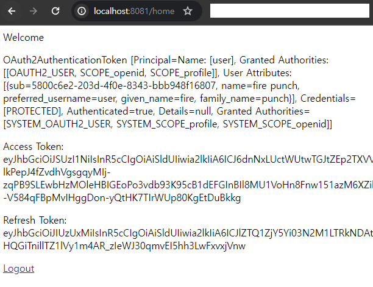
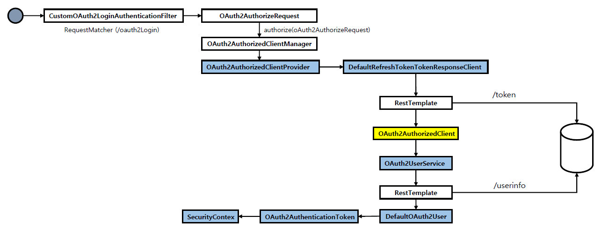

<nav>
    <a href="../.." target="_blank">[Spring Security OAuth2]</a>
</nav>

# 8.8 DefaultOAuth2AuthorizedClientManager -필터 기반으로 구현하기

---

## 1. 커스텀 필터
```kotlin
class CustomOAuth2LoginAuthenticationFilter(
    private val oauth2AuthorizedClientManager: DefaultOAuth2AuthorizedClientManager,
    authorizedClientRepository: OAuth2AuthorizedClientRepository
) : AbstractAuthenticationProcessingFilter(
    DEFAULT_FILTER_PROCESSES_URI,
) {

    private val authorityMapper = SimpleAuthorityMapper()
    private val oauth2AuthorizationSuccessHandler: OAuth2AuthorizationSuccessHandler
    private val oauth2UserService = DefaultOAuth2UserService()

    init {
        authorityMapper.setPrefix("SYSTEM_")
        oauth2AuthorizationSuccessHandler =
            OAuth2AuthorizationSuccessHandler { authorizedClient, authentication, attributes ->
                authorizedClientRepository.saveAuthorizedClient(
                    authorizedClient, authentication,
                    attributes[HttpServletRequest::class.java.name] as HttpServletRequest?,
                    attributes[HttpServletResponse::class.java.name] as HttpServletResponse?
                )
            }
        oauth2AuthorizedClientManager.setAuthorizationSuccessHandler(oauth2AuthorizationSuccessHandler)
    }

    companion object {
        const val DEFAULT_FILTER_PROCESSES_URI: String = "/oauth2Login/**"

        private fun createAttributes(servletRequest: HttpServletRequest, servletResponse: HttpServletResponse): Map<String, Any> {
            return mapOf(
                HttpServletRequest::class.java.name to servletRequest,
                HttpServletResponse::class.java.name to servletResponse
            )
        }
    }
```
- 생성자
  - DefaultOAuth2AuthorizedClientManager 와 OAuth2AuthorizedClientRepository 를 주입받는다
  - 매칭 URL 은 "/oauth2Login/**" 로 설정
  - oauth2AuthorizationSuccessHandler 를 매니저에 설정시킨다.
  - DefaultOAuth2AuthorizedClientManager 에서 OAuth2Client를 반환하기 전에 OAuth2AuthorizedClientRepository 에 저장하는 작업을 하는 oauth2AuthorizationSuccessHandler 를 설정
  

```kotlin
    override fun attemptAuthentication(request: HttpServletRequest, response: HttpServletResponse): Authentication? {
        val authentication = SecurityContextHolder.getContextHolderStrategy().context.authentication
            ?: AnonymousAuthenticationToken(
                "anonymous",
                "anonymousUser",
                AuthorityUtils.createAuthorityList("ROLE_ANONYMOUS")
            )

        val oauth2AuthorizeRequest = OAuth2AuthorizeRequest
            .withClientRegistrationId("keycloak")
            .principal(authentication)
            .attribute(HttpServletRequest::class.java.name, request)
            .attribute(HttpServletResponse::class.java.name, response)
            .build()


        val oauth2AuthorizedClient = oauth2AuthorizedClientManager.authorize(oauth2AuthorizeRequest)

        if (oauth2AuthorizedClient != null) {
            val clientRegistration = oauth2AuthorizedClient.clientRegistration
            val accessToken = oauth2AuthorizedClient.accessToken
            val refreshToken = oauth2AuthorizedClient.refreshToken

            val oauth2User = oauth2UserService.loadUser(OAuth2UserRequest(clientRegistration, accessToken))

            val authorities = authorityMapper.mapAuthorities(oauth2User.authorities)
            val oauth2AuthenticationToken =
                OAuth2AuthenticationToken(oauth2User, authorities, clientRegistration.registrationId)

            // 인증된 최종사용자 정보를를 다시 저장하기 위해 successHandler를 수동으로 다시 호출
            oauth2AuthorizationSuccessHandler.onAuthorizationSuccess(
                oauth2AuthorizedClient,
                oauth2AuthenticationToken,
                createAttributes(request, response)
            )
            return oauth2AuthenticationToken
        }
        return null
    }

}
```
- 컨트롤러에 구현했을 떄와 대부분의 로직은 비슷한데, 최초 Authentication 을 꺼내오는 부분이 문제다.
  - 컨트롤러에 구현했을 때는 SecurityContext 에서 Authentication 을 꺼낼 때 AnonymousAuthenticationToken 이 있었다.
  - 하지만 이 필터에 온 시점에서는 Authentication 이 null 이므로 AnonymousAuthenticationToken 을 수동으로 만들어줬다.
- 그 뒤의 로직은 대부분 비슷하다.
- 다만 마지막에, oauth2AuthorizationSuccessHandler 를 사용해서 인증된 OAuth2AuthenticationToken 를 저장하도록 한
부분만 다르다.

---

## 2. 설정 클래스

### 2.1 OAuth2AuthorizedClientManagerConfig
```kotlin
@Configuration
class OAuth2AuthorizedClientManagerConfig {

    @Bean
    fun oauth2AuthorizedClientManager(
        clientRegistrationRepository: ClientRegistrationRepository,
        oauth2AuthorizedClientRepository: OAuth2AuthorizedClientRepository,

        ): DefaultOAuth2AuthorizedClientManager {
        oauth2AuthorizedClientManager.setAuthorizedClientProvider(oauth2AuthorizedClientProvider)
        oauth2AuthorizedClientManager.setContextAttributesMapper(contextAttributesMapper())
        return oauth2AuthorizedClientManager
    }
}
```
- successHandler 설정을 CustomOAuth2LoginAuthenticationFilter 에서 하므로 이 코드에서 지웠다

### 2.2 SecurityConfig
```kotlin

@Configuration
class SecurityConfig(
    private val oauth2AuthorizedClientManager: DefaultOAuth2AuthorizedClientManager,
    private val oAuth2AuthorizedClientRepository: OAuth2AuthorizedClientRepository
) {

    @Bean
    fun securityFilterChain(http: HttpSecurity): SecurityFilterChain {
        http {
            authorizeHttpRequests {
                authorize(PathRequest.toStaticResources().atCommonLocations(), permitAll)
                authorize("/", permitAll)
                authorize("/client", permitAll)
                authorize("/favicon.ico", permitAll)
                authorize("/error", permitAll)
                authorize(anyRequest, authenticated)
            }
            addFilterBefore<UsernamePasswordAuthenticationFilter>(customOAuth2LoginAuthenticationFilter())
            oauth2Client {  }
            logout {
                disable()
            }
            requestCache {
                requestCache = NullRequestCache()
            }
            exceptionHandling {
                authenticationEntryPoint = LoginUrlAuthenticationEntryPoint("/")
            }
        }
        return http.build()
    }

    fun customOAuth2LoginAuthenticationFilter(): CustomOAuth2LoginAuthenticationFilter {
        val filter =  CustomOAuth2LoginAuthenticationFilter(oauth2AuthorizedClientManager, oAuth2AuthorizedClientRepository)
        filter.setAuthenticationSuccessHandler(SimpleUrlAuthenticationSuccessHandler("/home"))
        filter.setSecurityContextRepository(HttpSessionSecurityContextRepository())
        return filter
    }
}
```
- CustomOAuth2LoginAuthenticationFilter 를 구성하고 필터체인에 추가하였다.
- 필터의 AuthenticationSuccessHandler 설정을 `SimpleUrlAuthenticationSuccessHandler("/home")` 로 하였다.
  - 인증 성공시 "/home" 으로 이동한다.
- SecurityContextRepository 설정을 `HttpSessionSecurityContextRepository()` 으로 하였다.
  - 다시 요청이 들어왔을 때 세션에서 인증 정보를 꺼내서 쓸 수 있도록 한다.

---

## 3. HomePageController
```kotlin
@Controller
class HomePageController(
    private val oAuth2AuthorizedClientService: OAuth2AuthorizedClientService
) {

    @GetMapping("/home")
    fun home(model: Model, oauth2AuthenticationToken: OAuth2AuthenticationToken): String {
        val oauth2AuthorizedClient = oAuth2AuthorizedClientService.loadAuthorizedClient<OAuth2AuthorizedClient>(
            "keycloak", oauth2AuthenticationToken.name
        )
        model.addAttribute("oauth2AuthenticationToken", oauth2AuthenticationToken)
        model.addAttribute("accessToken", oauth2AuthorizedClient.accessToken.tokenValue)
        model.addAttribute("refreshToken", oauth2AuthorizedClient.refreshToken!!.tokenValue)
        return "home"
    }

}
```
- OAuth2AuthenticationToken 을 파라미터로 바인딩 받아서, 안의 값을 model 에 담아 페이지로 렌더링한다.


---

## 4. 실행


- 정상적으로 인증 결과가 잘 저장되는 것을 알 수 있다.

---

## 5. 흐름


- 대부분 흐름이 같다

---
