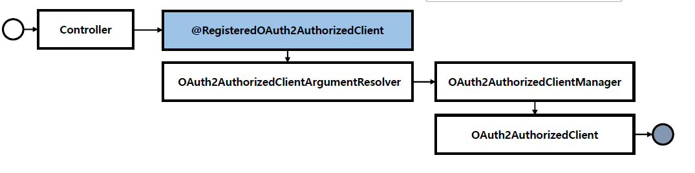
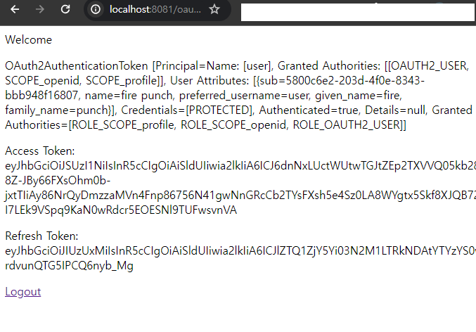
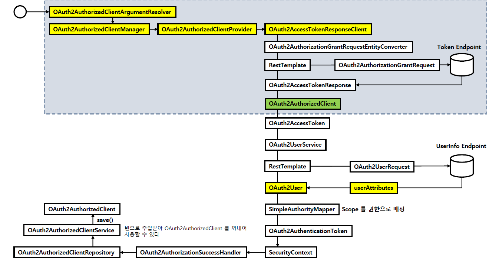

<nav>
    <a href="../.." target="_blank">[Spring Security OAuth2]</a>
</nav>

# 8.9 `@RegisteredOAuth2AuthorizedClient` 이해 및 활용

---

## 1. `@RegisteredOAuth2AuthorizedClient`
```java
@Target({ ElementType.PARAMETER, ElementType.ANNOTATION_TYPE })
@Retention(RetentionPolicy.RUNTIME)
@Documented
public @interface RegisteredOAuth2AuthorizedClient {
	@AliasFor("value")
	String registrationId() default "";

	@AliasFor("registrationId")
	String value() default "";
}
```
- 후술할 OAuth2AuthorizedClientArgumentResolver 를 위해 만들어진 어노테이션
- 인자로 `registrationId` 를 전달해서 ClientRegistration 을 특정하도록 해야한다.
  - registrationId 를 지정하지 않으면 argumentResolver 쪽에서 예외가 발생한다.



```java
    @GetMapping("/")
    public String index(@RegisteredOAuth2AuthorizedClient("keycloak") OAuth2AuthorizedClient authorizedClient) {
        OAuth2AccessToken accessToken = authorizedClient.getAccessToken();
        return "index";
    }
```
- 용례
  - 컨트롤러의 OAuth2AuthorizedClient 파라미터 앞에 `@RegisteredOAuth2AuthorizedClient(registrationId)` 를 달아준다.
  - 컨트롤러에서는 편리하게 OAuth2AuthorizedClient 를 얻어올 수 있다.

---

## 2. `OAuth2AuthorizedClientArgumentResolver`
```java
	@Override
	public boolean supportsParameter(MethodParameter parameter) {
		Class<?> parameterType = parameter.getParameterType();
		return (OAuth2AuthorizedClient.class.isAssignableFrom(parameterType) && (AnnotatedElementUtils
			.findMergedAnnotation(parameter.getParameter(), RegisteredOAuth2AuthorizedClient.class) != null));
	}
```
- 스프링부트 OAuth2 Client 자동 구성에 의해 OAuth2ClientConfiguration 에서 OAuth2AuthorizedClientArgumentResolver 가 만들어지고
argumentResolver 목록에 등록된다.
- 이 argumentResolver는 `@RegisteredOAuth2AuthorizedClient` 어노테이션이 달려있는 OAuth2AuthorizedClient 파라미터에 주입될
인자를 resolve 해준다.

```java
	private OAuth2AuthorizedClientManager authorizedClientManager;

	@NonNull
	@Override
	public Object resolveArgument(MethodParameter parameter, @Nullable ModelAndViewContainer mavContainer,
			NativeWebRequest webRequest, @Nullable WebDataBinderFactory binderFactory) {
		String clientRegistrationId = this.resolveClientRegistrationId(parameter);
		if (!StringUtils.hasLength(clientRegistrationId)) {
			throw new IllegalArgumentException("Unable to resolve the Client Registration Identifier. "
					+ "It must be provided via @RegisteredOAuth2AuthorizedClient(\"client1\") or "
					+ "@RegisteredOAuth2AuthorizedClient(registrationId = \"client1\").");
		}
		Authentication principal = this.securityContextHolderStrategy.getContext().getAuthentication();
		if (principal == null) {
			principal = ANONYMOUS_AUTHENTICATION;
		}
		HttpServletRequest servletRequest = webRequest.getNativeRequest(HttpServletRequest.class);
		HttpServletResponse servletResponse = webRequest.getNativeResponse(HttpServletResponse.class);
		OAuth2AuthorizeRequest authorizeRequest = OAuth2AuthorizeRequest
				.withClientRegistrationId(clientRegistrationId)
				.principal(principal)
				.attribute(HttpServletRequest.class.getName(), servletRequest)
				.attribute(HttpServletResponse.class.getName(), servletResponse)
				.build();
		return this.authorizedClientManager.authorize(authorizeRequest);
	}
```
- 이 arguemntResolver는 내부적으로 `OAuth2AuthorizedClientManager` 를 의존하고 있다.
- 따라서 실제 인가서버와의 통신을 통해 인가 절차를 거쳐서 OAuth2AuthorizedClient를 얻어올 수 있다.

---

## 3. 실습

### 3.1 컨트롤러
```kotlin
    @GetMapping("/oauth2Login")
    fun oauth2Login(
        model: Model,
        @RegisteredOAuth2AuthorizedClient("keycloak") oauth2AuthorizedClient: OAuth2AuthorizedClient?,
        servletRequest: HttpServletRequest,
        servletResponse: HttpServletResponse,
    ): String {

        if (oauth2AuthorizedClient != null) {
            val clientRegistration = oauth2AuthorizedClient.clientRegistration
            val accessToken = oauth2AuthorizedClient.accessToken
```
- `@RegisteredOAuth2AuthorizedClient("keycloak") oauth2AuthorizedClient: OAuth2AuthorizedClient?`
  - 편리하게 컨트롤러의 파라미터 바인딩 기능을 사용한다.


### 3.2 설정
```kotlin
@Configuration
class SecurityConfig {

    @Bean
    fun securityFilterChain(http: HttpSecurity): SecurityFilterChain {
        http {
            authorizeHttpRequests {
                authorize(PathRequest.toStaticResources().atCommonLocations(), permitAll)
                authorize("/", permitAll)
                authorize("/oauth2Login", permitAll)
                authorize("/favicon.ico", permitAll)
                authorize("/error", permitAll)
                authorize(anyRequest, authenticated)
            }
            logout { disable() }
            requestCache {
                requestCache = NullRequestCache()
            }
            exceptionHandling {
                authenticationEntryPoint = LoginUrlAuthenticationEntryPoint("/")
            }
        }
        return http.build()
    }
}
```
```kotlin
@Configuration
class OAuth2AuthorizedClientManagerConfig {

    @Bean
    fun oauth2AuthorizedClientManager(
        clientRegistrationRepository: ClientRegistrationRepository,
        oauth2AuthorizedClientRepository: OAuth2AuthorizedClientRepository,

        ): DefaultOAuth2AuthorizedClientManager {

        val oauth2AuthorizedClientManager =
            DefaultOAuth2AuthorizedClientManager(clientRegistrationRepository, oauth2AuthorizedClientRepository)

        val oauth2AuthorizedClientProvider =
            OAuth2AuthorizedClientProviderBuilder.builder()
                .authorizationCode()
                .clientCredentials()
                // 액세스토큰 실제 만료 시간으로부터 1시간을 차감한 값을 만료시간으로 간주
                .password{ it.clockSkew(Duration.ofSeconds(3600))}
                .refreshToken{ it.clockSkew(Duration.ofSeconds(3600))}
                .build()

        oauth2AuthorizedClientManager.setAuthorizedClientProvider(oauth2AuthorizedClientProvider)
        oauth2AuthorizedClientManager.setContextAttributesMapper(contextAttributesMapper())
        oauth2AuthorizedClientManager.setAuthorizationSuccessHandler(oauth2AuthorizationSuccessHandler(oauth2AuthorizedClientRepository))
        return oauth2AuthorizedClientManager
    }

    private fun contextAttributesMapper(): Function<OAuth2AuthorizeRequest, Map<String, Any>> {
        return Function<OAuth2AuthorizeRequest, Map<String, Any>> { oAuth2AuthorizeRequest: OAuth2AuthorizeRequest ->
            val contextAttributes = mutableMapOf<String, Any>()

            val request = oAuth2AuthorizeRequest.getAttribute(HttpServletRequest::class.java.name) as HttpServletRequest
            val username = request.getParameter(OAuth2ParameterNames.USERNAME)
            val password = request.getParameter(OAuth2ParameterNames.PASSWORD)

            if (StringUtils.hasText(username) && StringUtils.hasText(password)) {
                contextAttributes[OAuth2AuthorizationContext.USERNAME_ATTRIBUTE_NAME] = username
                contextAttributes[OAuth2AuthorizationContext.PASSWORD_ATTRIBUTE_NAME] = password
            }
            contextAttributes
        }
    }

    @Bean
    fun oauth2AuthorizationSuccessHandler(oauth2AuthorizedClientRepository: OAuth2AuthorizedClientRepository): OAuth2AuthorizationSuccessHandler {
        return OAuth2AuthorizationSuccessHandler { authorizedClient, authentication: Authentication, attributes ->
            oauth2AuthorizedClientRepository
                .saveAuthorizedClient(
                    authorizedClient, authentication,
                    attributes[HttpServletRequest::class.java.name] as HttpServletRequest,
                    attributes[HttpServletResponse::class.java.name] as HttpServletResponse
                )
        }
    }
}
```
- DefaultOAuth2AuthorizedClientManager 및 OAuth2AuthorizationSuccessHandler 를 빈으로 등록했다.

### 3.3 실행


- 잘 실행된다.

---

## 4. 흐름



---
