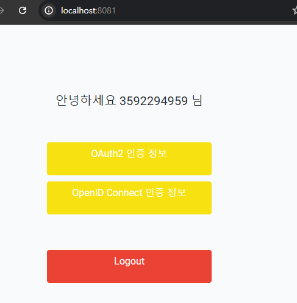

<nav>
    <a href="../.." target="_blank">[Spring Security OAuth2]</a>
</nav>

# 9.3 OAuth 2.0 Social Login 연동 구현 - 카카오 로그인 추가

---

## 1. 카카오 클라이언트 등록
- 주소: https://developers.kakao.com/
- 애플리케이션 등록
- 설정
  - clientId(앱키 -> REST API Key), clientSecret(제품 설정 > 보안 > ClientSecret)
- 동의항목
  - 닉네임: profile_nickname
  - 프로필 사진: profile_image
  - 카카오계정(이메일): account_email

---

## 2. 설정
```yaml
spring.application.name: spring-security-oauth2

server:
  port: 8081

spring:
  mvc:
    static-path-pattern: /static/**
  security:
    oauth2:
      client:
        registration:
          google:
            clientId: [클라이언트id]
            clientSecret: [클라이언트secret]
            redirectUri: http://localhost:8081/login/oauth2/code/google
            scope: openid,profile,email
          naver:
            clientId: [클라이언트id]
            clientSecret: [클라이언트secret]
            redirectUri: http://localhost:8081/login/oauth2/code/naver
            authorizationGrantType: authorization_code
            scope: profile,email
          kakao:
            clientId: [클라이언트id]
            clientSecret: [클라이언트secret]
            authorizationGrantType: authorization_code
            redirectUri: http://localhost:8081/login/oauth2/code/kakao
            scope: openid,profile_nickname,profile_image,account_email
        provider:
          naver:
            authorizationUri: https://nid.naver.com/oauth2.0/authorize
            tokenUri: https://nid.naver.com/oauth2.0/token
            userInfoUri: https://openapi.naver.com/v1/nid/me
            userNameAttribute: response
          kakao:
            issuerUri: https://kauth.kakao.com
```
- registration: scope 는 카카오 사양에 맞춰서 지정
- provider: kakao의 issuerUri 만 설정
  - kakao는 openid connect 표준을 따르는데 `issuerUri/.well-known/openid-configuration` 를 통해
  OpenID 구성 문서를 제공하는 공개적으로 액세스 가능한 엔드포인트에 접근할 수 있다.

---

## 3. ProviderUser

### 3.1 OAuth2ProviderUser
```kotlin
abstract class OAuth2ProviderUser(
    private val _attributes: Map<String, Any>,
    private val oAuth2User: OAuth2User,
    private val clientRegistration: ClientRegistration
) : ProviderUser {

    override val password: String
        get() = UUID.randomUUID().toString()

    override val authorities: Collection<out GrantedAuthority>
        get() = oAuth2User.authorities.map { SimpleGrantedAuthority(it.authority) }.toList()

    override val provider: String
        get() = clientRegistration.registrationId

    override val attributes: Map<String, Any> get() = _attributes
}
```
- email 을 꺼내는 key가 각 provider마다 달라서, 이 부분은 하위에서 구현하도록 변경했다.

### 3.2 GoogleOidcUser
```kotlin
class GoogleOidcUser(
    oauth2User: OAuth2User,
    clientRegistration: ClientRegistration
) : OAuth2ProviderUser(oauth2User.attributes, oauth2User, clientRegistration) {

    override val id: String
        get() = super.attributes["sub"] as String

    override val username: String
        get() = super.attributes["name"] as String


    override val email: String
        get() = super.attributes["email"] as String
}
```
- Google과 연동시에는 우리 서비스 기준 Oidc 방식으로 회원을 제공받는데 attributes에 담긴 key/value는
id_token의 헤더값이다.


### 3.3 Kakao
```kotlin
class KakaoOidcUser(
    oauth2User: OAuth2User,
    clientRegistration: ClientRegistration
): OAuth2ProviderUser(oauth2User.attributes, oauth2User, clientRegistration) {


    override val id: String
        get() = attributes["sub"] as String

    override val username: String
        get() = attributes["nickname"] as String

    override val email: String
        get() = attributes["email"] as String
}
```
```kotlin
class KakaoOAuth2User(
    oauth2User: OAuth2User,
    clientRegistration: ClientRegistration
) : OAuth2ProviderUser(oauth2User.attributes, oauth2User, clientRegistration) {

    override val id: String
        get() {
            return attributes["id"] as String
        }

    override val username: String
        get() {
            val kakaoAccount = attributes["kakao_account"] as Map<*, *>
            val profile = kakaoAccount["profile"] as Map<*, *>
            return profile["nickname"] as String
        }

    override val email: String
        get() {
            val kakaoAccount = attributes["kakao_account"] as Map<*, *>
            return kakaoAccount["email"] as String
        }
}
```
- Kakao 에서는 Oidc, OAuth2 방식으로 사용자 정보를 가져올 수 있다.
- 이 두 가지 사양에 맞춰서 OidcProviderUser, Oauth2ProviderUser 두 객체를 만들었다.

### 3.4 Naver
```kotlin
class NaverOAuth2User(
    oauth2User: OAuth2User,
    clientRegistration: ClientRegistration
) : OAuth2ProviderUser(
    oauth2User.attributes,
    oauth2User, clientRegistration)  {

    override val id: String
        get() = (attributes["response"] as Map<*, *>)["id"] as String

    override val username: String
        get() = (attributes["response"] as Map<*, *>)["email"] as String


    override val email: String
        get() = (attributes["response"] as Map<*, *>)["email"] as String
}
```
- Naver는 OAuth2 방식을 통해서만 사용자 정보를 획득할 수 있다.


---

## 4. ProviderConverter

### 4.1 ProviderUserConverter
```kotlin
interface ProviderUserConverter {

    fun convert(providerUserRequest: ProviderUserRequest): ProviderUser?
}
```
- ProviderUser를 획득하기 위한 인터페이스 사양이다.
- 강의에서는 제네릭을 사용했는데, 번잡하다는 느낌이 강해서 나는 그냥 제네릭을 안 썼다.

### 4.2 ProviderUserRequest
```kotlin
class ProviderUserRequest

private constructor(
    val clientRegistration: ClientRegistration? = null,
    val oAuth2User: OAuth2User? = null,
    val user: User?
) {

    companion object {

        fun fromSocialUser(clientRegistration: ClientRegistration, oAuth2User: OAuth2User): ProviderUserRequest {
            return ProviderUserRequest(clientRegistration, oAuth2User, null)
        }

        fun fromFormUser(user: User): ProviderUserRequest {
            return ProviderUserRequest(null, null, user)
        }
    }
}
```
- fromSocialUser: ClientRegistration, OAuth2User 을 통해 ProviderUserRequest 생성
- fromFormUser : 일반 사용자 user 객체로부터 ProviderUserRequest 생성

### 4.3 DelegatingProviderUserConverter
```kotlin
class DelegatingProviderUserConverter(
    private val converters: List<ProviderUserConverter>
) : ProviderUserConverter {

    override fun convert(providerUserRequest: ProviderUserRequest): ProviderUser? {
        for (converter in converters) {
            val providerUser = converter.convert(providerUserRequest)
            if (providerUser != null) {
                return providerUser
            }
        }
        return null
    }
}
```
- 컴포짓패턴을 적용한 ProviderUserConverter이다. 여기에 여러 개의 ProviderUserConverter 를 담아서
가장 먼저 null 이 아닌 ProviderUser 를 획득하면 이를 반환하도록 한다.

### 4.4 각각의 Converter
```kotlin
class OAuth2GoogleProviderUserConverter : ProviderUserConverter {

    override fun convert(providerUserRequest: ProviderUserRequest): ProviderUser? {
        if (providerUserRequest.clientRegistration!!.registrationId != SocialType.GOOGLE.socialName) {
            return null
        }
        return GoogleOidcUser(providerUserRequest.oAuth2User!!, providerUserRequest.clientRegistration)
    }
}
```
```kotlin
class OAuth2NaverProviderUserConverter : ProviderUserConverter {

    override fun convert(providerUserRequest: ProviderUserRequest): ProviderUser? {
        if (providerUserRequest.clientRegistration!!.registrationId != SocialType.NAVER.socialName) {
            return null
        }
        return NaverOAuth2User(providerUserRequest.oAuth2User!!, providerUserRequest.clientRegistration)
    }
}
```
```kotlin
class OAuth2KakaoProviderUserConverter: ProviderUserConverter {

    override fun convert(providerUserRequest: ProviderUserRequest): ProviderUser? {
        if (providerUserRequest.clientRegistration!!.registrationId != SocialType.KAKAO.socialName) {
            return null
        }
        if (providerUserRequest.oAuth2User is OidcUser) {
            return KakaoOidcUser(providerUserRequest.oAuth2User, providerUserRequest.clientRegistration)
        }
        return KakaoOAuth2User(providerUserRequest.oAuth2User!!, providerUserRequest.clientRegistration)
    }
}
```
- 카카오의 경우 Oidc 방식, OAuth2 방식 양쪽을 고려하여 분기처리 하여 반환하도록 했다.

### 4.5 AbstractOAuth2UserService
```kotlin
abstract class AbstractOAuth2UserService(
    private val userRepository: UserRepository,
    private val providerUserConverter: ProviderUserConverter
) {

    fun providerUser(providerUserRequest: ProviderUserRequest): ProviderUser? {
        return providerUserConverter.convert(providerUserRequest)
    }
```
- ProviderUser 반환처리에 대해서 이 안에서 분기처리해서 반환하도록 했는데 이에 대한 모든 처리를
ProviderUserConverter 에게 위임하여 처리하도록 했다.

### 4.6 ProviderConverterConfig
```kotlin
@Configuration
class ProviderUserConverterConfig {

    @Bean
    fun providerUserConverter(): ProviderUserConverter {
        return DelegatingProviderUserConverter(
            listOf(
                OAuth2GoogleProviderUserConverter(),
                OAuth2NaverProviderUserConverter(),
                OAuth2KakaoProviderUserConverter()
            )
        )
    }
}
```
- ProviderUserConverter 의 구현체를 지정하여 빈을 등록했다.
- DelegatingProviderUserConverter 에게 위임하여 처리한다.

### 4.7 IndexPageController
```kotlin

@Controller
class IndexPageController {

    @GetMapping("/")
    fun indexPage(model: Model, authentication: OAuth2AuthenticationToken?): String {
        if (authentication !== null) {
            model.addAttribute("user", resolveUsername(authentication))
        }
        return "index"
    }

    private fun resolveUsername(authentication: OAuth2AuthenticationToken): String {
        val oauth2User = authentication.principal
        val attributes = oauth2User.attributes

        val name = when (authentication.authorizedClientRegistrationId) {
            "naver" -> (attributes["response"] as Map<*, *>)["name"]
            "google" -> attributes["sub"]
            "kakao" -> attributes["sub"]
            else -> throw IllegalStateException()
        } as String
        return name
    }

}
```
- 일단 IndexPageController 의 경우 기존 형태를 유지하면서 작동하게 했다.
- 이후 구현에서, AuthenticationToken 저장의 사양을 Form 인증 사양도 호환하면서 우리 서비스의 사양에 맞게 커스텀할 예정이다.

---

## 5. 실행


- 소셜로그인 기능이 잘 구현하는 것을 확인할 수 있다.

---
