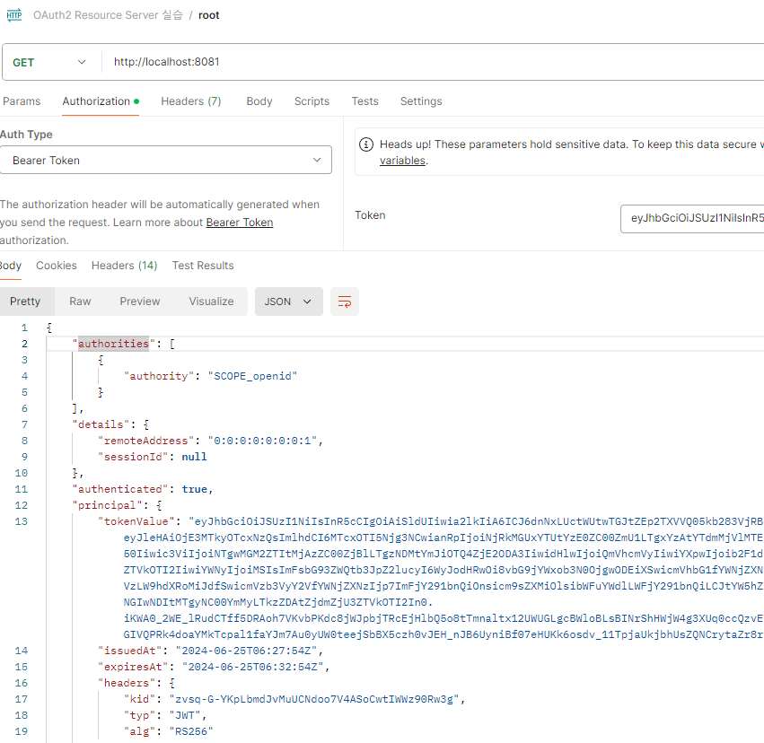

<nav>
    <a href="../.." target="_blank">[Spring Security OAuth2]</a>
</nav>

# 10.2 Resource Server 시작하기 - application.yml & OAuth2ResourceServerProperties

---

## 1. 환경설정 구성하기
- `application.yml` 환경설정 파일에 아무런 설정을 하지 않을 경우, Spring Security OAuth2 Resource Server의 자동 구성
설정이 작동하지 않는다. 
- `application.yml` 환경설정 파일에 `OAuth2 ResourceServer` 기본설정 시 기동결과가 달라진다. 기본으로 구성되는 시큐리티 필터체인에
차이가 발생한다.

---

## 2. OAuth2ResourceServerProperties
```java
@ConfigurationProperties(prefix = "spring.security.oauth2.resourceserver")
public class OAuth2ResourceServerProperties {
	private final Jwt jwt = new Jwt();
	private final Opaquetoken opaqueToken = new Opaquetoken();
```
- 우리가 설정파일을 통해 등록한 spring.security.oauth2.resourceserver 하위의 설정값은 `OAuth2ResourceServerProperties` 에 등록된다.
- 주요 설정
  - jwt
    - jwkSetUri 은 인가 서버에서 서명한 토큰의 위치를 나타낸다
    - issuerUri 는 인가서버의 위치를 나타낸다
    - publicKeyLocation 은 공개키를 가지고 있는 파일의 위치를 나타낸다
    - jwsAlgorithm 은 JWT 토큰을 서명하기 위한 알고리즘을 나타낸다
  - opaque
    - IntrospectionUri 는 토큰을 검증하기 위한 introspection 엔드 포인트를 나타낸다
- 주로 많은 서비스에서 인증을 jwt로 하는 만큼 이번 강의에서는 jwt를 다루고 opaque 방식은 뒷 챕터에서 다루도록 한다.

---

## 3. application.yml
```yaml
spring:
  security:
    oauth2:
      resourceserver:
        jwt:
          issuer-uri: http://localhost:8080/realms/oauth2
          jwk-set-uri: http://localhost:8080/realms/oauth2/protocol/openid-connect/certs
```
- JWT 유효성 검사를 위한 속성
  - issuer-uri: `http://localhost:8080` 는 인가 서버가 발급할 JWT 토큰의 iss 클레임에 추가되는 값으로서 발급자를 나타낸다.
  - jwk-set-uri: `http://localhost:8080/oauth2/jwks` 는 인가 서버가 발급한 JWT 토큰의 공개키 정보를 검색할 수 있는 엔드포인트를 나타낸다.
- 리소스 서버는 JWT 자체 검증 설정에 이 속성을 사용하며, 이 속성으로 인가 서버의 공개키를 찾고, 건내 받은 JWT의 유효성을 검사한다.

### JWT 관련 속성
```yaml
spring:
  security:
    oauth2:
      resourceserver:
        jwt:
          issuer-uri: http://localhost:8080/realms/oauth2 // 서비스 공급자 위치
          jwk-set-uri: http://localhost:8080/realms/oauth2/protocol/openid-connect/certs // OAuth 2.0 JwkSetUri 엔드 포인트
          jws-algorithms: RSA256 // OAuth 2.0 JWS 서명 알고리즘
          audiences: http://localhost:8081 // 수신자 위치
          public-key-location: classpath:certs/publicKey.txt // OAuth 2.0 JWS 검증을 위한 PublicKey 파일 위치
```
- 위 속성 중에 issuer-uri 혹은 jwk-set-uri 한 개는 반드시 필요하고 나머지 속성은 필요시 설정하면 된다

---

## 4. 인가 서버 메타데이터 엔드포인트
- issuer-uri 프로퍼티를 사용하려면 인가 서버는 반드시 다음 셋 중 하나를 지원해야 한다.
  1) `https://localhost:8080/issuer/.well-known/openid-configuration`,
  2) `https:// localhost:8080/.well-known/openid-configuration/issuer`,
  3) `https://localhost:8080/.well-known/oauth-authorization-server/issuer`
- 이 엔드포인트를 Provider 설정 엔드포인트 또는 인가 서버 메타데이터 엔드포인트라고 한다.

---

## 5. 실습

### 5.1 application.yml
```yaml
spring.application.name: spring-security-oauth2

server:
  port: 8081

spring:
  security:
    oauth2:
      resourceserver:
        jwt:
          issuer-uri: http://localhost:8080/realms/oauth2
          jwk-set-uri: http://localhost:8080/realms/oauth2/protocol/openid-connect/certs
```
- 위의 application.yml 설정을 활성화한다.

### 5.2 컨트롤러
```kotlin
@RestController
class ApiController {

    @GetMapping("/")
    fun authentication(authentication: Authentication): Authentication {
        return authentication
    }
}
```
- 루트(`/`)로 접근하면 사용자 인증객체 Authentication 을 반환한다.

### 5.3 액세스 토큰 발급
- POSTMAN 을 이용해, Resource Onwer Password Grant 방식으로 AccessToken 을 발급받는다.

### 5.4 루트 요청
- 헤더로 `Authorization: Bearer [액세스토큰]` 를 담아 루트에 요청

### 5.5 실행


- 리소스 서버 측에 액세스 토큰을 담아 요청하면 인증에 성공하고 루트 엔드포인트에 접근할 수 있다.
- 스프링 시큐리티 자동구성에 의해 생성된 필터 내에서 우리가 보낸 JWT 를 받아 인증 처리를 하고, 인가를 한뒤
리소스 엔드포인트에 접근할 수 있게 한 것이다.

---
