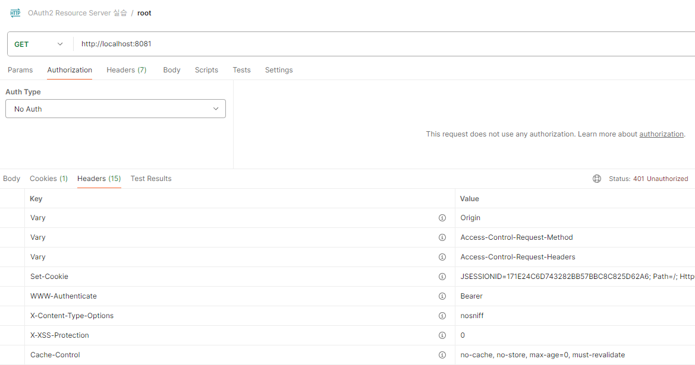
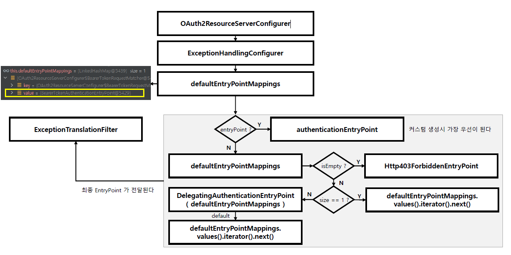

<nav>
    <a href="../.." target="_blank">[Spring Security OAuth2]</a>
</nav>

# 10.3 OAuth 2.0 Resource Server - AuthenticationEntryPoint


---

## 1. 인가 실패

### 1.1 요청


- 루트로 그냥 바로 접근을 시도하면 인증 예외(401 예외)가 발생한다.
- 헤더값으로 `WWW-Authenticate: Bearer` 응답이 온다.
- RFC 6750에 정의된 사양에 의하면, 사용자는 해당 서비스의 리소스에 접근하기 위해 `Authorization: Bearer <token>` 헤더 형태로
토큰을 전달해야한다.

### 1.2 AuthenticationEntryPoint


- 스프링 시큐리티 최종 인가를 담당하는 AuthorizationFilter에서 예외가 발생하면 ExceptionTranslationFilter 의 AuthenticationEntryPoint 에서
예외 후속처리를 처리한다.
- 이 자리에 BearerTokenAuthenticationEntryPoint가 위치해있다.
- 이곳에서 401 예외 응답으로 `WWW-Authenticate: Bearer` 헤더를 담아 보내줬다.
- 그런데 BearerTokenAuthenticationEntryPoint 를 설정하는 코드를 우리는 작성하지 않았는데 어디서 이런 작업이 일어난 것일까?

---

## 2. ExceptionHandlingConfigurer 파헤쳐보기
스프링 시큐리티의 기본 필터체인 구성이 일어날 때 ExceptionHandlingConfigurer 가 작동한다.

### 2.1 ExceptionHandlingConfigurer
```java
public final class ExceptionHandlingConfigurer<H extends HttpSecurityBuilder<H>> extends AbstractHttpConfigurer<ExceptionHandlingConfigurer<H>, H> {
    private AuthenticationEntryPoint authenticationEntryPoint;
    private AccessDeniedHandler accessDeniedHandler;
    private LinkedHashMap<RequestMatcher, AuthenticationEntryPoint> defaultEntryPointMappings = new LinkedHashMap();
    private LinkedHashMap<RequestMatcher, AccessDeniedHandler> defaultDeniedHandlerMappings = new LinkedHashMap();
```
- 스프링 시큐리티의 기본 필터체인 구성이 일어날 때 ExceptionHandlingConfigurer 가 작동한다.
- 여기에는 다음 필드들이 존재한다.
  - authenticationEntryPoint, accessDeniedHandler : 커스텀 설정
  - defaultEntryPointMappings, defaultDeniedHandlerMappings : 기본 설정

### 2.2 configure
```java
    public void configure(H http) {
        AuthenticationEntryPoint entryPoint = this.getAuthenticationEntryPoint(http);
        ExceptionTranslationFilter exceptionTranslationFilter = new ExceptionTranslationFilter(entryPoint, this.getRequestCache(http));
        AccessDeniedHandler deniedHandler = this.getAccessDeniedHandler(http);
        exceptionTranslationFilter.setAccessDeniedHandler(deniedHandler);
        exceptionTranslationFilter.setSecurityContextHolderStrategy(this.getSecurityContextHolderStrategy());
        exceptionTranslationFilter = (ExceptionTranslationFilter)this.postProcess(exceptionTranslationFilter);
        http.addFilter(exceptionTranslationFilter);
    }
```
- `HttpSecurity.build()` 가 호출되면 내부적으로 설정된 SecurityConfigurer 들의 init, configure 가 순서대로 호출된다.
- 이 과정에서 ExceptionHandlingConfigurer 의 configure 가 호출된다.
- ExceptionTranslationFilter 설정이 이루어진다.
- 여기서 `getAuthenticationEntryPoint` 이 부분이 AuthenticationEntryPoint 를 결정하는 부분이다.

### 2.3 getAuthenticationEntryPoint
```java
AuthenticationEntryPoint getAuthenticationEntryPoint(H http) {
    AuthenticationEntryPoint entryPoint = this.authenticationEntryPoint;
    if (entryPoint == null) {
        entryPoint = this.createDefaultEntryPoint(http);
    }

    return entryPoint;
}
```
- 개발자가 커스텀한 authenticationEntryPoint 를 명시적으로 설정했다면 이를 최우선적으로 사용하고 그렇지 않을 경우
createDefaultEntryPoint 를 통해 기본 AuthenticationEntryPoint 를 지정하여 설정하는 것을 알 수 있다.

### 2.4 createDefaultEntryPoint
```kotlin
    private AuthenticationEntryPoint createDefaultEntryPoint(H http) {
        if (this.defaultEntryPointMappings.isEmpty()) {
            return new Http403ForbiddenEntryPoint();
        } else if (this.defaultEntryPointMappings.size() == 1) {
            return (AuthenticationEntryPoint)this.defaultEntryPointMappings.values().iterator().next();
        } else {
            DelegatingAuthenticationEntryPoint entryPoint = new DelegatingAuthenticationEntryPoint(this.defaultEntryPointMappings);
            entryPoint.setDefaultEntryPoint((AuthenticationEntryPoint)this.defaultEntryPointMappings.values().iterator().next());
            return entryPoint;
        }
    }
```
- defaultEntryPointMappings 필드를 확인하여 예외 처리를 담당할 기본 AuthenticationEntryPoint 를 생성한다.
  - 아무 것도 없을 경우 : Http403ForbiddenEntryPoint
  - 1개가 설정됨 : 해당 AuthenticationEntryPoint 를 사용
  - 2개가 설정됨: DelegatingAuthenticationEntryPoint 를 생성하여 리스트의 원소로 추가
    - 내부 AuthenticationEntryPoint 목록 중에 가장 먼저 적합한 AuthenticationEntryPoint 가 먼저 처리
    - 아무 것도 처리하지 못 했을 경우 기본값으로 지정한 AuthenticationEntryPoint 가 처리(0번 원소)
- 우리 로직에서는 AuthenticationEntryPoint 구현체로 BearerTokenAuthenticationEntryPoint 가 작동했다.
**어디선가 우리고 모르는 새에 defaultEntryPointMappings 에 이것을 넣어줬다는 말이 된다.** 어디서 이 작업이 일어났을까?

---

## 3. OAuth2ResourceServerConfigurer 에서!

### 3.1 OAuth2ResourceServerConfigurer
```java
public final class OAuth2ResourceServerConfigurer<H extends HttpSecurityBuilder<H>> extends AbstractHttpConfigurer<OAuth2ResourceServerConfigurer<H>, H> {
    // ... 생략
    private AuthenticationEntryPoint authenticationEntryPoint = new BearerTokenAuthenticationEntryPoint();
```
- OAuth2ResourceServerConfigurer 에는 기본적으로 `BearerTokenAuthenticationEntryPoint` 객체를 authenticationEntryPoint 필드로
가지고 있다.

### 3.2 init
```java
    public void init(H http) {
    this.validateConfiguration();
    this.registerDefaultAccessDeniedHandler(http);
    this.registerDefaultEntryPoint(http);
    this.registerDefaultCsrfOverride(http);
    AuthenticationProvider authenticationProvider = this.getAuthenticationProvider();
    if (authenticationProvider != null) {
        http.authenticationProvider(authenticationProvider);
    }
}
```
- `init()` 메서드에서 registerDefaultEntryPoint 를 보자

### 3.3 registerDefaultEntryPoint
```java
    private void registerDefaultEntryPoint(H http) {
        ExceptionHandlingConfigurer<H> exceptionHandling = (ExceptionHandlingConfigurer)http.getConfigurer(ExceptionHandlingConfigurer.class);
        if (exceptionHandling != null) {
            ContentNegotiationStrategy contentNegotiationStrategy = (ContentNegotiationStrategy)http.getSharedObject(ContentNegotiationStrategy.class);
            if (contentNegotiationStrategy == null) {
                contentNegotiationStrategy = new HeaderContentNegotiationStrategy();
            }

            MediaTypeRequestMatcher restMatcher = new MediaTypeRequestMatcher((ContentNegotiationStrategy)contentNegotiationStrategy, new MediaType[]{MediaType.APPLICATION_ATOM_XML, MediaType.APPLICATION_FORM_URLENCODED, MediaType.APPLICATION_JSON, MediaType.APPLICATION_OCTET_STREAM, MediaType.APPLICATION_XML, MediaType.MULTIPART_FORM_DATA, MediaType.TEXT_XML});
            restMatcher.setIgnoredMediaTypes(Collections.singleton(MediaType.ALL));
            MediaTypeRequestMatcher allMatcher = new MediaTypeRequestMatcher((ContentNegotiationStrategy)contentNegotiationStrategy, new MediaType[]{MediaType.ALL});
            allMatcher.setUseEquals(true);
            RequestMatcher notHtmlMatcher = new NegatedRequestMatcher(new MediaTypeRequestMatcher((ContentNegotiationStrategy)contentNegotiationStrategy, new MediaType[]{MediaType.TEXT_HTML}));
            RequestMatcher restNotHtmlMatcher = new AndRequestMatcher(Arrays.asList(notHtmlMatcher, restMatcher));
            RequestMatcher preferredMatcher = new OrRequestMatcher(Arrays.asList(this.requestMatcher, X_REQUESTED_WITH, restNotHtmlMatcher, allMatcher));
            exceptionHandling.defaultAuthenticationEntryPointFor(this.authenticationEntryPoint, preferredMatcher);
        }
    }
```
- 여기서 ExceptionHandlingConfigurer 가 가져와지고, `defaultAuthenticationEntryPointFor` 가 호출되면서
authenticationEntryPoint 가 전달되는 것을 알 수 있다.
- ExceptionHandlingConfigurer 내부적으로 defaultEntryPointMappings 에 추가된다.
- 따라서 이후 필터체인 구성 과정에서 기본 AuthenticationEntryPoint로 BearerTokenAuthenticationEntryPoint 가 지정된다.

---

## 4. 흐름



---
