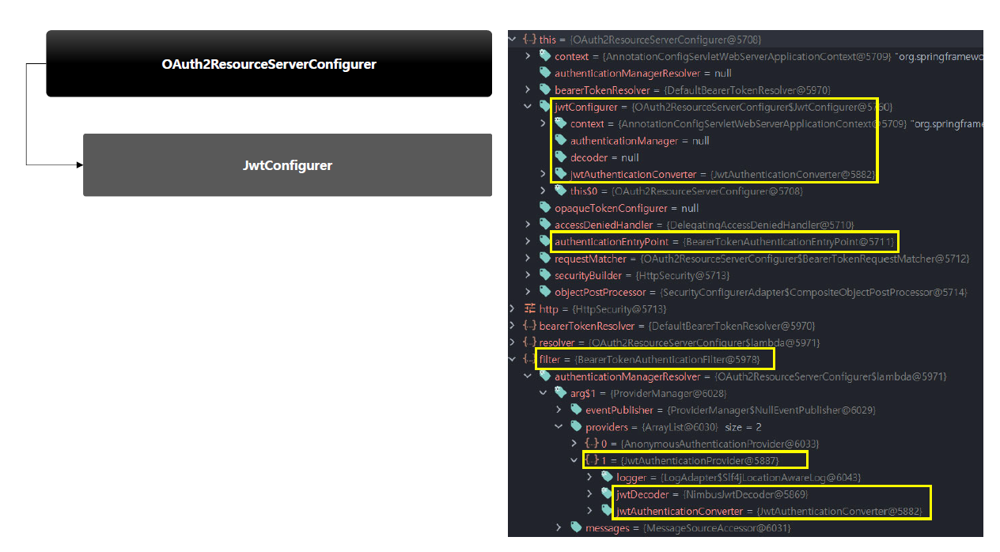
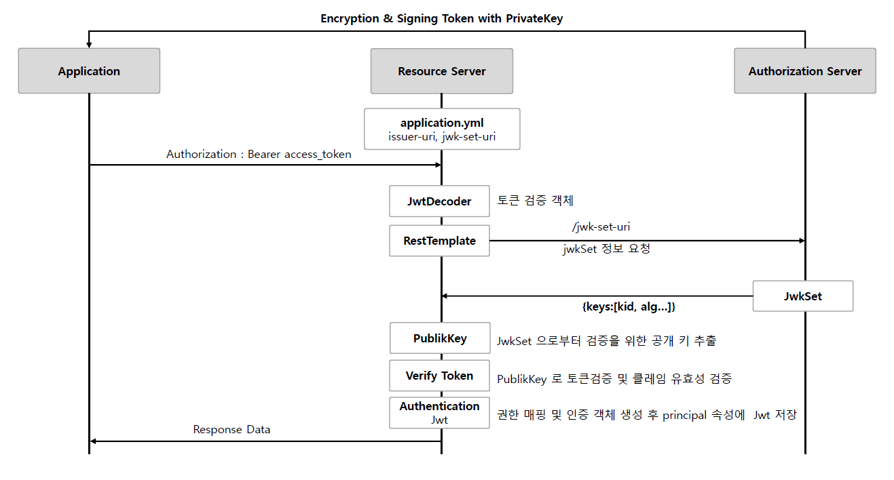

<nav>
    <a href="../.." target="_blank">[Spring Security OAuth2]</a>
</nav>

# 11.1 JWT API 설정 및 검증 프로세스 이해

---

## 1. 설정클래스
```java
@Configuration
class OAuth2ResourceServerConfig {

    @Bean
    fun jwtSecurityFilterChain(http: HttpSecurity): SecurityFilterChain {
        http
            .authorizeHttpRequests {
                it.anyRequest().authenticated()
            }
            .oauth2ResourceServer {
                it.jwt(Customizer.withDefaults())
            }
        return http.build()
    }
}
```
```kotlin
// Kotlin DSL 방식
import org.springframework.security.config.annotation.web.invoke

@Configuration
class OAuth2ResourceServerConfig {

    @Bean
    fun jwtSecurityFilterChain(http: HttpSecurity): SecurityFilterChain {
        http {
            // 모든 엔드포인트에 인증을 필요로 함
            authorizeHttpRequests {
                authorize(anyRequest, authenticated)
            }
            // Jwt 를 통해 인증함
            oauth2ResourceServer {
                jwt {}
            }
        }
        return http.build()
    }
}
```
- `http.oauth2ResourceServer { it.jwt(Customizer.withDefaults())}`
  - OAuth2ResourceServer의 Bearer 토큰 인증 기능을 활성화
  - JwtCustomizer 설정을 했는데 이를 통해 내부 설정에 jwtConfigurer 을 설정하게 된다.
- 즉 위의 메서드 호출을 통해
  - OAuth2ResourceServerConfigurer
  - OAuth2ResourceServerConfigurer.JwtConfigurer
- 설정이 구성됨

---

## 2. OAuth2ResourceServerConfigurer



### 2.1 OAuth2ResourceServerConfigurer.init
```java
    public void init(H http) {
        this.validateConfiguration();
        this.registerDefaultAccessDeniedHandler(http);
        this.registerDefaultEntryPoint(http);
        this.registerDefaultCsrfOverride(http);
        AuthenticationProvider authenticationProvider = this.getAuthenticationProvider();
        if (authenticationProvider != null) {
            http.authenticationProvider(authenticationProvider);
        }

    }
```
- 디폴트 AccessDeniedHandler 설정
- 디폴트 AuthenticationEntryPoint 설정
- DefaultCsrfOverride : Bearer 헤더값이 있을 때 Csrf 적용 안 함
- AuthenticationProvider 설정 : Jwt 설정이 있을 경우 jwtConfigurer 설정의 getAuthenticationProvider() 를 통해
  AuthenticationProvider 를 얻어온다. 이 때 Opaque Token 설정은 후순위로 설정이 적용되며 Jwt 설정이 있으면 적용되지 않는다.
    - authenticationManager 설정이 있으면 null, 없으면 JwtAuthenticationProvider 을 생성해 반환

### 2.2 OAuth2ResourceServerConfigurer.configurer
```java
    public void configure(H http) {
        BearerTokenResolver bearerTokenResolver = this.getBearerTokenResolver();
        this.requestMatcher.setBearerTokenResolver(bearerTokenResolver);
        AuthenticationManagerResolver resolver = this.authenticationManagerResolver;
        if (resolver == null) {
            AuthenticationManager authenticationManager = this.getAuthenticationManager(http);
            resolver = (request) -> {
                return authenticationManager;
            };
        }

        BearerTokenAuthenticationFilter filter = new BearerTokenAuthenticationFilter(resolver);
        filter.setBearerTokenResolver(bearerTokenResolver);
        filter.setAuthenticationEntryPoint(this.authenticationEntryPoint);
        filter.setSecurityContextHolderStrategy(this.getSecurityContextHolderStrategy());
        filter = (BearerTokenAuthenticationFilter)this.postProcess(filter);
        http.addFilter(filter);
    }
```
- 이 곳에서 BearerTokenAuthenticationFilter 설정이 이루어진다.
  - BearerTokenResolver : Authorization Header가 Bearer 사양에 부합하는지 확인하고 Token 값을 추출하는 역할

---

## 3. 실제 인증 작동

### 3.1 BearerTokenAuthenticationFilter
```java
public class BearerTokenAuthenticationFilter extends OncePerRequestFilter {

	@Override
	protected void doFilterInternal(HttpServletRequest request, HttpServletResponse response, FilterChain filterChain)
			throws ServletException, IOException {
		String token;
		try {
			token = this.bearerTokenResolver.resolve(request);
		}
		catch (OAuth2AuthenticationException invalid) {
			this.logger.trace("Sending to authentication entry point since failed to resolve bearer token", invalid);
			this.authenticationEntryPoint.commence(request, response, invalid);
			return;
		}
		if (token == null) {
			this.logger.trace("Did not process request since did not find bearer token");
			filterChain.doFilter(request, response);
			return;
		}

		BearerTokenAuthenticationToken authenticationRequest = new BearerTokenAuthenticationToken(token);
		authenticationRequest.setDetails(this.authenticationDetailsSource.buildDetails(request));

		try {
			AuthenticationManager authenticationManager = this.authenticationManagerResolver.resolve(request);
			Authentication authenticationResult = authenticationManager.authenticate(authenticationRequest);
            
            // 인증 성공 후속처리 (생략)
	}
```
- BearerTokenResolver 가 작동하여 헤더에서 Bearer 토큰값을 추출한다.
- authenticationManager 을 가져오고 인증 처리를 위임한다.
- 그 후 성공처리 (생략)

### 3.2 JwtAuthenticationProvider
```java
	@Override
	public Authentication authenticate(Authentication authentication) throws AuthenticationException {
		BearerTokenAuthenticationToken bearer = (BearerTokenAuthenticationToken) authentication;
		Jwt jwt = getJwt(bearer);
		AbstractAuthenticationToken token = this.jwtAuthenticationConverter.convert(jwt);
		if (token.getDetails() == null) {
			token.setDetails(bearer.getDetails());
		}
		this.logger.debug("Authenticated token");
		return token;
	}
```
- ProviderManager를 통해 인증 처리가 위임되고, 쭉 따라가보면 실질적 인증처리는 JwtAuthenticationProvider 에서 일어난다.
- getJwt 를 통해 인증 처리 후 Jwt 객체를 구성하고, AbstractAuthentication 으로 변환하여 반환한다.

### 3.3 JwtAuthenticationProvider.getJwt
```java
	private Jwt getJwt(BearerTokenAuthenticationToken bearer) {
		try {
			return this.jwtDecoder.decode(bearer.getToken());
		}
		catch (BadJwtException failed) {
			this.logger.debug("Failed to authenticate since the JWT was invalid");
			throw new InvalidBearerTokenException(failed.getMessage(), failed);
		}
		catch (JwtException failed) {
			throw new AuthenticationServiceException(failed.getMessage(), failed);
		}
	}
```
- JwtDecoder 를 통해 Jwt 디코딩 처리를 위임한다.
- 구현체는 NimbusJwtDecoder 이다

### 3.4 NimbusJwtDecoder
```java
	@Override
	public Jwt decode(String token) throws JwtException {
		JWT jwt = parse(token);
		if (jwt instanceof PlainJWT) {
			this.logger.trace("Failed to decode unsigned token");
			throw new BadJwtException("Unsupported algorithm of " + jwt.getHeader().getAlgorithm());
		}
		Jwt createdJwt = createJwt(token, jwt);
		return validateJwt(createdJwt);
	}
```
JWT 를 다음 3단계를 거쳐서 구성 후 반환한다.
- parse
  - 이 과정에서 JWT 헤더의 알고리즘에 따라 다른 인스턴스로 JWT를 생성한다.
    - PlainJWT, SignedJWT, EncryptedJWT
    - 이는 Nimbus 사양의 JWT 로 스프링 시큐리티 사양의 JWT가 아니다.
  - 여기까지가 단순히 파싱된 JWT이다. (parsedJWT)
- createJWT
  - 여기서 내부적으로 JWK 목록을 가져오는 작업이 일어난다. (예를 들어 jwk-set-uri 설정을 했다면 RestTemplate 를 통해 실제 통신이 일어난다.)
  - JWK 정보를 취합하여 스프링 시큐리티 사양의 Jwt 객체로 변환된다.
- validateJwt : 위에서 생성된 JWT 를 자체 검증하는 작업이 일어난다.

---

## 4. application.yml 설정에 대한 설명
```yaml
spring:
  security:
    oauth2:
      resourceserver:
        jwt:
          issuer-uri: http://localhost:8080/realms/oauth2
```
- 이 프로퍼티를 설정하면 JWT로 인코딩한 Bearer 토큰을 검증하는 리소스 서버 자동구성이 작동한다.
- JWTDecoder는 Open ID Connect Provider 설정 엔드포인트 또는 인가 서버 메타데이터 엔드포인트를 검색해서 jwk-set-url 엔드포인트를 찾아 JWKSet 을 가져오고,
이를 가져와서 검증에 사용한다.


---

## 5. 토큰의 유효성 검증
리소스 서버는 두 가지 기준으로 클라이언트로부터 받은 토큰을 검증한다.
- jwt가 유효한 지 인가서버의 jwk-set-uri 엔드포인트로부터 공개키를 가져와서, 검증한다.
- issuerUri 가 제공하는 각 JWT Claim 중 일부 Claim이 정해진 기준에 부합하는 지 검증한다.

---

## 6. 검증 흐름


- 인증
  - 클라이언트가 Authorization Bearer token-value 를 헤더에 담아서 요청한다
  - 리소스 서버는 요청한 토큰이 Bearer 토큰 사양에 부합하는지 검사한다
  - 인가서버에서 JWT 토큰에 서명한 개인키와 매칭하는 공개키를 jwk-set-url 엔드포인트 요청으로 가져와서 첫번째 검증을 진행한다.
  - JWT에 있는 exp, nbf, iss 클레임의 정보가 기준에 부합하는지 두번째 검증을 진행한다
- 성공 후속 로직
  - 검증에 성공하면 Jwt 객체를 생성하고 claims 정보에 있는 scope 를 추출해서 시큐리티의 권한에 매핑한다 (SCOPE_profile, SCOPE_email)
  - Authentication 객체를 생성하고 Jwt 객체를 principal 속성에는 저장한다
  - Authentication 를 SecurityContext 에 저장하고 인증을 완료한다

---
