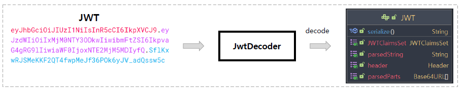
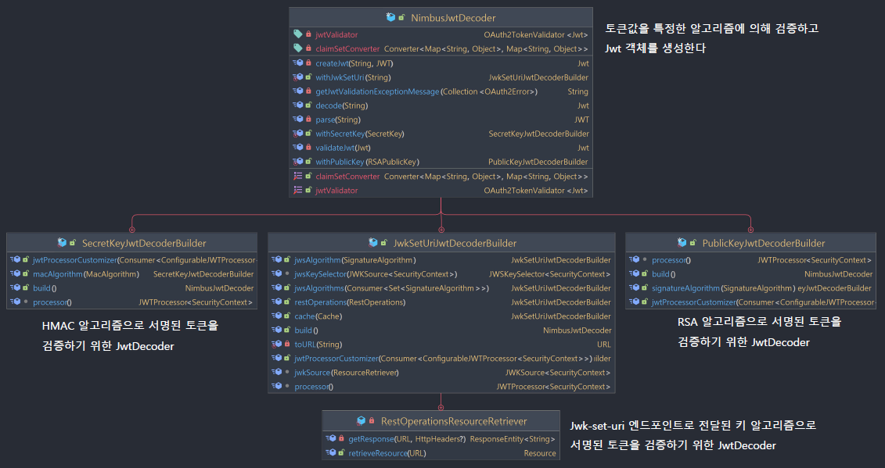
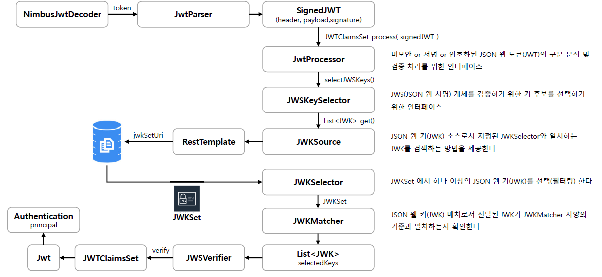

<nav>
    <a href="../.." target="_blank">[Spring Security OAuth2]</a>
</nav>

# 11.2 JwtDecoder 소개 및 세부 흐름

---

## 1. JwtDecoder, NimbusJwtDecoder

### 1.1 JwtDecoder


```java
public interface JwtDecoder {
	Jwt decode(String token) throws JwtException;
}
```
- token 문자열이 전달되면 이를 파싱, 분석하여 Jwt(org.springframework.security.oauth2.jwt.Jwt) 로 변환할 책임을 가짐


- JWT 가 JSON 웹 서명(JWS) 구조로 생성된 경우 JWS 서명에 대한 검증의 책임이 있다.
- 즉 토큰에 대한 유효성 검증 작업도 여기서 해야한다.

### 1.2 NimbusJwtDecoder


```java
public final class NimbusJwtDecoder implements JwtDecoder {

    private final Log logger = LogFactory.getLog(getClass());

    private static final String DECODING_ERROR_MESSAGE_TEMPLATE = "An error occurred while attempting to decode the Jwt: %s";

    private final JWTProcessor<SecurityContext> jwtProcessor;

    private Converter<Map<String, Object>, Map<String, Object>> claimSetConverter = MappedJwtClaimSetConverter
            .withDefaults(Collections.emptyMap());

    private OAuth2TokenValidator<Jwt> jwtValidator = JwtValidators.createDefault();
```
- 자동구성에 의해 기본으로 등록되어지는 JwtDecoder 구현체
- 내부적으로 사용하는 속성
  - jwtProcessor
  - claimSetConverter
  - jwtValidator
- 역할
  - `decode(...)` : 토큰 값을 기반으로 스프링 시큐리티의 JWT 객체를 반환할 책임(검증된 JWT)
- 유틸 메서드 : 빌더 생성
  - withIssuerLocation
  - withJwkSetUri
  - withPublicKey
  - withSecretKey

## 1.3 NimbusJwtDecoder 검증 세부 흐름
```java
	@Override
	public Jwt decode(String token) throws JwtException {
		JWT jwt = parse(token);
		if (jwt instanceof PlainJWT) {
			this.logger.trace("Failed to decode unsigned token");
			throw new BadJwtException("Unsupported algorithm of " + jwt.getHeader().getAlgorithm());
		}
		Jwt createdJwt = createJwt(token, jwt);
		return validateJwt(createdJwt);
	}
```
- 세 단계를 거쳐서 Jwt를 구성한다.
  - parse : 토큰 문자열을 단순 파싱 -> (com.nimbusds.jwt.JWT)
  - createJwt : 파싱된 com.nimbusds.jwt.JWT 객체를 분석하고 의미단위로 잘 나눈 org.springframework.security.oauth2.jwt.Jwt 객체 구성
  - validateJwt : 검증
- Jwt 반환

---

## 2. parse
```java
	private JWT parse(String token) {
		try {
			return JWTParser.parse(token);
		}
		catch (Exception ex) {
			this.logger.trace("Failed to parse token", ex);
			if (ex instanceof ParseException) {
				throw new BadJwtException(String.format(DECODING_ERROR_MESSAGE_TEMPLATE, "Malformed token"), ex);
			}
			throw new BadJwtException(String.format(DECODING_ERROR_MESSAGE_TEMPLATE, ex.getMessage()), ex);
		}
	}
```
```java
	public static JWT parse(final String s)
		throws ParseException {

		final int firstDotPos = s.indexOf(".");
		
		if (firstDotPos == -1)
			throw new ParseException("Invalid JWT serialization: Missing dot delimiter(s)", 0);
			
		Base64URL header = new Base64URL(s.substring(0, firstDotPos));
		
		Map<String, Object> jsonObject;

		try {
			jsonObject = JSONObjectUtils.parse(header.decodeToString());

		} catch (ParseException e) {

			throw new ParseException("Invalid unsecured/JWS/JWE header: " + e.getMessage(), 0);
		}

		Algorithm alg = Header.parseAlgorithm(jsonObject);

		if (alg.equals(Algorithm.NONE)) {
			return PlainJWT.parse(s);
		} else if (alg instanceof JWSAlgorithm) {
			return SignedJWT.parse(s);
		} else if (alg instanceof JWEAlgorithm) {
			return EncryptedJWT.parse(s);
		} else {
			throw new AssertionError("Unexpected algorithm type: " + alg);
		}
	}
```
- 여기서는 JWT 가 구성된다.
  - 알고리즘 none : PlainJWT
  - JWS 알고리즘(HS256, RS256, ...) : SignedJWT
  - JWE 알고리즘 : EncryptedJWT

---

## 3. createJwt

### 3.1 createJwt
```java
	private Jwt createJwt(String token, JWT parsedJwt) {
		try {
			// Verify the signature
			JWTClaimsSet jwtClaimsSet = this.jwtProcessor.process(parsedJwt, null);
			Map<String, Object> headers = new LinkedHashMap<>(parsedJwt.getHeader().toJSONObject());
			Map<String, Object> claims = this.claimSetConverter.convert(jwtClaimsSet.getClaims());
			return Jwt.withTokenValue(token)
					.headers((h) -> h.putAll(headers))
					.claims((c) -> c.putAll(claims))
					.build();
		}
        // 생략
	} 
```
- 헤더 및 클레임 분리
  - 클레임
    - jwtProcessor 를 통해 검증된 JWTClaimSet 구성 : JWT에서 JWTClaimSet 을 얻고 이를 자체 검증한 뒤 반환하는 작업이 일어난다.
    - claimSetConverter 를 통해 Map 으로 변환
  - 헤더
    - parsedJwt 의 Header 를 Map 으로 추출해옴
- Jwt 객체 구성

### 3.2 jwtProcessor.process
```java
	@Override
public JWTClaimsSet process(final JWT jwt, final C context)
        throws BadJOSEException, JOSEException {

    if (jwt instanceof SignedJWT) {
        return process((SignedJWT)jwt, context);
    }

    if (jwt instanceof EncryptedJWT) {
        return process((EncryptedJWT)jwt, context);
    }

    if (jwt instanceof PlainJWT) {
        return process((PlainJWT)jwt, context);
    }

    // Should never happen
    throw new JOSEException("Unexpected JWT object type: " + jwt.getClass());
}
```
- JwtProcessor는 위에서 전달받은 JWT를 기반으로 JWTClaimsSet 을 반환할 책임을 갖긴다.
- DefaultJWTProcessor가 작동하며, 여기서 SignedJWT 부분만 보겠다.

```java
	@Override
	public JWTClaimsSet process(final SignedJWT signedJWT, final C context)
		throws BadJOSEException, JOSEException {
    
        // 생략
		JWTClaimsSet claimsSet = extractJWTClaimsSet(signedJWT);

		List<? extends Key> keyCandidates = selectKeys(signedJWT.getHeader(), claimsSet, context);

		if (keyCandidates == null || keyCandidates.isEmpty()) {
			throw new BadJOSEException("Signed JWT rejected: Another algorithm expected, or no matching key(s) found");
		}

		ListIterator<? extends Key> it = keyCandidates.listIterator();

		while (it.hasNext()) {

			JWSVerifier verifier = getJWSVerifierFactory().createJWSVerifier(signedJWT.getHeader(), it.next());

			if (verifier == null) {
				continue;
			}

			final boolean validSignature = signedJWT.verify(verifier);

			if (validSignature) {
				return verifyClaims(claimsSet, context);
			}

			if (! it.hasNext()) {
				// No more keys to try out
				throw new BadJWSException("Signed JWT rejected: Invalid signature");
			}
		}

		throw new BadJOSEException("JWS object rejected: No matching verifier(s) found");
	}
```
- extractJWTClaimsSet : JWTClaimsSet 추출
- selectKeys : JWS 의 Key 후보들을 가져온다.
- 이 후보들을 반복자를 통해 순회하며 다음 작업을 진행한다.
  - JWSVerifier 구성
  - signedJWT.verify : 시그니처 검증
  - verifyClaims : 클레임 검증

### 3.3 selectKeys
```java
	private List<? extends Key> selectKeys(final JWSHeader header, final JWTClaimsSet claimsSet, final C context)
		throws KeySourceException, BadJOSEException {
		
		if (getJWTClaimsSetAwareJWSKeySelector() != null) {
			return getJWTClaimsSetAwareJWSKeySelector().selectKeys(header, claimsSet, context);
		} else if (getJWSKeySelector() != null) {
            // 여기 작동 코드가 작동됨
			return getJWSKeySelector().selectJWSKeys(header, context);
		} else {
			throw new BadJOSEException("Signed JWT rejected: No JWS key selector is configured");
		}
	}
```
- JWSKeySelecetor를 불러온 뒤, 이를 통해 Key 목록을 가져온다.
  - JWT 개체를 검증하기 위한 키 후보를 선택하기 위한 역할

```java
	@Override
	public List<Key> selectJWSKeys(final JWSHeader jwsHeader, final C context)
		throws KeySourceException {

		if (! jwsAlgs.contains(jwsHeader.getAlgorithm())) {
			// Unexpected JWS alg
			return Collections.emptyList();
		}

		JWKMatcher jwkMatcher = createJWKMatcher(jwsHeader);
		if (jwkMatcher == null) {
			return Collections.emptyList();
		}

		List<JWK> jwkMatches = getJWKSource().get(new JWKSelector(jwkMatcher), context);

		List<Key> sanitizedKeyList = new LinkedList<>();

		for (Key key: KeyConverter.toJavaKeys(jwkMatches)) {
			if (key instanceof PublicKey || key instanceof SecretKey) {
				sanitizedKeyList.add(key);
			} // skip asymmetric private keys
		}

		return sanitizedKeyList;
	}
```
- JWKMatcher
  - matches(JWK key): 전달된 JWK 가 JWKMatcher 사양의 기준과 일치하는 지 확인
    - 키가 만료됐는지
    - 사양에 부합하는 지
    - ... 검증
- `getJWKSource().get(...)`
  - JWKSource : JWK를 실질적으로 조회해오는 역할
  - 여기서는 RemoteJWKSet 이 실제 구현체로 사용된다.
  - com.nimbusds.jose.jwk.JWK 가 가져와진다.
- KeyConverter.toJavaKeys
  - 위에서 가져와진 JWK 를 java.security.key 사양을 변환한다.


```java
	@Override
	public List<JWK> get(final JWKSelector jwkSelector, final C context)
		throws RemoteKeySourceException {

		JWKSet jwkSet = jwkSetCache.get();
		
		if (jwkSetCache.requiresRefresh() || jwkSet == null) {
			try {
				synchronized (this) {
					jwkSet = jwkSetCache.get();
					if (jwkSetCache.requiresRefresh() || jwkSet == null) {
						jwkSet = updateJWKSetFromURL();
					}
				}
			} catch (Exception e) {
				
				List<JWK> failoverMatches = failover(e, jwkSelector, context);
				if (failoverMatches != null) {
					return failoverMatches; // Failover success
				}
				
				if (jwkSet == null) {
					// Rethrow the received exception if expired
					throw e;
				}
				
				// Continue with cached version
			}
		}

		// Run the selector on the JWK set
		List<JWK> matches = jwkSelector.select(jwkSet);

		if (! matches.isEmpty()) {
			// Success
			return matches;
		}

		// Refresh the JWK set if the sought key ID is not in the cached JWK set

		// Looking for JWK with specific ID?
		String soughtKeyID = getFirstSpecifiedKeyID(jwkSelector.getMatcher());
		if (soughtKeyID == null) {
			// No key ID specified, return no matches
			return Collections.emptyList();
		}

		if (jwkSet.getKeyByKeyId(soughtKeyID) != null) {
			// The key ID exists in the cached JWK set, matching
			// failed for some other reason, return no matches
			return Collections.emptyList();
		}
		
		try {
			// If the jwkSet in the cache is not the same instance that was
			// in the cache at the beginning of this method, then we know
			// the cache was updated
			synchronized (this) {
				if (jwkSet == jwkSetCache.get()) {
					// Make new HTTP GET to the JWK set URL
					jwkSet = updateJWKSetFromURL();
				} else {
					// Cache was updated recently, the cached value is up-to-date
					jwkSet = jwkSetCache.get();
				}
			}
		} catch (KeySourceException e) {
			
			List<JWK> failoverMatches = failover(e, jwkSelector, context);
			if (failoverMatches != null) {
				return failoverMatches; // Failover success
			}
			
			throw e;
		}
		
		
		if (jwkSet == null) {
			// Retrieval has failed
			return Collections.emptyList();
		}

		// Repeat select, return final result (success or no matches)
		return jwkSelector.select(jwkSet);
	}
```
- JWK 를 가져오는 작업이 일어난다.
- 반복적으로 JWK를 가져올 때를 대비하여 캐시를 사용한다.
- 캐시를 통해 못 가져왔다면 다시 시도하고, 재갱신이 필요하거나 가져오는데 실패했다면 updateJWKSetFromURL 을 통해 JWKSet 을 가져온다.
- 이렇게 가져온 JWKSet을 jwkSelector 를 통해 한 번 더 매칭하여 조건에 부합하는 지 확인한다.
  - 내부적으로 JWKMatcher 를 사용하여 조건에 부합하는 지 확인한다. (키 만료여부, 사양 부합 여부, ...)
```java
	private JWKSet updateJWKSetFromURL()
		throws RemoteKeySourceException {
		Resource res;
		try {
			res = jwkSetRetriever.retrieveResource(jwkSetURL);
		} catch (IOException e) {
			throw new RemoteKeySourceException("Couldn't retrieve remote JWK set: " + e.getMessage(), e);
		}
		JWKSet jwkSet;
		try {
			jwkSet = JWKSet.parse(res.getContent());
		} catch (java.text.ParseException e) {
			throw new RemoteKeySourceException("Couldn't parse remote JWK set: " + e.getMessage(), e);
		}
		jwkSetCache.put(jwkSet);
		return jwkSet;
	}
```
- JWKSetRetriever 를 통해 리소스를 가져오고, 이를 파싱하여 JWKSet 을 구성해 반환한다.
  - RestOperationsResourceRetriever : RestOperations(RestTemplate) 를 사용해 인가서버의 JWKSet 을 가져오는 부분

### 3.4 signedJWT.verify : 시그니처 검증
```java
	@Override
	public boolean verify(final JWSHeader header,
		              final byte[] signedContent, 
		              final Base64URL signature)
		throws JOSEException {

		if (! critPolicy.headerPasses(header)) {
			return false;
		}

		final Signature verifier = RSASSA.getSignerAndVerifier(header.getAlgorithm(), getJCAContext().getProvider());

		try {
			verifier.initVerify(publicKey);

		} catch (InvalidKeyException e) {
			throw new JOSEException("Invalid public RSA key: " + e.getMessage(), e);
		}

		try {
			verifier.update(signedContent);
			return verifier.verify(signature.decode());

		} catch (SignatureException e) {
			return false;
		}
	}
```
- RSASSAVerifier 가 작동한다
- 시그니처의 공개키가 잘 맞는지 검증하는 역할을 여기서 한다고 보면 된다.

### 3.5 verifyClaims : 클레임 검증
```java
	private JWTClaimsSet verifyClaims(final JWTClaimsSet claimsSet, final C context)
		throws BadJWTException {
		
		if (getJWTClaimsSetVerifier() != null) {
			getJWTClaimsSetVerifier().verify(claimsSet, context);
		}
		return claimsSet;
	}
```
```java
	@Override
	public void verify(final JWTClaimsSet claimsSet, final C context)
		throws BadJWTException {
		
		// Check audience
		if (acceptedAudienceValues != null) {
			List<String> audList = claimsSet.getAudience();
			if (audList != null && ! audList.isEmpty()) {
				boolean audMatch = false;
				for (String aud : audList) {
					if (acceptedAudienceValues.contains(aud)) {
						audMatch = true;
						break;
					}
				}
				if (! audMatch) {
					throw new BadJWTException("JWT audience rejected: " + audList);
				}
			} else if (! acceptedAudienceValues.contains(null)) {
				throw new BadJWTException("JWT missing required audience");
			}
		}
		
		// Check if all required claims are present
		if (! claimsSet.getClaims().keySet().containsAll(requiredClaims)) {
			SortedSet<String> missingClaims = new TreeSet<>(requiredClaims);
			missingClaims.removeAll(claimsSet.getClaims().keySet());
			throw new BadJWTException("JWT missing required claims: " + missingClaims);
		}
		
		// Check if prohibited claims are present
		SortedSet<String> presentProhibitedClaims = new TreeSet<>();
		for (String prohibited: prohibitedClaims) {
			if (claimsSet.getClaims().containsKey(prohibited)) {
				presentProhibitedClaims.add(prohibited);
			}
		}
		if (! presentProhibitedClaims.isEmpty()) {
			throw new BadJWTException("JWT has prohibited claims: " + presentProhibitedClaims);
		}
		
		// Check exact matches
		for (String exactMatch: exactMatchClaims.getClaims().keySet()) {
			Object actualClaim = claimsSet.getClaim(exactMatch);
			Object expectedClaim = exactMatchClaims.getClaim(exactMatch);
			if (! actualClaim.equals(expectedClaim)) {
				throw new BadJWTException("JWT " + exactMatch + " claim has value " + actualClaim + ", must be " + expectedClaim);
			}
		}
		
		// Check time window
		final Date now = currentTime();

		if (now != null) {
			final Date exp = claimsSet.getExpirationTime();
			if (exp != null) {

				if (! DateUtils.isAfter(exp, now, maxClockSkew)) {
					throw new BadJWTException("Expired JWT");
				}
			}

			final Date nbf = claimsSet.getNotBeforeTime();
			if (nbf != null) {

				if (! DateUtils.isBefore(nbf, now, maxClockSkew)) {
					throw new BadJWTException("JWT before use time");
				}
			}
		}
	}
```
- 클레임의 유효성 검증이 여기서 일어난다.
  - 필요한 클레임이 누락됐는 지
  - 허용되지 않는 클레임이 포함됐는지
  - 유효기간이 만료됐는 지
  - ...


---

## 4. validateJwt
```java
	private Jwt validateJwt(Jwt jwt) {
		OAuth2TokenValidatorResult result = this.jwtValidator.validate(jwt);
		if (result.hasErrors()) {
			Collection<OAuth2Error> errors = result.getErrors();
			String validationErrorString = getJwtValidationExceptionMessage(errors);
			throw new JwtValidationException(validationErrorString, errors);
		}
		return jwt;
	}
```
- OAuth2TokenValidator(jwtValidator) 를 사용하여 JWT 를 검증
- 여기서는 DelegatingOAuth2TokenValidator 가 작동한다.
  - 내부적으로 JwtTimestampValidator, JwtIssuerValidator 가 포함
  - JwtTimestampValidator : 토큰 유효시간이 올바른 지
  - JwtIssuerValidator : issuer가 맞는지

---

## 5. 정리


- JwtDecoder는 스프링 시큐리티의 인터페이스로, 문자열로 된 JWTToken 을 Jwt 인스턴스로 디코딩하는 역할을 수행한다.
- 이 과정에서 JWT가 JWS 구조로 생성된 경우 JWS 서명에 대한 검증의 책임이 있다.
- 디코딩 흐름은 다음과 같다.
  - JwtParser 를 통해 SingnedJWT 로 파싱한다. (Header, Payload, Signature)
  - JwtProcessor 를 통해 검증된 JWTClaimsSet 를 구성한다. 이를 토대로 JWT 객체를 구성한다.
    - JWK 가져오기 : 이 과정에서도 JWKMatcher 를 사용하여 조건에 부합하는 지 확인한다. (키 만료여부, 사양 부합 여부, ...)
    - 시그니처 검증 : 공개키 또는 비밀키가 잘 맞는지
    - 클레임 검증
  - JwtValidator를 통해 최종 검증을 마치고 JWT를 반환한다. (토큰의 유효기간, issuer 검증, ...)

```java
	@Override
	public Authentication authenticate(Authentication authentication) throws AuthenticationException {
		BearerTokenAuthenticationToken bearer = (BearerTokenAuthenticationToken) authentication;
		Jwt jwt = getJwt(bearer);
		AbstractAuthenticationToken token = this.jwtAuthenticationConverter.convert(jwt);
		if (token.getDetails() == null) {
			token.setDetails(bearer.getDetails());
		}
		this.logger.debug("Authenticated token");
		return token;
	}
```
- 이렇게 가져온 JWT 를 JwtAuthenticationProvider 가 받아서, 적절한 인증객체 변환 작업을 거치고 AuthenticationManager 에게
반환된다.

---
