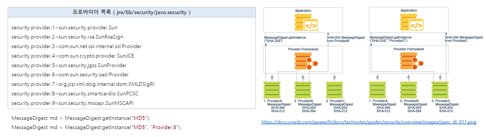
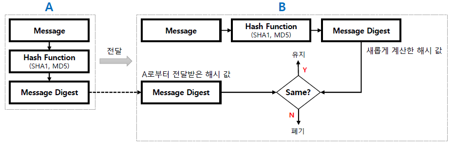
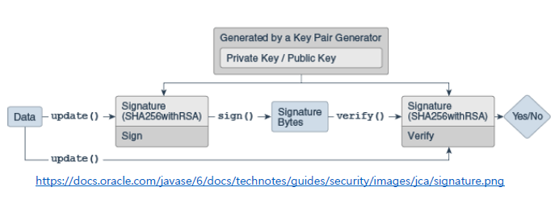

<nav>
    <a href="../.." target="_blank">[Spring Security OAuth2]</a>
</nav>

# 12.1 JCA & JCE - 소개 및 구조

---

## 1. JCA (Java Cryptography Architecture) / JCE (Java Cryptography Extention)

### 1.1 개요
- 자바 암호화 아키텍처 및 확장
  - JCA : Java Cryptography Architecture
  - JCE : Java Cryptography Extention. JCA의 확장버전으로서, 조금 더 강력한 보안 기술이 추가됨.
- 자바는 JCA & JCE 프레임워크 를 통해 자체적인 보안 관련 기능을 제공하고 있으며 전자서명(Digital Signature),
메시지 다이제스트(Message Digest, hashs), 인증서와 인증서 유효성 검사(Certificate Validation),
키 생성 및 관리 그리고 보안 랜덤 수(Secure Random Number) 생성 등 현대 정보 통신 암호 기술 중에서 필수적인 것은 모두 제공하고 있다.

### 1.2 Provider


- JCA & JCE 프레임워크는 프로바이더 보안 구조를 사용하여 보안과 관련한 다양한 API를 제공하고 있다.
- 프로바이더는 `java.security.Provider` 클래스의 구현체로 보안 알고리즘 구현체 목록을 포함하고 있고 이를 통해 보안 서비스를 구현할 수 있다.
- 예를 들어 특정 알고리즘의 인스턴스가 필요해지면
  - JCA & JCE 프레임워크는 프로바이더 저장소에서 해당 알고리즘의 적합한 구현체 클래스를 찾아 첫번째로 찾아진 구현체를 생성해 제공한다.
  - 이 때 어떤 프로바이더를 통해 제공받을 지 직접 지정하는 것도 가능하다. 이 경우 해당 이름을 가진 프로바이더가 우선시되어 찾아진다.

---

## 2. 메시지 다이제스트(MessageDigest)


- 메시지 다이제스트의 목적은 원본 파일이 그대로인지 파악하는 무결성 검사이다.
- 메시지 다이제스트 알고리즘은 입력 값으로 전달된 다양한 길이의 원본 값을 고정 길이 해시 값으로 출력한다.
- 솔트 사용
  - 잘 알려진 해시 알고리즘들은 해시값 테이블인 '레인보우 테이블'이 널리 알려져 있다.
  - 단순히 원본값을 해싱하는 것에 그치면 보안상 취약하다.
  - 원문을 약간 변조하는 것이 솔트이다. 문자열의 앞뒤에 특정 문자열(사람이 인식할 수 있는 문자로 할 경우 암호의 안전성을 담보할 수 없기에
  난수생성을 통해 작성된 수천 비트 단위의 바이너리 문자열을 사용하는 것을 권장)을 끼워넣고 해시를 하는 것이다.
- 복호화 불가능: 이 알고리즘은 단방향이기 때문에 해시 값에서 거꾸로 원본 값을 도출할 수 없다.

### 방법
- 갑
  - 원본값에 솔트를 더해서 메시지 다이제스트 알고리즘을 통해 해싱
  - '을'에게 원본값, 알고리즘(SHA, MD5), 해싱값을 전달.
- 을
  - 을 역시 솔트 값을 알고 있다.
  - 갑에게 원본, 해시값, 알고리즘을 3개 전달 받는다.
  - 원본값에 솔트를 더해 해싱하고, 갑에게 전달받은 해싱값과 비교한다.
  - 비교를 통해 원본이 을에게 오기까지 변조되지 않았는 지 검증한다.
- 분석
  - 서명과, 검증단계에서 같은 솔트값을 사용한다.
  - 방법론적으로 놓고보면 대칭키 방식으로 볼 수 있다.

---

## 3. 시그니처(Signature)


- JCA의 Signature는 초기화 시 제공받은 공개키/개인키 쌍을 사용해서 데이터를 서명하고 전자 서명의 유효성을 검증 하기 위해 사용된다.
- 서명: 메시지 다이제스트와 비대칭키 암호화가 결합한 형태
  - 예) RS256(RSA Signature with SHA-256) 방식
    - 메시지 다이제스트 알고리즘인 "SHA256"을 사용하여 초기에 대규모 데이터를 보다 관리하기 쉬운 고정길이의 형식으로 압축
    - 그 후 비대칭키 암호화인 "RSA" 알고리즘으로 고정길이의 32바이트 메시지 다이제스트에 서명

### 흐름
- 초기화: 공개키/비밀키 쌍 생성
- 서명 : Signature.sign()
  - 원본값을 SHA256 방식으로 해싱, 고정길이 해시값을 생성한다.
  - 해시값을 개인키(비밀키)를 사용하여 서명한다. (암호화)
  - 이 암호화된 결과인 해시값이 디지털 서명이된다.(Sinature 객체)
- 검증 : Signature.verify()
  - 검증자에게 원본데이터와 디지털 서명(Signature)을 함께 전달한다.
  - 검증자는 원본데이터를 SHA256 방식으로 서명한다. (해시값1)
  - 검증자는 디지털 서명을 공개키를 이용해 해시값을 추출한다. (해시값2)
  - 해시값1과 해시값2를 비교하여 원본데이터가 변조되지 않았는 지 검증할 수 있다.

---

## 4. 테스트

### 4.1 메시지 다이제스트 테스트
```kotlin
class MessageDigestTest {

    companion object {

        // 솔트
        private lateinit var salt: ByteArray

        // 해시 결과
        private lateinit var digest: ByteArray

        fun messageDigestTest(message: String) {
            createMD5(message)
            validateMD5(message)
        }

        private fun createMD5(message: String) {
            val random = SecureRandom()

            // 암호화를 위한 salt
            val salt = ByteArray(10)
            random.nextBytes(salt)

            this.salt = salt

            val messageDigest = MessageDigest.getInstance("MD5")
            messageDigest.update(salt)
            messageDigest.update(message.toByteArray(charset("UTF-8")))

            // 해시 결과
            this.digest = messageDigest.digest()
        }

        private fun validateMD5(message: String) {
            // 원본값
            val messageDigest = MessageDigest.getInstance("MD5")

//            val wrongSalt = salt.copyOf(9)
//            messageDigest.update(wrongSalt)
            messageDigest.update(salt)
            messageDigest.update(message.toByteArray(charset("UTF-8")))

            val digest = messageDigest.digest()

            if (this.digest.contentEquals(digest)) {
                println("message matches.")
            }
            else {
                println("message does not matches.")
            }
        }
    }
}
```
- createMD5 : MD5 알고리즘을 적용하여 원본 문자열을 해싱한다.
- validateMD5 : MD5 알고리즘을 적용하여 원본 문자열을 다시 해싱하고 위에서의 해싱값과 비교한다.
- 이때 솔트값이 달라지면 검증에 실패한다.

### 4.2 Signature 테스트
```kotlin

class SignatureTest {

    companion object {

        fun signatureTest(message: String) {
            val keyPairGenerator = KeyPairGenerator.getInstance("RSA")
            keyPairGenerator.initialize(2048)
            val keyPair = keyPairGenerator.genKeyPair()

            val signature = Signature.getInstance("SHA256WithRSA")

            val data = message.toByteArray(charset("UTF-8"))

            // 서명 생성(비밀키 사용)
            signature.initSign(keyPair.private)
            signature.update(data)
            val sign = signature.sign()

            // 검증 (공개키 사용)
            signature.initVerify(keyPair.public)
            signature.update(data)

            var verified = false
            try {
                verified = signature.verify(sign)
            } catch (e: SignatureException) {
                println("전자서명 검증과정에서 오류발생")
                e.printStackTrace()
            }
            println(if (verified) "전자서명 검증 성공" else "전자서명 검증 실패")
        }
    }
}
```
- RSA 를 위한 2048비트 키 쌍을 생성한다.
  - private Key : 서명을 위한 비밀키
  - public key : 검증을 위한 공개키
- 원본값을 RS256 방식으로 서명한다.
  - 원본값 -> SHA256 해싱 -> RSA 서명(비밀키)
- 검증하는 측에서는 RS256 방식으로 검증한다.
  - 원본값 -> SHA256 해싱
  - 암호 -> RSA 복호화(공개키) -> SHA256 해싱문자열
  - 둘을 비교한다.

---
