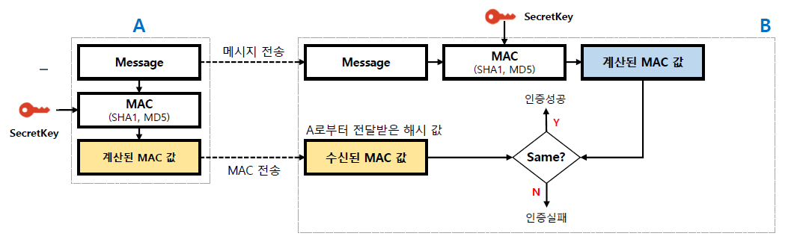
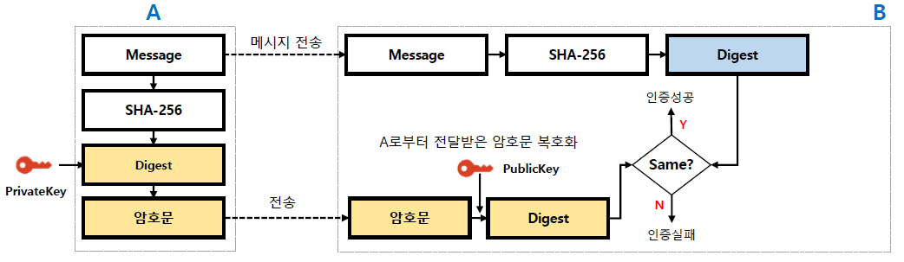
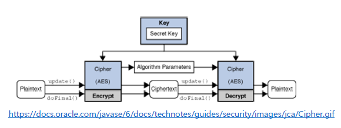
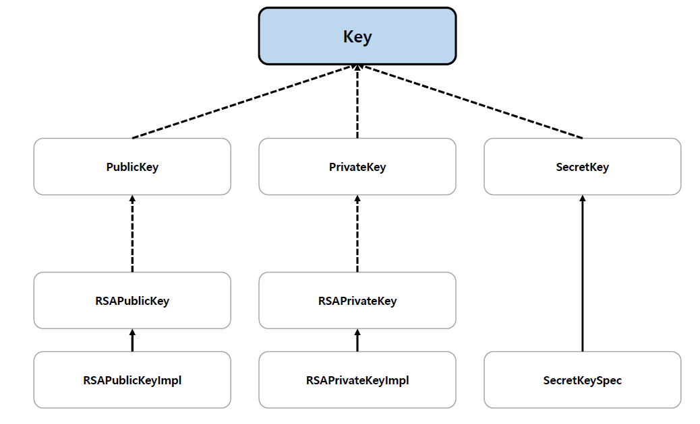

<nav>
    <a href="../.." target="_blank">[Spring Security OAuth2]</a>
</nav>

# 12.2 JCA & JCE - 대칭키 & 비대칭키

---

## 1. 대칭키 암호

### 1.1 대칭키 암호
- 암호화와 복호화에 같은 암호 키를 쓰는 암호화 알고리즘을 의미한다.
- 대칭 키 암호에서는 암호화를 하는 측과 복호화를 하는 측이 같은 암호 키를 공유해야 한다. 이는 비대칭 키 암호에서 공개 키와 비밀 키를 별도로 가지는 것과 구별된다.
- 대부분의 대칭 키 암호는 비대칭 키 암호와 비교하여 계산 속도가 빠르다는 장점을 가진다.

### 1.2 MAC(Message Authentication Code, 메시지 인증 코드)


- 데이터가 변조(수정, 삭제, 삽입 등) 되었는지 무결성 검증할 수 있도록 데이터에 덧붙이는 코드
- 해시 값을 생성한다는 점에서 메시지 다이제스트와 비슷하지만, 초기화 시 비밀키(SecretKey, 대칭키)를 요구한다는 점에서 다르다.
  - 메시지 다이제스트는 받은 측이 누구든 무결성 검사가 가능하지만, MAC은 오직 동일한 비밀 키를 가진 쪽에서만 전달받은 메시지의 무결성을 검사 할 수 있다.
- 암호화 해시 함수(MD5, SHA256 등)를 기반으로 하는 MAC이 잘 알려진 HMAC이다.
- HMAC은 메시지 다이제스트 알고리즘과 공유된 비밀 키의 조합으로 가능하며 데이터의 무결성과 기밀성, 송.수신자간 인증을 보증하기 위한 암호화 기법이다.
- 흐름
  - 송신측: 해시함수에 Secret Key 를 사용하여 계산된 해시값 생성(MAC)
  - 수신측: 원본 메시지와 MAC 을 수신받고 원본 메시지를 Secret Key를 사용하여 해싱한뒤 MAC과 비교한다.

---

## 2. 비대칭키 암호 

### 2.1 비대칭키 암호화
- 암호화 알고리즘의 한 종류로, 암호화와 복호화에 다른 암호 키를 쓰는 알고리즘을 의미한다.
- 외부에 절대 노출되어서는 안되는 개인키(Private key)와 공개적으로 개방되어 있는 공개키(Public key)를 쌍으로 이룬 형태이다
  - A의 공개키를 이용하여 암호화된 데이터는 A의 개인키로만 복호화가 가능하다.
  - A의 개인키를 이용하여 암호화된 데이터는 A의 공개키로만 복호화가 가능하다
- 비대칭키를 사용하여 두가지 암호학적 문제를 해결할 수 있다
  - 데이터 보안 : 송신자는 공개키로 암호화 -> 수신자는 비밀키로 복호화한다. 중간에 누군가 데이터를 가로채더라도, 비밀키 없이는 내용을 복원할 수 없으므로 
  데이터 관리 관점에서 좀 더 안전하다. 
  - 인증 : 송신자는 개인키로 데이터를 암호화 -> 수신자는 공개키로 데이터를 복호화를 하여 메시지를 인증(부인방지)할 수 있다.

### 2.2 RSA (Ron Rivest, Adi Shamir, Leonard Adleman 세 사람의 성을 따서 RSA 라고 이름이 붙은 암호 방식) + SHA256


- 현재 SSL/TLS에 가장 많이 사용되는 공개키 암호화 알고리즘으로 전세계 대부분의 인터넷 뱅킹(대한민국 포함)이 이 RSA-2048 암호화를 사용한다.
- SHA256 해싱과 함께 사용하는 방식(RS256)
  - 수신측: 메시지를 SHA-256 해시를 하여 해싱값(Digest) 생성 후, RSA-2048 Private Key를 사용하여 암호화(암호문)
  - 송신측: 원본 메시지와 암호문을 받고, RSA-2048 Public Key를 사용하여 복호화한 뒤, 원본 메시지의 SHA256 해싱값(Digest)과 비교

---

## 3. Key 관련 JCA 클래스

### 3.1 Key
```java
package java.security;

public interface Key extends java.io.Serializable {
    String getAlgorithm();
    String getFormat();
    byte[] getEncoded();
}
```
- JCA에서 지원하는 모든 종류의 키에 대한 최상위 인터페이스
- Key 인터페이스는 getAlgorithm(), getEncoded(), getFormat() 의 세 가지 메서드를 제공한다
  - getAlgorithm() : 어떤 키 알고리즘을 사용했는 지 반환. 보통 대칭키 암호 방식(AES,DSA 등) 또는 비대칭키 연산 알고리즘(RSA)이다.
  - getEncoded() : 인코딩된 형식의 키 값을 byte 배열로 반환
  - getFormat() : 키를 인코딩한 형식의 이름을 반환.
    - X.509 : 공개키 포맷 표준의 일종
    - PKCS#8 : 비밀키 포맷 표준의 일종

### 3.2 KeyPair
```java
public final class KeyPair implements java.io.Serializable {

    /** The private key. */
    private final PrivateKey privateKey;

    /** The public key. */
    private final PublicKey publicKey;

    public KeyPair(PublicKey publicKey, PrivateKey privateKey) {
        this.publicKey = publicKey;
        this.privateKey = privateKey;
    }
}
```
- 키 쌍(공개 키와 개인 키)을 보관하고 접근할 수 있는 기능만 제공한다

### 3.3 KeyPairGenerator
- 공개키 및 개인키 쌍(KeyPair) 생성하는 역할

### 3.4 KeyFactory
- 어떤 키 데이터 객체를, 다른 타입의 키 데이터 객체로 전환하는데 사용
- 예) key 포맷이 x.509 였던 것을 다른 포맷으로 변환

---

## 4. JCA JCE 구조

### 4.1 Cipher
- 암호화 및 복호화 기능을 제공한다. 
- 참고
  - 암호화: 일반 텍스트와 키를 가져와 암호화된 데이터를 생성하는 프로세스
  - 복호화: 암호화된 데이터와 키를 가져와서 일반 텍스트를 생성하는 역과정

### 4.2 Cipher 객체 인스턴스화
```java
Cipher c1 = Cipher.getInstance("RSA/ECB/OAEPWithSHA1AndMGF1Padding");
Cipher c2 = Cipher.getInstance("RSA");
```
인스턴스 생성 시 변환을 지정하는데 변환은 `[암호화 알고리즘/피드백 모드/패딩]` or `[암호화 알고리즘]` 으로 지정한다

### 4.3 Cipher 초기화


```java
Cipher cipher = Cipher.getInstance("RSA");
cipher.init(Cipher.ENCRYPT_MODE, PrivateKey);
```
Cipher 객체를 초기화하기 위해서 Cipher의 작동 모드를 나타내는 opmode 와 Key 또는 증명서(Certificate) 를 인자로 전달하고, 
init() 메서드를 실행하면 된다.

- opmode
  - ENCRYPT_MODE: cipher 객체를 암호화 모드로 초기화한다.
  - DECRYPT_MODE: cipher 객체를 복호화 모드로 초기화한다.

---

## 5. Key 계층 구조(java.security.Key)


- 최상위 Key 인터페이스
- 비대칭키
  - PublicKey : 공개키
  - PrivateKey : 개인키
- 대칭키
  - SecretKey : 비밀키

---

## 6. 실습

### 6.1 MAC 실습
```kotlin
class MacTest {

    companion object {

        private const val SECRET_KEY = "cbf41347bb1978f6f32087b2cf01e351"

        fun hmacTest(data: String) {
            hmacBase64(SECRET_KEY, data, "HmacMD5")
            hmacBase64(SECRET_KEY, data, "HmacSHA256")
        }

        private fun hmacBase64(secret: String, data: String, algorithm: String) {
            val secretKeySpec = SecretKeySpec(secret.toByteArray(Charsets.UTF_8), algorithm)
            val mac = Mac.getInstance(algorithm)

            // MAC 사양 초기화 : 비밀키, 알고리즘
            mac.init(secretKeySpec)

            // 원본값을 비밀키를 이용하여 해싱
            val hash = mac.doFinal(data.toByteArray())

            val base64EncodedHash = Base64.getEncoder().encodeToString(hash)

            println("${algorithm}: $base64EncodedHash")
        }
    }
}
```
- 비밀키를 가지고 Mac(Message Authentication Code) 를 생성한다.
- Mac 방식은 복호화가 불가능하고, 원본값과 Secret 키를 기반으로 다시 암호화한 뒤 MAC과 비교해야한다.

### 6.2 RSA 실습
```kotlin

class RSAGen {

    companion object {

        fun genKeyPair(): KeyPair {
            val generator = KeyPairGenerator.getInstance("RSA")
            generator.initialize(2048, SecureRandom())
            return generator.genKeyPair()
        }

        fun encryptWithPublicKey(plainText: String, publicKey: PublicKey): String {
            val cipher = Cipher.getInstance("RSA")
            cipher.init(Cipher.ENCRYPT_MODE, publicKey)

            val bytePlain = cipher.doFinal(plainText.toByteArray())
            return Base64.getEncoder().encodeToString(bytePlain)
        }

        fun decryptWithPrivateKey(encrypted: String, privateKey: PrivateKey): String {
            val cipher = Cipher.getInstance("RSA")
            cipher.init(Cipher.DECRYPT_MODE, privateKey)

            // Base64 디코딩
            val byteEncrypted = Base64.getDecoder().decode(encrypted.toByteArray())

            // 복호화
            val bytePlain = cipher.doFinal(byteEncrypted)
            return String(bytePlain, StandardCharsets.UTF_8)
        }

        fun getPublicKeyFromKeySpec(base64PublicKey: String?): PublicKey {
            val decodedBase64PubKey = Base64.getDecoder().decode(base64PublicKey)
            return KeyFactory.getInstance("RSA").generatePublic(X509EncodedKeySpec(decodedBase64PubKey))
        }

        fun getPrivateKeyFromKeySpec(base64PrivateKey: String?): PrivateKey {
            val decodedBase64PrivateKey = Base64.getDecoder().decode(base64PrivateKey)

            return KeyFactory.getInstance("RSA").generatePrivate(PKCS8EncodedKeySpec(decodedBase64PrivateKey))
        }

    }
}
```
```kotlin
class RSATest {

    companion object {

        fun rsaTest(message: String) {
            // 키페어 생성
            val keyPair = RSAGen.genKeyPair()
            val publicKey = keyPair.public
            val privateKey = keyPair.private

            println("original: $message")

            println("--------------------------------------------------------------------")

            // 원본값 암호화 및 복호화
            val encrypted = RSAGen.encryptWithPublicKey(message, publicKey)
            val decrypted = RSAGen.decryptWithPrivateKey(encrypted, privateKey)

            println("decrypted: $decrypted")

            println("-------------------------------------------------------------------")

            // 키 스펙 전환하기
            val bytePublicKey = publicKey.encoded
            val base64PublicKey = Base64.getEncoder().encodeToString(bytePublicKey)
            val bytePrivateKey = privateKey.encoded
            val base64PrivateKey = Base64.getEncoder().encodeToString(bytePrivateKey)

            // X.509 표준형식
            val x509PublicKey = RSAGen.getPublicKeyFromKeySpec(base64PublicKey)

            val encrypted2 = RSAGen.encryptWithPublicKey(message, x509PublicKey)
            val decrypted2 = RSAGen.decryptWithPrivateKey(encrypted2, privateKey)
            println("decrypted2: $decrypted2")

            println("-------------------------------------------------------------------")

            // PKCS8 표준형식
            val pKCS8PrivateKey = RSAGen.getPrivateKeyFromKeySpec(base64PrivateKey)
            val decrypted3 = RSAGen.decryptWithPrivateKey(encrypted2, pKCS8PrivateKey)
            println("decrypted3: $decrypted3")
        }
    }
}
```
- KeyPairGenerator 를 통해 RSA-2048 방식 키쌍을 생성한다.
- 공개키로 데이터를 서명한다.
  - Cipher 생성 후 Cipher.ENCRYPT_MODE 모드 및 공개키 설정을 한다.
  - doFinal 을 호출하여 데이터를 서명한다.
- 비밀키로 암호문을 복호화한다.
  - Cipher 생성 후 Cipher.DECRYPT_MODE 모드 및 비밀키 설정을 한다.
  - doFinal 을 호출하여 데이터를 복호화한다.
- KeyFactory 를 통해 키 사양을 변환하는 것도 실습한다.

---
