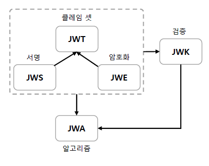
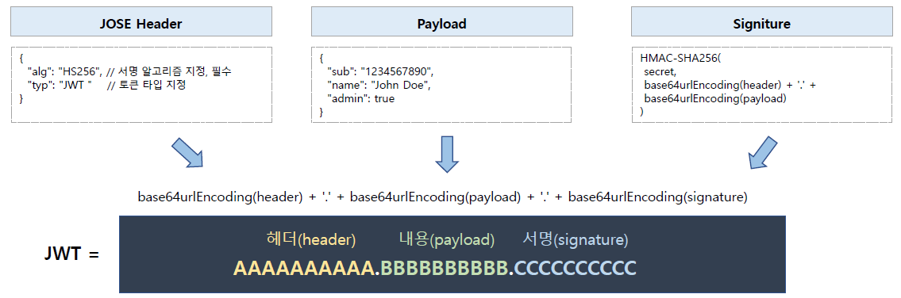
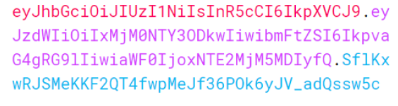
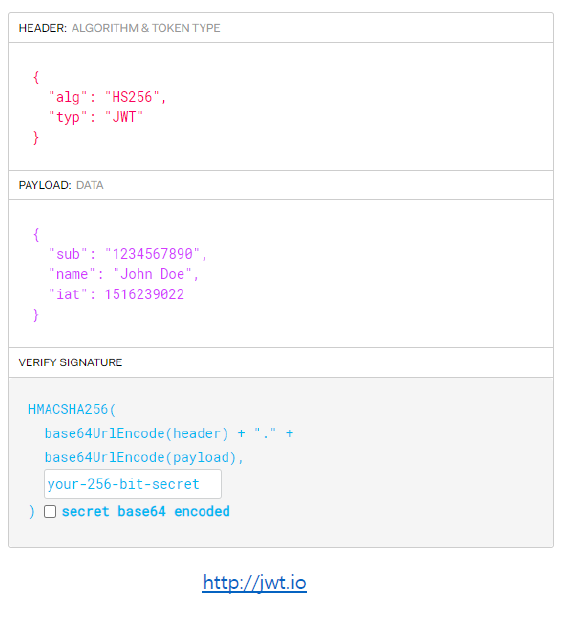

<nav>
    <a href="../.." target="_blank">[Spring Security OAuth2]</a>
</nav>

# 12.3 JWT - 소개 및 특징

---

## 1. JOSE (JSON Object Signing and Encryption)


- JSON 데이터의 컨텐츠를 암호화 또는 서명의 형태로 나타내기 위해 IETF에서 표준화 한 소프트웨어 기술 세트
- 기술에는 다음 사양이 포함된다
    1. JWT (JSON Web Token, RFC7519)
        - 클레임 기반 보안 값을 나타내는 방법으로 두 당사자 간에 안전하게 전달되는 클레임을 표현하기 위한 개방형 표준
        - JWT는 인증, 권한 부여 및 정보 교환에 사용된다
        - JWT 는 하나의 추상화된 개념이다. JWS 방식 또는 JWE 방식으로 구현된다
    2. JWS (JSON WEB SIGNITURE, RFC 7515)
        - JWT의 구현체
        - JSON을 사용하여 디지털 서명(비대칭키 방식) 또는 MAC(대칭키 방식) 으로 보안된 콘텐츠를 표현하는 방법
        - 보통 JWS 방식으로 JWT를 구현하고 이 강의에서는 JWS 방식을 다룬다.
    3. JWE (JSON WEB ENCRYPTION, RFC 7516)
        - JWT의 구현체
        - JSON을 사용하여 의도한 수신자만 읽을 수 있도록 암호화된 데이터(토큰)를 나타내는 형식
        - 토큰 전체의 모든 헤더, 클레임 정보가 암호화됨.
    4. JWK (JSON WEB KEY, RFC 7517)
        - HMAC(대칭키)이나 타원 곡선 또는 RSA 알고리즘(비대칭키)을 사용하여 공개 키 세트(Set)를 JSON 객체로 나타내는 JSON 구조
    5. JWA (JSON WEB ALGORITHM, RFC 7518)
        - JWS, JWK 및 JWE에 필요한 알고리즘 목록으로 JWS 헤더 및 JWS 페이로드의 내용을 서명하는 데 사용된다
        - 토큰에 사용된 알고리즘 목록을 칭하며, JWA 에 해당 알고리즘을 명시한다.
- 정리
  - JWT : 개념
    - JWS : 서명 또는 MAC 방식으로 데이터를 암호화
    - JWE : 데이터 전체 암호화
  - JWK : 공개키를 JSON 구조로 나타낸 것
  - JWA : JWS, JWE, JWK에 필요한 알고리즘 목록

---

## 2. JWS 구조


- JOSE Header
  - 일반적으로 토큰 유형(typ)과, 서명 알고리즘(alg) 두 부분으로 구성된다.
    - 유형(typ) : 어떤 토큰인지. 보통 "JWT" 가 지정된다.
    - 서명 알고리즘(alg) : HMAC SHA256 / RSA, ...
  - Base64Url 로 인코딩되어 JSON 웹 토큰의 첫 번째 부분을 형성한다
- Payload (JWT Claim Set)
  - 토큰에 포함할 내용인 클레임을 포함하는 페이로드로서 표준 필드인 7개의 등록 클레임 이름(Registered Claim Names) 및 사용자 지정 클레임 등으로 구성한다
  - Base64Url 로 인코딩되어 JSON 웹 토큰의 두 번째 부분을 형성한다
- Signature
  - 서명은 Base64url 인코딩을 이용하여 헤더와 페이로드를 인코딩하고 이 둘을 점(.) 구분자로 함께 연결시킴으로써 계산되어 토큰을 안전하게 확인한다.
  - `(base64헤더 + "." + base64페이로드) + secret 서명 -> + Signature`

---

## 3. jwt.io




- 참고 : `https://jwt.io` 에서는 간단하게 JWS 를 실습할 수 있는 기능을 제공한다.

---

## 4. 클레임

### 4.1 Claim(클레임)
```json
{
  // 등록된 클레임
  "sub": "128394384937",
  // 등록된 클레임
  "iss": "ttasjwi.com",
  // 등록된 클레임
  "exp": "1925230000000",
  // 공개 클레임
  "https:// ttasjwi.com/claims/job": "developer”,
  // 비공개 클레임
  "userId": "ttasjwi"
}
```

- 클레임(claim) 은 주장하고자 하는 정보를 나타내는 것으로 이 정보를 모두 가지고 있는 바디 부분을 Claim Set 이라고 부른다.
- Claim Set은 키 부분인 Claim Name과 값 부분인 Claim Value의 여러 쌍으로 이루어져 있다.
- JWT 에는 여러개의 클레임들을 넣을 수 있다
- 종류
  - 등록된 클레임(Registered Claims)
  - 공개 클레임(Public Claims)
  - 비공개 클레임(Private Claims)
- 용어 이해
  - 토큰의 본문에서 주장하는 바(Claim)이 제대로 된 내용인지는 시그니처를 검증해야만 알 수 있다.
  - 따라서 주장(Claim) 이라는 이름이 붙은 것 같다.

### 4.2 등록된 클레임(Registered Claims)
- IANA 에 이미 등록된 표준 클레임이며 필수가 아닌 선택적으로 작성 가능하다.
- 공통으로 사용하기 위한 기본값이 정해져 있다.
- 종류
  - iss: 토큰을 발급한 발급자(issuer)
  - sub: 토큰의 주제 혹은 제목(subject)
  - aud: 토큰을 사용할 수신자(audience)
  - exp: 토큰 만료시간(expiration Time), 언제나 현재 시간보다 이후로 설정되어있어야 한다.
  - nbf: not before의 의미로 이 시간 이전에는 토큰을 처리하지 않아야 함을 의미한다.
  - iat: 토큰이 발급된 시간(issued at)
  - jti: JWT의 고유 식별자로서 중복 방지를 위해 사용하며, 일회용 토큰(Access Token 등)에 사용한다.

### 4.3 공개 클레임(Public Claims)
- 공개된 이름으로 충돌을 방지된 이름을 가지고 있어야 한다
- 클레임 이름을 URI 형식으로 짓는다
- 예) `"https://ttasjwi.com/claims/job": “developer”`

### 4.4 비공개 클레임(Private Claims)
```json
{
  "username": "ttasjwi",
  "age": "10"
}
```
- 등록된 클레임이나 공개된 클레임이 아닌 당사자 간에 (클라이언트 <->서버) 협의하에 사용되는 클레임 이름들이다.
- 공개 클레임과는 달리 이름이 중복되어 충돌이 될 수 있으니 사용할때에 유의 해야 한다.

---

## 5. 정리

### 5.1 장점: 데이터 무결성 보장
- Payload 의 클레임 값을 변조하여 토큰을 생성한 후 전달하더라도 서명에서 해시된 값과 변조된 값의 해시된 값이 서로 일치하지 않기
때문에 검증이 실패하여 데이터의 안전성을 보장한다.

### 5.2 취약점: SecretKey 탈취 위험성
- SecretKey 를 탈취당했을 경우에는 중요한 정보가 도난당할 수 있는 취약점이 발생한다. 따라서 SecretKey 를 주기적으로 변경하도록 하는 key rotation( key rolling) 정책이 필요할 수 있다

---
