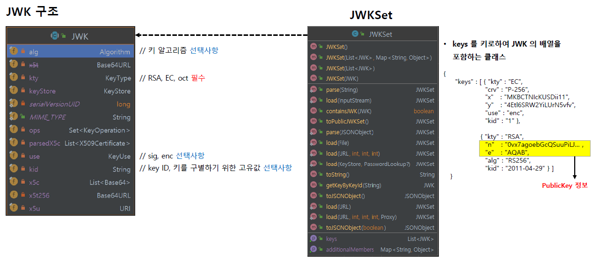
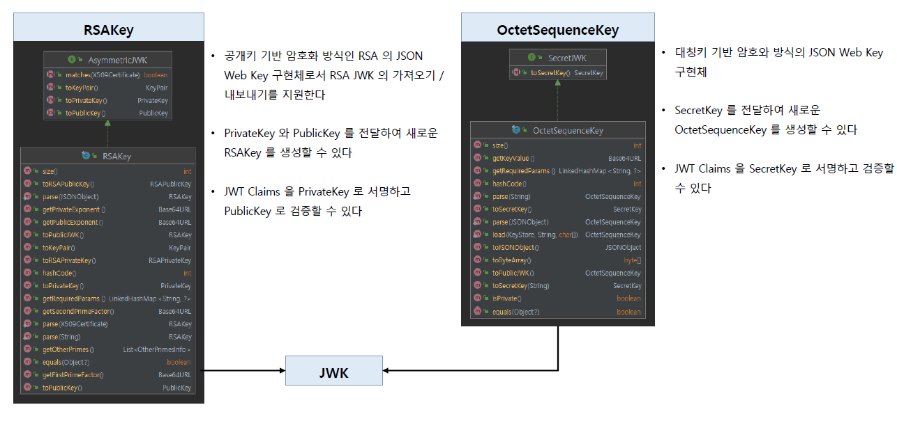
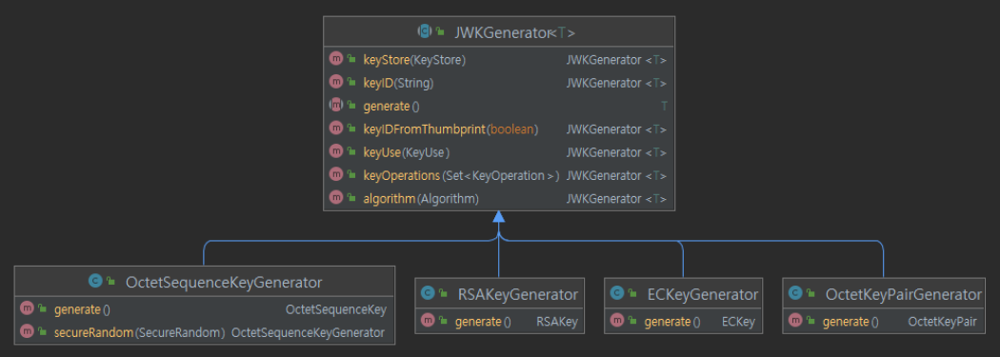

<nav>
    <a href="../.." target="_blank">[Spring Security OAuth2]</a>
</nav>

# 12.4 JWT - JWK 이해 및 활용하기

---

## 1. JWK 개념

- 암호화 키를 저장하는 방식으로 인가서버에서 발행하는 JWT 토큰의 암호화 및 서명에 필요한 암호화 키의 다양한 정보를 담은 JSON 객체 표준이다
- `JwkSetUri` 를 설정하면 인가서버로부터 JWK 형태의 정보를 다운로드할 수 있고 JWT 를 검증할 수 있다.

---

## 2. JWK 및 JWKSet 구조


Nimbus 의 jwt 라이브러리에서는 JWK 사양을 기반으로 JWK 및 JWKSet 클래스를 제공한다.

### 2.1 JWK
- 파라미터
  - alg : 키 알고리즘. (선택적)
    - 예) "RS256", "HS256"
  - kty : 키 종류. (필수)
    - 예) "oct"(대칭키, HS256 방식), "rsa"(비대칭키, 주로 RS256 방식), "ec"(타원곡선, 주로 ES256 방식)
  - use: 사용 용도
    - 예) "sig"(서명), "enc"(암호화)
  - kid: 키 구별 고유값 (선택)
  - n,e : 퍼블릭 키 정보
- 

### 2.2 JWKSet
- JWK의 집합

---

## 3. JWK의 확장



### 3.1 개요
- Nimbus JWK 에서는 JWK의 확장으로 RSAKey, OctetSequenceKey클래스를 제공한다.
- 자바 표준 보안 클래스들을 사용하여 대칭키, 비대칭키 방식의 JWT 의 암호화 및 전자서명, 이후 검증을 위한 키 생성, 변환 등을 지원한다
- 구현체로서 RSAKey, OctetSequenceKey, ECKey, OctetKeyPair 가 있다

### 3.2 RSAKey
- 공개키 기반 암호화 방식인 RSA 의 JSON Web Key 구현체
- RSA JWK 의 가져오기, 내보내기 기능을 지원한다.
- PrivateKey와 PublicKey 를 전달하여 새로운 RSAKey 를 생성할 수 있다.
- JWK Claims 를 PrivateKey 로 서명하고 PublicKey 로 검증할 수 있다.


### 3.3 OctetSequenceKey
- 대칭키 기반 암호화 방식의 JSON Web Key 구현체
- SecretKey 를 전달하여, 새로운 OctetSequenceKey 를 생성할 수 있다.
- JWT Claims 를 SecretKey 로 서명하고 검증할 수 있다.

---

## 4. JWKGenerator


- 암호화 알고리즘 방식에 따라 JWK 의 구현체가 있고 각 구현체를 편리하게 생성할 수 있는 제너레이터 클래스이다
  - RSAKeyGenerator – 비대칭 암호화 알고리즘 키를 포함하는 JWK 생성기
  - OctetSequenceKeyGenerator - 대칭 암호화 알고리즘 키를 포함하는 JWK 생성기
  - EcKeyGenerator - 타원곡선 암호화 알고리즘 키 포함하는 JWK 생성기

---

## 5. 예제
```kotlin
class JWKTest {

    companion object {

        fun jwkTest() {
            // 비대칭키 JWK
            val rsaKeyPairGenerator = KeyPairGenerator.getInstance("RSA")
            rsaKeyPairGenerator.initialize(2048)

            val keyPair = rsaKeyPairGenerator.generateKeyPair()
            val publicKey = keyPair.public as RSAPublicKey
            val privateKey = keyPair.private as RSAPrivateKey

            val rsaKey1 = RSAKey.Builder(publicKey)
                .privateKey(privateKey)
                .keyUse(KeyUse.SIGNATURE)
                .algorithm(JWSAlgorithm.RS256)
                .keyID("rsa-key-1")
                .build()

            val rsaKey2 = RSAKeyGenerator(2048)
                .keyID("rsa-key2")
                .keyUse(KeyUse.SIGNATURE)
                .keyOperations(setOf(KeyOperation.SIGN))
                .algorithm(JWSAlgorithm.RS512)
                .generate()

            // 대칭키 JWK
            val secretKey = SecretKeySpec(
                Base64.getDecoder().decode("bCzY/M48bbkwBEWjmNSIEPfwApcvXOnkCxORBEbPr+4="), "AES"
            )

            val octetSequenceKey1 = OctetSequenceKey.Builder(secretKey)
                .keyID("secret-kid1")
                .keyUse(KeyUse.SIGNATURE)
                .keyOperations(setOf(KeyOperation.SIGN))
                .algorithm(JWSAlgorithm.HS256)
                .build()

            val octetSequenceKey2 = OctetSequenceKeyGenerator(256)
                .keyID("secret-kid2")
                .keyUse(KeyUse.SIGNATURE)
                .keyOperations(setOf(KeyOperation.SIGN))
                .algorithm(JWSAlgorithm.HS384)
                .generate();

            jwtSet(
//                kid = rsaKey1.keyID, alg = rsaKey1.algorithm as JWSAlgorithm, type = rsaKey1.keyType,
//                kid = rsaKey2.keyID, alg = rsaKey2.algorithm as JWSAlgorithm, type = rsaKey2.keyType,
                kid = octetSequenceKey1.keyID, alg = octetSequenceKey1.algorithm as JWSAlgorithm, type = octetSequenceKey1.keyType,
//                kid = octetSequenceKey2.keyID, alg = octetSequenceKey2.algorithm as JWSAlgorithm, type = octetSequenceKey2.keyType,
                rsaKey1,
                rsaKey2,
                octetSequenceKey1,
                octetSequenceKey2
            )
        }

        private fun jwtSet(kid: String, alg: JWSAlgorithm, type: KeyType, vararg jwk: JWK) {
            val jwkSet = JWKSet(mutableListOf(*jwk))
            val jwkSource = JWKSource<SecurityContext> { jwkSelector, _ ->
                jwkSelector.select(jwkSet)
            }

            val jwkMatcher = JWKMatcher.Builder()
                .keyTypes(type)
                .keyID(kid)
                .keyUses(KeyUse.SIGNATURE)
                .algorithms(alg)
                .build()

            val jwkSelector = JWKSelector(jwkMatcher)
            val jwks = jwkSource.get(jwkSelector, null)

            println("jwks= $jwks")
            if (jwks.isNotEmpty()) {
                val findJwk = jwks[0]

                val keyType = findJwk.keyType
                println("keyType = $keyType")

                val keyId = findJwk.keyID
                println("keyID = $keyId")

                val algorithm = findJwk.algorithm
                println("algorithm  = $algorithm")
            }
        }
    }
}
```
- 비대칭키 방식 JWK 생성
  - KeyPairGenerator 로 KeyPair 를 만들고 RSAKey.Builder 를 사용해 생성하는 방법
  - RSAKeyGenerator 로 생성하는 방법
- 대칭키 방식 JWK 생성
  - SecretKeySpec 로 SecretKey 구현체 생성 후 OctetSequenceKey.Builder 로 생성하는 방법
  - OctetSequenceKeyGenerator 로 생성하는 방법

---
