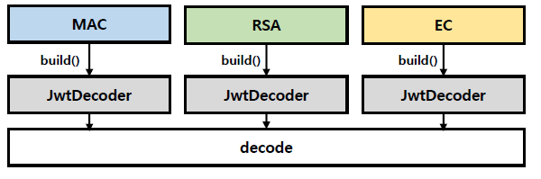

<nav>
    <a href="../.." target="_blank">[Spring Security OAuth2]</a>
</nav>

# 13.1 MAC & RSA 토큰 검증 - 기본 환경 및 공통 클래스 구성

---

## 1. 요구사항

### 1.1 개요


이번 실습에서는 다음 두 상황을 모두 고려하여 토큰 발행 및 검증을 테스트할 것이다.
- 알고리즘 방식
  - JwtDecoder 빈은 암호화 알고리즘 및 특정한 조건에 따라 각 생성되며 디코딩이 진행되면 주어진 알고리즘에 의해 검증하게 된다.
  - 크게 MAC 방식, RSA 방식, EC 방식(타원곡선) 방식이 있는데 본 강의에서는 EC 방식은 다루지 않는다.
- 토큰 직접 발행 여부
  - 우리 서비스에서 직접 토큰을 발행하고 이를 검증
  - OAuth2 인가서버에서 발행한 Access Token 을 대상으로 한 검증


### 1.2 토큰 검증 테스트
좀 더 실질적으로 분류하여 다음 상황들을 테스트할 것이다.

1. MAC 방식에 의한 검증 테스트
   - 자체 토큰 발행 및 검증
   - SecretKey 설정에 의한 검증
2. RSA 방식에 의한 검증 테스트
   - 자체 토큰 발행 및 검증
   - JwtDecoder 에 의한 검증
   - KeyStore 툴에 의한 검증
   - JwkSetUri 설정에 의한 검증

### 1.3 기본골격 생성
- 이번 글에서는 위 테스트를 위한 기본 골격을 만들 것이다.

---

## 2. 로그인 필터

### 2.1 로그인 요청
```kotlin
package com.ttasjwi.oauth2.security.dto

class LoginRequest(
    val username: String? = null,
    val password: String? = null,
)

```


### 2.2 로그인 필터
```kotlin
class CustomLoginAuthenticationFilter(
    requestMatcher: RequestMatcher
) : AbstractAuthenticationProcessingFilter(requestMatcher) {

    companion object {
        private val objectMapper: ObjectMapper = jacksonObjectMapper()
    }

    override fun attemptAuthentication(request: HttpServletRequest, response: HttpServletResponse): Authentication {
        val loginRequest: LoginRequest
        try {
            loginRequest = objectMapper.readValue(request.inputStream, LoginRequest::class.java)
        } catch (e: Exception) {
            throw BadCredentialsException("자격증명이 유효하지 않습니다.")
        }
        val authenticationToken = UsernamePasswordAuthenticationToken(loginRequest.username, loginRequest.password)
        val authentication = authenticationManager.authenticate(authenticationToken)
        return authentication
    }
}
```
- AbstractAuthenticationProcessingFilter 를 상속하여 커스텀 필터의 골격을 만들었다.
- 일단 간단하게 전달받은 username, passsword 를 UsernameAuthenticationToken 형태로 만들어 AuthenticationManager 에게 전달하여 처리하도록 했다.

---

## 3. 컨트롤러
```kotlin
@RestController
class ApiController {

    @GetMapping("/")
    fun index(): String = "index"
}
```
- 루트로 접속하면 "index" 문자열이 반환하도록 함.

---

## 4. 보안설정
```kotlin
@Configuration
class SecurityConfig {

    @Bean
    fun securityFilterChain(http: HttpSecurity): SecurityFilterChain {
        http {
            csrf { disable() }
            authorizeHttpRequests {
                authorize("/", permitAll)
                authorize(anyRequest, authenticated)
            }
            addFilterBefore<UsernamePasswordAuthenticationFilter>(customLoginAuthenticationFilter())
        }
        return http.build()
    }

    @Bean
    fun customLoginAuthenticationFilter(): CustomLoginAuthenticationFilter {
        val filter = CustomLoginAuthenticationFilter(AntPathRequestMatcher("/login", HttpMethod.POST.name()))
        filter.setAuthenticationManager(authenticationManager())
        filter.setSecurityContextRepository(securityContextRepository())
        return filter
    }


    @Bean
    fun authenticationManager(): AuthenticationManager {
        val provider = DaoAuthenticationProvider()
        provider.setUserDetailsService(userDetailsService())
        provider.setPasswordEncoder(passwordEncoder())

        return ProviderManager(provider)
    }

    @Bean
    fun userDetailsService(): UserDetailsService {
        val user = User.withUsername("user").password("1111").authorities("ROLE_USER").build()
        return InMemoryUserDetailsManager(user)
    }

    @Bean
    fun passwordEncoder(): PasswordEncoder = NoOpPasswordEncoder.getInstance()

    @Bean
    fun securityContextRepository(): SecurityContextRepository {
        return DelegatingSecurityContextRepository(
            HttpSessionSecurityContextRepository(),
            RequestAttributeSecurityContextRepository()
        )
    }
    
}
```
- 필터체인 설정
  - CSRF 무효화
  - "/" 경로 모든 사용자에게 허용, 나머지는 인증 요구
  - 커스텀 로그인 필터 추가
- 커스텀 인증필터 구성
  - AuthenticationManager 구성 : ProviderManager 가 DaoAuthenticationProvider 에게 위임하는 형태
    - DaoAuthenticationProvider
      - UserDetailsService : 간단하게 user 사용자 하나를 등록하고 이를 테스트하기 위한 수준으로 InMemoryUserDetailsManager 지정
      - PasswordEncoder : 간단한 실습을 위해 NoOpPasswordEncoder 지정
  - SecurityContextRepository : 일단 세션에 인증결과 저장. 이후 수정 예정

---

## 5. 실행
- json 형태로 POST "/login" 엔드포인트로 username, password 를 전달한다.
- 성공 후 "/" 로 리다이렉트된다.

---
