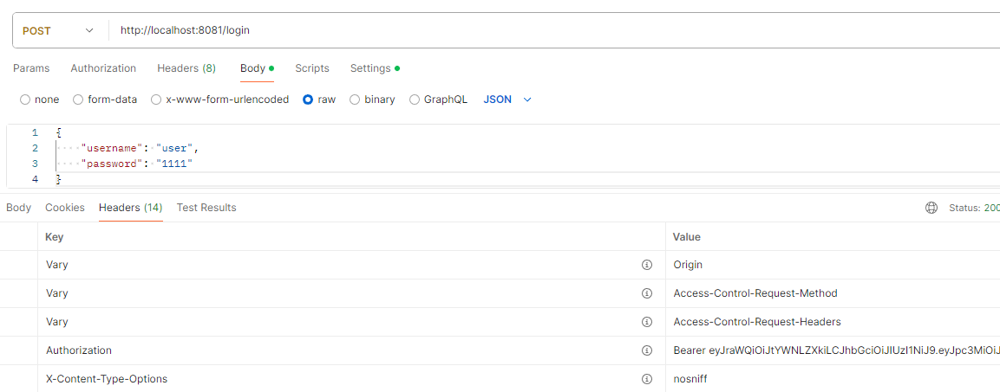
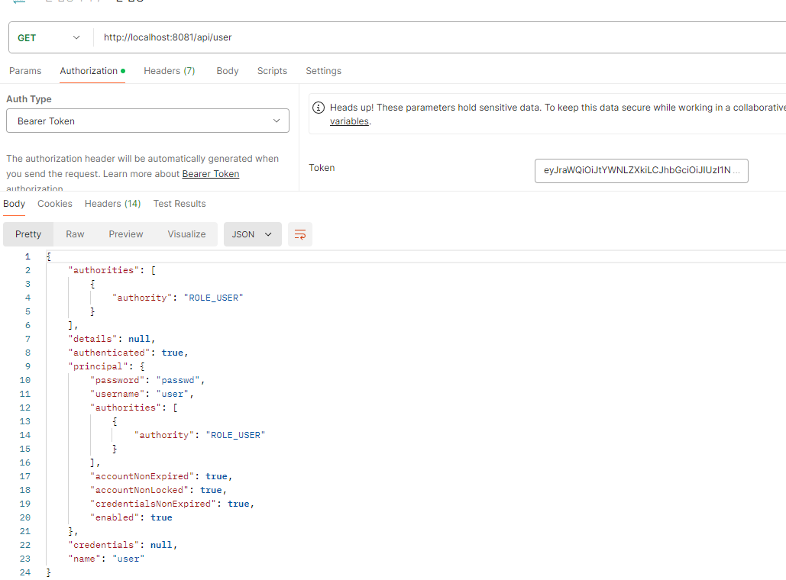

<nav>
    <a href="../.." target="_blank">[Spring Security OAuth2]</a>
</nav>

# 13.2 MAC 검증 기능 구현 - MacJwtAuthenticationFilter

---

## 1. 토큰 발행

### 1.1 JWKRepository
```kotlin
class JWKRepository(
    private val jwk: JWK
) {

    fun findJWK(): JWK {
        return jwk
    }
}
```
- 내부적으로 우리가 직접 등록한 JWK 를 꺼내서 제공하도록 했다.

### 1.2 TokenSigner
```kotlin
interface TokenSigner {
    fun signToken(user: User): String
}
```
```kotlin

abstract class AbstractTokenSigner : TokenSigner {

    override fun signToken(user: User): String {
        val jwk = getJWK()

        val header = JWSHeader.Builder(jwk.algorithm as JWSAlgorithm).keyID(jwk.keyID).build()
        val authority = user.authorities.map { it.authority }.toList()

        val claimSet = JWTClaimsSet.Builder()
            .subject("user")
            .issuer("http://localhost:8081")
            .claim("username", user.username)
            .claim("authority", authority)
            .expirationTime(Date(Date().time + 60 * 100 * 5))
            .build()

        val signedJWT = SignedJWT(header, claimSet)
        signedJWT.sign(getJWSSigner(jwk))
        return signedJWT.serialize()
    }

    protected abstract fun getJWK(): JWK
    protected abstract fun getJWSSigner(jwk: JWK): JWSSigner
}
```
```kotlin
class MacTokenSigner(
    private val jwkRepository: JWKRepository): AbstractTokenSigner() {


    override fun getJWK(): JWK {
        return jwkRepository.findJWK()
    }


    override fun getJWSSigner(jwk: JWK): JWSSigner {
        return MACSigner((jwk as OctetSequenceKey).toSecretKey())
    }

}
```
- User를 전달받았을 때 Token 을 전달하는 역할을 하는 TokenSigner 를 정의했다.
- 여기서 MacTokenSigner 는 MAC 방식으로 생성한 JWK를 기반으로 JWS 를 생성한다.

### 1.3 CustomLoginAuthenticationFilter
```kotlin
    private val tokenSigner: TokenSigner,

    override fun successfulAuthentication(
        request: HttpServletRequest,
        response: HttpServletResponse,
        chain: FilterChain,
        authResult: Authentication
    ) {
        val user = authResult.principal as User
        val jwt = tokenSigner.signToken(user)
        response.addHeader("Authorization", "Bearer $jwt")
    }
```
- 성공 로직 부분을 오버라이드하여, JWT 를 생성하고 응답 헤더에 담아 보내도록 했다.

---

## 2. 토큰 검증기능 구현 - MacJwtAuthenticationFilter
```kotlin

class MacJwtAuthenticationFilter(
    private val jwkRepository: JWKRepository
) : OncePerRequestFilter() {

    private val bearerTokenHeaderName = HttpHeaders.AUTHORIZATION

    companion object {
        val log = getLogger(MacJwtAuthenticationFilter::class.java)
    }

    override fun doFilterInternal(
        request: HttpServletRequest,
        response: HttpServletResponse,
        chain: FilterChain
    ) {
        val token = resolveToken(request)

        if (token == null) {
            chain.doFilter(request, response)
            return
        }
        val signedJWT: SignedJWT
        try {
            signedJWT = SignedJWT.parse(token)
            val macVerifier = MACVerifier((jwkRepository.findJWK() as OctetSequenceKey).toSecretKey())
            val verify = signedJWT.verify(macVerifier)

            if (verify) {
                val jwtClaimSet = signedJWT.jwtClaimsSet
                val username = jwtClaimSet.getClaim("username")?.toString()
                val authorities = jwtClaimSet.getClaim("authority") as MutableList<String>?

                if (username != null && authorities != null) {
                    val user = User.withUsername(username).password("passwd").authorities(authorities.map { SimpleGrantedAuthority(it) }).build()
                    val auth = UsernamePasswordAuthenticationToken.authenticated(user, null, user.authorities)

                    SecurityContextHolder.getContextHolderStrategy().context.authentication = auth
                }
            }
        } catch(e: Exception) {
            log.error (e) { "토큰 검증 과정에서 예외 발생"  }
        }
        chain.doFilter(request, response)
    }

    private fun resolveToken(request: HttpServletRequest): String? {
        val header = request.getHeader(bearerTokenHeaderName)
        if (header == null || !header.startsWith("Bearer ")) {
            return null
        }
        log.info { "header: $header" }
        return header.replace("Bearer ", "")
    }
}
```
- MacJwtAuthenticationFilter 는 매 요청마다 Authorization 헤더를 확인하고 Bearer 뒷부분을 추출하여 검증한다.
- 그리고 인증 정보를 생성하여 SecurityContext 에 저장한다.
- 흐름
  - resolveToken : 토큰 문자열 추출
  - SignedJWT.parse : SignedJWT 객체 생성
  - signedJWT.verify : 검증
  - User 구성 : Header, Payload 기반으로 User 생성
  - SecurityContext 에 사용자 인증정보 저장

---

## 3. 설정

### 3.1 서명 설정
```kotlin

@Configuration
class SignatureConfig {

    @Bean
    fun tokenSigner(jwkRepository: JWKRepository): TokenSigner {
        return MacTokenSigner(jwkRepository)
    }

    @Bean
    fun jwkRepository(jwk: JWK): JWKRepository {
        return JWKRepository(jwk)
    }

    @Bean
    fun jwk(): JWK {
        return OctetSequenceKeyGenerator(256).keyID("macKey").algorithm(JWSAlgorithm.HS256).generate()
    }
}
```
- JWKRepository 및 JWKSigner 설정을 여기서 하도록 했다.

### 3.2 SecurityConfig
```kotlin
@Configuration
class SecurityConfig(
    private val tokenSigner: TokenSigner,
    private val jwkRepository: JWKRepository
) {

    @Bean
    fun securityFilterChain(http: HttpSecurity): SecurityFilterChain {
        http {
            csrf { disable() }
            sessionManagement {
                sessionCreationPolicy = SessionCreationPolicy.STATELESS
            }
            authorizeHttpRequests {
                authorize("/", permitAll)
                authorize(anyRequest, authenticated)
            }
            addFilterBefore<UsernamePasswordAuthenticationFilter>(customLoginAuthenticationFilter())
            addFilterBefore<UsernamePasswordAuthenticationFilter>(macJwtAuthenticationFilter())
        }
        return http.build()
    }

    private fun customLoginAuthenticationFilter(): CustomLoginAuthenticationFilter {
        val filter = CustomLoginAuthenticationFilter(AntPathRequestMatcher("/login", HttpMethod.POST.name()), tokenSigner)
        filter.setAuthenticationManager(authenticationManager())
        return filter
    }

    private fun macJwtAuthenticationFilter(): MacJwtAuthenticationFilter {
        return MacJwtAuthenticationFilter(jwkRepository)
    }

    @Bean
    fun authenticationManager(): AuthenticationManager {
        val provider = DaoAuthenticationProvider()
        provider.setUserDetailsService(userDetailsService())
        provider.setPasswordEncoder(passwordEncoder())

        return ProviderManager(provider)
    }

    @Bean
    fun userDetailsService(): UserDetailsService {
        val user = User.withUsername("user").password("1111").authorities("ROLE_USER").build()
        return InMemoryUserDetailsManager(user)
    }

    @Bean
    fun passwordEncoder(): PasswordEncoder = NoOpPasswordEncoder.getInstance()

}
```
- 더 이상 세션을 사용하지 않으므로 세션을 무효화했다.
- CustomLoginAuthenticationFilter 에서 SecurityContextHolderRepository 설정이 필요 없으므로 제거했다.
- customLoginAuthenticationFilter 및 macJwtAuthenticationFilter 를 필터체인에 등록했다.

---

## 4. 컨트롤러
```kotlin
@RestController
class ApiController {

    @GetMapping("/")
    fun index(): String = "index"

    @GetMapping("/api/user")
    fun user(authentication: Authentication): Authentication {
        return authentication
    }
}
```
- "/api/user" 로 진입할 때는 인증을 필요로 하며, 여기서 Authentication 객체를 반환하도록 했다.

---

## 5. 실행

### 5.1 로그인


- 로그인 응답으로 리다이렉트되지 않고, Authorization 헤더가 담겨온다.

### 5.2 "/api/user" 접근


- "/api/user" 로 접근 시 Authorization 헤더에 "Bearer 토큰" 형태로 전달한다.
- 인증/인가에 성공하여 필터를 통과하고 무사히 엔드포인트에 접근할 수 있다.

---


