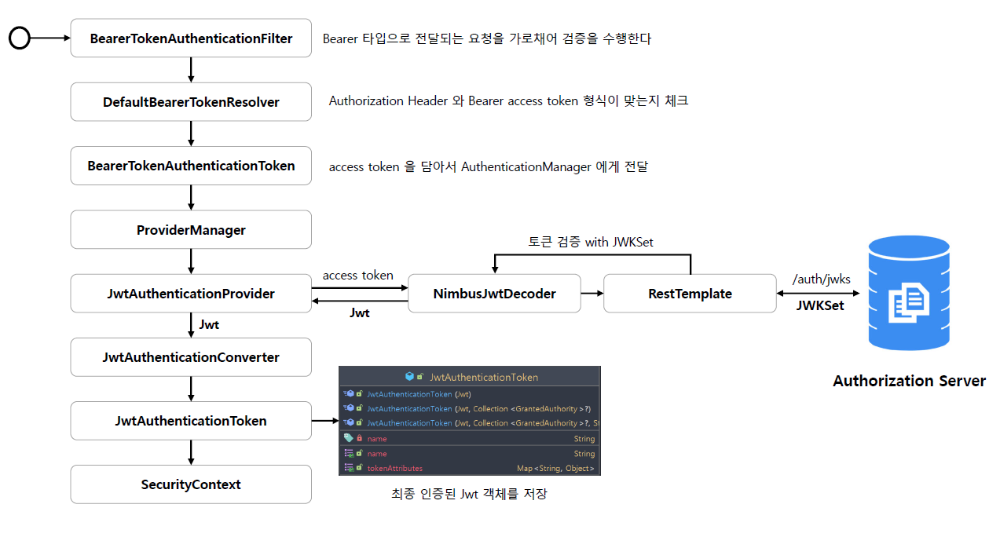

<nav>
    <a href="../.." target="_blank">[Spring Security OAuth2]</a>
</nav>

# 13.9 검증 아키텍처 이해 - BearerTokenAuthenticationFilter

- BearerTokenResolver 가 작동하여 헤더에서 Bearer 토큰값을 추출한다.
- authenticationManager 을 가져오고 인증 처리를 위임한다.
- JwtAuthenticationProvider 가 실질적 인증을 처리한다.
  - JwtDecoder(구현체 NimbusJwtDecoder) 를 사용하여 Jwt 를 구성한다.
  - JwtAuthenticationConverter 를 사용하여 Jwt 를 기반으로 JwtAuthenticationToken 을 구성한다.
- 이후 성공 후속처리
  - SecurityContext 에 저장하여 요청-응답 사이클 내에서 인증이 유지되도록 한다.

---
