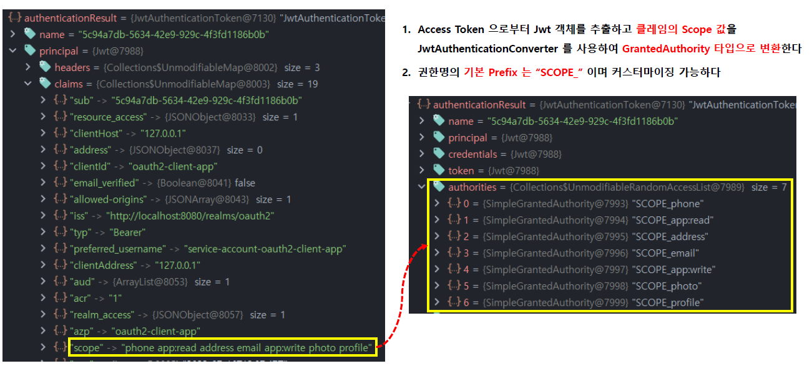
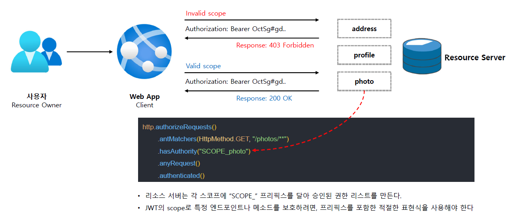

<nav>
    <a href="../.." target="_blank">[Spring Security OAuth2]</a>
</nav>

# 14.1 Scope 기반 권한 매핑 구현하기

---

### 1. 리소스 서버의 scope - 권한 매핑


```java
	private static final String DEFAULT_AUTHORITY_PREFIX = "SCOPE_";

	@Override
	public Collection<GrantedAuthority> convert(Jwt jwt) {
		Collection<GrantedAuthority> grantedAuthorities = new ArrayList<>();
		for (String authority : getAuthorities(jwt)) {
			grantedAuthorities.add(new SimpleGrantedAuthority(this.authorityPrefix + authority));
		}
		return grantedAuthorities;
	}
```
- 스프링 시큐리티의 oauth2ResourceServer API 사용 시, JwtAuthenticationProvider가 실질적 인증처리를 담당한다.
- 여기서는 인증주체인 Jwt 를 구성하고, 이를 기반으로 JwtAuthenticationToken 을 만드는데 이 과정에서 JwtAuthenticationConverter 가 사용된다.
- JwtAuthenticationConverter 는 기본적으로 jwt 클레임에서 "scope" 를 찾고, scope 값들 앞에 "SCOPE_"를 붙여서 SimpleGrantedAuthority 를
만들어 권한으로 지정한다.

---

## 2. 권한부여 설정
```kotlin
@Configuration
class SecurityConfig {

    @Bean
    @Order(0)
    fun securityFilterChain1(http: HttpSecurity): SecurityFilterChain {
        http {
            securityMatcher("/photos/1")
            authorizeHttpRequests {
                authorize(HttpMethod.GET, "/photos/1", hasAuthority("SCOPE_photo"))
            }
            oauth2ResourceServer {
                jwt {  }
            }
        }
        return http.build()
    }

    @Bean
    @Order(1)
    fun securityFilterChain2(http: HttpSecurity): SecurityFilterChain {
        http {
            securityMatcher("/photos/2")
            authorizeHttpRequests {
                authorize(HttpMethod.GET, "/photos/2", permitAll)
            }
            oauth2ResourceServer {
                jwt {  }
            }
        }
        return http.build()
    }
}
```



- 우리 서버에서는 이를 응용하여, jwt의 scope를 기반으로 "SCOPE_xxx" 로 엔드포인트 권한을 지정하면 된다.
- 위의 예시에서는
  - "/photo/1" : "SCOPE_photo" 권한 필요 == jwt의 "scope" 범위에 "photo"가 필요
  - "/photo/2" : 누구나 접근 허용

---

## 3. 실습

### 3.1 keycloak 인가서버 설정
- client scope 설정
  - create client scope
  - photo scope 생성
  - photo scope 상세 페이지에서 "include in token scope" 지정
    - 이 속성을 지정해야 scope 에 "photo"가 포함됐을 때 액세스토큰 scope에 "photo"가 추가된다.
- clients > oauth2-client-app
  - client scopes
  - add client scope -> photo
  - assigned type 설정에서 optional(우리가 토큰 발행 요청 시 scope 에 photo 를 수동으로 넣어야만 scope로 photo가 발행될 수 있도록)

### 3.2 컨트롤러
```kotlin
@RestController
class PhotoController {

    @GetMapping("/photos/1")
    fun photo1(): Photo {
        return Photo(
            userId="user1",
            photoId = "1",
            photoTitle = "Photo1",
            photoDescription = "이것은 photo 1 입니다",
        )
    }

    @GetMapping("/photos/2")
    fun photos2(): Photo {
        return Photo(
            userId="user1",
            photoId = "2",
            photoTitle = "Photo2",
            photoDescription = "이것은 photo 2 입니다",
        )
    }
}
```

### 3.3 실행
- "/photo/1"
  - scope 에 "photo"가 있을 때만 접근 가능
  - 미인증 사용자는 접근 불가
- "/photo/2"
  - 누구나 접근 가능

---

## 4. 추가 - 메서드 인가 설정

### 4.1 SecurityConfig
```kotlin
@Configuration
@EnableMethodSecurity
class SecurityConfig {
```
- `@EnableMethodSecurity` : 메서드 권한부여 설정

### 4.2 컨트롤러
```kotlin

    @GetMapping("/photos/2")
    @PreAuthorize("hasAuthority('SCOPE_photo')")
    fun photos2(): Photo {
        return Photo(
            userId="user1",
            photoId = "2",
            photoTitle = "Photo2",
            photoDescription = "이것은 photo 2 입니다",
        )
    }
```
- "/photo/2" 접근 시 "SCOPE_photo" 권한이 있어야만 접근할 수 있도록 `@PreAuthorize` 어노테이션을 지정했다.

### 4.3 실행
- "/photo/2" 접근 시  "photo" scope가 필요해진다.

---
