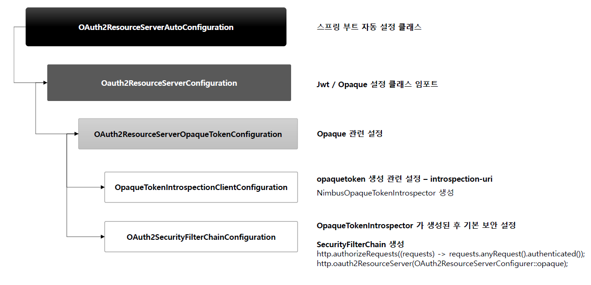

<nav>
    <a href="../.." target="_blank">[Spring Security OAuth2]</a>
</nav>

# 15.1 Opaque 개념 및 프로세스 이해

---

## 1. OpaqueToken 인증
- Opaque 토큰은 인가 서버에서 호스트하는 OAuth 2.0 Introspection 엔드포인트로 검증한다.
- Bearer 토큰이 리소스 서버에서 처리하는 자체 검증이라면 Opaque 토큰은 인가서버를 통해 토큰의 유효성을 확인하여 검증하는 원격 검증이라고 볼 수 있다.

---

## 2. Opaque 설정 원리


```java
@AutoConfiguration(before = { SecurityAutoConfiguration.class, UserDetailsServiceAutoConfiguration.class })
@EnableConfigurationProperties(OAuth2ResourceServerProperties.class)
@ConditionalOnClass(BearerTokenAuthenticationToken.class)
@ConditionalOnWebApplication(type = ConditionalOnWebApplication.Type.SERVLET)
@Import({ Oauth2ResourceServerConfiguration.JwtConfiguration.class,
		Oauth2ResourceServerConfiguration.OpaqueTokenConfiguration.class })
public class OAuth2ResourceServerAutoConfiguration {
```
```java
@Configuration(proxyBeanMethods = false)
@Import({ OAuth2ResourceServerOpaqueTokenConfiguration.OpaqueTokenIntrospectionClientConfiguration.class,
        OAuth2ResourceServerOpaqueTokenConfiguration.OAuth2SecurityFilterChainConfiguration.class })
static class OpaqueTokenConfiguration {

}
```
- OAuth2ResourceServerAutoConfiguration -> Oauth2ResourceServerConfiguration.OpaqueTokenConfiguration
  - OAuth2ResourceServerOpaqueTokenConfiguration.OpaqueTokenIntrospectionClientConfiguration.class
  - OAuth2ResourceServerOpaqueTokenConfiguration.OAuth2SecurityFilterChainConfiguration.class
```java
@Configuration(proxyBeanMethods = false)
class OAuth2ResourceServerOpaqueTokenConfiguration {

	@Configuration(proxyBeanMethods = false)
	@ConditionalOnMissingBean(OpaqueTokenIntrospector.class)
	static class OpaqueTokenIntrospectionClientConfiguration {

		@Bean
		@ConditionalOnProperty(name = "spring.security.oauth2.resourceserver.opaquetoken.introspection-uri")
		SpringOpaqueTokenIntrospector opaqueTokenIntrospector(OAuth2ResourceServerProperties properties) {
			OAuth2ResourceServerProperties.Opaquetoken opaqueToken = properties.getOpaquetoken();
			return new SpringOpaqueTokenIntrospector(opaqueToken.getIntrospectionUri(), opaqueToken.getClientId(),
					opaqueToken.getClientSecret());
		}

	}

	@Configuration(proxyBeanMethods = false)
	@ConditionalOnDefaultWebSecurity
	static class OAuth2SecurityFilterChainConfiguration {

		@Bean
		@ConditionalOnBean(OpaqueTokenIntrospector.class)
		SecurityFilterChain opaqueTokenSecurityFilterChain(HttpSecurity http) throws Exception {
			http.authorizeHttpRequests((requests) -> requests.anyRequest().authenticated());
			http.oauth2ResourceServer((resourceServer) -> resourceServer.opaqueToken(withDefaults()));
			return http.build();
		}

	}

}
```
- spring.security.oauth2.resourceserver.opaquetoken.introspection-uri 설정이 있을 때, OpaqueTokenIntrospector 빈이 등록
  - 기본 구현체는 SpringOpaqueTokenIntrospector
- 기본 스프링 시큐리티 필터체인 등록(opaque token 인증처리)
  - 우리가 수동으로 시큐리티 필터체인을 등록하면 활성화되지 않는다.

---

## 3. OpaqueToken 기반 인증 설정 구성 원리

### 3.1 HttpSecurity
```java
	public HttpSecurity oauth2ResourceServer(
			Customizer<OAuth2ResourceServerConfigurer<HttpSecurity>> oauth2ResourceServerCustomizer) throws Exception {
		OAuth2ResourceServerConfigurer<HttpSecurity> configurer = getOrApply(
				new OAuth2ResourceServerConfigurer<>(getContext()));
		this.postProcess(configurer);
		oauth2ResourceServerCustomizer.customize(configurer);
		return HttpSecurity.this;
	}
```
- `http.oauth2ResourceServer` API 를 통해 설정을 구성할 수 있다.
  - `OAuth2ResourceServerConfigurer`
- 여기에 OAuth2ResourceServerConfigurer::opaqueToken 를 전달하면 OpaqueToken 기반 인증 기능이 활성화된다.

### 3.2 OAuth2ResourceServerConfigurer.init 
```java
	AuthenticationProvider getAuthenticationProvider() {
		if (this.jwtConfigurer != null) {
			return this.jwtConfigurer.getAuthenticationProvider();
		}
		if (this.opaqueTokenConfigurer != null) {
			return this.opaqueTokenConfigurer.getAuthenticationProvider();
		}
		return null;
	}
```
- OAuth2ResourceServerConfigurer 에서는 BearerTokenAuthenticationFilter 가 구성된다.
- 내부적으로 사용하는 AuthenticationManager 및 그 내부적으로 등록되는 AuthenticationProvider 설정이 이루어지는데
여기서 OpaqueTokenAuthenticationProvider 설정이 가져와진다.

---

## 4. OpaqueToken 인증 흐름

### 4.1 OpaqueTokenAuthenticationProvider
```java
public final class OpaqueTokenAuthenticationProvider implements AuthenticationProvider {
    private final OpaqueTokenIntrospector introspector;
    private OpaqueTokenAuthenticationConverter authenticationConverter = OpaqueTokenAuthenticationProvider::convert;

    @Override
    public Authentication authenticate(Authentication authentication) throws AuthenticationException {
        if (!(authentication instanceof BearerTokenAuthenticationToken bearer)) {
            return null;
        }
        OAuth2AuthenticatedPrincipal principal = getOAuth2AuthenticatedPrincipal(bearer);
        Authentication result = this.authenticationConverter.convert(bearer.getToken(), principal);
        if (result == null) {
            return null;
        }
        if (AbstractAuthenticationToken.class.isAssignableFrom(result.getClass())) {
            final AbstractAuthenticationToken auth = (AbstractAuthenticationToken) result;
            if (auth.getDetails() == null) {
                auth.setDetails(bearer.getDetails());
            }
        }
        this.logger.debug("Authenticated token");
        return result;
    }
}
```
```java
	private OAuth2AuthenticatedPrincipal getOAuth2AuthenticatedPrincipal(BearerTokenAuthenticationToken bearer) {
		try {
			return this.introspector.introspect(bearer.getToken());
		}
		catch (BadOpaqueTokenException failed) {
			this.logger.debug("Failed to authenticate since token was invalid");
			throw new InvalidBearerTokenException(failed.getMessage(), failed);
		}
		catch (OAuth2IntrospectionException failed) {
			throw new AuthenticationServiceException(failed.getMessage(), failed);
		}
	}
```
- BearerTokenAuthenticationProvider 는 인증처리를 AuthenticationManager 에게 위임한다.
- 내부적으로 OpaqueTokenAuthenticationProvider 를 통해 인증 처리가 위임된다.
  - OpaqueTokenIntrospector 를 통해 introspect 를 수행하고 인증 주체에 대한 정보를 OAuth2AuthenticatedPrincipal 로 구성한다.
- OpaqueTokenAuthenticationConverter 를 통해 BearerTokenAuthentication 로 convert 한다.
  - BearerTokenAuthentication 의 principal 속성으로 OAuth2AuthenticatedPrincipal 가 주입된다.
- 인증 결과를 SecurityContext 에 저장한다.


### 4.2 OpaqueTokenIntrospector.introspect
```java
	@Override
	public OAuth2AuthenticatedPrincipal introspect(String token) {
		RequestEntity<?> requestEntity = this.requestEntityConverter.convert(token);
		if (requestEntity == null) {
			throw new OAuth2IntrospectionException("requestEntityConverter returned a null entity");
		}
		ResponseEntity<Map<String, Object>> responseEntity = makeRequest(requestEntity);
		Map<String, Object> claims = adaptToNimbusResponse(responseEntity);
		return convertClaimsSet(claims);
	}
```
- 기본 구현체는 SpringOpaqueTokenIntrospector 이다.
- 내부적으로 introspection-uri 에 통신하여 인증 처리를 맡기고, 결과를 받아와 claim 을 구성한다.
- 이 정보를 기반으로 OAuth2AuthenticatedPrincipal 이 구성된다.

---

## 5. 실습

### 5.1 의존성 추가
```kotlin
dependencies {
    // 추가
    runtimeOnly("com.nimbusds:oauth2-oidc-sdk:11.13")
}
```
- 우리는 NimbusOpaqueTokenIntrospector 를 OpaqueTokenIntrospector 로 구현해볼 것이다.
- 내부적으로 사용하는 의존성들을 가져오려면 위 라이브러리가 필요해서, runtimeOnly 의존성 추가를 한다.

### 5.2 application.yml 의존성 추가
```yaml
spring.application.name: spring-security-oauth2
server:
  port: 8081
spring:
  security:
    oauth2:
      resourceserver:
        opaquetoken:
          introspection-uri: http://localhost:8080/realms/oauth2/protocol/openid-connect/token/introspect
          client-id: oauth2-client-app
          client-secret: 1tIeERcVJnWNmVZIEFA7Ao5YkTIbx83w
```
- keycloak 의 introspection-uri, client-id, client-secret 을 추가한다.
- 이 설정은 OAuth2ResourceServerProperties 에 등록된다

### 5.3 SecurityConfig
```kotlin
@Configuration
@EnableMethodSecurity
class SecurityConfig {

    @Bean
    fun securityFilterChain(http: HttpSecurity): SecurityFilterChain {
        http {
            authorizeHttpRequests {
                authorize(anyRequest, authenticated)
            }
            oauth2ResourceServer {
                opaqueToken { }
            }
        }
        return http.build()
    }

    @Bean
    fun opaqueTokenIntrospector(properties: OAuth2ResourceServerProperties): OpaqueTokenIntrospector {
        val opaqueToken = properties.opaquetoken
        return NimbusOpaqueTokenIntrospector(opaqueToken.introspectionUri, opaqueToken.clientId, opaqueToken.clientSecret)
    }

}
```
- OpaqueTokenIntrospector 빈을 커스텀하게 생성하여 등록했다.
  - 기본 구현체는 SpringOpaqueTokenIntrospector 인데 NimbusOpaqueTokenIntrospector 로 등록했다.
- opaqueToken 인증 처리를 활성화했다.

### 5.4 ApiController
```kotlin

class OpaqueTokenResponse (
    val active: Boolean,
    val principal: Any,
    val authentication: Authentication
)
```
```kotlin
@RestController
class ApiController {

    @GetMapping("/")
    fun user(authentication: BearerTokenAuthentication, @AuthenticationPrincipal principal: OAuth2AuthenticatedPrincipal): OpaqueTokenResponse {
        val attributes =  authentication.tokenAttributes as Map<String, *>
        val active = attributes["active"] as Boolean

        return OpaqueTokenResponse(active, principal, authentication)
    }
}
```
- "/" 로 접속하면 OpaqueTokenResponse 객체를 생성하여 json 으로 반환한다.

### 5.5 실행
- NimbusOpaqueTokenIntrospector 가 빈으로 등록되어 정상적으로 OpaqueToken 인증이 활성화된다.
- 실제로 내부적으로 introspector-uri 측과 통신하여 인증한다

---
