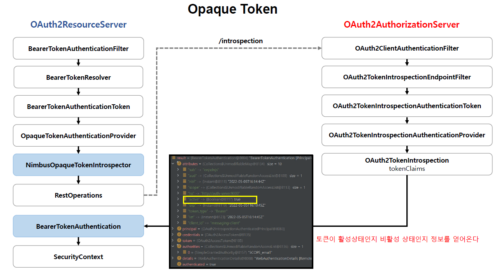
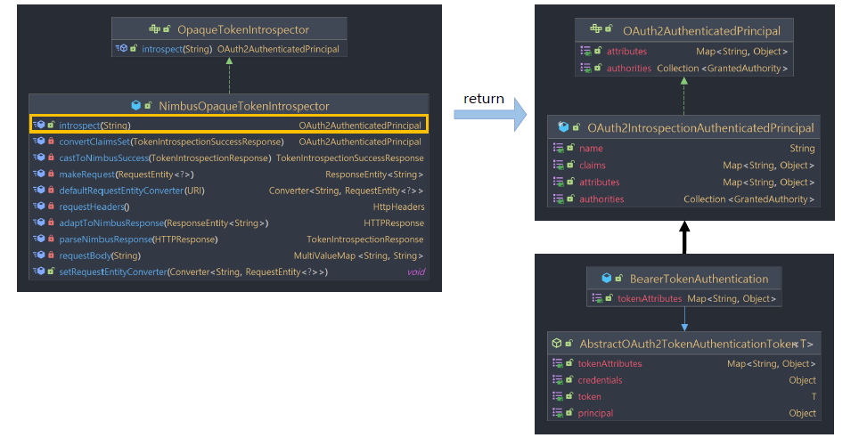

<nav>
    <a href="../.." target="_blank">[Spring Security OAuth2]</a>
</nav>

# 15.2 토큰 검사 및 프로세스 이해

---

## 1. OpaqueToken 인증 흐름


- OpaqueToken 인증 흐름에서는 내부적으로 OpaqueTokenIntrospector가 사용된다.
- 이를 통해 인가서버와 통신하고 토큰 인증을 수행한다.

---

## 2. OpaqueTokenIntrospector


- 문자열 토큰을 RestTemplate 을 사용하여 인가서버 엔드포인트로 요청한다
- 토큰이 검증되면 최종 OAuth2AuthenticatedPrincipal 타입의 객체로 디코딩하여 반환한다.
- OAuth2AuthenticatedPrincipal 은 BearerTokenAuthentication 의 principal 속성에 저장된다

---

## 3. 커스텀 OpaqueTokenIntrospector

### 3.1 CustomOpaqueTokenIntrospector
```kotlin
class CustomOpaqueTokenIntrospector(
    private val delegate: OpaqueTokenIntrospector
) : OpaqueTokenIntrospector {


    override fun introspect(token: String): OAuth2AuthenticatedPrincipal {
        val principal = delegate.introspect(token)

        val name = principal.name
        val attributes = principal.attributes
        val authorities = getAuthorities(attributes)

        return DefaultOAuth2AuthenticatedPrincipal(name, attributes, authorities)
    }

    private fun getAuthorities(attributes: Map<String, *>): MutableList<GrantedAuthority> {
        return (attributes[OAuth2TokenIntrospectionClaimNames.SCOPE] as List<String>)
            .map { SimpleGrantedAuthority("ROLE_"+ it.uppercase(Locale.getDefault())) }
            .toMutableList()
    }
}
```
- 내부적으로 위임 OpaqueTokenIntrospector 를 통해 OAuth2AuthenticatedPrincipal 를 얻어온다.
- 이름, 속성을 기반으로 하여 DefaultOAuth2AuthenticatedPrincipal 로 생성한다.
  - scope 를 기반으로 "ROLE_xxx" 권한을 만들어 매핑한다.

### 3.2 설정
```kotlin
    @Bean
    fun opaqueTokenIntrospector(properties: OAuth2ResourceServerProperties): OpaqueTokenIntrospector {
        val opaqueToken = properties.opaquetoken
        val delegate =  NimbusOpaqueTokenIntrospector(opaqueToken.introspectionUri, opaqueToken.clientId, opaqueToken.clientSecret)

        return CustomOpaqueTokenIntrospector(delegate)
    }
```

---

## 4. 실행
- 우리가 등록한 CustomOpaqueTokenIntrospector 가 작동한다.

---
