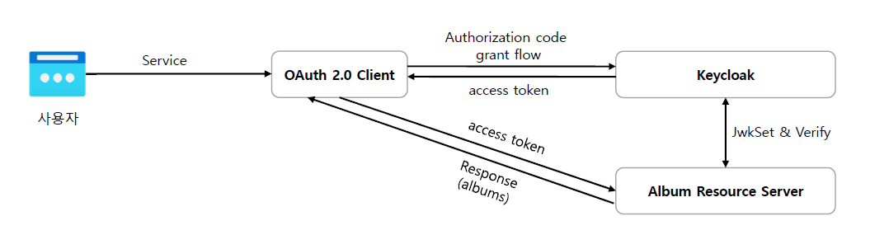

<nav>
    <a href="../.." target="_blank">[Spring Security OAuth2]</a>
</nav>

# 16.1 프로젝트 구성

---

## 1. 개요


### 1.1 연동 구성
- OAuth 2.0 Client - 어플리케이션
- OAuth 2.0 Resource Server - 보호된 자원 서버
- Keycloak - 인가 서버

### 1.2 photos 처리 순서
1. 클라이언트에서 인가서버로 Authorization Code Grant 타입으로 토큰을 발급받고 이후 사용자 엔드포인트 요청으로 인증을 진행한다
2. 클라이언트에서 인증에 성공하면 백단에서 RestTemplate 로 Photo 리소스 서버로 자원 요청을 한다
3. 최종적으로 반환받은 Albums 리소스를 클라이언트로 응답한다


### 1.3 remotePhotos
- 브라우저에서 바로 클라이언트에 요청하여 액세스토큰을 가져와 로컬스토리지에 저장
- 브라우저에서 바로 리소스 서버에 요청하여 remotePhotos API 를 호출해 리소스 가져오기

---

## 2. settings.gradle.kts
```kotlin
rootProject.name = "spring-security-oauth2"
include(
    "oauth2-client",
    "oauth2-resource-server",
    "support:logging"
)
```
- 모듈 설정
    - "oauth2-client"
    - "oauth2-resource-server"

---

## 3. build.gradle.kts

### 2.1 루트
```kotlin
import org.jetbrains.kotlin.gradle.tasks.KotlinCompile

plugins {
    id(Plugins.SPRING_BOOT) version PluginVersions.SPRING_BOOT_VERSION apply false
    id(Plugins.SPRING_DEPENDENCY_MANAGEMENT) version PluginVersions.DEPENDENCY_MANAGER_VERSION
    id(Plugins.KOTLIN_JVM) version PluginVersions.JVM_VERSION
    id(Plugins.KOTLIN_SPRING) version PluginVersions.SPRING_PLUGIN_VERSION apply false
}

java {
    sourceCompatibility = JavaVersion.VERSION_21
}

allprojects {
    group = "com.security"
    version = "0.0.1-SNAPSHOT"

    repositories {
        mavenCentral()
    }
}

subprojects {
    apply { plugin(Plugins.KOTLIN_JVM) }
    apply { plugin(Plugins.KOTLIN_SPRING) }
    apply { plugin(Plugins.SPRING_BOOT) }
    apply { plugin(Plugins.SPRING_DEPENDENCY_MANAGEMENT) }


    dependencies {
        // kotlin
        implementation(Dependencies.KOTLIN_REFLECT)
        implementation(Dependencies.KOTLIN_JACKSON)

        // test
        testImplementation(Dependencies.SPRING_TEST)
    }

    tasks.getByName("bootJar") {
        enabled = false
    }

    tasks.getByName("jar") {
        enabled = true
    }

}


tasks.withType<KotlinCompile> {
    kotlinOptions {
        freeCompilerArgs += "-Xjsr305=strict"
        jvmTarget = "21"
    }
}

tasks.withType<Test> {
    useJUnitPlatform()
}
```

### 3.2 `/oauth2-client/build.gradle.kts`
```kotlin
dependencies {
    // web
    implementation(Dependencies.SPRING_WEB)

    // security
    implementation(Dependencies.SPRING_SECURITY)
    implementation(Dependencies.SPRING_OAUTH2_CLIENT)

    // thymeleaf
    implementation(Dependencies.THYMELEAF)
    implementation(Dependencies.THYMELEAF_EXTRAS_SECURITY)

    // logging
    implementation(project(":support:logging"))
}

tasks.getByName("bootJar") {
    enabled = true
}

tasks.getByName("jar") {
    enabled = false
}

```
- 의존성
    - spring
        - web
        - security
        - oauth2-client
    - Thymeleaf

### 3.3 `/oauth2-resource-server/build.gradle.kts`
```kotlin
dependencies {
    // web
    implementation(Dependencies.SPRING_WEB)

    // security
    implementation(Dependencies.SPRING_SECURITY)
    implementation(Dependencies.SPRING_OAUTH2_RESOURCE_SERVER)

    // logging
    implementation(project(":support:logging"))
}

tasks.getByName("bootJar") {
    enabled = true
}

tasks.getByName("jar") {
    enabled = false
}
```
- 의존성
    - spring
        - web
        - security
        - oauth2-resource-server

---

## 4. 설정파일

### 4.1 OAuth2Client -> application.yml
```yaml
spring.application.name: oauth2-client
server:
  port: 8081

spring:
  security:
    oauth2:
      client:
        registration:
          keycloak:
            client-id: oauth2-client-app
            client-secret: 1tIeERcVJnWNmVZIEFA7Ao5YkTIbx83w
            scope: openid,email,photo
            authorization-grant-type: authorization_code
            redirect-uri: http://localhost:8081/login/oauth2/code/keycloak
        provider:
          keycloak:
            issuer-uri: http://localhost:8080/realms/oauth2
            user-name-attribute: preferred_username
```
- 포트 : 8081
- keyCloak 서버에 권한부여 요청을 하기 위한 client 설정

### 4.2 OAuth2ResourceServer -> application.yml
```yaml
spring.application.name: oauth2-resource-server
server:
  port: 8082
spring:
  security:
    oauth2:
      resourceserver:
        jwt:
          jwk-set-uri: http://localhost:8080/realms/oauth2/protocol/openid-connect/certs
```
- 포트 : 8082
- keyCloak 서버에 jwkset 을 질의하기 위해 jwk-set-uri 지정

---

## 5. 실행
```kotlin
@SpringBootApplication
class ClientMain

fun main(args: Array<String>) {
    runApplication<ClientMain>(*args)
}
```
```kotlin
@SpringBootApplication
class ResourceServerMain

fun main(args: Array<String>) {
    runApplication<ResourceServerMain>(*args)
}
```
- 각각 메인 클래스를 만들고, 실행하여 작동하는 지 확인한다.

---
