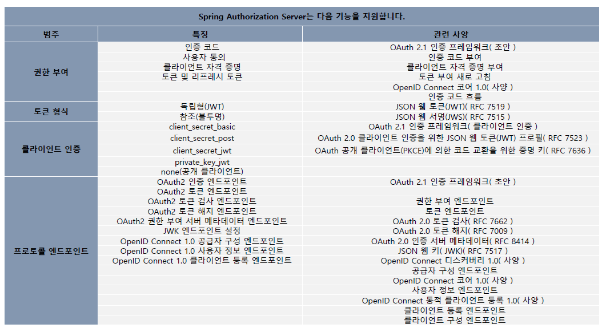

<nav>
    <a href="../.." target="_blank">[Spring Security OAuth2]</a>
</nav>


# 17.1 OAuth 2.0 Authorization Server 소개 및 프로젝트 구성

---

## 1. 개요


- Spring Authorization Server는 OAuth 2.1 및 OpenID Connect 1.0 사양 및 기타 관련 사양의 구현을 제공하는 프레임워크이다.
- OpenID Connect 1.0 공급자 및 OAuth2 권한 부여 서버 제품을 구축하기 위한 안전하고 가볍고 사용자 지정 가능한 기반을 제공하기 위해 구축됐다.

---

## 2. 프로젝트 구성 : OAuth2-Authorization-Server

### 2.1 `settings.gradle.kts`
```kotlin
rootProject.name = "spring-security-oauth2"
include(
    "oauth2-client",
    "oauth2-resource-server",
    "oauth2-authorization-server",
    "support:logging"
)
```

### 2.2 `build.gradle.kts`
```kotlin
dependencies {
    // web
    implementation(Dependencies.SPRING_WEB)

    // security
    implementation(Dependencies.SPRING_SECURITY)
    implementation(Dependencies.SPRING_OAUTH2_AUTHORIZATION_SERVER)

    // logging
    implementation(project(":support:logging"))
}

tasks.getByName("bootJar") {
    enabled = true
}

tasks.getByName("jar") {
    enabled = false
}
```
- `Dependencies.SPRING_OAUTH2_AUTHORIZATION_SERVER`: "org.springframework.boot:spring-boot-starter-oauth2-authorization-server"

### 2.3 application.yml
```yaml
server:
  port: 9000
```
- 인가서버의 포트는 9000번으로 지정한다.


### 2.4 실행
```kotlin
@SpringBootApplication
class AuthorizationServerMain

fun main(args: Array<String>) {
    runApplication<AuthorizationServerMain>(*args)
}
```

---
